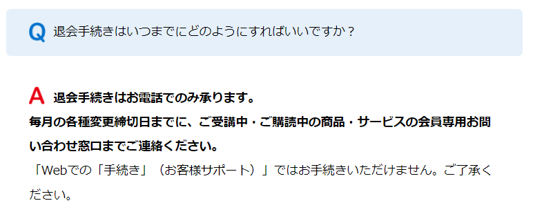
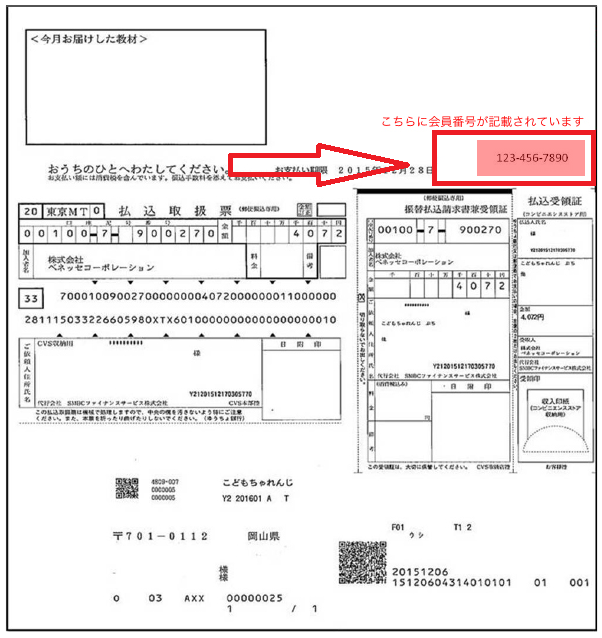
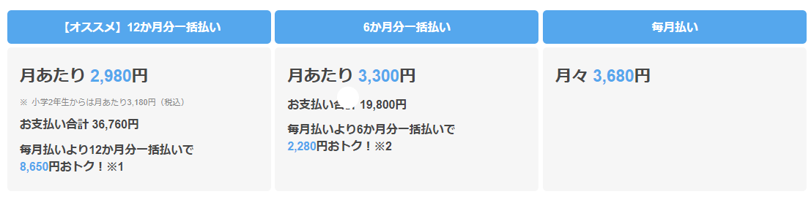

進研ゼミの解約方法は電話でのみ解約することが可能です

WEBからの解約方法を探しているか方もいますが、現在進研ゼミを解約する方法はこれしかないのでおぼえていきましょう。

この記事では、進研ゼミを退会する前に「準備する物」「確認しておくべき注意点」を細かく解説します。

知らないまま解約すると料金面で損してしまうこともあるので、必ず確認しておきましょう。

## チャレンジタッチを解約する方法

チャレンジタッチを解約する方法は**電話のみ**となっています。

これは、進研ゼミ公式サイトにも記載されています。

WEBからの解約はできません。

解約する時の電話番号は申し込みしている講座ごとによって違います。

| 講座名 | 解約の電話番号 |
| --- | --- |
| 進研ゼミ小学講座 | 0120-977-377   （042-679-8563） |
| 進研ゼミ中学講座 | 0120-929-100   （042-679-8565） |
| 進研ゼミ中学講座   中高一貫 | 0120-933-599   （042-679-8185） |
| 進研ゼミ高校講座 |    0120-332-211   （042-679-8567） |

 

💡 **解約する時には必ず10桁の会員番号が必要です。**

会員番号は、「チャレンジタッチ」と一緒に送られてくる会員番号シールに記載されています。

会員番号が分らない方は[こちら](https://bfg.benesse.ne.jp/m01/p/o/b11v01/v010010?kcd=mns)から調べられます。

また、会員番号が分らない時は電話で確認することも可能です。

ですが、時間がかかる場合があるのであらかじめ用意しておくことをオススメします。

電話する前に用意しておこう

## チャレンジタッチ解約前に確認すべき点3つ

チャレンジタッチを解約する際に確認しておくべき点が3つあります。

①：解約する1ヶ月前には連絡する

②：最低2ヶ月の継続が必須

③：タブレットは返却するの？

チャレンジタッチの解約を考えている人は必ず確認してね

### ①：解約する1ヶ月前には連絡する

チャレンジタッチは電話を入れてすぐに解約ではありません。

また、いつまでに連絡すればいいかは講座によって違います。

✅ **小学講座（チャレンジタッチ）の場合** 退会したい月の1ヶ月前には電話をしておきましょう。

7月1日から解約したい場合は、6月1日までに連絡しておく必要があります。

これを逃すと解約日が1ヶ月後になってしまうので注意しましょう。

**✅ （中学～高校）講座の場合**

これらを退会する時は、希望月の前々月の25日までに連絡する必要があります。

7月に退会したい場合は、5月25日までに連絡しましょう。

これを過ぎてしまうともう1ヶ月継続しなくてはなりません。

解約を考えている人は覚えておきましょう。

🐕

知っておかないといざという時に損してしまうかも

チャレンジタッチの口コミが知りたい方はこちら

[チャレンジタッチ【良い口コミ・悪い口コミ】を暴露！入会前にちょっと待ってください](https://xn--5ckip8c4fq970ahbya2o7acu2a.com/2021/06/28/%e9%80%b2%e7%a0%94%e3%82%bc%e3%83%9f-%e5%b0%8f%e5%ad%a6%e8%ac%9b%e5%ba%a7%e3%81%ae%e5%8f%a3%e3%82%b3%e3%83%9f%e8%a9%95%e5%88%a4%e5%ae%8c%e5%85%a8%e3%81%be%e3%81%a8%e3%82%81/)

### ②：最低2ヶ月の継続が必須

チャレンジタッチは最低2ヶ月は継続しなければ解約することはできません。

入会していつでも解約できるわけではありません。

2ヶ月で辞める人はめったにいませんが、入会する前に確認しておきましょう。

### ③：タブレットは返却するの？

チャレンジタッチを解約してもタブレットを返却する必要はありません。

解約が終わったらタブレットはご自身の物となります。

タブレット端末は処分する人もいますが、再入会する際は、また必要になります。

弟や妹がいる方は必要になるかもしれないのでとっておくといいですよっ！

[チャレンジタッチ公式サイトはこちら](//ck.jp.ap.valuecommerce.com/servlet/referral?sid=3613518&pid=887390659)

## 損しない為に知っておきたい知識

チャレンジタッチを解約する際知っておきたいのが、「継続期間」と「料金」の関係です。

チャレンジタッチはいつ退会しても違約金は発生しません。

⚠️ ですが、タブレットの本体代金は別です。

タブレット本体の料金は、6ヶ月の継続で無料です。

しかし、5ヶ月以下で解約すると9,900円請求されます。

つまり、5ヶ月で解約するなら6ヶ月継続した方が安くてお得なんです。

🐕

5ヶ月で解約するとかなり損なんだ

### 一括払いの料金の差額が返金される

結論から言うと、一括払いを済ませた後に解約しても料金は返金されます。

継続した期間に合わせて再計算された差額が返ってくる仕組みです。

チャレンジタッチは毎月払いより、「一括払い」や「半年払い」の方が料金は安くなります。

解約するまでの期間によって、毎月の支払い料金額が変わります。

1～５ヶ月で解約　⇒　毎月払いの料金で計算

6～11ヶ月で解約　⇒　6か月払いの料金で計算

毎月払いで換算し、その差額が返却されます。

小学１年生の例 チャレンジタッチを1年払い済みで、８ヶ月で退会した場合

①1年払いで払った金額 2,980円×12か月＝35,760円

②半年払いに再計算 3,300円×6ヶ月＝19,800円

③残り2ヶ月分を毎月払いの料金で計算 3,680円×２ヶ月＝7,360円

これを計算すると、

①35,760円ー(②19,800円＋③7,360円）＝8,600円

つまり8,600円返金されるということが分かります。

### 本の読み放題は解約後、3ヶ月も利用できる！

まなびライブラリー（本の読み放題）は、解約しても3か月目の24日まで利用できます。

小学生向けの本や絵本が1000冊も読み放題機能ですが、解約してからも一定期間つかえるようです。

最終受講月が7月であれば、10月24日まで利用できるんだ♪

意外に知らない人も多いので覚えておこう。

[チャレンジタッチ公式サイトはこちら](//ck.jp.ap.valuecommerce.com/servlet/referral?sid=3613518&pid=887390659)

## チャレンジタッチに再入会したい時

🐕

チャレンジタッチの再入会はかんたんだよ。

公式サイトからまた同じように入会するだけでOKです。

チャレンジタッチ再入会する場合は、タブレットは送られてきません。

1回目の入会時に送られてきたタブレットを使用する形となります。

1回目は無償でもらえたタブレットですが、2回目以降は有料となります。

もし、「捨ててしまった」「無くした」という場合はタブレット代19,800円（税込み）を払わなければいけません。

チャレンジタッチを解約する場合、もしもに備えてタブレットは保管しておくことをオススメします。

**合わせて読みたい**

[チャレンジタッチに再入会について](https://xn--5ckip8c4fq970ahbya2o7acu2a.com/2022/02/24/%e9%80%b2%e7%a0%94%e3%82%bc%e3%83%9f%e3%83%81%e3%83%a3%e3%83%ac%e3%83%b3%e3%82%b8%e3%82%bf%e3%83%83%e3%83%81%e5%86%8d%e5%85%a5%e4%bc%9a%e3%81%ab%e3%81%af%e3%82%bf%e3%83%96%e3%83%ac%e3%83%83%e3%83%88/)
