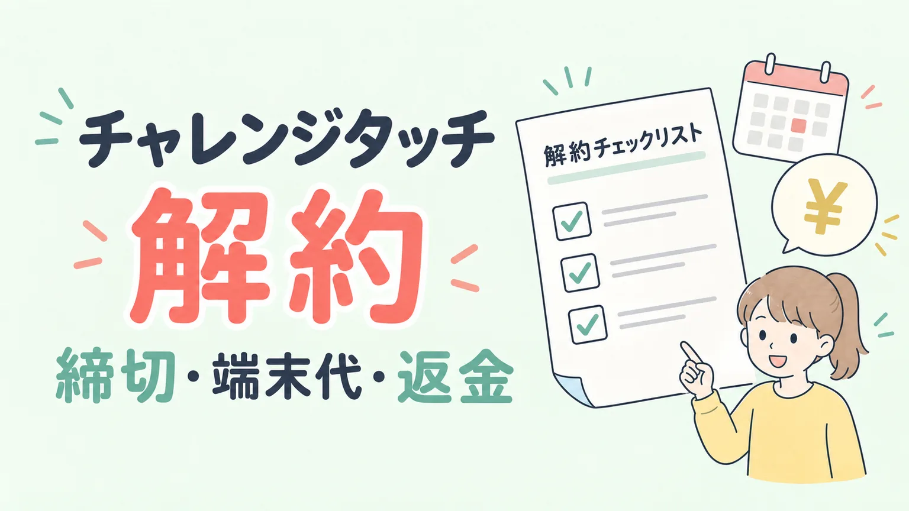
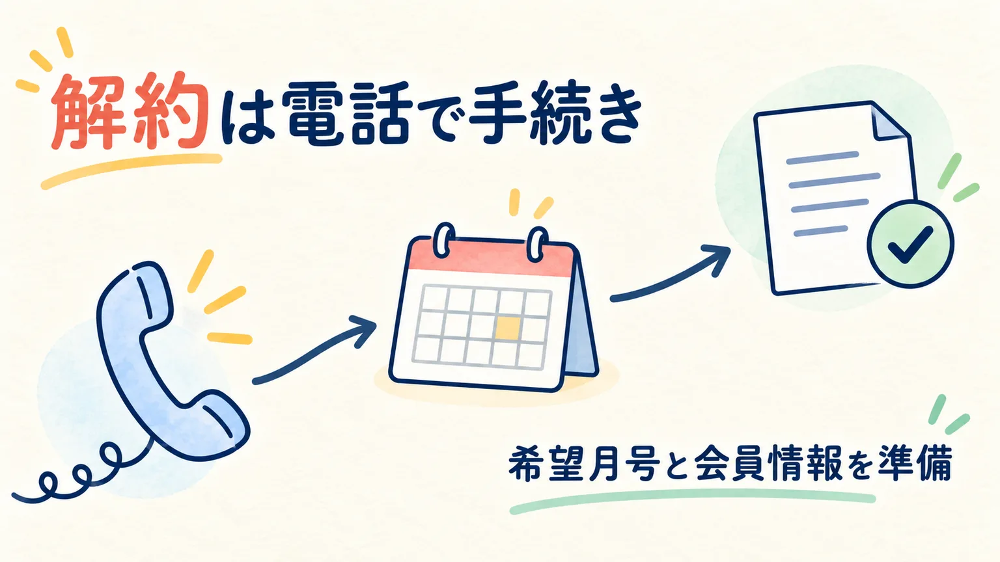
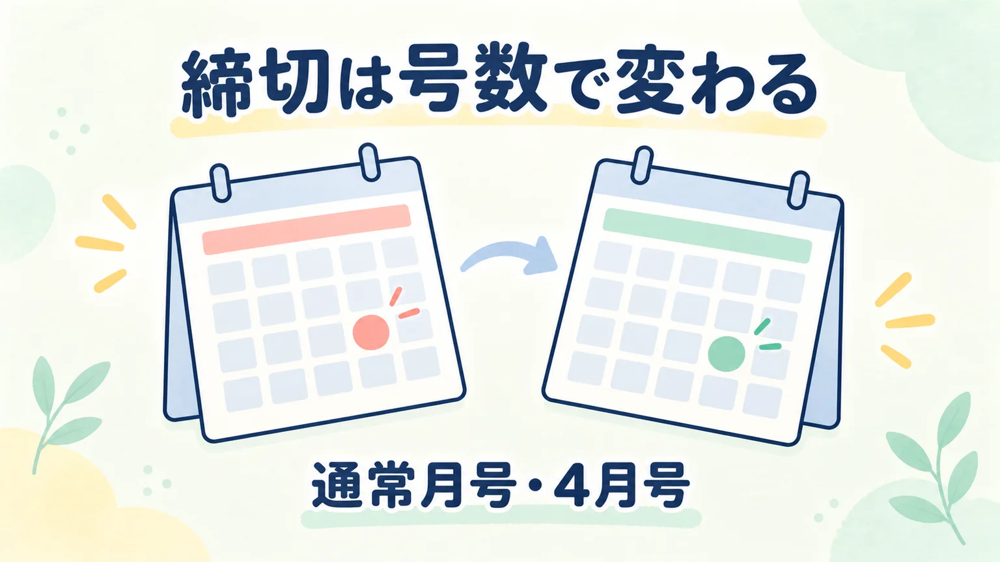
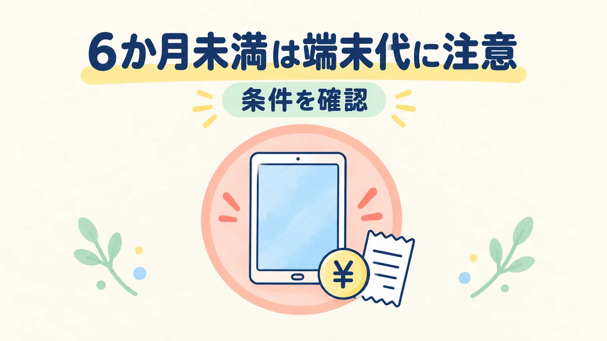
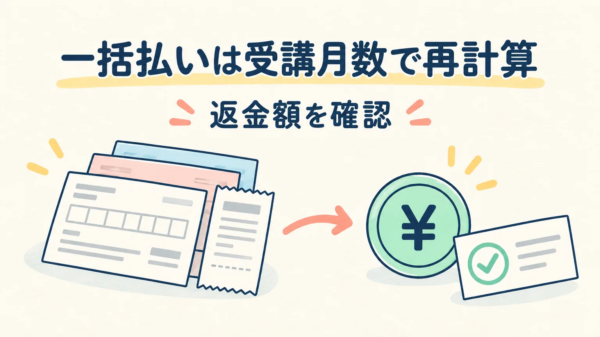
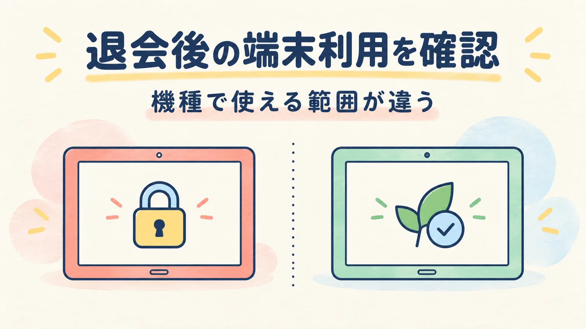
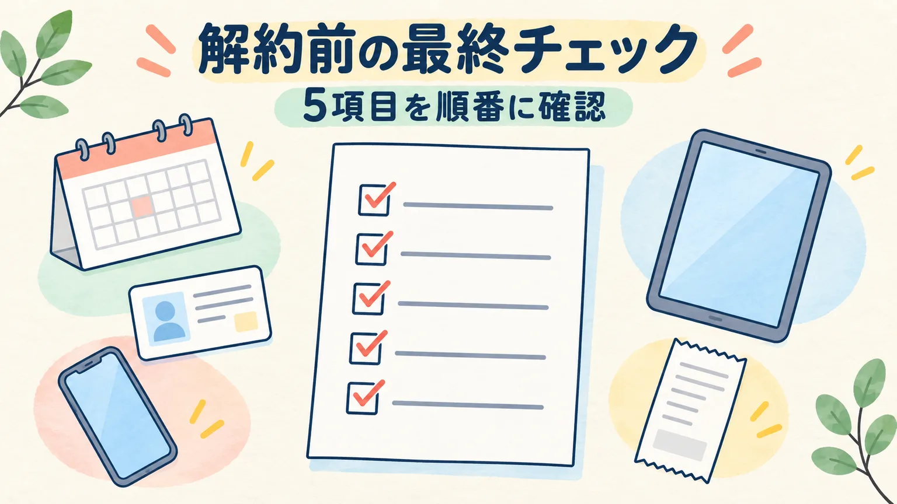
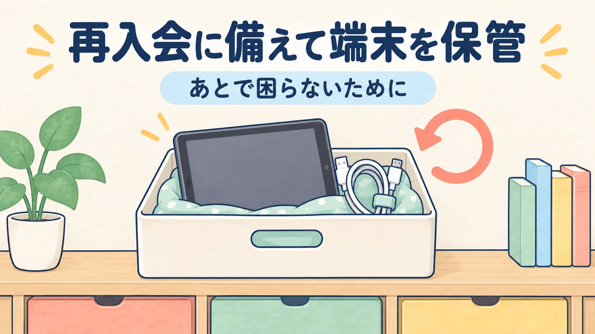

チャレンジタッチを解約したいと思っても、「いつまでに連絡すればよい？」「端末代は請求される？」「先払いした受講費は戻る？」と確認することが多くあります。

この記事では、進研ゼミ小学講座のチャレンジタッチを対象に、**解約の窓口・締切・費用・退会後の端末利用**を順番に整理します。条件は学年、退会する月号、受講期間、支払い方法で変わるため、最後は公式FAQの案内と手元の契約内容を照合してください。

<aside class="article-callout article-callout--conclusion" aria-label="結論">
  
先に結論

  
チャレンジタッチの退会は、希望する月号を決めてから公式の電話窓口へ連絡します。通常月号は<strong>退会したい月号の前月1日まで</strong>、小学2〜6年生の4月号だけは前々月25日が締切です。6か月未満の退会では、条件により<strong>学習専用タブレット代8,300円（税込）</strong>がかかります。

</aside>

## チャレンジタッチの解約は電話で申し込み、準備してから進める

進研ゼミ小学講座の途中退会は可能ですが、公式FAQでは退会手続きを電話で行う案内になっています。会員ページだけで完了させるのではなく、[途中退会に関する公式FAQ](https://faq.benesse.co.jp/faq/show/8708?category_id=7660&site_domain=sho)にある「退会のお手続き」から現在の電話窓口を確認しましょう。

### 退会する月号を先に決める

「今月でやめる」のではなく、**何月号まで受講するか**を決めてから連絡します。締切を過ぎると退会月が1か月先になるため、カレンダーに希望月号と連絡日を書いておくと行き違いを防げます。

### 電話前に会員情報と支払い方法をそろえる

電話では本人確認や契約内容の確認が必要になる場合があります。次の情報を手元に置いておくと、問い合わせが進みやすくなります。

- 会員番号、子どもの氏名、生年月日
- 退会したい月号と、最後に受講する月号
- 受講開始月、チャレンジタッチを選んだ時期
- 毎月払い・一括払いなどの支払い方法

## 解約の締切は通常月号と4月号で違う

公式FAQの締切は、退会したい月号を基準に考えます。締切日は「連絡を始めた日」ではなく、**ベネッセに退会の連絡が届く期限**として確認してください。

### 通常月号は退会したい月号の前月1日まで

たとえば12月号から退会したい場合、連絡期限は11月1日です。11月2日以降の連絡になると、通常は退会が翌月号へずれます。

### 小学2〜6年生の4月号だけは前々月25日まで

小学2〜6年生が4月号から退会する場合は、通常の「前月1日」ではなく**前々月25日**が締切です。学年が変わる時期に解約する家庭は、3月号の締切と混同しないよう、対象学年と月号を一緒に確認しましょう。

<aside class="article-callout article-callout--warning" aria-label="締切の注意">
  
締切を過ぎたとき

  
希望月号から退会できない可能性があります。電話がつながらなかった場合も、締切日を過ぎる前に公式窓口へ相談し、受付方法を確認してください。

</aside>

## 6か月未満の解約は端末代の条件を確認する

チャレンジタッチは、受講費とは別に学習専用タブレットの条件を確認する必要があります。公式FAQでは、チャレンジタッチを**6か月未満で退会する場合、端末代8,300円（税込）を請求**する案内です。

### 8,300円は「受講期間」と「申込条件」を合わせて見る

端末代の扱いは、受講月数だけでなく、入会時に適用された端末特典や申込条件にも関係します。「6か月未満なら必ず同じ請求」と決めつけず、入会時の案内と[公式FAQの端末代に関する説明](https://faq.benesse.co.jp/faq/show/8708?category_id=7660&site_domain=sho)を照合してください。

### キャンペーンの返却条件は別に確認する

入会時期によっては、端末の返却を条件にした特典が案内されることがあります。古いキャンペーン記事の金額や期限を現在の契約へ当てはめず、手元の申込完了メール・規約・公式窓口の説明を優先しましょう。

## 一括払いの返金は受講月数に応じて再計算される

受講費を半年分・12か月分などで先に支払っている場合、退会後の返金額は残りの月数を単純に掛けた金額とは限りません。公式FAQでは、**受講済みの月数に応じて受講費を計算し直し、返金する**と案内されています。

### 返金額を確認するときの順番

次の順に情報をそろえると、返金の確認がしやすくなります。

1. 最後に受講する月号を確定する
2. 一括払いを申し込んだ期間と支払い額を確認する
3. 受講済み月数で再計算した金額を公式窓口へ確認する
4. 端末代など、受講費以外の請求がないか分けて見る

受講費の返金と端末代の請求は別の項目です。合計だけを見ず、明細ごとに確認してください。

### 毎月払いでも最後の請求月を確認する

毎月払いの場合も、退会月号と請求のタイミングが一致するとは限りません。クレジットカードや口座振替など支払い方法による処理時期は、公式窓口で自分の契約内容を確認しましょう。

## 退会後のチャレンジパッドは機種で使える範囲が違う

「解約したら端末はすぐ使えなくなる」とも、「どの端末でも自由に使える」とも一律には言えません。[チャレンジパッドの利用条件に関する公式FAQ](https://faq.benesse.co.jp/faq/show/5523?site_domain=sho)では、機種ごとに扱いが分かれています。

### チャレンジパッド3・Nextは学習専用として確認する

チャレンジパッド3とNextは、退会や学習スタイル変更後にチャレンジタッチ以外の用途へ使えるとは案内されていません。受講していたコンテンツがいつまで利用できるかも、退会月号と学年を含めて公式案内で確認します。

### 第6世代は通常のAndroid利用が案内されている

公式FAQでは、チャレンジパッド第6世代は退会後に通常のAndroid端末として利用できる案内があります。手元の端末がどの世代か分からない場合は、設定画面や購入時の案内だけで判断せず、サポートへ確認してください。

退会ではなく紙教材への変更を考えている場合は、[チャレンジタッチとチャレンジの違いを比べた記事](https://xn--5ckip8c4fq970ahbya2o7acu2a.com/2022/02/12/%e3%83%81%e3%83%a3%e3%83%ac%e3%83%b3%e3%82%b8%e3%82%bf%e3%83%83%e3%83%81%e3%81%a8%e3%83%81%e3%83%a3%e3%83%ac%e3%83%b3%e3%82%b8%e9%81%b8%e3%81%b6%e3%81%aa%e3%82%89%e3%81%a9%e3%81%a3%e3%81%a1%ef%bc%9f/)で学び方の違いを確認できます。

## 解約前に5項目を順番にチェックする

手続きを急ぐ前に、次の5項目を一つずつ確認しておきましょう。

<aside class="article-callout article-callout--checklist" aria-label="解約前チェックリスト">
  
解約前チェックリスト

  <ul>
    <li><strong>退会月号と締切日</strong>を決めた</li>
    <li>会員番号・氏名・生年月日を準備した</li>
    <li>受講開始月と、端末特典の条件を確認した</li>
    <li>支払い方法と一括払いの返金条件を確認した</li>
    <li>退会後に使いたい教材・サービスの期限を確認した</li>
  </ul>
</aside>

退会後の教材やサービスは、すべて同じ期限ではありません。たとえば、最終受講月の24日までのもの、次学年の3月24日までのものなどがあります。学年やサービスによって異なるため、[退会後の利用期限を扱う公式FAQ](https://faq.benesse.co.jp/faq/show/43209?site_domain=sho)で必要な項目を確認してください。

「あとで見直すつもりだった教材が使えない」という行き違いを防ぐには、退会電話の前に必要な答案や学習記録を確認しておくのが安心です。

## 解約後に再入会する可能性があるなら端末を保管する

退会後にもう一度チャレンジタッチを使う可能性があるなら、専用端末と付属品を処分せず保管しておきましょう。再入会時に端末をどう扱うかは、以前の受講状況や端末の世代で変わります。下の関連記事で、再入会時に確認する条件を整理しています。

再入会を決めていない段階では、今の端末が使えるか、追加費用があるかを断定しないことが大切です。端末の型番、付属品、故障の有無をメモしておくと、将来の問い合わせで説明しやすくなります。

[チャレンジタッチ再入会時の確認点を整理した記事](https://xn--5ckip8c4fq970ahbya2o7acu2a.com/2022/02/24/%e9%80%b2%e7%a0%94%e3%82%bc%e3%83%9f%e3%83%81%e3%83%a3%e3%83%ac%e3%83%b3%e3%82%b8%e3%82%bf%e3%83%83%e3%83%81%e5%86%8d%e5%85%a5%e4%bc%9a%e3%81%ab%e3%81%af%e3%82%bf%e3%83%96%e3%83%ac%e3%83%83%e3%83%88/)

解約を迷っている場合は、利用者の感じ方を扱った[チャレンジタッチの口コミ総まとめ](https://xn--5ckip8c4fq970ahbya2o7acu2a.com/2022/01/09/%e9%80%b2%e7%a0%94%e3%82%bc%e3%83%9f-%e5%b0%8f%e5%ad%a6%e8%ac%9b%e5%ba%a7%e3%81%ae%e5%8f%a3%e3%82%b3%e3%83%9f%e8%a9%95%e5%88%a4%e5%ae%8c%e5%85%a8%e3%81%be%e3%81%a8%e3%82%81/)や、[チャレンジタッチを辞めた理由の記事](https://xn--5ckip8c4fq970ahbya2o7acu2a.com/2023/05/31/%e3%83%81%e3%83%A3%e3%83%ac%e3%83%b3%e3%82%b8%e3%82%bf%e3%83%83%e3%83%81%e3%82%92%e8%be%9e%e3%82%81%e3%81%9f%e7%90%86%e7%94%b1%e3%81%af%e4%bd%95%ef%bc%9f%e7%9f%a5%e3%82%89%e3%81%9a%e3%81%ab%e5%85%a5/)も参考になります。

解約後に再受講を考えるときは、最新の学年・受講費・端末条件を公式サイトで確認してください。

  
進研ゼミ小学講座の最新の受講条件を公式サイトで確認できます

  <a class="shinken-zemi-cta__button" href="//ck.jp.ap.valuecommerce.com/servlet/referral?sid=3613518&amp;pid=892693444" rel="nofollow">進研ゼミ小学講座の公式サイトを見る</a>
  
リンク先：進研ゼミ小学講座公式サイト

### まとめ：締切と費用を確認してから電話で解約する

チャレンジタッチの解約で先に確認したいのは、次の3点です。

- 退会月号と締切（通常月号は前月1日、2〜6年生の4月号は前々月25日）
- 6か月未満の端末代や、支払い方法ごとの返金条件
- 退会後に使いたい教材・サービスと、端末の世代

条件をメモして公式窓口へ電話すれば、契約内容に合った退会月と請求・返金を確認できます。手続き後に端末を使う予定がある場合は、機種と利用期限も一緒に聞いておきましょう。

「解約したらいくらかかるか」を一つの金額で決めつけず、**締切・端末代・返金・退会後の利用**を分けて確認することが、後悔しない進め方です。

