1年生準備スタートボックス」は、**追加料金なし**で先行して小学1年生の教材が届き、それに加えて限定の豪華特典が得られる、非常にお得なキャンペーンです。

普段は貰えない特典や小学1年生の内容を早めに学習させたいという方々からとっても人気のキャンペーンです。

しかし、「1年生準備ボックスは全ての人に必要か？」と聞かれるとそうではありません。

詳しい知識を持たずに入会してしまうと、「**うちの子には必要なかった**」という結果にもなりかねません。

1年生準備ボックスについて正しく理解しておくことで、最適な判断をする事ができるようになります。

この記事では、進研ゼミへの入会を検討中の新1年生や幼児（年長さん）の保護者の皆様に向けて、1年生準備ボックスについて詳しく解説します。

- 1年生準備ボックスとは何か？
- 追加料金はいるのか？
- どんな特典があるのか？
- 登録の方法について知りたい

この記事を最後まで読む事で、これらの疑問を解決することができます。

## 1年生準備スタートボックスとは何か？

1年生準備スタートボックスとは、「新1年生」、つまりもうすぐ小学生になる子どもたちに向けた教材で、先行申し込みをした人だけに提供されるものです。

通常入会と比べると**特典も豪華で、お得に入会できるサービス**となります。

また、この「1年生準備ボックス」を選ぶ一番のメリットは、**教材が通常よりも4ヶ月早く届く**点です。

🐕

通常よりも、約4ヶ月早く教材が届くから、小学生になる前に少しでも勉強することに慣れておくことができるんだね

通常入会では、4月から教材が届けられますが、準備スタートボックスを先行申し込みしておくことで、年長の12月には教材が届けられます。

新学年が始まる前に少しでも学習の環境に慣れておくことで、お子さまの学習へのモチベーションを上げることができます。

[進研ゼミ小学1年生の月額料金について詳しく知りたい方はこちら](https://xn--5ckip8c4fq970ahbya2o7acu2a.com/2023/07/13/%e3%83%81%e3%83%a3%e3%83%ac%e3%83%b3%e3%82%b81%e5%b9%b4%e7%94%9f%e6%96%99%e9%87%91%e3%81%af%e3%81%84%e3%81%8f%e3%82%89%ef%bc%9f12%e3%83%b6%e6%9c%88%e4%b8%80%e6%8b%ac%e6%89%95%e3%81%84%e3%81%aa/)の記事で詳しく解説しています。

申し込みから約1週間で、4月号に含まれている教材が、小学校入学前の年長さんに先行して提供されます。スタートボックスは以下の2種類のコースから好きな方を選択することが可能です。

**チャレンジ１年生（**紙教材コース）

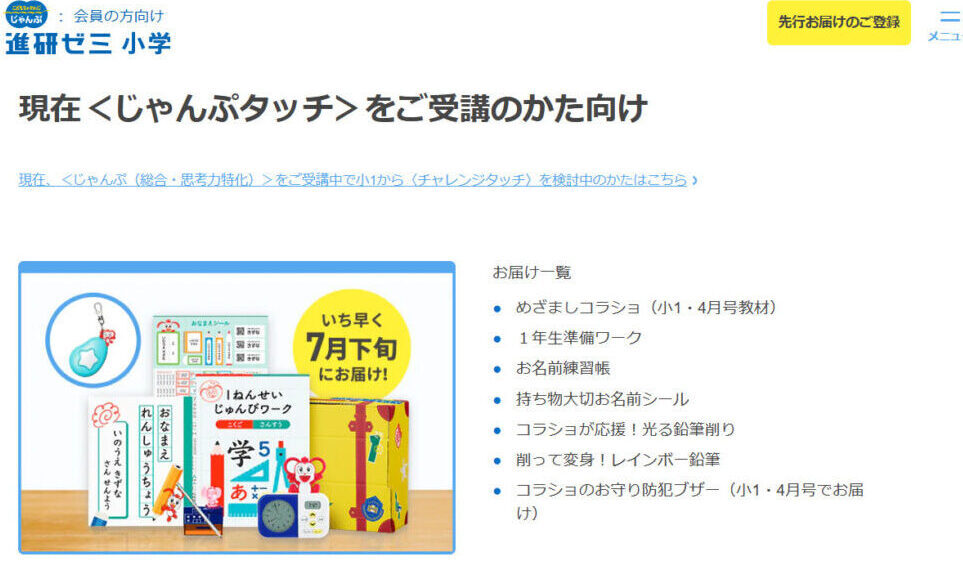

 

**チャレンジタッチ１年生（タブレットコース）**

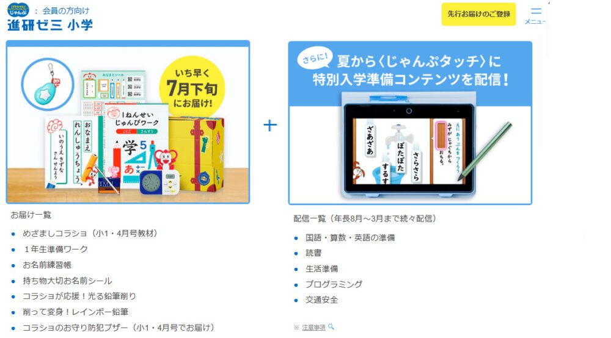

タブレットコースと紙教材コースでは受けられる特典に違いがあります。それぞれの教材の内容については、後ほど詳しく紹介します。

[チャレンジタッチとチャレンジの違い](https://xn--5ckip8c4fq970ahbya2o7acu2a.com/2022/02/12/%e3%83%81%e3%83%a3%e3%83%ac%e3%83%b3%e3%82%b8%e3%82%bf%e3%83%83%e3%83%81%e3%81%a8%e3%83%81%e3%83%a3%e3%83%ac%e3%83%b3%e3%82%b8%e9%81%b8%e3%81%b6%e3%81%aa%e3%82%89%e3%81%a9%e3%81%a3%e3%81%a1%ef%bc%9f/)を知りたい方は別記事で解説していますので、気になる方はリンクをタップしてください。♪

**＼2分で完了／**

[▶ 「公式」進研ゼミの1年生準備ボックスをはじめる](https://ck.jp.ap.valuecommerce.com/servlet/referral?sid=3613518&pid=887679902)

### 1年生準備スタートボックスと通常入会で大きく違う2つの点

1年生準備ボックスと普通に入会する場合では、以下の2点に大きな違いがあります。

1年生準備ボックスと通常入会の2つの違い

- 準備ボックス限定特典がもらえる
- 教材が4ヶ月早く届く

「1年生準備ボックス」に申し込みをすると、各種ワーク教材や学習用のめざまし時計が届けられます。これは新しい学習環境に適応することを目的とされています。

また、通常よりも早い段階で教材が届けられるため、少しでも勉強になれておくことができます。

## 1年生準備スタートボックスで貰える8つの豪華特典

「チャレンジタッチ1年生準備ボックス」を先行申し込みすると、多くの限定の豪華特典を手に入れることができます。

特典①：チャレンジ スタートナビ 特典②：チャレンジパッドnext 特典③：1年生準備ワーク 特典④：めざましコラショ 特典⑤：お名前練習帳 特典⑥：持ち物大切お名前シール 特典⑦：コラショのお守り防犯ブザー 特典⑧：コラショが応援！光る鉛筆削り

特典の内容は定期的に更新されますが、過去には**限定デザイン**の学習グッズや人気**キャラクターのグッズ**などが提供されたこともあります。お子さまの学習をより楽しく、効果的なものにするための工夫がたくさん詰まっています。

新しい学習環境への適応をスムーズにし、楽しく学習するための最初の一歩を踏み出すお手伝いをしてくれます。

**＼2分で完了／**

[▶ 「公式」進研ゼミの1年生準備ボックスをはじめる](https://ck.jp.ap.valuecommerce.com/servlet/referral?sid=3613518&pid=887679902)

### 1年生準備ボックス特典①：チャレンジ スタートナビ

「チャレンジ スタートナビ」は、これから小学1年生になる子供たちが、学習の基本となる「ひらがな・かたかな」の書き順を身につけるための学習ツールです。

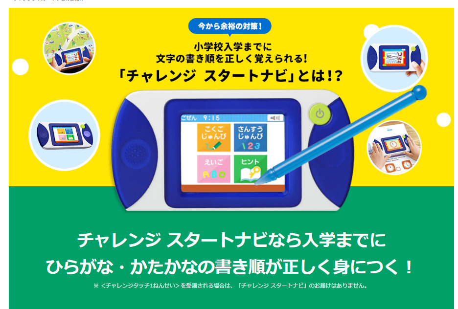スタートナビは、子供たちが「**なぞり書き**」から始めて、最終的には「何も見ずに白いマスに書く」までのステップを踏むことを支援します。これにより、ひらがな・かたかなの正しい書き順を自然と身に付けることができます。

さらに、「チャレンジ スタートナビ」には**計算**や**漢字**の書き順なだけでなく、ゲーム感覚で**英語**の勉強もすることができます。

※さまざまな機能がありますが、一部の機能は時期によって利用できるようになります。

※「たし算機能」は小1・6月号以降、「ひき算機能」は小1・7月号以降に利用可能です。なお、ピンク色のスタートナビの提供は終了しており、現在は新しいバージョンの提供が行われています。

### 1年生準備ボックス特典②：チャレンジパッドnext

チャレンジパッドnextは、2021年に進研ゼミで登場した最新のタブレットです。

このタブレット一台で、基本的な科目である国語や算数だけではなく、実力テストやプログラミングまでの学習が可能です。

これはタブレットコースに申し込んだ人限定で届けられるチャレンジパッドだよ

[チャレンジパッドnext](https://xn--5ckip8c4fq970ahbya2o7acu2a.com/2023/06/19/%e3%83%81%e3%83%a3%e3%83%ac%e3%83%b3%e3%82%b8%e3%83%91%e3%83%83%e3%83%89next%ef%bc%88%e3%83%8d%e3%82%af%e3%82%b9%e3%83%88%ef%bc%89%e3%81%a3%e3%81%a6%e3%81%a9%e3%82%93%e3%81%aa%e3%82%bf%e3%83%96/)についてもっと詳しく知りたい人は別記事で解説しています

### 1年生準備ボックス特典③：1年生準備ワーク

「1年生準備ワーク」は、国語と算数がメインの紙教材で、教科学習の準備から思考力を鍛える問題が用意されています。

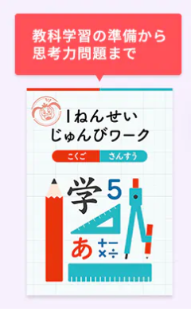このワークでは、「シールを張る」「線を引く」をしながら基本的な内容を勉強していきます。

### 1年生準備ボックス特典④：めざましコラショ

「めざましコラショ」とは、小学1年生が時計の読み方や時間管理を学ぶために作られたしゃべるめざまし時計です。

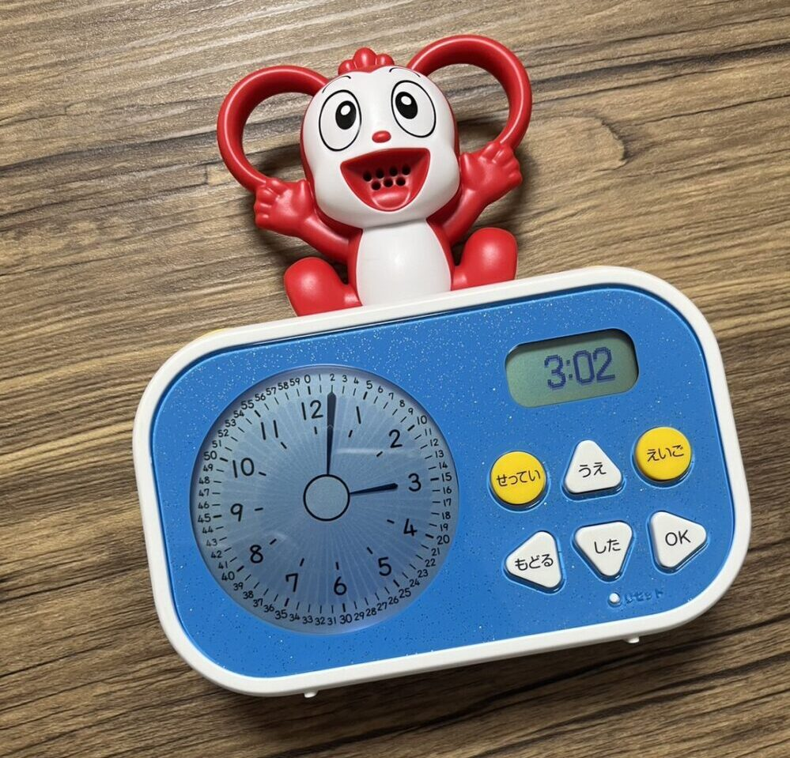コラショが名前を呼んで寝る時間や起きる時間を教えてくれるから、早寝・早起きを習慣づけられます。

また、自分だけのめざまし時計を毎日使うことで、時計の読み方や時間を管理する力が自然と身に付いていきます。

使い方は、「名前、誕生日、現在の西暦、現在の時間、アラームをセットする時間」の順に設定するだけのシンプルなので1～2分で終了します。

### 1年生準備ボックス特典⑤：お名前練習帳

進研ゼミのお名前練習帳には、届いた時点で、お子さんの名前が印刷されています。書き順どうりに上からなぞって書くことで、名前をきれいに書く練習ができます。

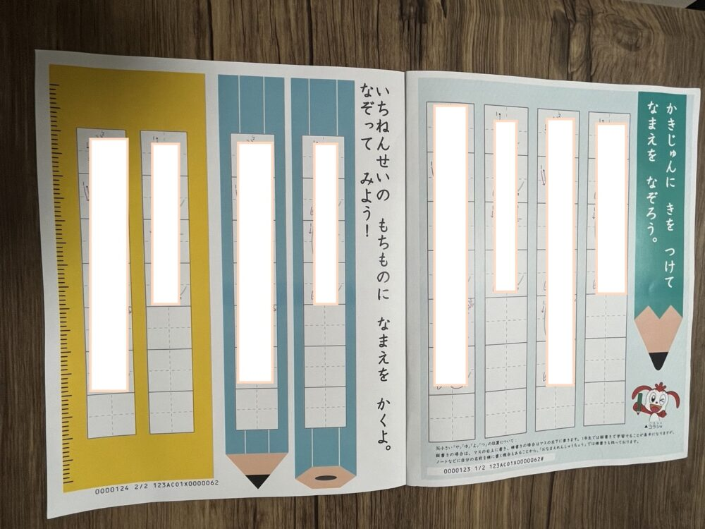

何度も自分の名前を書く練習をすることで、小学1年生になる前に自分の名前を書けるようになります。

### 1年生準備ボックス特典⑥：持ち物大切お名前シール

進研ゼミから届くシールは、大小合わせて400枚全てにお子さんの名前が既に印刷されています。

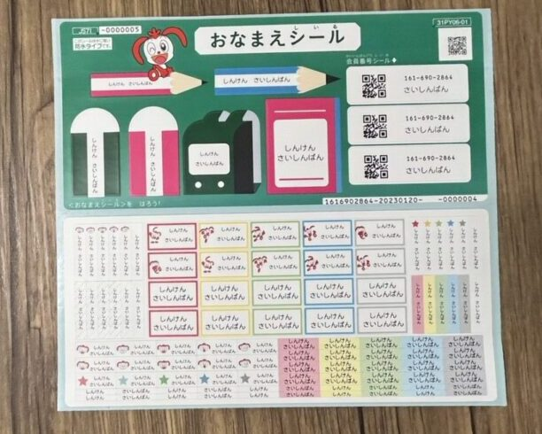一つ一つのシールに名前を書く手間が省けるので、鉛筆、はさみ、消しゴム、傘など、どんなものにでも自分の名前シールを貼ることができます。

そして、防水加工が施されているため、コップや歯ブラシなど水に濡れる可能性のある物にも貼ることができますよ。

文法的におかしい部分や読みづらい部分があれば、教えてください。

### 1年生準備ボックス特典⑦：コラショのお守り防犯ブザー

新しい生活を始める小学1年生にとって、登下校時の防犯ブザーは必需品ですよね？

コラショのお守り防犯ブザーは、小学生に配慮した設計がされているので、初めての防犯ブザーとして非常に適しています。

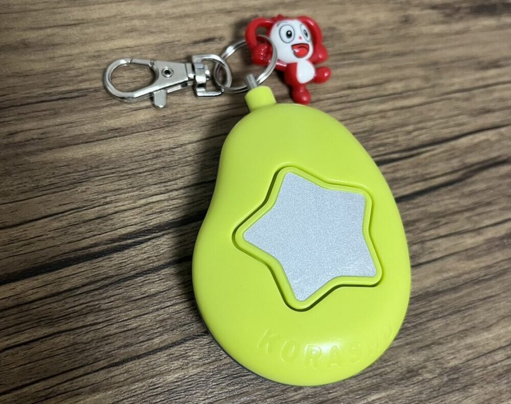危険を感じたら本体を強く引っ張ると、大きなブザー音が鳴り響き、もしもの緊急の事態が生じた場合には、コラショが保護を提供します！

ランドセルに装着しておくことができるので、緊急時にすぐに使えるようになっています。

### 1年生準備ボックス特典⑧：コラショが応援！光る鉛筆削り

最後に紹介するのが、コラショの鉛筆削りです。デザインも可愛く、機能性も高いのが特徴です。 鉛筆は小学生になると必ず使うため、鉛筆削りも学校生活には欠かせないアイテムの一つです。

### 注意：選択したコースによって貰える特典が違う

先ほども紹介したように、1年生準備ボックスに申し込みをする際、のチャレンジ（紙教材中心）とチャレンジタッチ（タブレット中心）の**2種類**から選ぶことができます。

この2種類では、送られてくる教材の内容が少しだけ違うので、それぞれ詳しく解説していきます。

| 教材紹介 | チャレンジ | チャレンジタッチ |
| --- | --- | --- |
| 「おしゃべりおうえん！めざましコラショ」 | 〇 | 〇 |
| 「チャレンジスタートナビ」（国語・算数） | 〇 | × |
| 「コラショのお守り防犯ブザー」 | 〇 | 〇 |
| 「1年生準備ワーク（国語・算数）」 | 〇 | 〇 |
| 「お名前練習帳」 | 〇 | 〇 |
| コラショが応援！光る鉛筆削り | 〇 | 〇 |
| 「持ち物大切お名前シール」 | 〇 | 〇 |
| チャレンジパッドnext（タブレット） | × | 〇 |

※申し込みをする期間によっては届く内容が変わる場合があります。

[チャレンジとチャレンジタッチの違い](https://xn--5ckip8c4fq970ahbya2o7acu2a.com/2022/02/12/%e3%83%81%e3%83%a3%e3%83%ac%e3%83%b3%e3%82%b8%e3%82%bf%e3%83%83%e3%83%81%e3%81%a8%e3%83%81%e3%83%a3%e3%83%ac%e3%83%b3%e3%82%b8%e9%81%b8%e3%81%b6%e3%81%aa%e3%82%89%e3%81%a9%e3%81%a3%e3%81%a1%ef%bc%9f/)をさらに詳しく知りたい方は別記事で紹介しているのでリンクをタップしてください。

✅ ちなみに、[進研ゼミ公式サイト](https://ck.jp.ap.valuecommerce.com/servlet/referral?sid=3613518&pid=887390659)では、この2種類のどちらが子供に合っているかを自動で診断してくれます。

無料診断の手順

1. 公式サイトに進む
2. 学年を選択する
3. 右上のメニューを開く
4. 学習のスタイル・比較診断を開く

🐕

タブレットと紙教材のコースで迷っている人におすすめだよ

**＼2分で完了／**

[▶ 「公式」進研ゼミの1年生準備ボックスをはじめる](https://ck.jp.ap.valuecommerce.com/servlet/referral?sid=3613518&pid=887679902)

## 1年生準備スタートボックスに登録する5つの手順

1年生準備ボックスへの登録は進研ゼミ公式サイトから行なうことができます。

1年生準備ボックスの登録手順５つ

1. 進研ゼミ公式サイトに進む
2. 「入会の申し込み」を選択
3. 新1年生（現在年長さん）を選択
4. タブレットコース、紙教材コースのどちらかを選択
5. 個人情報の入力（住所、氏名、電話番号など）

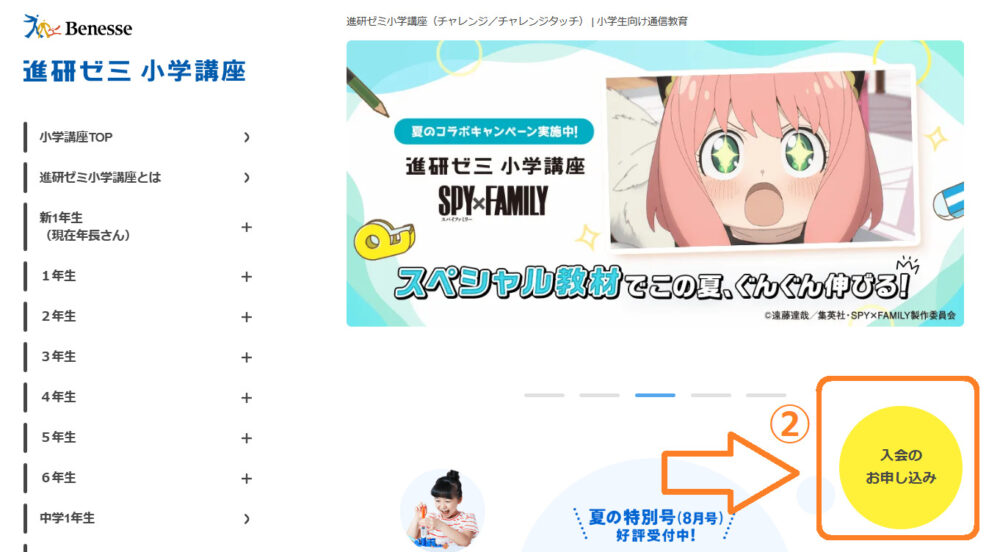

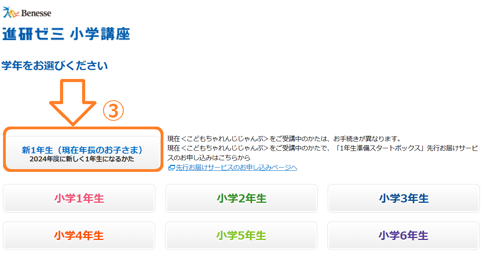

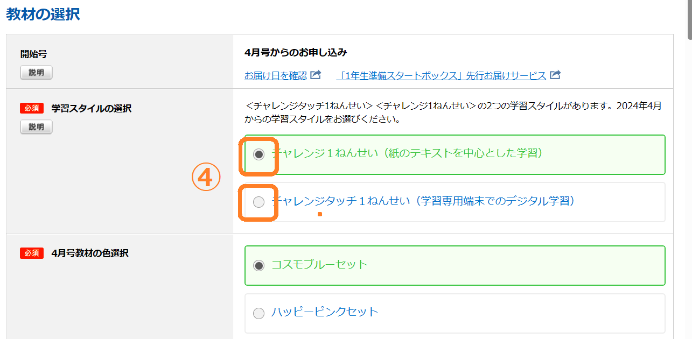

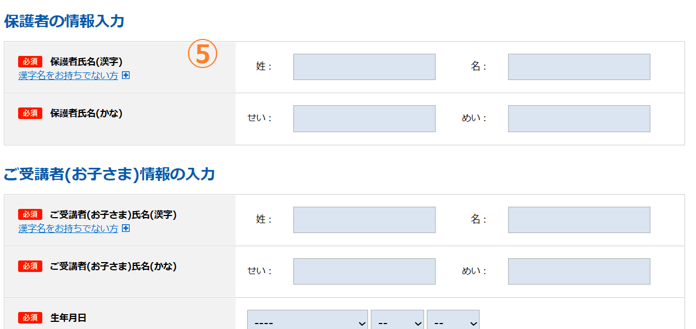

**＼2分で完了／**

[▶ 「公式」進研ゼミの1年生準備ボックスをはじめる](https://ck.jp.ap.valuecommerce.com/servlet/referral?sid=3613518&pid=887679902)

## 1年生準備スタートボックスに関するQ＆A

最後に、1年生準備スタートボックスに関するよくある質問をまとめました。

1年生準備スタートボックスへの登録を考えている方は、覚えておくと役立つ情報を紹介します。

### 1年生準備スタートボックスはいつ届く？

1年生準備スタートボックスは申し込みをした後約2週間程度で届けられます。

ただ、タブレットコースを選択した場合、専用タブレット、タッチペン、カバーが届くのは、2023年12月上旬以降に配送されます。

※「じゃんぷタッチ」（進研ゼミの幼児コース）を受講中で、小１から「チャレンジタッチ」を選択された方への「音読・英語かんぺきマイク」は、「じゃんぷタッチ」の1月号で、「きらきら★やる気アップボックス」は小1・4月号で配送されます。

つまり、タブレットが届けられるのは、早くても申し込みをした年に12月ということになります。

それ以外の教材や特典は基本的には、申し込みをしてから1～2週間以内にはお手元に届けられます。

[✅ 幼児にチャレンジタッチで先取り学習](https://xn--5ckip8c4fq970ahbya2o7acu2a.com/2023/05/10/%e5%b9%bc%e5%85%90%ef%bd%9e%e5%b0%8f%e5%ad%a61%e5%b9%b4%e7%94%9f%ef%bc%9a%e3%83%81%e3%83%a3%e3%83%ac%e3%83%b3%e3%82%b8%e3%82%bf%e3%83%83%e3%83%81%e3%81%ae%e5%85%88%e5%8f%96%e3%82%8a%e3%81%af%e5%85%88/)をさせたい方はこちらの記事に詳しく紹介してあります。

### 1年生準備ボックスに入会するタイミングはいつが良い？

結論から言うと、進研ゼミへの入会を考えているのであれば、申めに始めることをおすすめします。

進研ゼミの1年生準備スタートボックスは、子どもが小学校1年生になる前、つまり、小学校入学の年の前半から利用を始めるのが一般的です。

このプログラムは、子どもが小学校1年生になる前に始めるのが普通です。例えば、もし子どもが2024年の4月に小学1年生になるのであれば、2023年の後半（だいたい秋から冬くらい）には始めておくと良いでしょう。これは、子どもが小学校に入学する前に、学ぶ準備と学習の習慣を身につけるためです。

また、入会のタイミングは子どもの学習ニーズや家庭のスケジュールにもよります。子どもが学習習慣を早くから身につけ、家庭のライフスタイルに適した時期に入会することが大切です。

特に小学1年生（4月）から進研ゼミに入会させることを決めている方は今すぐ入会することをオススメします。

**＼2分で完了／**

[▶ 「公式」進研ゼミの1年生準備ボックスをはじめる](https://ck.jp.ap.valuecommerce.com/servlet/referral?sid=3613518&pid=887679902)

### 1年生準備スタートボックスは途中解約できる？

結論から言うと、解約手続き自体は電話一本で行えます。

こどもちゃれんじの受講者であろうと非会員であろうと、この電話番号にかければすぐに解約が可能です​。

解約の電話番号：0120-977-377

ただし、途中で解約する場合は、利用した期間によって進研ゼミに返却しなければならない物もあるので注意が必要です。

### 途中解約すると教材は返却しないとダメ？

1年生準備スタートボックスに先行申し込みをして、4月号を受け取る前に解約する場合は、届いた教材すべてを返却する必要があります。

そのため、解約する場合は、届**いた教材全てを捨てずに残しておく必要があります。**

「もし教材を捨ててしまった」という場合は、4月号を受け取るまで解約することはできません。

逆に言うと、4月号を受け取った後は解約しても教材を返却する必要がなくなります。

### 1年生が4月号で退会する教材は返却しないでいい？

この準備ボックスは4月号まで、受講して解約した場合は教材を返却する必要はありません。全ての教材が手元に残ります。

なんと、タブレットの返却も必要ありません。解約後もタブレットを使用して勉強することができます。タブレットだけでも39,800円(税込)するので、途中で解約したとしても**かなりお得ですね**！

そのため、個人的には解約するのであれば1年生準備ボックスの教材が全て貰える4月号まで待ってからがオススメです♪

進研ゼミのタブレットは、解約してからでも2年間はダウンロードした講座を利用することができます。

ダウンロードした講座を利用しない場合は、タブレットをAndroid化することも可能です。

Android化すれば普通のタブレットとしても使用することができますので、興味のある方は、別記事の[Android化する方法](https://xn--5ckip8c4fq970ahbya2o7acu2a.com/2022/04/30/%e3%83%81%e3%83%a3%e3%83%ac%e3%83%b3%e3%82%b8%e3%82%bf%e3%83%83%e3%83%81%e3%81%ae%e6%94%b9%e9%80%a0%e3%81%af%e5%8d%b1%e9%99%ba%ef%bc%9fandroid%e5%8c%96%e3%81%ae%e3%83%aa%e3%82%b9%e3%82%af%ef%bc%95/)をご覧下さい。

### 途中でコースを変更することは可能？

1年生準備スタートボックスに先行入会した後でコースを変更する場合は、2つの注意点があります。

**教材の返品**：コース変更を行うと、特定の教材を返品する必要があります。例えば、「チャレンジ1年生（紙教材）」から「チャレンジタッチ1年生（タブレット学習）」へ変更した場合は、「チャレンジスタートナビ」を返却する必要があります。

逆に、「チャレンジタッチ1年生」から「チャレンジ1年生」に変えた場合は、「チャレンジタッチ」を返却しなければいけません​。

**送料の負担**：返送にかかる送料は自己負担となります。また、返送手続きも自分で行う必要があります​。

コース変更によって追加料金が発生することはありませんが、送料の負担や手続きの手間が必要となります。

コースを変更する場合は、一度電話にてお問い合わせするとスタッフさんが丁寧に教えてくださいますよ♪

問い合わせ電話番号：0120-977-377

### 1年生準備スタートボックス支払いの日はいつから？

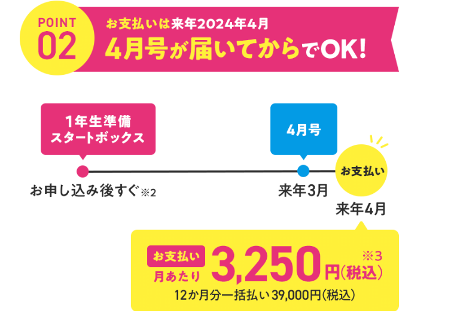

1年生準備スタートボックスの支払いは、申し込みをしてすぐに教材が届けられますが、支払いは4月まで不要になります。

つまり、2023年の8月に申し込みをしてすぐに教材が届いても支払いは2024年の4月から始まります。

### 進研ゼミに入会している幼児（年長）でも特典はもらえる？

結論から言うと、進研ゼミに入会している幼児（こどもちゃれんじじゃんぷ会員）でも1年生準備スタートボックスの特典を貰うことは可能です。

ただし、『1年生準備スタートボックス』の特典を受けるためには、事前に連絡が必要になります。

毎月、『1年生準備スタートボックス』に関するダイレクトメールが届く場合、その指示に従うだけで問題ありません。しかし、もし知らなかったとしたら、実は会員ページからも手軽に手続きを行うことができます。

『チャレンジ』の利用を続ける予定があるなら、この機会にぜひ特典を受け取ってみてください。費用は一切かからず、たくさんの教材を得る絶好のチャンスですよ♪

**＼2分で完了／**

[▶ 「公式」進研ゼミの1年生準備ボックスをはじめる](https://ck.jp.ap.valuecommerce.com/servlet/referral?sid=3613518&pid=887679902)
