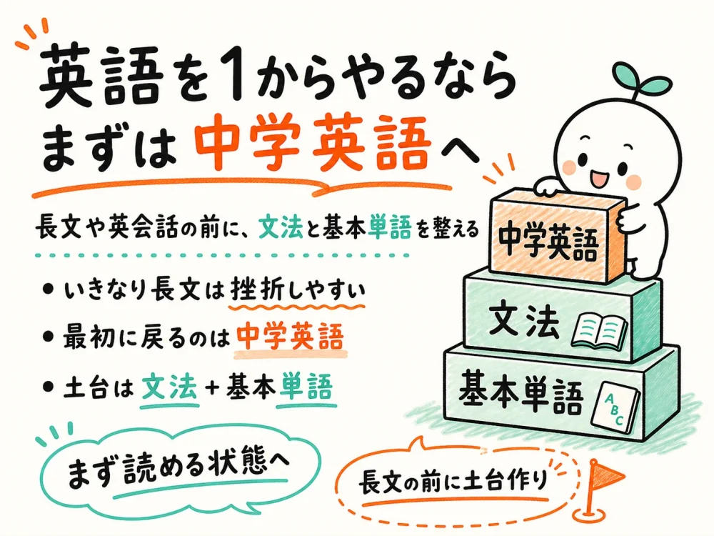
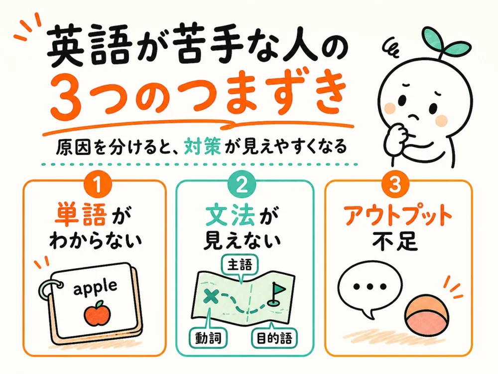
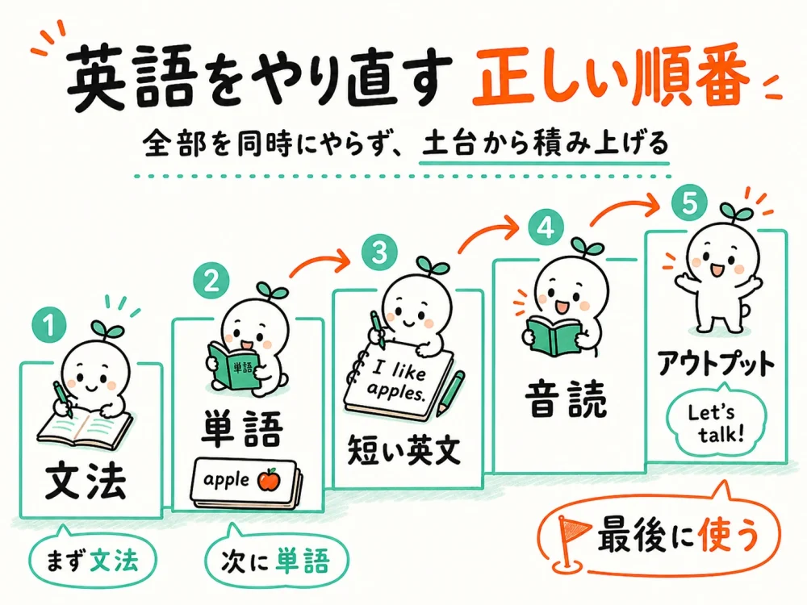
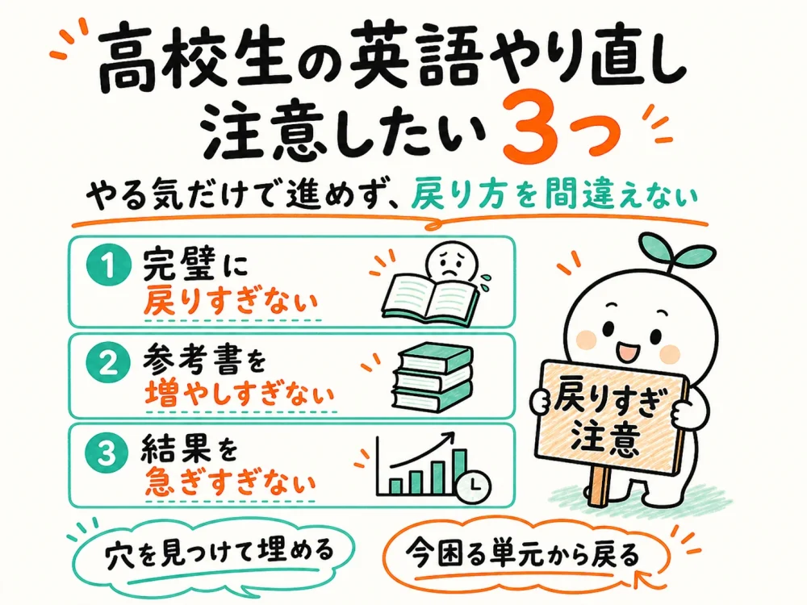
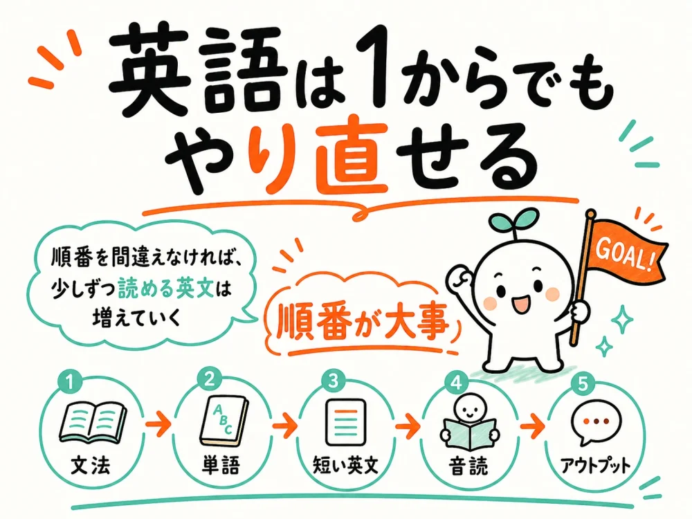

「英語を1から勉強したい」と思っても、いざ始めようとすると「単語から？」「文法から？」「長文もやるべき？」みたいに迷うんですよね。

特に高校生の場合、学校の授業は容赦なく先へ進みます。

中学英語があいまいなまま高校英語に入ると、文法も長文も一気にわけがわからなくなるわけです。

ただし、英語は戻る順番を間違えなければ、1からでもちゃんとやり直せます。

ってことで今回は、英語が苦手な人がどこでつまずきやすいのかを整理しつつ、1から勉強し直す順番をまとめておきます。

## 英語を1から勉強したい人は、まず何から始めればいい？

 英語を1からやり直すなら、まず戻るべきなのは「中学英語の文法」と「基本単語」です。

いきなり長文読解や英会話から始めなくてもOKです。

というか、土台がない状態で難しい教材に手を出すと、「やっぱ英語ムリかも……」となりやすいんですよね。

### いきなり長文や英会話から始めると挫折しやすい

英語を頑張ろうと思ったとき、長文問題集や英会話アプリから始める人はけっこういます。 もちろん、長文も英会話も大事です。

ただ、英語が苦手な状態でいきなりそこに行くと、わからない単語と文法だらけになります。

1文読むだけで止まる。 音声を聞いても、何を言ってるのかわからない。 解説を読んでも、そもそも文の形が見えない。

みたいな感じですね。

これだと、勉強している時間は長いのに、理解が積み上がりにくいです。

なので、英語を1から勉強するなら、まずは「読める状態」を作るのが先であります。

### 最初に戻るべきなのは中学英語の文法と単語

英語の土台になるのは、中学英語の文法と基本単語です。 高校英語が難しく感じる原因は、高校内容そのものというより、中学英語の抜けにあるケースが多いんですよね。

たとえば、以下のような内容です。

中学英語で確認したいポイント

・be動詞と一般動詞の違いがあいまい ・三単現のsが感覚でしかわかっていない ・過去形、現在完了、受け身の区別が弱い ・不定詞や動名詞の使い方が整理できていない ・関係代名詞が出ると文の形が見えなくなる

ここがあいまいなまま高校英語に進むと、仮定法や分詞構文、長文読解でかなり苦しくなります。

逆に言えば、中学英語を整理し直すだけでも、高校英語の見え方はけっこう変わります。

## 英語が苦手な人に多い3つのつまずき

英語が苦手な人は、才能がないわけではありません。 多くの場合、つまずいている場所がそのまま放置されているだけです。

特に多いのは、単語、文法、アウトプットの3つであります。

### 単語がわからず英文が読めない

英語の文章を読むとき、単語がわからなければ当然止まります。 しかも、わからない単語が1文に何個も出てくると、文法を考える余裕もなくなります。

「文法が苦手」と思っている人でも、実は単語不足で読めていないケースは多いんですよね。

ただし、単語帳を最初から完璧に覚えようとしなくても大丈夫です。

まずは、学校の教科書や定期テストでよく出る基本単語からで十分です。

**最初の目標は、難単語を増やすことではなく、短い英文を止まらず読める単語量を作ることです。**

### 文法があいまいで文の形が見えない

単語の意味がわかっても、文法があいまいだと英文は読めません。 たとえば、関係代名詞が入った文で、どこまでが主語で、どこからが説明なのか見えなくなる。

不定詞（ふていし）が出てきたときに、「名詞的用法」「形容詞的用法」「副詞的用法」の違いがわからなくなる。

こうなると、単語をつなげてなんとなく訳すしかなくなります。

でも、なんとなく訳す読み方は、長文になるほど崩れます。

文法は暗記科目というより、英文の形を見るための地図みたいなものです。

地図があると、知らない道でも進みやすくなるわけですね。

### 勉強しているのにアウトプットが足りない

英語を1から勉強する人ほど、インプットだけで終わりがちです。 単語を見る。 文法の解説を読む。 長文の日本語訳を確認する。

これも大事です。

ただ、それだけだと「わかったつもり」で止まりやすいんですよね。

本当に理解できているかは、自分で使ってみるとすぐにわかります。

たとえば、覚えた文法で1文作ってみる。 短い英文を音読してみる。 日本語を見て英語に直してみる。

この小さなアウトプットを入れるだけでも、英語の定着はかなり変わります。

## 英語を1からやり直す勉強順

英語を1からやり直すときは、順番が大事です。 やる気があると、つい単語も文法も長文もリスニングも英作文も、全部まとめてやりたくなります。

が、これを最初からやるとかなりしんどいです。

まずは土台から順番に積み上げていきましょう。

### まずは中学レベルの文法を復習する

最初にやるべきなのは、中学英文法の復習です。 高校生だからといって、いきなり高校英文法から始める必要はありません。

むしろ、中学英文法をざっと確認したほうが早いケースは多いです。

特に優先したいのは、以下の単元です。

最初に復習したい英文法

・be動詞、一般動詞 ・疑問文、否定文 ・過去形、未来表現 ・助動詞 ・不定詞、動名詞 ・比較 ・受け身 ・現在完了 ・関係代名詞

ここを完璧に説明できなくても、英文を見たときに「あ、これは受け身だ」「これは関係代名詞だ」と気づければOKです。

最初から細かい例外まで覚えようとしなくて大丈夫です。

まずは文の形を見抜けるようにするのが大事であります。

### 基本単語を毎日少しずつ覚える

文法と並行して、基本単語も進めます。 単語は一気に覚えようとすると苦しくなります。

1日100個を無理やり詰め込むより、1日20個を何度も見るほうが続きやすいです。

大事なのは、完璧主義にならないことです。

1回で覚えられなくても問題ありません。

単語は、何度も出会うことで少しずつ定着します。

学校の教科書、単語帳、定期テスト範囲の単語を優先して、まずは「見たことがある単語」を増やしていきましょう。

### 短い英文を読んで音読する

文法と単語を少しずつ復習したら、短い英文に進みます。 ここでいきなり長文問題集に入る必要はありません。

最初は、教科書の本文や短めの例文で十分です。

英文を読むときは、次の流れがおすすめです。

・英文を読む ・わからない単語を確認する ・文の形を確認する ・日本語訳を見る ・最後に音読する

音読を入れると、英語の語順に慣れやすくなります。 ただ目で読むだけより、口を動かしたほうが記憶にも残りやすいです。

「読める」「意味がわかる」「声に出せる」英文を少しずつ増やしていく。

これが、1から英語をやり直すときの現実的な進め方かと存じます。

## 高校生が英語をやり直すときの注意点

英語を1から勉強し直すとき、やる気だけで突っ走ると失敗しやすいです。 特に高校生は、学校の授業、定期テスト、模試、受験勉強が同時に進みます。

だからこそ、戻り方を間違えないことが大事です。

### 完璧に戻ってから進もうとしない

中学英語に戻るのは大事です。 ただし、中学英語を100％完璧にしてから高校英語に進もうとすると、時間がかかりすぎます。

英語は、戻る勉強と今の授業の勉強を分けすぎないほうがいいです。

たとえば、学校で不定詞が出てきたら、中学範囲の不定詞まで戻る。長文で関係代名詞が出てきたら、中学の関係代名詞を確認する。

ぐらいの戻り方でOKです。

全部を最初からやり直すというより、穴を見つけて埋めるイメージですね。

### 参考書を何冊も増やさない

英語が苦手なときほど、新しい参考書に頼りたくなります。 これ、かなり気持ちはわかります。

ただ、参考書を増やしすぎると、どれも中途半端になりがちです。

最初は、文法1冊、単語帳1冊、学校の教科書で十分です。

大事なのは、教材の数ではなく、同じ内容を何度も確認することです。

「この参考書が合わないかも」と感じたときも、すぐに買い替える前に、まず1章だけでもやり切ってみるのがおすすめです。

進んだ量が少ないうちは、教材の良し悪しより、勉強の続け方のほうが影響しやすいです。

### 短期間で結果を求めすぎない

英語は、今日やったことが明日すぐ点数になる科目ではありません。

特に1からやり直す場合、最初は「わかることは増えているのに、点数にはまだ出ない」という時期があります。

ここで焦ってやめてしまう人は多いです。

でも、文法が見えるようになり、単語が増え、短い英文が読めるようになると、あるタイミングから長文の理解がかなり楽になります。

つまり、最初の数週間は土台作りの期間です。

点数だけで判断せず、「昨日より読める英文が増えたか」で見ていくと続けやすいかと思います。

## AIを使えば英語のやり直しはもっと進めやすい

英語を1から勉強し直すとき、今はAIを使えるのが大きいです。 昔なら、わからない文法は先生に聞くか、参考書を読み込むしかありませんでした。

でも今は、AIに「この英文の構造を中学生にもわかるように説明して」と聞けます。

これは、英語が苦手な人ほど相性がいい使い方です。

たとえば、こんなことができます。

AIでできる英語のやり直し

・英文の主語と動詞を分けてもらう ・不定詞や関係代名詞をやさしく説明してもらう ・自分の英作文を添削してもらう ・単語テストを作ってもらう ・定期テスト範囲から確認問題を作ってもらう

ただし、AIに丸投げするだけでは伸びません。

大事なのは、AIを答えを出す道具ではなく、自分専用の先生として使うことです。

わからないところを説明してもらい、自分で解き直し、もう一度確認する。

この流れができると、英語のやり直しはかなり進めやすくなります。

AIを使って英語の苦手を整理したい人向けに、単語・文法・長文・定期テスト対策までまとめたNOTEも用意しています。この記事の内容からさらに具体的なAI活用手順まで知りたい場合は、必要なところだけ参考にしてみてください。[高校英語の完全攻略NOTEで詳しく見る](https://note.com/glossy_colt7458/n/ncf73e36ce9cc)

## まとめ 英語は1からでも順番を間違えなければやり直せる

英語を1から勉強したいとき、最初にやるべきなのは難しい長文でも英会話でもありません。 まずは中学英語の文法と基本単語に戻ることです。

そこから短い英文を読み、音読し、少しずつアウトプットを入れていく。

この順番で進めれば、英語が苦手な状態からでも十分やり直せます。

英語を1から勉強する順番は、 文法 → 単語 → 短い英文 → 音読 → アウトプット の流れで考えるとわかりやすいです。

大事なのは、完璧に戻ってから進もうとしないことです。 今つまずいている単元を見つけて、必要なところまで戻る。

この繰り返しで、少しずつ読める英文が増えていきます。

そんなわけで、英語は苦手になった原因を整理すれば、1からでもちゃんと立て直せる科目であります。
