使わなくなったチャレンジタッチのタブレットを改造してAndroid化すればYouTubeやゲームアプリなどを使えるようになります。

iPadのように自由に何でも使えるという訳ではありませんが、「**YouTubeやアプリを利用したい**」という方にはオススメです。

ただし、チャレンジタッチの**改造には危険な部分もある**ので、Android化を考えるいる方は今回紹介する５つのリスクを知っておきましょう。

この注意点を知らずにAndroid化してしまい、「新しくタブレットを購入なければいけなくなった」という人もるので、必ず確認しておきましょう。

記事の後半では**パソコンを使わない**簡単で**安全**なAndroid化の方法を紹介していきます。

<strong>おすすめ</strong>の<strong>タブレット学習教材</strong>を知りたい人はクリックしてね♪

[「小学生」におすすめのタブレット学習6選](https://xn--5ckip8c4fq970ahbya2o7acu2a.com/2021/08/29/%e5%b0%8f%e5%ad%a6%e7%94%9f%e3%81%ae%e3%82%bf%e3%83%96%e3%83%ac%e3%83%83%e3%83%88%e5%ad%a6%e7%bf%92%e3%81%8a%e3%81%99%e3%81%99%e3%82%817%e9%81%b8%e3%80%82%e3%81%9d%e3%82%8c%e3%81%9e%e3%82%8c%e3%81%ae/)

[「中学生」におすすめのタブレット学習6選](https://xn--5ckip8c4fq970ahbya2o7acu2a.com/2024/02/05/%e5%8b%89%e5%bc%b7%e3%81%8c%e8%8b%a6%e6%89%8b%e3%81%aa%e4%b8%ad%e5%ad%a6%e7%94%9f%e3%81%ab%e3%81%8a%e3%81%99%e3%81%99%e3%82%81%e9%80%9a%e4%bf%a1%e6%95%99%e8%82%b26%e9%81%b8%ef%bc%81%e5%9c%a7%e5%80%92/)

## チャレンジタッチAndroid化のリスク５つ

使わなくなったチャレンジパッドはAndroid化の改造を行なうことで「YouTube・SNS・アプリゲーム」を利用することができます。

ただ、Android化の改造には注意点があります。

今回は、Android化する前に知っておきたい注意点を５つ紹介します。

### 注意①改造後は進研ゼミで利用できない

進研ゼミ入会中にタブレットをAndroid化してしまう方はたまにいますが、これは**絶対にしてはいけません**。

入会中にタブレットをAndroid化してしまうと、進研ゼミから配信される講座やサービスといった**全てが利用不可になります**。

🐕

タブレットの改造は必ず、進研ゼミを退会した後にしてね

▶ [チャレンジタッチ【解約】解約手順のまとめ](https://xn--5ckip8c4fq970ahbya2o7acu2a.com/2021/09/18/1175/)

### 注意②ダウンロードした講座が消えてしまう

チャレンジタッチを退会した後でも**2年間はダウンロード済みの講座を利用可能**となります。

しかし、Android化すると今までダウンロードした**データが全て削除**されてしまいます。

もし、「歳が近い兄弟がいる」といった場合はダウンロード済みのデータが2年間使えるのでAndroid化は控えておくといいでしょう。

▶ [チャレンジタッチは兄弟で共有できる？](https://xn--5ckip8c4fq970ahbya2o7acu2a.com/2022/02/19/%e3%82%b9%e3%83%9e%e3%82%a4%e3%83%ab%e3%82%bc%e3%83%9f%e3%83%bb%e3%83%81%e3%83%a3%e3%83%ac%e3%83%b3%e3%82%b8%e3%82%bf%e3%83%83%e3%83%81%e3%81%af%e5%85%84%e5%bc%9f%e3%81%ae%e3%81%8a%e4%b8%8b%e3%81%8c/)

### 注意③再入会にはタブレット購入が必要

「進研ゼミに再入会したい」と思っても、一度Android化したタブレットは、進研ゼミでは使用できません。

進研ゼミに再入会する際は、また新しくタブレットを**再購入****する必要があります。**

**タブレットが無料になるのは新規申し込みの方限定**のため、タブレットは定価での購入になります。

「退会したけど、また入会するかもしれない」という人はタブレットのAndroid化は控えて保管しておくこといいですよ。

再入会時のタブレット購入に関しては別記事で解説してるので参考にしてください。

▶ [チャレンジタッチ再入会はタブレットの購入が必要？](https://xn--5ckip8c4fq970ahbya2o7acu2a.com/2022/02/24/%e9%80%b2%e7%a0%94%e3%82%bc%e3%83%9f%e3%83%81%e3%83%a3%e3%83%ac%e3%83%b3%e3%82%b8%e3%82%bf%e3%83%83%e3%83%81%e5%86%8d%e5%85%a5%e4%bc%9a%e3%81%ab%e3%81%af%e3%82%bf%e3%83%96%e3%83%ac%e3%83%83%e3%83%88/)

▶ [チャレンジパッド交換料金はいくら？保証がいらない人はどうする？](https://xn--5ckip8c4fq970ahbya2o7acu2a.com/2022/04/05/%e3%83%81%e3%83%a3%e3%83%ac%e3%83%b3%e3%82%b8%e3%82%bf%e3%83%83%e3%83%81%e7%ab%af%e6%9c%ab%e3%81%ae%e4%ba%a4%e6%8f%9b%e3%81%ae%e6%96%99%e9%87%91%e3%81%af%ef%bc%9f%e4%bf%9d%e8%a8%bc%e3%81%8c%e3%81%84/)

### 注意④Android化は失敗する可能性がある

Android化の改造は失敗する可能性もあり、最悪の場合タブレット自体が壊れてしまうこともあります。

🐕

そもそもチャレンジタッチの改造は<strong>進研ゼミは推奨しているの？</strong>

進研ゼミの相談窓口に問い合わせてみましたので、実際に返ってきた内容を紹介します。

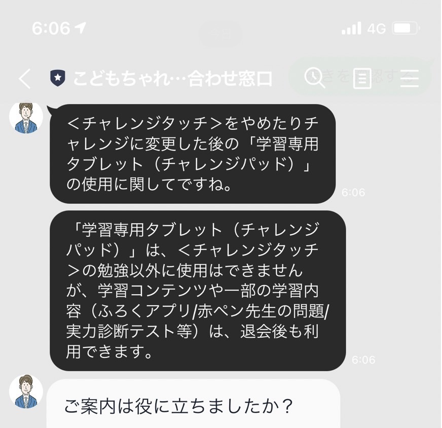

**返答内容**

「学習専用タブレット（チャレンジパッド）」は、＜チャレンジタッチ＞の勉強以外に使用はできませんが、学習コンテンツや一部の学習内容（ふろくアプリ/赤ペン先生の問題/実力診断テスト等）は、退会後も利用できます。

返信された内容にあるように進研ゼミ公式サイトでは、**タブレットの改造は推奨していません**。

そのため、必ずしも安全にできるわけではなく、失敗する可能性もゼロではありません。

Android化をする際は**全て自己責任でおこないましょう**。

ちなみに、[スマイルゼミ](https://xn--5ckip8c4fq970ahbya2o7acu2a.com/2021/06/30/%e3%82%b9%e3%83%9e%e3%82%a4%e3%83%ab%e3%82%bc%e3%83%9f%e5%b0%8f%e5%ad%a6%e7%94%9f%e3%81%ae%e3%80%8c%e5%8f%a3%e3%82%b3%e3%83%9f%e3%83%bb%e8%a9%95%e5%88%a4%e3%80%8d%e3%81%8c%e6%9c%80%e6%82%aa%e3%81%a8/)では公式サイトがタブレットのAndroid化を推奨しています。

スマイルゼミのAndroid化は進研ゼミよりも簡単で約10程で完了します。

▶ [スマイルゼミ解約方法は超簡単！解約後のAndroid化まで紹介](https://xn--5ckip8c4fq970ahbya2o7acu2a.com/2021/12/24/%e3%82%b9%e3%83%9e%e3%82%a4%e3%83%ab%e3%82%bc%e3%83%9f%e3%80%90%e8%a7%a3%e7%b4%84%e6%96%b9%e6%b3%95%e3%80%91%e3%81%af%e8%b6%85%e7%b0%a1%e5%8d%98%ef%bc%81%e3%80%8c%e9%81%95%e7%b4%84%e9%87%91%ef%bd%9ean/)

### 注意⑤Android化できない機種もある

Android化は、全てのチャレンジパッドで改造することは理論的には可能です。

しかし、まだ出たばかりのNEOやNextでは改造の方法がまだ確立されていません。

**一般的に改造できるのは今の段階だとチャレンジパッド2，3、NEOになります。**

今回は、その中でもチャレンジパッド2，3のAndroid化の方法を紹介します。

**＼5分で完了／**

[✅ 今すぐ「公式」進研ゼミ小学講座に入会する](//ck.jp.ap.valuecommerce.com/servlet/referral?sid=3613518&pid=887915088)

[✅ 今すぐ「公式」進研ゼミ中学講座に入会する](//ck.jp.ap.valuecommerce.com/servlet/referral?sid=3613518&pid=887915087)

## チャレンジタッチをAndroid化の手順

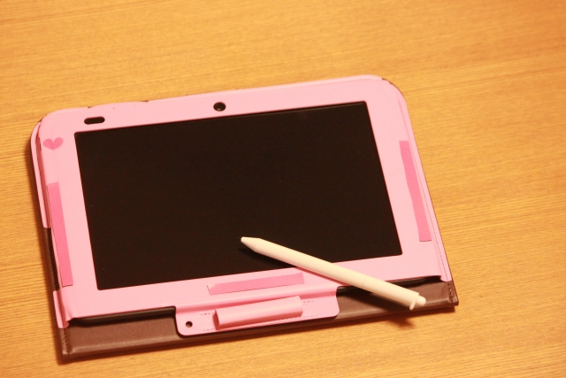チャレンジタッチの改造にはいくつか方法があります。

パソコンで改造する方法もありますが、今回は**タブレットとWi-Fiのみでできる改造方法を紹介します。**

🐕

早速、Android化をしていこう

Android化の手順は３つだよっ

**1：ホ****ームボタンと電源ボタンを同時に押し続ける**

すると画面が暗くなり「Android」の表示されます。

 

**2：「システム復旧モードに入ります」と表示されたら「ホームボタン」を離す**

ホームボタンは、「工場出荷状態にもどしますか？」と表示されるまで押し続けます。

 

**3：「工場出荷状態にもどしますか？」と表示されたら音量ボタンで「はい」を選択して電源ボタンを押す**

すると「工場出荷状態に戻しました」と表示され、画面が暗くなので、再び電源ボタンを長押しして電源を入れましょう。

この作業で今までダウンロードした講座やデータが全て削除されます。

以上でAndroid化の設定は完了です。

ただ、これだけではWebやアプリをインストールをすることはできません。Webに繋げるには、Wi-Fiに接続できるように設定する必要があります。

**＼5分で完了／**

[✅ 今すぐ「公式」進研ゼミ小学講座に入会する](//ck.jp.ap.valuecommerce.com/servlet/referral?sid=3613518&pid=887915088)

[✅ 今すぐ「公式」進研ゼミ中学講座に入会する](//ck.jp.ap.valuecommerce.com/servlet/referral?sid=3613518&pid=887915087)

## チャレンジタッチをWebに接続する手順

Android化しただけの状態では、YouTubeやSNSなどを利用することはできません。

Web設定をする前にタブレットを自宅のWi-Fiに接続しておく必要があります。

**Wi-Fiの接続方法**

「設定」を開く ↓ 「Wi-Fi」を開く ↓ 「Wi-Fi」をオンにする ↓ 自宅で使用しているWi-Fiのパスワードを入力 ※「接続完了」とでたら準備OK

ウェブ設定はチャレンジパッド1とチャレンジパッド2・3では設定の方法が違うよ

それぞれの設定方法を見ていこう

### チャレンジパッド1（Web設定）

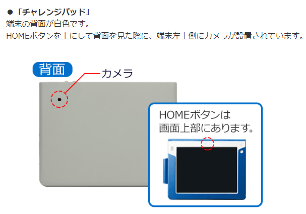

チャレンジパッド1をWebに接続する方法はとても簡単です。

**1：画面右上の点々（縦に3つ並んだ）を開く** 「ヘルプ」をタップ

 

**2：「何をお探しですか？」と表示される** これでGoogleでWeb検索ができるようになります。

検索したい場合は画面を上にスワイプして検索窓を表示させます。

既に入力されているURLを削除して検索したい内容を入力すればOKです。

### チャレンジパッド2・3（Web設定）

次にチャレンジパッド2・3をWebに接続する方法を紹介します。

**1：タブレット内にある「設定」を開く** 画面中央下に出てくる記号（○の中に点々がある）をタップして「設定」を開きます。

 

**2：「タブレット情報」を開く** 「法的情報」→「オープンソースライセンス」の順でタップする

 

**3：黒文字を探して長押しする** 青色のリンク文字が大量に並ぶ中で、どれでもいいので、黒い文字を長押しします。

 

**4：右上にでる「ウェブ検索」をタップする**

以上でWeb設定は完了です。

この設定ができればアプリのインストールの設定が始められます。

**＼5分で完了／**

[✅ 今すぐ「公式」進研ゼミ小学講座に入会する](//ck.jp.ap.valuecommerce.com/servlet/referral?sid=3613518&pid=887915088)

[✅ 今すぐ「公式」進研ゼミ中学講座に入会する](//ck.jp.ap.valuecommerce.com/servlet/referral?sid=3613518&pid=887915087)

## チャレンジタッチにアプリをインストールする手順

アプリをインストールするにも設定が必要です。

**①Webを開きWebの検索窓にAPKqure apkと入力** 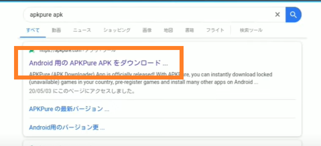

**②「Android用のAPKqure apk」ダウンロードをタップ** 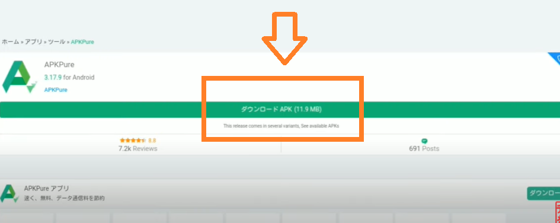

**③画面を上から下にスワイプして通知バーを開き「ダウンロードが完了しました。」をタップ** 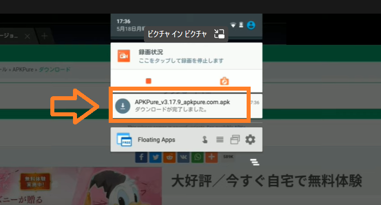

**④以下のように画面が切り替わったら下にスワイプして「インストール」をタップ** 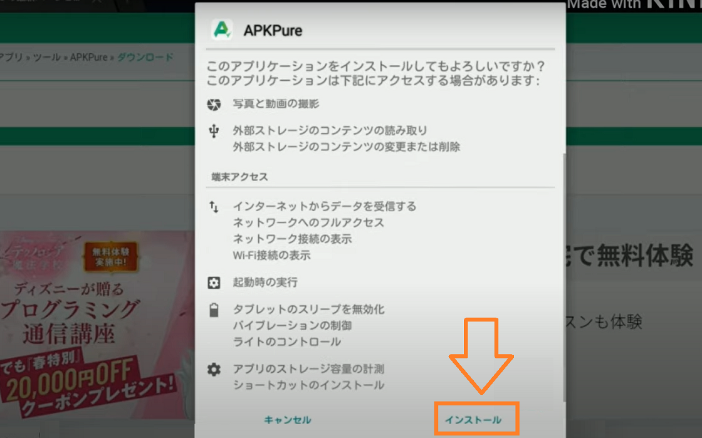

**⑤「インストール完了しました。」とでたら右下の「開く」をタップ**

**⑥以下のような画面に移ったら「画面上の検索窓にインストールしたいアプリ名を入力してダウンロードする** 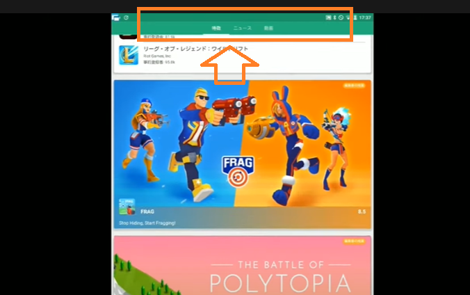

🐕

アプリは先ほどインストールした「APKqure apk」からいつでもダウンロードすることができます。

### タブレットを自分好みにカスタマイズする方法

次にタブレット内をカスタマイズする手順を解説します。

今回紹介する方法を使えば「アニメーション」「フォルダ」などのほとんどを自分好みにカスタマイズすることが可能です。

早速はじめましょう。

カスタマイズには「novalauncherapk\]というアプリを使います。

「novalauncherapk\]はアンドロイドのカスタマイズとしてよく使われるソフトで、危ないものではなく、信用できるアプリなので安心してください。

①Webの検索窓に「novalauncherapk\]と入力する

②一番上に出る「Android 用の Nova Launcher APK 」をタップ 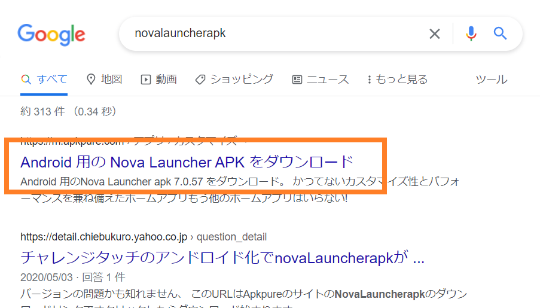

**③以下画面に移ったのを確認して「ダウンロードAPK」をタップ** 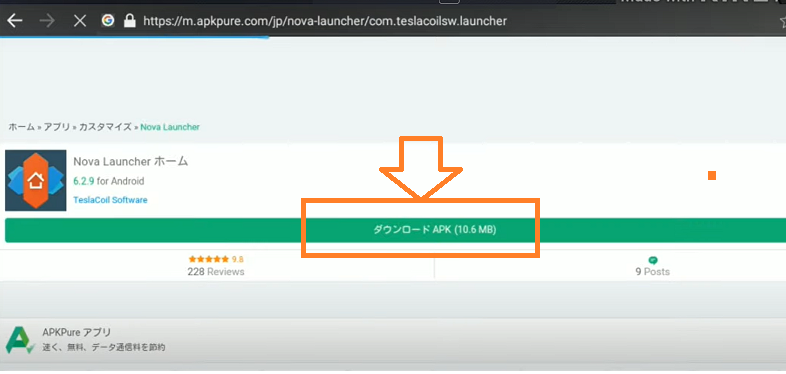

**④画面の上から下に向けてスワイプして通知を出す**

**⑤「Nova Launcherダウンロード完了しました」をタップ** 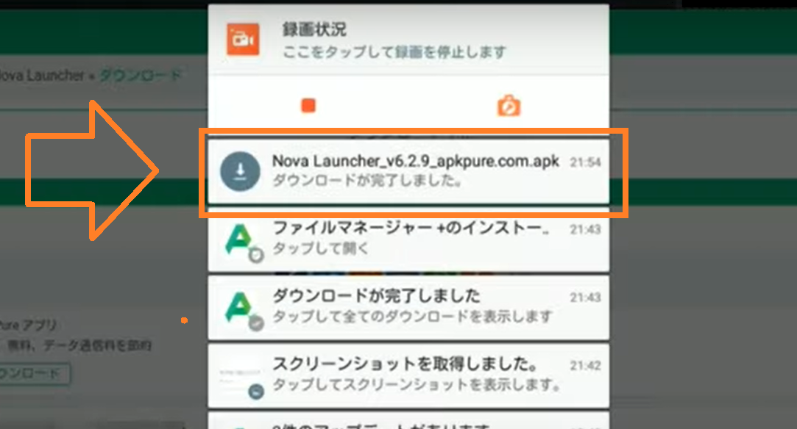

**⑥右下の「インストール」をタップ**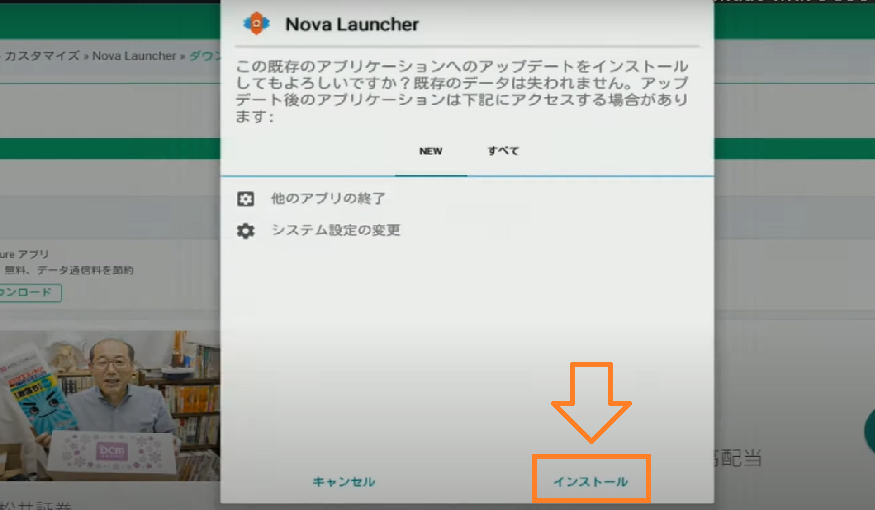**⑦「インストール」が終了したら左下の「完了」をタップ**

**⑧「ホームボタン」を押してホームに戻る**

**⑨今後どちらのランチャーを使用するか選択できるので、「Nova Launcher」を選択して「常時」をタップ** 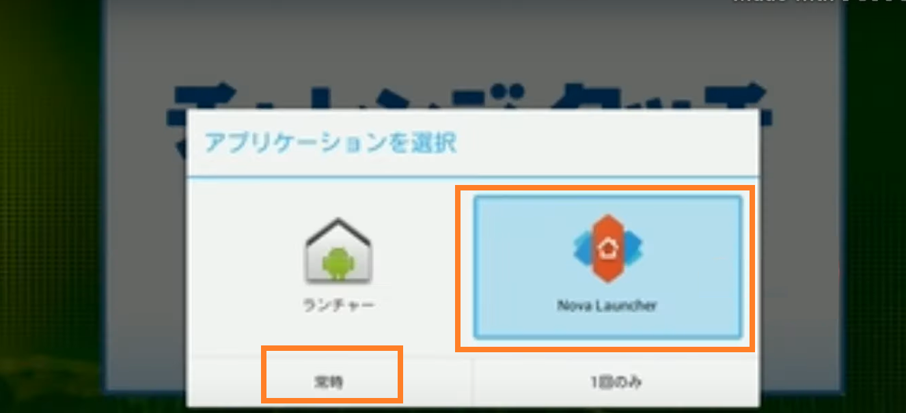これでタブレット内をカスタマイズできるようになりました。

細かいカスタマイズは先ほどインストールしたアプリ「Novaの設定」からできます。

「ナイトモード」や「1画面にいくつのアプリを表示させるか」など自分好みのタブレットにすることができます。

### ダウンロードできるアプリはどんものがある？

Android化したチャレンジタッチではどんなアプリがインストールできるのでしょうか？

先ほど紹介した「アプリのインストール方法」を元に紹介します。

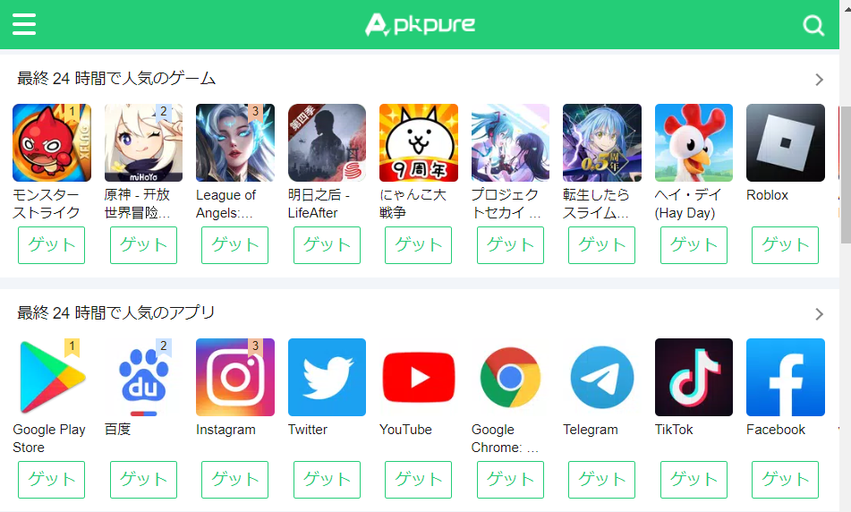 ・YouTube ・Twitter ・Tik Tok ・インスタグラム ・にゃんこ大戦争 ・モンスト ・パズドラ ・Pokémon GO ・荒野行動

と挙げるときりがありませんが、有名なアプリは大体インストールが可能となっています。

### 電子書籍の読書はできる？

Android化したタブレットでは、電子書籍で本を読むことも可能です。

アプリでキンドルといった電子書籍アプリをダウンロードして購入した本や漫画を読むことができます。

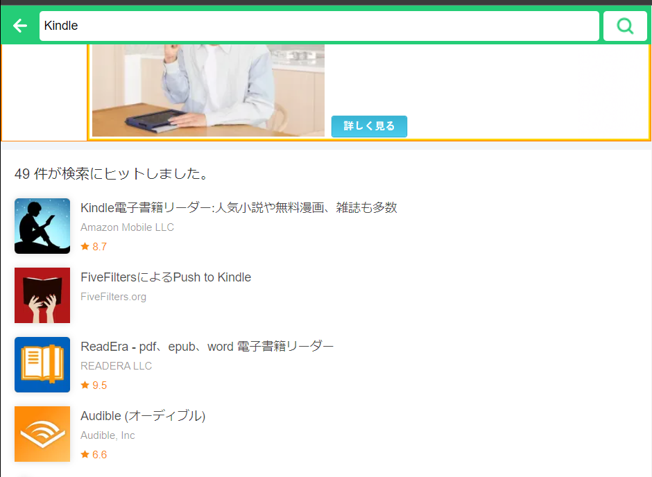Kindleだけでなく、Audible（オーディオブック）もインストールすれば利用することができます。

**＼5分で完了／**

[✅ 今すぐ「公式」進研ゼミ小学講座に入会する](//ck.jp.ap.valuecommerce.com/servlet/referral?sid=3613518&pid=887915088)

[✅ 今すぐ「公式」進研ゼミ中学講座に入会する](//ck.jp.ap.valuecommerce.com/servlet/referral?sid=3613518&pid=887915087)

## チャレンジタッチAndroid化のまとめ

今回紹介した方法の改造であればかなり安全で簡単にAndroid化をすることができます。

今は、「YouTubeでは勉強の解説チャンネル」「アプリでは漢字や算数の勉強」などもできる時代です。

使い方次第では勉強に生かすこともできるので、改造する際は参考にしてください。

ただ、Android化には注意点もありますので、リスクを理解したうえで自己責任に行って下さい。

**＼5分で完了／**

[✅ 今すぐ「公式」進研ゼミ小学講座に入会する](//ck.jp.ap.valuecommerce.com/servlet/referral?sid=3613518&pid=887915088)

[✅ 今すぐ「公式」進研ゼミ中学講座に入会する](//ck.jp.ap.valuecommerce.com/servlet/referral?sid=3613518&pid=887915087)
