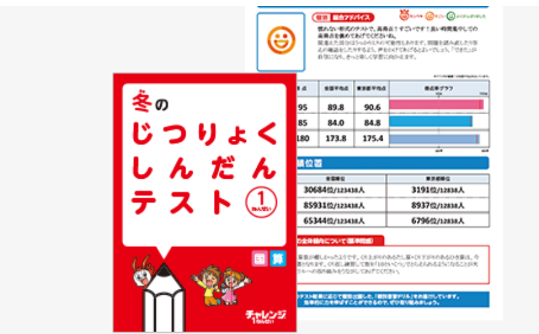
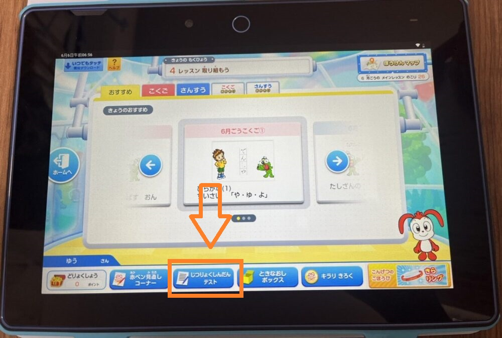
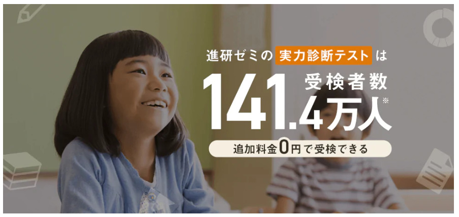
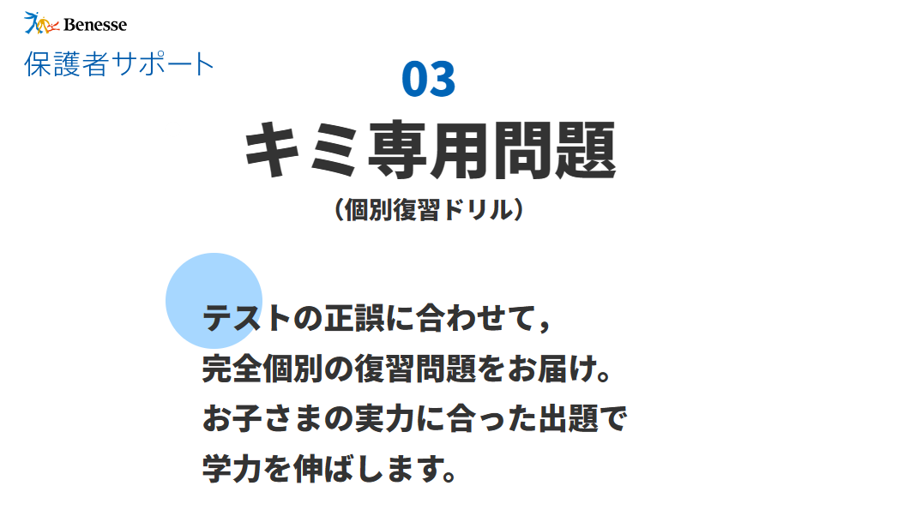

進研ゼミのチャレンジ実力診断テストは、全国141.4万人以上（2021年受講者数）の小学生が一斉に受講する規模の大きな実力テストです。

この膨大なデータを元に、一人一人のに合った勉強方法や**今取り組むべき課題**を明確にしてくれます。

ただ、分析をしてくれると言っても、もう少し具体的に何ができるのか気になりますよね？

この記事では、チャレンジ実力診断テストについて詳しく知りたい方に向けて、このテストを受けることで、「得られるメリット」「実力診断捨テスト内容」「診断テストの提出方法」など細かく紹介していきます。興味がある方は是非最後までご覧ください。

## 進研ゼミ実力診断テストとは何か？

進研ゼミの実力診断テストとは、進研ゼミに入会している**小学1年～中学3年までを対象**とした個人の実力をはかるためのテストで、**141万人以上**（2021年の受講数）が受けているテストです。

進研ゼミに入会している人なら全員無料で受けられるよ

進研ゼミの実力診断テストは、選択している学習スタイルによって少し異なります。

**チャレンジ（紙教材）=　問題冊子を使用**

**チャレンジタッチ（タブレット教材）=　専用タブレットを使用**

実力診断テストの結果を元に、どうやって勉強を進めるべきかを教えてくれます。

「診断テストを受けて終わり」ではなく、この結果を元に今後の勉強の仕方を考えていくことが大幅な点数UPに繋がります♪

[今すぐチャレンジタッチ公式サイトから入会する](//ck.jp.ap.valuecommerce.com/servlet/referral?sid=3613518&pid=887679902)

### 進研ゼミ実力診断テストは年に何回ある？

チャレンジ実力診断テストは、**小学1年生が1年に2回**（12月・3月）**小学2～6年生が1年に3回**（8月・12月・3月）実施されています。

1年に3回テストを行なうことで、子供の成長率、苦手な分野、成績が上がらない理由などをより細かく分析し、効率的で正しい勉強の方法で進めることができます。

### 進研ゼミ実力診断テストは難しい？

チャレンジタッチの実力診断テストは、通常のチャレンジのテストよりも**難易度が高く設定**されています。

これは個人の実力を診断するテストのため当然といえば当然ですね！

具体的に言うと、国語は単純な読み書きだけでなく読解力が試される問題があります。特に、算数では考える力が必要で、基礎を使ってどうやって問題を解いていくかが試される問題が用意されています。

## 進研ゼミ実力診断テスト小学生内容

チャレンジ実力診断テストは学年によって「受ける教科」「年間の受講回数」など少しづつ違いますので、1年生～6年生まで詳しく見ていきましょう。

### 進研ゼミ実力診断テスト：小学1年生

|  | チャレンジ | チャレンジタッチ |
| --- | --- | --- |
| 実力診断テストの教科 | 国語・算数 |  |
| 回数（一年間） | 年2回（12月・3月） |  |
| テスト時間 | 20分（目安） |  |
| 提出方法 | 郵送提出またはネット提出 | ネット提出 |
| 返却方法 | 郵送返却 ※一部コンテンツは、ネット返却 | ネット提出 |
| 問題集 ※（テスト結果によって個別で作成されるもの） | 国語・算数 |  |
| 順位 | ○ |  |
| アドバイス | ○ |  |
| 努力賞ポイントの付与 | ○ |  |

### 進研ゼミ実力診断テスト：小学2年生

|  | チャレンジ | チャレンジタッチ |
| --- | --- | --- |
| 実力診断テストの教科 | 国語・算数 |  |
| 回数（1年間） | 年3回（8月・12月・3月） |  |
| テスト時間 | 20分（目安） |  |
| 提出方法 | 郵送提出またはネット提出 | ネット提出 |
| 返却方法 | 郵送返却 ※一部コンテンツは、ネット返却 | ネット提出 |
| 問題集 ※（テスト結果によって個別で作成されるもの） | 国語・算数 |  |
| 順位 | ○ |  |
| アドバイス | ○ |  |
| 努力賞ポイントの付与 | ○ |  |

### 進研ゼミ実力診断テスト：小学3年生

|  | チャレンジ | チャレンジタッチ |
| --- | --- | --- |
| 実力診断テストの教科 | 国語・算数 |  |
| 回数（1年間） | 年3回（8月・12月・3月） |  |
| テスト時間 | 1科目あたり30分（目安） |  |
| 提出方法 | 郵送提出またはネット提出 | ネット提出 |
| 返却方法 | 郵送返却 ※一部コンテンツは、ネット返却 | ネット提出 |
| 問題集 ※（テスト結果によって個別で作成されるもの） | 国語・算数 |  |
| 順位 | ○ |  |
| アドバイス | ○ |  |
| 努力賞ポイントの付与 | ○ |  |

### 進研ゼミ実力診断テスト：小学4年生

|  | チャレンジ | チャレンジタッチ |
| --- | --- | --- |
| 実力診断テストの教科 | 国語・算数・理科・社会 |  |
| 回数（一年間） | 年3回（8月・12月・3月） |  |
| テスト時間 | 1科目あたり30分（目安） |  |
| 提出方法 | 郵送提出またはネット提出 | ネット提出 |
| 返却方法 | 郵送返却 ※一部コンテンツは、ネット返却 | ネット提出 |
| 問題集 ※（テスト結果によって個別で作成されるもの） | 国語・算数・理科・社会 |  |
| 順位 | ○ |  |
| アドバイス | ○ |  |
| 努力賞ポイントの付与 | ○ |  |

### 進研ゼミ実力診断テスト：小学5年生

|  | チャレンジ | チャレンジタッチ |
| --- | --- | --- |
| 実力診断テストの教科 | 国語・算数・理科・社会 |  |
| 回数（一年間） | 年3回（8月・12月・3月） |  |
| テスト時間 | 40分（目安） |  |
| 提出方法 | 郵送提出またはネット提出 | ネット提出 |
| 返却方法 | 郵送返却 ※一部コンテンツは、ネット返却 | ネット提出 |
| 問題集 ※（テスト結果によって個別で作成されるもの） | 国語・算数・理科・社会 |  |
| 順位 | ○ |  |
| アドバイス | ○ |  |
| 努力賞ポイントの付与 | ○ |  |

### 進研ゼミ実力診断テスト：小学6年生

|  | チャレンジ | チャレンジタッチ |
| --- | --- | --- |
| 実力診断テストの教科 | 国語・算数・理科・社会 |  |
| 回数（一年間） | 年3回（8月・12月・3月） |  |
| テスト時間 | 20分（目安） |  |
| 提出方法 | 郵送提出またはネット提出 | ネット提出 |
| 返却方法 | 郵送返却 ※一部コンテンツは、ネット返却 | ネット提出 |
| 問題集 ※（テスト結果によって個別で作成されるもの） | 国語・算数 |  |
| 順位 | ○ |  |
| アドバイス | ○ |  |
| 努力賞ポイントの付与 | ○ |  |

## 進研ゼミ実力診断を受けるメリット

チャレンジ実力診断テストで1教科にかかる時間は約20分～40分と、学校で行なわれるテストと同じくらいの時間がかかります。

そのため「実力テストなんて面倒くさい」と思う子もいるかもしれません。しかしそれ以上に実力診断テストを受けることには大きなメリットがたくさんあります。

メリットを知っておくことで、その価値を理解し、積極的に取り組むかもしれません。

### メリット1：今の子供の実力が分かる

この実力診断テストを受けることで、今の子供がどれくらいのレベルで**何が得意で何が苦手か**をハッキリさせることができます。

例えば、算数が得意な子であれば、算数の問題の基礎を使って応用問題を解ける一方で、国語が苦手な子は、読解力や表現力の問題に苦労するかもしれません。

自分では得意な分野だと思っていても、意外と理解できていない部分が多い可能性もあります。

このような場合、「分からない部分」に気がつかないまま先に進んでしまうと、少しずつ分からない部分が増えていき勉強自体が苦手になってしまうかもしれません。

自分だけで決めつけるのではなく、実力テストを受けることで何をするべきかを明確にすることができます。

自分の得意な部分を伸ばすための学習方法や、苦手な部分を改善するための勉強法を見つけ、学習の成果を最大限に引き出すことができます。

[今すぐチャレンジタッチ公式サイトから入会する](//ck.jp.ap.valuecommerce.com/servlet/referral?sid=3613518&pid=887679902)

### メリット2：何をどうやって勉強すればいいのかが明確になる

チャレンジ実力診断テストは全国141.4万人以上の小学生が受けているため、毎年膨大なデータが集まります。

この膨大なデータを元に、**一人一人の子供の特徴**にあてはめていきます。

- ○○につまずいている子は、どこを勉強するのが一番効率的か
- △△が苦手な子供はどうやって勉強するべきか

このように子供の特徴別にどうやって勉強するかを判断して、一人一人の勉強の取り組み方を的確にアドバイスしてくれます。

やみくもに勉強するよりも効率的に苦手を克服することができるようになります。

### メリット3：子供に的確なアドバイスができるようになる

保護者には実力テストの結果をスマホで見られるようになります。

スマホで見られる内容

- 総合アドバイス
- 教科別結果
- 順位・平均点
- 思考力診断
- 今までの成績との比較
- 高校進学シュミレーション※5.6年のみ

普段仕事が忙しく「どこの分野が苦手にしてるのか知らない」「子供がどこでつまずいているか分からない」という親御さんは多くいるのではないでしょうか？

このテストの結果を見ることで、あなたの学習の進み具合や得意、苦手な部分がハッキリ分かるようになり「何から教えたらいい？」と考える時間が無くなります。

このように実力診断テストは子供だけでなく、保護者が勉強を教える際にもとっても役にたつテストだと言えます。

### メリット4：個人専用の問題が作成される

チャレンジ実力診断テストを提出すると、結果に合わせて、子供にピッタリの「個別復習問題集」が送られてきます。 

この問題集には実力診断テストの結果をもとに作成されている為、子供にとってはどこの本屋さんにも売っていない**最高の問題集**です。

この問題集を完璧になるまで繰り返し行なうことで、苦手な部分や理解できていなかった部分をいっぺんに克服きるようになります。

そのため、一度最後までやって終わりにするのではなく、繰り返し何度も解き直すことでその効果を最大限引き出すことができます。

[今すぐチャレンジタッチ公式サイトから入会する](//ck.jp.ap.valuecommerce.com/servlet/referral?sid=3613518&pid=887679902)

### メリット5：進研ゼミの実力診断テストは完全無料

ここまで、詳しく説明してきました進研ゼミの実力診断テストですが、小学生、中学生、全ての**進研ゼミ会員は無料**で利用することができます。

進研ゼミには、他にも無料で受けられるサービスがたくさんあります。

入会前の方は是非チェックしてみてください。

<strong>進研ゼミ無料で使えるサービス一覧</strong>

- [チャレンジイングリッシュ（小１～高３レベルが使い放題）](https://xn--5ckip8c4fq970ahbya2o7acu2a.com/2022/03/28/%e3%83%81%e3%83%a3%e3%83%ac%e3%83%b3%e3%82%b8%e3%82%a4%e3%83%b3%e3%82%b0%e3%83%aa%e3%83%83%e3%82%b7%e3%83%a5%e3%81%ae%e6%96%99%e9%87%91%e3%81%af%e7%84%a1%e6%96%99%ef%bc%81%ef%bc%9f%e3%80%8c%e5%88%a9/)
- [プログラミング（基礎）](https://xn--5ckip8c4fq970ahbya2o7acu2a.com/2022/03/08/%e9%80%b2%e7%a0%94%e3%82%bc%e3%83%9f%e3%83%81%e3%83%a3%e3%83%ac%e3%83%b3%e3%82%b8%e3%82%bf%e3%83%83%e3%83%81%e3%80%8c%e5%b0%8f%ef%bc%91%ef%bd%9e%e5%b0%8f%ef%bc%96%e3%80%8d%e3%81%ae%e3%83%97%e3%83%ad/)
- [努力賞ポイント景品交換](https://xn--5ckip8c4fq970ahbya2o7acu2a.com/2023/07/10/%e3%83%81%e3%83%a3%e3%83%ac%e3%83%b3%e3%82%b8%e3%82%bf%e3%83%83%e3%83%81%e5%8a%aa%e5%8a%9b%e8%b3%9e%e3%83%9d%e3%82%a4%e3%83%b3%e3%83%88%ef%bc%81%e8%b2%b0%e3%81%88%e3%82%8b%e5%95%86%e5%93%81%e3%81%af/)
- [オンライン授業](https://xn--5ckip8c4fq970ahbya2o7acu2a.com/2023/06/26/%e3%83%81%e3%83%a3%e3%83%ac%e3%83%b3%e3%82%b8%e3%82%aa%e3%83%b3%e3%83%a9%e3%82%a4%e3%83%b3%e6%8e%88%e6%a5%ad%e3%82%92%e3%80%8c%e5%8f%97%e8%ac%9b%e3%81%97%e3%81%9f%e6%84%9f%e6%83%b3%e3%80%8d/)
- [まなびライブラリー（1000冊の本が読み放題）](https://xn--5ckip8c4fq970ahbya2o7acu2a.com/2023/07/18/%e3%83%81%e3%83%a3%e3%83%ac%e3%83%b3%e3%82%b8%e3%82%bf%e3%83%83%e3%83%81%e3%81%ae%e6%9c%ac%e8%aa%ad%e3%81%bf%e6%94%be%e9%a1%8c%e3%82%b5%e3%83%bc%e3%83%93%e3%82%b9%e3%81%a8%e3%81%af%ef%bc%9f%e9%80%b2/)

それぞれ別記事で詳しく解説しています。

## 進研ゼミ実力診断テストの提出する方法は2種類

チャレンジ実力診断テストを提出する方法は以下の2種類が用意されています。

実力診断テストの提出方法

- 郵便ポストにて提出
- ネット提出

テストを受ける形式は、進研ゼミを受講しているスタイルによって少し違うよ

**チャレンジタッチ（タブレット教材）は**、タブレットで配信されたテストに回答してネットで提出する。※郵送での冊子のお届けはありません。

**チャレンジ（紙教材）は**、届いた問題冊子とマークシートに直接記入した後、郵便提出またはネット提出が可能。

### 「郵便ポストに提出」する場合

基本的に実力診断テストをポスト提出するのは、チャレンジ受講生のみとなります。

テストを受講する前に届いた問題冊子とマークシートを記入後に封筒にいれてポスト投函すれば完了となります。

🐕

提出する際に会員番号の記入を書き忘れないように注意してね

テストを受けた後に郵送で個別の成績表やドリルが届けられます。テスト結果はスマホから確認することもできます。

### 「ネットで提出」する場合

チャレンジタッチ受講の方は2023年より実力診断テストがタブレットで問題に取り組めるようになりました。

実力診断テストが配信されて後、チャレンジタッチのホーム画面にある「教室（きょうしつ）」をタッチし、「実力診断テスト」をタッチして解いていきます。

回答したらそのままネットにて提出が可能です。

チャレンジタッチでは、テストの結果や問題冊子がタブレットに配信されるため、郵便による返送物はありません。

### チャレンジ実力診断テストの提出期限に注意！

チャレンジ実力診断テストには、提出目標日が設定されています。これはあくまで目安のため、期限を過ぎても問題ありません。

ただし、最終提出期限を超えると診断テストを提出しても採点してもらえなくなるので注意が必要です。

実力診断テストの最終提出期限

- １～５年生の課題：次学年の3/15まで ※小１の課題であれば小２の３/15までが提出期限
- ６年生の課題：小学講座ご卒業後の６/24まで

[今すぐチャレンジタッチ公式サイトから入会する](//ck.jp.ap.valuecommerce.com/servlet/referral?sid=3613518&pid=887679902)
