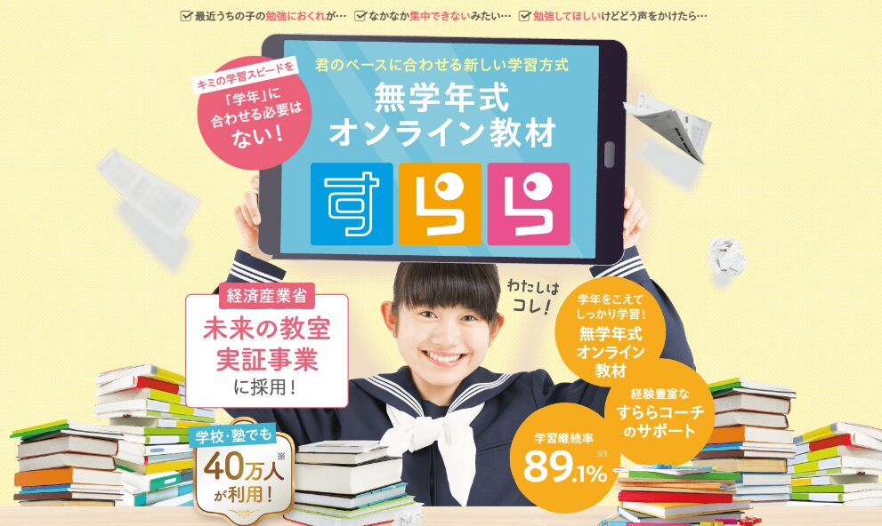
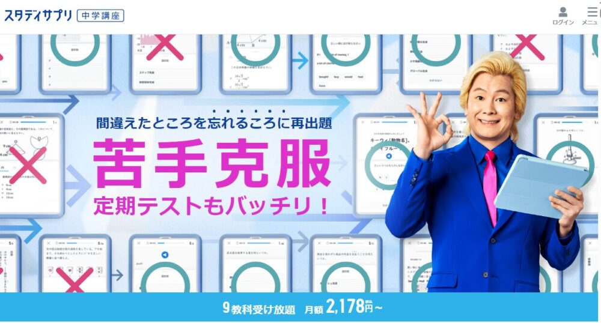
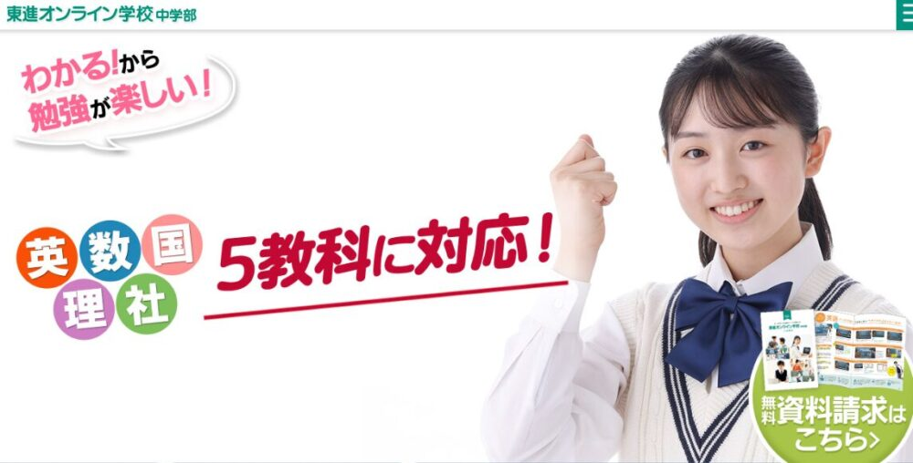

通信教材は50年以上前から多くの子供に利用されてきましたが、最近ではタブレット学習に形を変えて、より効率的に学習ができるようになりました。

それに比例し多くのタブレット学習教材が提供されています。（今回調査した結果20種類以上も・・・）

今回はその中でも「**勉強が苦手な中学生**」「**基礎を固めたい子**」に向けておすすめのタブレット学習教材を6つに厳選して紹介します。

ただ、タブレット学習は選ぶ教材によって大きく内容が違います。ゲーム性の高さ、サポート体制、料金面、など会社によって様々です。

そのため、**選び方には注意が必要**です。

もし合わない教材を選んでしまった場合、本来の実力を発揮できず、すぐに辞めてしまう可能性も・・・

今回は、「その選び方」を3つのポイントに分けて詳しく解説します。最後まで読むことで、**正しい選び方**を理解し「子供に合った教材がどれか？」を見分けることができるようになります。

その上で今回紹介するオススメのタブレット教材6選の中から子供に合うものを選んであげましょう。

## 勉強が苦手な中学生【タブレット学習の選び方】ポイント3つ

通信教材といっても、選ぶ教材によって特徴が全く異なります。特に、勉強が苦手な子がタブレット教材を選ぶ際に、大切なポイントが3つあります。

まずは選び方のポイントを押さえよう

本人に合うベストなタブレット教材を選ぶために、このポイントを必ず押さえておきましょう。

1. 適切な難易度を選ぶ
2. 基礎が定着しやすいかどうか
3. 子供の性格に合わせる

### 選び方1：自分に適切な難易度か？

タブレット学習教材を選ぶ際に大切なのが、子どもにとって適切な難易度の教材を選んで上げることが大切です。

教育心理学には「**適切な難易度の学習**」という原理があります。この原理によれば、人が学習するとき、問題が簡単すぎると退屈してしまい、逆に難しすぎると挫折感を感じてしまいます。

つまり、適切なレベルの難易度を選ぶことが、学習のモチベーションを保ち、効果的に学ぶためには非常に重要です。

人間は、問題を見て**約50％の問題が解ける状態**は学習モチベーションを最も高めるとされています。これは、自分にとって適度な挑戦がある状態が、学習意欲を刺激するからです。

では、どうやって自分の子どもに適切な難易度の教材を選ぶかというと、まずは提供されている通信教育の教材をじっくりと調べてみることが大切です。

教材のレベルを確認し、可能であればお試し教材や無料体験を使ってみると良いでしょう。

まずは、それぞれの通信教材の難易度をしっかりと理解して、自分の子供に適切なレベルかを判断しましょう。

### 選び方2：基礎が定着しやすいかどうか

タブレット教材を選ぶ時に、重要なポイントの2つ目は「**基礎をしっかりと身につけられるかどうか**」です。

勉強が苦手な中学生に共通しているのが、基礎がしっかり身についていないことです。反対に、勉強が得意な生徒ほど基礎をよく理解しています。

基礎を軽視すると、新しい内容を学ぶ際につまずきやすくなります。そのため、基礎からしっかり学べる教材を選び、基本を固めることが大切です。

また、理解しやすい解説や、段階的に難しくなる問題など、学習の進行に合わせて調整できる教材が理想的です。

タブレット教材を選ぶ際は、このポイントを念頭に置きながら、中学生が理解しやすい内容のものを選んでください。

### 選び方3：子供の性格にあった教材か

タブレット教材を選ぶ際、3つ目の重要なポイントは「子供の性格に合った教材かどうか」です。**子供一人ひとりの性格は異なる**ため、それぞれに合う教材も変わってきます。

例えば、集中力が短い子供の場合、問題の量が多すぎると集中が続かない可能性があります。そのような子供には、短時間で集中しやすく、解説が分かりやすい教材が適しています。

また、文字だけの教材に飽きやすい子供には、アニメーションや図解が豊富な教材が適しています。

このように子供の性格に合わせて教材を選ぶことで、**子供は学習により積極的に取り組む**ようになります。

また、教材選びに迷ったときは、全額返金保証のある教材や、資料請求やオンラインで無料体験ができる教材を利用するのも一つの方法です。

実際に子供に使ってみて、続けられそうか、理解しやすいかを確かめることが大切です。子供自身が快適に感じる教材を選ぶことで、学習効果を高めることができるでしょう。

## 「勉強が苦手な中学生」におすすめタブレット学習3選

勉強が苦手な中学生がタブレット学習を選ぶ際のポイントが分かったところで、ここからはおすすめのタブレット教材をランキング形式で紹介していきます。

以下の項目をそれぞれ5段階で評価して、**総合得点を決めた教材をランキング形式**で紹介します。

**評価のポイント**

- 基礎の定着しやすさ
- 解説の分かりやすさ
- コスパの良さ
- 無料サービスの充実

それぞれのポイントを元に総合評価して順位を決めていきます。

### 1位【 進研ゼミ】総合的に使いやすく基礎が学べる

進研ゼミは、全体的にバランスの取れており、タブレット教材の中では**人気No.1の教材**です。

基礎固めはもちろん、解説の分かりやすさや無料サービスの充実という点でも人気の高い教材となっています。

| **進研ゼミ中学講座の評価** |  |
| --- | --- |
| 総合得点 | 　　★ 5.0（4.8） |
| 基礎の定着のしやすさ | 　　★ 5.0（5.0） |
| 解説の分かりやすさ | 　　★ 4.5（4.5） |
| コスパの良さ | 　　★ 4.5（4.5） |
| 無料サービスの充実 | 　　★ 5.0（5.0） |

<strong>進研ゼミ中学講座　基本情報</strong>

| 対象学年 | 中学1年生～中学3年生 |
| --- | --- |
| 教科 | 国、数、理、社、英 ＋「保健/体育・音楽・美術・技術/家庭科」の9科目 |
| 学習スタイル | 紙テキスト or  専用タブレット学習 |
| 難易度 | ・スタンダードコース 　：基礎～標準 ・ハイレベルコース　 　：標準～応用 |
| 料金 | 中1：6,400円～ 中2：6,570円～ 中3：7,090円～ |
| サービス一覧 | ・赤ペン先生   ・月1000の本が冊読み放題   ・実力診断テスト   ・オンライン生配信授業   ・さかのぼり学習機能   ・先取り学習   ・英検対策（5級～準1級まで対応）   ・努力賞ポイント景品交換 |
| お試し | あり（資料請求） |

進研ゼミでは、「タブレットコース」と「紙教材コース」の2つが用意されていんだ。

 

タブレット学習が合わないと思ったら紙教材コースへの変更することもできるよ♪

#### 進研ゼミ：基礎の身につけやすさ

進研ゼミでは、基礎学力を身につけやすいように、イラストやアニメーションで問題が解説され、より**イメージしやすい作り**となっています。

さらに、利用者の1番多い進研ゼミには、過去、現在において**膨大なデータ**がります。

このデータを元に「どうすれば中学生が理解しやすいのか」を研究して解説が作られてるんだっ！

また、そのデータを元に最新のAIが、

- 勉強が苦手な中学生がつまずきやすいか？
- どこの勉強が不足しているのか？

などを判断してくれるため、進研ゼミのタブレットコースでは、勉強をすればするほど子供の弱点や理解度を把握し、最適な問題を自動で出題くてれるというのもとっても便利な機能ですね。

#### 進研ゼミはどんな性格の子に向いている教材？

進研ゼミ中学講座は以下のような性格の子に向いている教材です。

- 基礎を固めたい子
- 集中力が長く続かない子
- ゲーム感覚で勉強を進めたい子
- 勉強に苦手意識がある子
- ビジュアルや動画の方が頭に入りやすい子
- 本をたくさん読みたい子

進研ゼミ中学講座のタブレット教材では、図やイラストを使った教材が豊富なので、視覚的に情報を理解するのが得意な子に適しています。

また、進研ゼミではただ勉強を進めるのではなく、中学生が「勉強を楽しむ」というのを重視しています。

ゲーム性の高さや、本の読み放題サービスなども受講者が「より楽しく学べるように」作れているのが分かりますね。

[進研ゼミ中学講座をもっと詳しく見る](https://xn--5ckip8c4fq970ahbya2o7acu2a.com/2023/10/26/%e9%80%b2%e7%a0%94%e3%82%bc%e3%83%9f%e4%b8%ad%e5%ad%a6%e8%ac%9b%e5%ba%a7%ef%bc%88%e3%83%81%e3%83%a3%e3%83%ac%e3%83%b3%e3%82%b8%e3%82%bf%e3%83%83%e3%83%81%e4%b8%ad%e5%ad%a6%e7%94%9f%ef%bc%89%e6%9c%ac/)

メリット

- コスパが良い
- 無料サービスが豊富
- 難易度が2コース用意されている
- 楽しく勉強できる

デメリット

- 分からない所をすぐに聞けない
- 強制力は小さい

進研ゼミでは「分からない問題があってもすぐ質問できない」点や塾のように強制力があるわけではないので、ある程度保護者のサポートが必要になります。

一方で、コスパの良さやサービスのクオリティはタブレット教材の中でもトップクラスと言えます。

「どの教材にするか決められない」という方は総合的にバランスの取れた進研ゼミを受講するのがおすすめです。

難易度が2つ用意されているため、基礎がしっかりと身に付いたタイミングで難易度の高いコースに変更できる点も魅力的ですね。

[進研ゼミ中学講座の公式サイトをチェック](//ck.jp.ap.valuecommerce.com/servlet/referral?sid=3613518&pid=889799013)

[進研ゼミ中学講座の「口コミ・料金」を詳しく知りたい方は別記事で詳しく紹介しています♪](https://xn--5ckip8c4fq970ahbya2o7acu2a.com/2023/10/26/%e9%80%b2%e7%a0%94%e3%82%bc%e3%83%9f%e4%b8%ad%e5%ad%a6%e8%ac%9b%e5%ba%a7%ef%bc%88%e3%83%81%e3%83%a3%e3%83%ac%e3%83%b3%e3%82%b8%e3%82%bf%e3%83%83%e3%83%81%e4%b8%ad%e5%ad%a6%e7%94%9f%ef%bc%89%e6%9c%ac/)

https://xn--5ckip8c4fq970ahbya2o7acu2a.com/2024/10/17/%e3%80%902024%e5%b9%b410%e6%9c%88%e6%9c%80%e6%96%b0%e3%80%91%e9%80%b2%e7%a0%94%e3%82%bc%e3%83%9f%e3%82%ad%e3%83%a3%e3%83%b3%e3%83%9a%e3%83%bc%e3%83%b3%e7%89%b9%e5%85%b8%e4%b8%80%e8%a6%a7%ef%bc%81/

### 2位【すらら】基礎を徹底強化したいならコレ

すららは、「基礎固めを徹底したい」という子に特化したタブレット学習サービスです。

数あるタブレット教材の中でも、1番固めに特化した教材で、全国2,500校の塾や学校で導入されています。

| **すららの評価** |  |
| --- | --- |
| 総合得点 | 　　★ 4.5（4.5） |
| 基礎の定着のしやすさ | 　　★ 5.0（5.0） |
| 解説の分かりやすさ | 　　★ 5.0（5.0） |
| コスパの良さ | 　　★ 4.0（4.0） |
| 無料サービスの充実 | 　　★ 4.0（4.0） |

<strong>すらら小中コース　基本情報</strong>

| 対象学年 | 小学1年生～中学3年生　　　※無学年学習が可能 |
| --- | --- |
| 教科 | 国、数、理、社、英 の5科目 |
| 学習スタイル | お持ちの「タブレット」または「パソコン」 |
| 難易度 |  基礎～標準　　　　※基礎問題が多め |
| 料金 | 4教科 小中コース（国、数、理、社）：月額 8,800円  5教科 小中コース（国、数、理、社、英）: 月額 10,978円 |
| サービス一覧 | ・すららコーチにアドバイスが貰える ・コーチによる学習計画の設計 ・先取り学習が可能 ・無学年学習 ・理解度に合わせてＡＩがドリルを自動調節 ・学力診断テスト ・不登校の出席扱い |
| お試し | あり（資料請求 または パソコンで無料体験） |

🐕

無学年だから小学生の内容もさかのぼることができるんだね♪

#### すらら：基礎が学びやすいポイント

すららはタブレット教材の中でもトップクラスに基礎の習得に向いた教材と言えます。「基礎～標準」レベルの学習に特化しており、個々の学生に合わせたサポート体制が特徴です。

すららが他の教材と大きく違うのが、このプロのコーチによるサポート体制です。

生徒一人ひとりに専用のコーチが付き、苦手分野や性格、集中力を考慮して、最適な学習スケジュールを提案します。

このようにして、生徒が無理なく苦手を無くし、基礎力を上げることができます。

数学など特定の科目の基礎を固めたい場合も、要望に応じてスケジュールを組んでくれるため、基礎学習の習得には最適な教材と言えるでしょう。

#### すららはどんな性格の子に向いている教材？

サポート体制があり、基礎力や苦手対策に優れたすららは、以下のような性格の子に適した教材です。

- 集中力が短い子
- 勉強に自信がない子
- 難しい問題に挫折しやすい子
- 注意力が散漫な子
- 面倒なことを後回しにする
- 自分がどこが理解できていないか分からない子
- 学習計画を立てるのが苦手な子
- 文章で理解するのが苦手な子
- ゲーム感覚で勉強を進め高い子
- ある程度のサポートが欲しい子

すららでは、ゲーミフィケーションと言われる、学習への取り組みをポイント化し、ゲーム感覚でやる気を高めてくれる機能が搭載されています。

また、問題の解説はキャラクターがしてくれるので、文字だけでなく耳からも情報がはいってくるのが特徴です。

[すららをもっと詳しく見る](https://xn--5ckip8c4fq970ahbya2o7acu2a.com/2022/03/21/%e6%9c%80%e6%82%aa%e3%81%99%e3%82%89%e3%82%89%e3%81%ae%e5%8f%a3%e3%82%b3%e3%83%9f%e8%a9%95%e5%88%a4%e3%81%be%e3%81%a8%e3%82%81%ef%bc%81%e6%84%8f%e5%a4%96%e3%81%a8%e7%9f%a5%e3%82%89%e3%81%aa%e3%81%84/)

メリット

- 基礎を徹底して身につけられる
- すららコーチ（現役講師）によるマンツーマンサポート
- 不登校でも出席認定が貰える
- 1人1人のタイプからプロが学習計画を設計してくれる

デメリット

- 応用問題の数は少ない
- 料金は高め
- 受講にはパソコンかタブレットが必要

基礎固めに優れているすららですが、逆に言うとスピード感をもってサクサク問題を解きたい子には向いていません。

1つ1つの分野の基礎を確実に理解して成績を上げたい子におすすめの教材と言えます。

[すららの公式サイトをチェックする](https://px.a8.net/svt/ejp?a8mat=3BOQS8+8HFOWY+4CT0+5YRHE)

[すららの「口コミ・料金」をもっと詳しく知りたい方はこちらの記事からどうぞ♪](https://xn--5ckip8c4fq970ahbya2o7acu2a.com/2022/03/21/%e6%9c%80%e6%82%aa%e3%81%99%e3%82%89%e3%82%89%e3%81%ae%e5%8f%a3%e3%82%b3%e3%83%9f%e8%a9%95%e5%88%a4%e3%81%be%e3%81%a8%e3%82%81%ef%bc%81%e6%84%8f%e5%a4%96%e3%81%a8%e7%9f%a5%e3%82%89%e3%81%aa%e3%81%84/)

### 3位【サブスタ】1000本以上の授業動画が見放題

サブスタを今回初めて聞いた方もいるかもしれません。サブスタは2022年に登場したばかりのまだ新しい通信教材サービスです。

まだ出たばかりではありますが、クオリティの高さや、充実したサービス内容で多くの人から選ばれています。

| **サブスタの評価** |  |
| --- | --- |
| 総合得点 | 　　★ 4.0（4.2） |
| 基礎の定着のしやすさ | 　　★ 4.0（4.0） |
| 解説の分かりやすさ | 　　★ 4.0（4.0） |
| コスパの良さ | 　　★ 4.5（4.5） |
| 無料サービスの充実 | 　　★ 4.5（4.5） |

<strong>サブスタ中学生コース　基本情報</strong>

| 対象学年 | 中学1年生～中学3年生 |
| --- | --- |
| 教科 | 国、数、理、社、英の5科目 |
| 学習スタイル | お持ちの「タブレット・スマホ」または「パソコン」 |
| 難易度 | 基礎～標準　　※基礎問題が多め |
| 料金 | 中学生：7,900円/月 |
| サービス一覧 | ・個別サポート（LINEで常時チャット、メールが可能） ・プロの学習アドバイザーによる計画作成 ・1000本以上の授業動画が見放題 ・無学年方式 ・不登校の出席認定制度 ・確認・練習・応用問題を使った演習 ・赤ペン映像を使った解答解説 |
| お試し | 入会から14日間の全額返金保証あり |

#### サブスタ：基礎が学びやすいポイント

サブスタでは、1人1人の性格や学習状況に合わせて**プロがスケジュールを設計してくれる**ので、基礎から無理なく勉強をスタートすることができます。

難易度は入門レベルから始まり、授業の動画も基本的な内容から詳しく解説されるため、勉強が苦手な子でもしっかりと理解できます。

また、サブスタの教材は教科書の内容に沿って作られており、学校の授業で分からなかった部分をすぐに復習することが可能です。

授業動画は何度も見返すことができるため、理解が深まりやすくなります。

もし授業を見ても理解できない時は、**直接チャットで先生に質問**することができる点も、学びを支援する大きな特徴ですね♪

#### サブスタはどんな性格の子に向いている教材？

授業動画が充実してサポート体制の強いサブスタは以下のような性格の子におすすめです。

- 今まで計画通りに勉強が進まなかった子
- 分からない問題は今すぐ理解しないと気がすまない子
- ある程度の先生のサポートが必要な子
- 集中力が短い子
- 授業動画を見ながら勉強したい子

サブスタの特徴として、サポート充実さと豊富な授業動画があります。この特徴をしっかり理解したうえで子供の性格と合わせることができれば効率良く勉強を進める事が可能です。

[サブスタをもっと詳しく見る](https://xn--5ckip8c4fq970ahbya2o7acu2a.com/2024/02/12/%e3%82%b5%e3%83%96%e3%82%b9%e3%82%bf%e3%81%af%e3%81%a9%e3%82%93%e3%81%aa%e5%ad%90%e3%81%ab%e5%90%91%e3%81%84%e3%81%a6%e3%82%8b%ef%bc%9f%e5%85%a5%e4%bc%9a%e5%89%8d%e3%81%ab%e5%8f%a3%e3%82%b3%e3%83%9f/)

メリット

- プロの先生が学習計画を立ててくれる
- 全ての教科書に対応している
- さきどり学習ができる
- 手元のPCやタブレットで学習できる
- 赤ペン映像を使った解答解説が分かりやすい
- 解約金0円
- 14日間の全額返金保証

デメリット

- 5教科以外は学べない
- 新しいサービスのため情報が少ない
- 専用タブレットがない

サブスタは、入会金・解約金が0円なので気軽に利用できるのが特徴です。また14日以内であれば**全額返金保証が付いているのも安心**ですね♪

[サブスタの公式サイトをチェックする](https://px.a8.net/svt/ejp?a8mat=3YYHZQ+EPW3Z6+4YUW+62ENM)

## 「安い料金」で苦手を克服したい子におすすめ3選

次に、タブレット教材を安く利用したい方に向けて「料金の安さ」「基礎の身につけやすさ」の2つを重視してランキングを作成しました。

### 1位【スタディサプリ】圧倒的な安さが人気

「料金の安さだけじゃない」一流講師の神授業が受け放題で月額2,178円～。というコスパ最強のスタディサプリ。

普段の学校の授業で分からない部分を復習～テスト対策まで幅広く使用することができます。

| **スタディサプリ 評価** |  |
| --- | --- |
| 総合得点 | 　　★ 4.5（4.4） |
| 基礎の定着のしやすさ | 　　★ 3.5（3.5） |
| 解説の分かりやすさ | 　　★ 5.0（5.0） |
| コスパの良さ | 　　★ 5.0（5.0） |
| 無料サービスの充実 | 　　★ 4.0（4.0） |

<strong>スタディサプリの基本情報</strong>

| 対象学年 | 小学4年生～高校3年生 |
| --- | --- |
| 教科 | 国、数、理、社、英の5科目 |
| 学習スタイル | お持ちの「タブレット・スマホ」または「パソコン」 ※別売りテキストあり |
| 難易度 | ベーシックコース　：基礎～応用 個別指導コース　　：個人のレベルに合わせて調節 |
| 料金 | ベーシックコース　：2,178円 個別指導コース　　：10,780円 |
| 無料サービス | ・理解度チェックテスト ・厳選問題での定期テスト対策 ・動画倍速再生機能 ・1万問以上の演習問題 ・先取り学習可能 |
| お試し教材 | 14日間の全額返金保証あり |

#### スタディサプリ：基礎が学びやすいポイント

スタディサプリでは、授業動画の数が非常に豊富で、問題のレベルが「基礎」「少し応用」「応用」と段階的に分けられています。

これにより、基礎からしっかり学び、徐々に応用へと進むことができます。プロの講師による分かりやすい動画解説があり、苦手な分野は動画を何度も見直すことが可能です。

ちなみに、専用テキスト（別売り）とセットで勉強することで、授業での理解を深めることができますよ。

#### スタディサプリはどんな性格の子に向いている教材？

授業動画が豊富にあるスタディサプリは以下のような性格の子に向いています。

- 自分のペースで学びたい子
- 集中して学習することができる子
- 授業動画メインで勉強したい子
- 学習計画などのサポートがいらない子
- 隙間時間に動画を見て勉強したい子
- 学校の授業で分からない部分を復習したい子
- 継続的に学習することができるな子
- テキストや動画で学ぶことが好きな子

スタディサプリは、その値段の安さから学校の授業や塾で分からないかった問題の復習に使う。というような補助として利用されている方も多くいらっしゃいます。

料金の安いスタディサプリだからこそ、「たくさん利用しないともったいない」と思わず、より自分に合った使い方が選択できるかもしれませんね。

メリット

- 料金が安い
- プロの授業動画が見放題
- 隙間時間を活用できる

デメリット

- 分からない問題の質問はできない（ベーシックプランの場合）
- 実力診断テストはない
- 無学年方式で学年以外の授業動画が見られる
- 自分で計画をたてて進めていく必要がある

[スタディサプリをもっと詳しく見る](https://xn--5ckip8c4fq970ahbya2o7acu2a.com/2022/03/26/%e3%82%b9%e3%82%bf%e3%83%87%e3%82%a3%e3%82%b5%e3%83%97%e3%83%aa%e5%8f%a3%e3%82%b3%e3%83%9f%e8%a9%95%e5%88%a4%e3%81%af%e3%81%a9%e3%81%86%ef%bc%9f%e3%81%a1%e3%82%87%e3%81%a3%e3%81%a8%e3%81%97%e3%81%9f/)

スタディサプリは「安い」「授業動画が見放題」などの大きなメリットがある反面、他のタブレット教材のようなサーポート体制はありません。ゆえに、一人で勉強の計画を立てていく必要があります。

一方「学校の宿題が多い」「部活が忙しくて勉強する時間が少ない」このような子には、勉強したい部分だけを短時間学べるスタディサプリはとってもオススメな教材です。

[スタディサプリの公式サイトをチェック](https://px.a8.net/svt/ejp?a8mat=3HEHQP+CIPGIQ+36T2+TRVYQ)

[スタディサプリの「口コミ・料金」について詳しく知りたい方はこちらの記事からどうぞ♪](https://xn--5ckip8c4fq970ahbya2o7acu2a.com/2022/03/26/%e3%82%b9%e3%82%bf%e3%83%87%e3%82%a3%e3%82%b5%e3%83%97%e3%83%aa%e5%8f%a3%e3%82%b3%e3%83%9f%e8%a9%95%e5%88%a4%e3%81%af%e3%81%a9%e3%81%86%ef%bc%9f%e3%81%a1%e3%82%87%e3%81%a3%e3%81%a8%e3%81%97%e3%81%9f/)

### 2位【東進オンライン学校】コスパよく基礎～応用が学べる

東進オンライン学校は、2020年よりサービスが開始された新しいオンラインのタブレット教材です。

日本最強の講師陣を自負する東進の講師陣と、オール四谷大塚の名物先生の中から選ばれたエースによる授業が「分かりやすい」と人気の教材です。

東進オンライン学校では、基礎～応用まで**幅広い難易度**が用意されているため、勉強が苦手な子でもしっかりと基礎を固めてレベルを上げる事ができますよ。

| **東進オンライン学校 中学部の評価** |  |
| --- | --- |
| 総合得点 | 　★ 4.5（4.3） |
| 基礎の定着のしやすさ | 　★ 4.0（4.0） |
| 解説の分かりやすさ | 　★ 4.5（4.5） |
| コスパの良さ | 　★ 5.0（5.0） |
| 無料サービスの充実 | 　★ 3.5（3.5） |

<strong>東進オンライン学校 中学部　基本情報</strong>

| 対象学年 | 中学1年生～中学3年生 |
| --- | --- |
| 教科 | 国、数、理、社、英の5科目 |
| 学習スタイル |  お持ちの「タブレット・スマホ」または「パソコン」 |
| 難易度 | ・高速マスター基礎力養成講座（数・英）　：基礎 ・標準講座（数・英）　　　　　　　　　　：基礎～標準 ・実戦力養成講座（国・理・社）　　　　　：標準～応用 |
| 料金 | 中1～中3 ：　3,278円 |
| 無料サービス | ・映像授業配信 ・確認テスト（毎授業後） ・月例テスト（年12回） ・学習状況の把握 ・テキストの無料ダウンロード |
| お試し教材 | 10日間の無料お試し入会 |

#### 東進オンライン学校：基礎が学びやすいポイント

東進オンライン学校では、定期的に行われる2種類のテストで基礎を定着をさせ、学力向上を目指しています。

特に数学・英語の基礎固めに特化しており「授業動画」で基礎を固め、授業の終わりに実施される「確認テスト」で理解度を毎回チェックします。

🐕

分かっていない部分を明確化することで、苦手な部分を見つけ対処していけるんだね

#### 東進オンライン学校中学部はどんな性格の子に向いている教材？

超一流の講師がそろった東進オンライン学校は、以下のような性格の子におすすめです。

- 計画的に学習を進めることができる子
- わからないことは自分で調べられる子
- 時間管理が得意で、計画的に行動できる子
- 基礎固めだけでなく、テストで高得点を狙いたい子
- 向上心がある子
- 一度スイッチが入るとしっかり勉強できる子

東進オンライン学校では、スタディサプリ同様にマンツーマンのサポート体制はありません。

そのため、学習計画などは個人で立てる必要があります。また分からない問題を先生に質問するサービスもありません。理解できない問題にぶつかった時には自分で調べる力が必要になります。

そのため、自分で計画を立てるのが苦手な子には向かないかもしれません。

メリット

- 5教科学べて3,500円以下で利用できる
- 個性的な東進の先生の授業が面白い
- やや難しめの問題にも取り組める
- 隙間時間に勉強できる

デメリット

- マンツーマンのサポートがない
- テキストを印刷するのが面

東進オンライン学校では、10日間の全額返金保証が用意されています。

東進オンライン学校は、他のタブレット教材と学習の進め方が違う面も多いため、10日間試して決めてるのもオススメです。

 

10日間以内であれば全額返金されるので、リスク0で判断することができますよ♪

### 3位【デキタス】低価格なのに8科目も学習できる

デキタスは、塾として有名な「城南予備校」や「城南医志塾」成績保証の個別指導塾「城南コベッツ」などで構成される城南進研グループの講師陣が監修しているタブレット教材です。

オリジナルキャラクターを使用したゲーム性の高いタブレット教材となっています。勉強が苦手な子や「基礎を定着させたい」という子から多く利用されています。

| **デキタス中学コースの評価** |  |
| --- | --- |
| 総合得点 | 　★ 4.0（4.1） |
| 基礎の定着しやすさ | 　★ 4.5（4.5） |
| 解説の分かりやすさ | 　★ 4.0（4.0） |
| コスパの良さ | 　★ 4.5（4.5） |
| 無料サービスの充実 | 　★ 3.5（3.5） |

<strong>デキタス中学コース　基本情報</strong>

| 対象学年 | 中学1年生～中学3年生 |
| --- | --- |
| 教科 | 国、数、理、社、英 、地理・歴史・公民・国文法）の8科目 |
| 学習スタイル | お持ちの「タブレット・スマホ」または「パソコン」 |
| 難易度 | 基礎～標準　　※基礎多め |
| 料金 | 中1～中3：4,400円 |
| 無料サービス | ・さかのぼり、先取り学習可能 ・テスト機能 ・穴埋め式ノート ・学習状況の管理 ・間違えた問題集が自動作成される ・不登校の生徒向けの進路指導 |
| お試し教材 | 5日間の無料体験あり |

#### デキタスが基礎が学びやすいポイント

デキタスが基礎を固めやすい理由として、繰り返し学習、深い理解、そして段階的なプログラムにあります。

何度も同じ内容を練習することで、知識が長期記憶に定着し、忘れにくくなります。また、単に覚えるのではなく、なぜその解答になるのかを理解することで、知識がより深く根付きます。

例えば、数学の公式を覚える際にも、その公式がどのように導かれるかを理解することが重要です。

段階的な学習プログラムは、学びを基礎から応用まで自然に進めることを可能にし、各ステップでの理解を深めながら知識を広げることができます。

#### デキタスはどんな性格の子に向いている教材？

デキタスが向いている性格の子の特徴は以下になります。

- 集中力が続かない子
- 勉強にあまり自信がない子
- 好奇心旺盛な子
- 計画的に勉強を進めるのが苦手な子
- 文字より図やイラストで勉強したい子

デキタスの授業動画は1本が2分～5分に区切られていているため、集中力が短い子でもサクサクと進めていくことができます。

また、1回の学習時間も10分から始められることから、忙しい日でも続けやすいのが特徴です。

メリット

- 4,400円という安さで8科目も受講できる
- ゲーム感覚で進められる
- 学習習慣が身につきやすい

デメリット

- 応用問題はやや少なめ
- 添削や個別フォローはない
- すぐに質問できない

[デキタスをもっと詳しく見る](https://xn--5ckip8c4fq970ahbya2o7acu2a.com/2021/12/20/%e3%80%90%e3%83%87%e3%82%ad%e3%82%bf%e3%82%b9%e3%83%bb%e5%8f%a3%e3%82%b3%e3%83%9f%e3%80%91%e6%b3%a8%e6%84%8f%e3%81%99%e3%81%b9%e3%81%8d%e3%83%87%e3%83%a1%e3%83%aa%e3%83%83%e3%83%88%e3%81%a8%e3%81%af/)

デキタスには、5日間の無料体験があり、名前、メールアドレスなどを登録するだけで簡単に利用することができます。

支払い情報の入力は必要ないため、無料体験終了後「いつの間にか自動的に入会していた」という心配もありません。気になる方は公式サイトからチェックしてみましょう。

[デキタスの公式サイトをチェックする](https://px.a8.net/svt/ejp?a8mat=3HEHQP+K925E+2MJW+HYV1E)

[デキタスについての詳しい「口コミ・料金」はこちらの記事からどうぞ♪](https://xn--5ckip8c4fq970ahbya2o7acu2a.com/2021/12/20/%e3%80%90%e3%83%87%e3%82%ad%e3%82%bf%e3%82%b9%e3%83%bb%e5%8f%a3%e3%82%b3%e3%83%9f%e3%80%91%e6%b3%a8%e6%84%8f%e3%81%99%e3%81%b9%e3%81%8d%e3%83%87%e3%83%a1%e3%83%aa%e3%83%83%e3%83%88%e3%81%a8%e3%81%af/)

## 中学生がタブレット学習をする【メリット】5つ

中学生がタブレット教材で学習するとどんな効果があるのでしょう？

次に中学生がタブレット学習教材を利用するメリットについて紹介します。

中学生がタブレット学習を使うメリット5つ

1. 塾よりも圧倒的に料金が安い
2. AIによる個別の苦手対策ができる
3. 独学力が身に付く
4. 自分に合う教材を見つけられれば最強
5. 基礎を身につけやすい

### メリット①塾よりも圧倒的に料金が安い

まず1つ目のメリットとして料金の安さが上げられます。中学生が塾に通った場合にかかる月額料金は以下のようになります。

**中学生平均の塾の費用（月額）**

- 集団指導の相場：月額 約2万円～4万円
- 個別指導の相場：月額 4万円～7万円

参考元URL：[文部科学省学習費調査](https://www.mext.go.jp/content/20191212-mxt_chousa01-000003123_03.pdf)

このように集団で授業を受けるスタイルの塾であっても月額で2万円以上。個別塾になると毎月4万円以上かかることが文部科学省の調べで明らかになりました。

一方で、今回紹介した通信教材では、一番高いすららでも 月額 10,978円。一番安いスタディサプリでは、2,178円と塾の10倍以上安く利用することができます。

### メリット②AIによる個別の苦手対策ができる

最近のタブレット学習教材には、AI（人工知能）によるデータの蓄積と分析機能が搭載されています。この機能により、生徒がどの分野で苦手を抱えているかを自動で判断することができます。

たとえば、ある生徒が数学の特定の単元で間違えやすい傾向があると、AIはその生徒の過去の間違いや学習パターンを分析します。

その分析に基づいて、その生徒にとって最も効果的な問題を選んで出題してくれます。

さらに、この機能はただ問題を提供するだけでなく、

- 生徒がなぜその問題を間違えたのか？
- どの部分が理解できていないのか？

を詳しく**自動分析**し、理解を助けるための説明や追加の練習問題を出題してくれます。これにより、生徒は自分の苦手を克服しやすくなります。

今回紹介するタブレット教材の中でスタディサプリはAI搭載をしていないので注意してね

### メリット③独学力が身に付く

中学生のうちから独学力を身につけることで、その先の学校の勉強や受験、さらには大人になってからの仕事や学びにも**大きく役立てることができます**。

この重要な独学力、実は通信教育と**非常に相性が良い**のです！

通信教育では、学校や塾の授業とは違い、難しいところはゆっくり時間をかけて理解し、簡単な部分はさっと進めることができますよね！

問題によって自分で考える力や、わからないことを調べる力、つまり「思考力」や「情報収集力」を鍛えるチャンスにもつながります。

一人で問題を解決する経験を積むことで、自然と独学力が身についていきます。

このように、通信教育は自分だけの力で学ぶ必要がありますが、それがまさに学ぶ力を育てるのに効果的なのです。

### メリット④自分に合う教材を見つけられれば最強

記事の冒頭でも説明したように、タブレット学習教材は一見同じように見えても実は、サービスや勉強の進め方は大きく異なります。

子供に合った教材を見つけることができれば、タブレット学習は非常に効果的な学習方法となります。

例えば、子供がテレビを見る前に、毎日5分や10分だけタブレットで学習するという習慣をつけるだけで、1ヶ月に**2時間30分～5時間**もの追加学習時間が生まれます。

このように、日常生活に上手く組み込むことで、効率的に学習時間を増やすことが可能です。

子供に合ったタブレット学習教材を選んであげることで、学習習慣をが身につき、学習効果を最大化することができるでしょう。

### メリット⑤基礎を身につけやすい

タブレット学習のメリットの5つ目は、「基礎の身につけやすさ」です。

タブレット学習では、アニメーションやイラストで理解した後、簡単な小テストを頻繁に行います。

ここで、間違えた問題に焦点を当てて何度も挑戦できるのが大きな魅力。

この方法は、記憶の定着に非常に有効です。間違えた問題を繰り返し解くことで、理解を深め、基礎知識をしっかりと固めることができるようになります。

タブレット学習では、このような反復学習が手間なく行なえます。学習者は自分のペースで、必要な時に復習学習し、基礎を強化することができます。

## 中学生がタブレット学習をする【デメリット】3つ

タブレット学習教材では、たくさんのメリットがありますが、その一方でデメリットがあることもしっかりと確認しておく必要があります。

タブレット学習のデメリット3選

- 途中で辞めてしまう可能性がある
- 直接的な指導はない
- 長時間の勉強にはむいていない

### デメリット①途中で辞めてしまう可能性がある

タブレット学習などの通信教材でよく耳にするのが「**うちの子は、続けられなかった**」という内容です。

確かに、初めは新しい教材やタブレットで勉強するのが楽しくて、子供もやる気満々。でも、時間がたつと飽きてしまったり、難しく感じたりすることがあります。

ただ、これは子供に合った教材を選んであげることで、継続率を大幅に上げることができます。適切な難易度や性格に合わせた教材を選ぶことで、飽きずに続けやすくなります。

それでも「タブレット教材自体が合わずに辞める」という子もいるでしょう。

「辞めたらもったいない」「どうせ続かないから」と思うかもしれませんが、子供の将来を考えると、タブレット教材にかかる料金はかなり安いのが特徴です。

結果が出れば、相当コスパ良く勉強することができます。もし結果が出なくても子供の将来の為の必要経費と考えて次に進み、子供に合う勉強方法を見つけてあげるといいでしょう。

結局のところ、タブレット学習や通信教材が子供に合うかどうかは、試してみないとわかりません。

ただ、かたっぱしから教材を試すのは非常に効率が悪いので、この記事で紹介した「選び方」を参考に子供に合った教材を選んであげてくださいね。

### デメリット②直接的な指導がない

タブレット学習では、塾のように先生から直接指導を受けることはできません。

この点は通信教育の大きなデメリットの一つです。例えば、難しい問題があったとき、すぐに先生に質問することはできません。

特に、「直接先生から教えてもらうと一番頭に入る」というタイプの子供には、タブレット教材よりも**塾の方が合っている**と言えるでしょう。

塾では、先生が直接教えてくれるので、質問があったときにすぐに答えてもらえます。

ただ、集団塾の場合は先生1人に対し、多くの生徒を必ずしも聞きたい問題を直ぐに質問できる訳ではないので注意が必要です。

### デメリット③ついついYouTubeやSNSを見てしまう

タブレット学習では、YouTubeやSNSが使えてしまうというデメリットがあります。

「少し休憩のつもりでYouTubeやSNSを開いて1～2時間も無駄にしてしまった」こんな経験は大人でもありますよね？

タブレット学習は便利な反面、子供が楽しいと感じるコンテンツが豊富にありため注意が必要です。

子供にタブレット学習をさせる場合は、勉強に必要のないアプリはあらかじめロックをしておくといいでしょう。

Android端末やiPadでは設定画面から簡単にパスワードで必要なアプリ以外をロックすることができます。

また、今回紹介した通信教育の中には専用のタブレットを使用する教材もあります。

「進研ゼミ」と「スマイルゼミ」では、入会時に専用タブレットが送られてくるため、もともと気が散るアプリは入れれないようになっています。

また、進研ゼミのように「紙教材コース」と「タブレット学習コース」で選択できるもあります。

タブレットが合わなければ途中からコースを変更することも可能ですよ。

## まとめ：中学生タブレット学習は教材選びで成果に大きな差が生まれる

今回は、中学生におすすめのタブレット学習6選を紹介しました。オススメの教材をまとめると以下のようになります。

「勉強が苦手な子」におすすめ タブレット学習3選

1位【 進研ゼミ】総合的に使いやすく基礎が学べる 2位【すらら】基礎を徹底的に強化したい人に 3位【サブスタ】1000本以上の授業動画が見放題

「安い料金」で苦手対策したい子におすすめタブレット学習3選

1位【スタディサプリ】圧倒的な安さが人気の教材 2位【東進オンライン学校】コスパ良く基礎～応用を学べる 3位【デキタス】低価格で8教科も学習できる

タブレット学習教材では選び方が非常に重要です。今回紹介した**選び方のポイント3つ**をしっかり押さえて選んでいきましょう。

選び方のポイント3つ

1. 適切な難易度
2. 基礎の定着のしやすさ
3. 子供に合った難易度

子供に合った教材を選ぶことができれば、塾に行くより値段も安く、すきま時間でも勉強ができるタブレット学習はとっても効率的に学習を進めることができますよ♪
