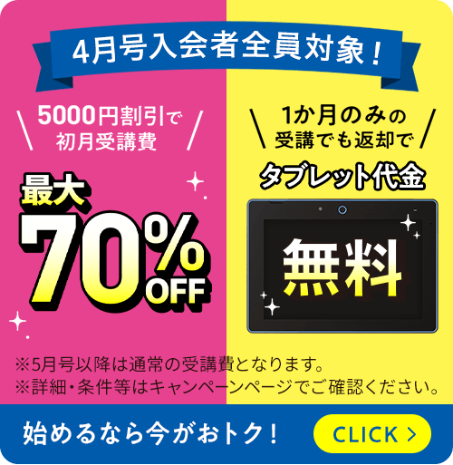
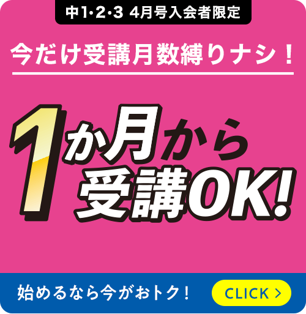

進研ゼミ中学講座にキャンペーンコードはあるのか。まずここが気になって検索する人は多いと思います。

ただ、実際に見ておきたいのはコードそのものより、4月号キャンペーンの内容と紹介制度の条件です。

この記事では、今使える特典を整理しながら、どこを確認して申し込むといちばんわかりやすいかをまとめます。

2026年4月号入会キャンペーンとお友だち・ごきょうだい紹介制度の2つです。

## 進研ゼミ中学講座の最新キャンペーンはこの2つ

結論からいうと、今チェックしておきたいのは「4月号入会キャンペーン」と「お友だち・ごきょうだい紹介制度」の2つです。

「キャンペーン」とひとことで言っても、中身は1種類ではありません。

4月号の入会特典として受講費割引や1か月受講OKがあり、別枠で紹介制度のプレゼントも用意されています。

なので、まずはこの2つを分けて見るのがわかりやすいです。

まとめて眺めるより、「今の入会特典」と「紹介で受けられる特典」を整理したほうが、申し込み前に迷いにくくなります。

[進研ゼミ中学講座の最新キャンペーンを確認する](https://ck.jp.ap.valuecommerce.com/servlet/referral?sid=3613518&pid=889799013)

### 4月号入会キャンペーン

今の中心は、4月号から入会する人向けのキャンペーンです。

公式では、4月号受講費5,000円引き、1か月だけの受講OK、タブレット代金0円の条件つき特典が案内されています。

特に「ちょっと試してから考えたい」という人には、1か月だけで始めやすい点が大きいです。

とはいえ、全部が同じ条件ではありません。

1か月受講OKの期限や、タブレットの返却条件は分けて見たほうが安心です。

### お友だち・ごきょうだい紹介制度

もう1つ見落としにくいのが、紹介制度です。

進研ゼミ会員の紹介で中学講座に入会すると、入会者と紹介者それぞれに図書カード1,000円分またはAmazonギフトカード1,000円分が用意されています。

さらに、2026年4月30日までは春の紹介キャンペーンがあり、全員プレゼントに加えてオリジナル図書カード4,000円分の抽選もあります。

つまり、「今入るなら4月号キャンペーンだけ見れば十分」というより、紹介してくれる人がいるなら紹介制度も一緒に確認したほうが自然です。

## 4月号キャンペーンの特典内容

4月号キャンペーンの良さは、ただ安くなるだけではなく、始めやすさまで含めて設計されているところです。

受講費の割引だけなら他社でも見かけますが、進研ゼミ中学講座は「まずは4月号だけでも試しやすい」という入り方が用意されています。

ここは、通信教材をいきなり長く続けるのが不安な家庭にはかなり大きいポイントです。

[4月号の締切と特典内容を確認する](https://ck.jp.ap.valuecommerce.com/servlet/referral?sid=3613518&pid=889799013)

### 4月号受講費5,000円引き

まず、4月号から入会する人には、4月号の受講費が5,000円引きになります。

この特典は、別の手続きをしなくても対象者に自動で反映される形です。

一括払いでも毎月払いでも、4月号分にあたる受講費から引かれるので、コードを入力しないと適用されない仕組みではありません。

ただし、ここは少しだけ注意があります。

割引されるのは4月号分で、5月号以降は通常の受講費に戻ります。

なので、「ずっと安いまま」と考えるより、最初の入り口を軽くしてくれる特典と考えたほうが近いです。

### 1か月だけ受講OK

次に大きいのが、4月号だけの受講がしやすくなっている点です。

公式では、通常は最短2か月からのところ、2026年4月9日までに4月号へ入会した人に限って、4月号1か月のみの受講も可能と案内されています。

「続けられるかまだわからない」という家庭ほど助かる条件です。

とはいえ、1か月だけで終わる場合は自動で止まるわけではありません。

2026年3月21日以降に入会した人は、教材到着後10日以内に電話での連絡が必要です。

要するに、「1か月だけ試せる」は本当です。

ただ、「何もしなくても自動で終了する」わけではない、という理解で見ておくのが安全です。

### タブレット代金0円の条件

タブレット代金0円も魅力ですが、ここは条件を読み分ける必要があります。

まず共通して言えるのは、無条件で完全無料というより、学年や選ぶスタイルによって扱いが変わることです。

この点をざっくり理解しておくだけでも、申込後のズレを防ぎやすくなります。

中1では、4月号のみでやめる場合や5月号から紙中心のスタイルに変える場合、2026年6月10日必着で返却すればタブレット代金はかかりません。

返却がない場合は8,300円が請求されるので、ここは忘れないようにしたいところです。

一方で中2・中3では、新品タブレットを返却条件つきで使う形に加えて、リユースタブレットなら受講月数にかかわらず無料で、短期受講でも返却不要という案内があります。

「返却の手間を減らしたい」「短期間でやめる可能性もある」という人は、この違いを先に見ておくと選びやすいです。

## 紹介制度でもらえる特典と使い方

紹介制度は、知っているかどうかで差が出やすい特典です。

4月号キャンペーンは見つけやすいのですが、紹介制度は申込画面での入力が関わるぶん、あとから気づきやすいんですね。

だからこそ、入会前に流れまでざっくり把握しておくと安心です。

### もらえるプレゼント

紹介制度でもらえるのは、図書カード1,000円分またはAmazonギフトカード1,000円分です。

しかもこれは入会者だけではなく、紹介者にも用意されています。

「紹介してもらう側だけが得をする」という形ではないので、すでに受講している兄弟や友だちがいるなら相談しやすい制度です。

さらに、2026年4月30日までは春の紹介キャンペーンがあり、対象者はオリジナル図書カード4,000円分の抽選対象にもなります。

時期が合っているなら、一緒に確認しておいて損はありません。

### 申し込みの流れ

流れはそこまで難しくありません。

紹介してくれる人の10ケタの会員番号を確認して、入会時に「ご紹介者がいる」を選び、会員番号と希望プレゼントを登録する形です。

電話で申し込む場合は、オペレーターに伝える案内になっています。

ここで気をつけたいのは、申し込みのあとで気づくと手間が増えやすいことです。

紹介制度を使いたいなら、申し込み前に会員番号を確認しておく前提で動いたほうがスムーズです。

[紹介制度を使う前に申込ページを確認する](https://ck.jp.ap.valuecommerce.com/servlet/referral?sid=3613518&pid=889799013)

## キャンペーンコードはある？

ここがいちばん気になる人も多いと思います。

結論からいうと、少なくとも2026年4月時点で公式が案内している中学講座の最新特典は、コード入力が必要なタイプではありません。

実際の特典は、対象者に自動で適用される形で整理されています。

### コード不要で自動適用

4月号キャンペーンの公式案内でも、キャンペーンは自動適用とされています。

つまり、申込画面で特別なコードを入れて割引を呼び出すというより、対象の条件を満たして入会した人に特典が反映されるイメージです。

競合記事でも、進研ゼミではキャンペーンコードの配布はなく、割引やプレゼントキャンペーンを確認する形だと整理されていました。

なので、「コードを探せていないせいで損しているかも」と不安になりすぎなくて大丈夫です。

今やるべきことは、コード探しよりも、対象期間の特典と条件を見落とさないことだと考えたほうが自然です。

### 申し込み時の注意点

申し込み前に確認したいこと

・期限が特典ごとに少し違う ・1か月だけでやめる場合は連絡が必要 ・タブレット0円の条件は学年で違う ・紹介制度を使うなら会員番号の入力忘れに注意

特に1か月受講OKは2026年4月9日が区切りなので、ここは先に見ておきたいです。

また、4月号だけでやめる場合は連絡が必要です。

自動で止まると思い込むと、次号まで進んでしまうので注意したいところです。

## 結局どれを使うのがいちばんお得か

いちばんわかりやすい答えは、「4月号キャンペーンを土台に考える」ことです。

今の時点では、受講費5,000円引き、1か月だけ試しやすい条件、タブレット特典の3つが揃っているので、まずはここを基準にするのが自然です。

特に「まず試したい」「新学年の最初から整えたい」という家庭には相性がいいと言えそうです。

そのうえで、紹介してくれる人がいるなら、紹介制度も忘れずに確認したいです。

ここを入れ忘れるともったいないので、申し込み直前にもう一度だけ見直す価値があります。

要するに、今いちばんお得に入りやすいのは、4月号キャンペーンの条件を確認して、紹介制度が使えるなら申込時にきちんと反映する入り方です。

コード探しに時間をかけるより、期限と条件を先に押さえて動くほうが、結果的に失敗しにくいと思います。

[進研ゼミ中学講座の申込ページを見る](https://ck.jp.ap.valuecommerce.com/servlet/referral?sid=3613518&pid=889799013)
