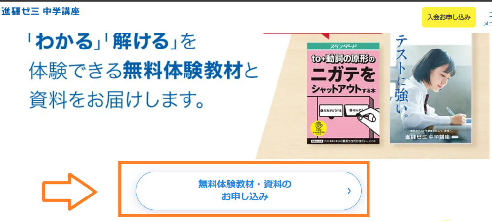

「進研ゼミ中学講座って実際どうなの？」と気になって調べてみると、良い口コミもあれば、悪い評判もあって迷いますよね。

続きやすいって声もあれば、放置しやすいという声もあるので、結局うちの子に合うのかどうかがいちばん気になるところです。

そこで今回は、進研ゼミ中学講座の口コミや評判をもとに、やめたほうがいいと言われる理由や、合う人・合わない人の違いまでわかりやすく整理していきます。

進研ゼミ中学講座を調べたところ、以下のような口コミが見つかりました。

## 進研ゼミ中学講座は「やめたほうがいい」と言われる理由は？

進研ゼミ中学講座は、合う子には使いやすい一方で、合わない子には続きにくさが出やすい教材、と見たほうがよさそうです。

良いところとしては、学習の流れを作りやすいこと、学校の教科書に合わせて進めやすいこと、定期テスト前にやることを整理しやすいこと。このあたりは強みと言えます。

忙しい中学生にとっては、「何をやればいいか」が見えやすいだけでも助かるポイントです。

その一方で、自分から動くのが苦手だと止まりやすいとか、もっと問題量がほしいと感じるとか、気になる点もあります。

だからこそ、良いか悪いかで決めるというより、「うちの子に合うかどうか」で見たほうが失敗しにくいです。

進研ゼミ中学講座悪い口コミ一覧

・放置しやすく、気づくと後回しになりやすい ・演習量が少なく、難しい問題には物足りなさを感じることがある ・最初は親が進み方を見てあげないと止まりやすいことがある

## 進研ゼミ中学講座：悪い口コミ評判

気になる声としてまず出てきやすいのが、「放置しやすい」という点です。

家庭学習って自由に進められるぶん、忙しい日が続くとどうしても後回しになりやすいんですよね。最初はやる気があっても、学校の宿題や部活でバタバタしているうちに触らなくなって、そのまま止まる。これは十分ありえる話です。

また、「問題量が少ない」「もっと難しい問題もやりたい」という声もあります。

これは、短時間で進めやすいことの裏返しでもあります。サクッと進めやすいぶん、演習量をたっぷりこなしたい子には少なく感じることがあるんですよね。

さらに、親のフォローが必要になる場面がある、というのも見ておきたいところです。特に最初のうちは、「何からやるのがいいのか」「ちゃんと進んでいるのか」が見えにくいことがあります。

もちろん、ずっと横につきっきりで見る必要がある、という話ではありません。ただ、完全に任せきりにすると止まりやすいタイプの子もいるので、最初だけでも少し伴走したほうが安定しやすいです。

・放置しやすい ・難しい問題が物足りないことがある ・最初は親のフォローがあると進めやすい

### 続かないと言われる理由

進研ゼミ中学講座でまず気になるのが、「ちゃんと続くの？」という不安です。これはよくある心配ですし、実際その不安が出るのもわかります。

というのも、家庭学習が中心だからです。塾みたいに決まった時間に通うわけではないぶん、自分で始めないとその日は進みません。

「今日は疲れたから明日でいいか」が続くと、そのまま止まりやすいんですよね。

ただ、だからといって続けにくい仕組みかというと、そうとも言い切れません。学習の進み具合に合わせて調整しやすかったり、その時々に合わせて進め方を立てやすかったり、続けるための工夫はちゃんとあります。

つまり、続かないというよりは、自分で勉強を始めるのが苦手な子だと止まりやすい、という見方のほうが自然です。

### 塾より弱いと思われがち

「塾と比べると弱いのでは？」と感じる人がいるのも自然です。

塾には、時間が来たら勉強する流れがありますし、その場で質問もできます。そういう意味では、進研ゼミ中学講座とはそもそもの形が違います。

進研ゼミ中学講座は、あくまで家庭で進める学習が中心です。だから、塾と同じものを期待すると「ちょっと違うな」と感じやすいんですよね。

とはいえ、サポートがまったくないわけではありません。質問できる仕組みや添削のようなサポートもありますし、一人で全部抱え込む形ではありません。

ここは「塾より弱い」というより、塾とは役割が違う、と考えたほうがわかりやすいです。日々の家庭学習や定期テスト対策には使いやすいけれど、対面で細かく見てもらいたいなら塾のほうが合うこともあります。

### タブレット学習に不安がある

タブレット学習に不安を感じる人もいます。これも、よくわかる話です。

便利な機能が多いぶん、「結局どれを使えばいいの？」となりやすいんですよね。情報がたくさん入っていることが、逆に使いにくさにつながることもあります。

また、操作感が合うかどうかもあります。タブレット学習がすごくやりやすいと感じる子もいれば、紙のほうが落ち着く子もいます。

とはいえ、タブレットならではの良さも多くあります。自動採点だったり、理解度に合わせた出題だったり、学習の流れを見えやすくしてくれるところはやっぱり便利です。

つまり、タブレット学習の不安は「良い悪い」というより、本人に合うかどうか、というところが大きそうです。

## 進研ゼミ中学講座：良い口コミ評判

進研ゼミ中学講座の良い口コミを見ていくと、特に多いのは「定期テスト対策がしやすい」「部活と両立しやすい」「自分のペースで進めやすい」といった声です。

忙しい中学生でも家庭学習を回しやすく、毎日の授業やテスト対策に合わせて使いやすい点が、高く評価されやすい理由だと言えそうです。

### 定期テスト対策がしやすい

進研ゼミ中学講座の良い評判で、いちばん強いのが定期テスト対策のしやすさです。

学校の教科書に合わせて進めやすく、テスト範囲や日程に合わせて学習を整理しやすいので、「テスト前に何をやるべきか」が見えやすいのが大きな強みです。

暗記用の教材や予想問題、アプリ系の機能などもあり、テスト前に使い分けしやすい点も魅力です。

普段の勉強にも使えますが、特に力を発揮しやすいのは定期テスト前だと言えそうです。

忙しい中学生ほど、やることが整理されているだけで助かるはずです。

そういう意味でも、定期テスト対策のしやすさは大きな強みです。

### 部活と両立しやすい

部活と両立しやすいのも、評価されやすいポイントです。

短時間で区切って進めやすいので、平日にまとまった時間が取りにくい子でも取り組みやすいです。

家ですぐ始めやすいのも、忙しい中学生には嬉しいポイントでしょう。

部活がある日は短めに、少し余裕がある日は多めに、というように、生活に合わせて調整しやすいのも使いやすさにつながっています。

もちろん、短時間で終わるからそれだけで成績が上がるわけではありません。

ただ、少なくとも「忙しいから続けにくい」という壁を下げやすい教材ではあります。

### 自分のペースで進めやすい

自分のペースで進めやすい、というのも良い評価としてよく出てきます。

好きな時間に取り組みやすく、わからないところを中心に進めやすいので、生活のリズムに合わせて勉強しやすいです。

予定どおりにいかない日があっても調整しやすいので、無理なく続けやすいのも強みです。

ここは「自由すぎる」という見方もできますが、逆に言えば、日ごとの忙しさに合わせて動かしやすいということでもあります。

部活や習い事がある中学生には、この柔軟さがありがたいはずですね。

## 進研ゼミ中学講座は合う人・合わない人がハッキリしている

進研ゼミ中学講座は、良い教材か悪い教材かという見方よりも、向き不向きがはっきり分かれる教材として捉えたほうが実態に近いです。

実際、良い口コミでは「定期テスト対策がしやすい」「部活と両立しやすい」「自分のペースで進めやすい」といった声がよく見られます。

教科書に合わせて進めやすいので、普段の授業とズレにくいですし、テスト前に何をやるべきかも整理しやすいです。部活や習い事で忙しい子にとっては、短時間で区切って進めやすいのも大きなメリットです。

ただ、その良さがそのまま全員に当てはまるわけではありません。自由に進められるからこそ合う子もいれば、その自由さが逆に難しく感じる子もいます。

だからこそ、最初に向いているタイプと向いていないタイプを見ておくことが大事です。

### 向いている中学生

向いているのは、まず忙しい毎日の中でも家庭学習をちゃんと回したい中学生です。

部活や習い事と両立したい子、定期テスト前にやることを整理したい子、家での勉強を効率よく進めたい子には相性がよさそうです。

また、アプリや教材を使い分けながら計画的に進めるのが苦にならない子にも向いています。「時間はないけど、家でしっかり勉強したい」そんなタイプにはハマりやすいです。

・部活や習い事と両立したい子 ・定期テスト対策をしっかりやりたい子 ・家で自分のペースで勉強を進めたい子 ・何をやればいいか整理しながら進めたい子

### 向いていない中学生

逆に、向いていない可能性があるのは、自分で始めるのが苦手な中学生です。

家庭学習が中心なので、どうしても最初の一歩は自分で踏み出す必要があります。ここが難しいと、せっかく教材があっても止まりやすくなります。

また、もっと演習量がほしい子や、難しい問題をどんどん解きたい子、その場で先生に質問したい子だと、少し物足りなく感じることもありそうです。

つまり、向き不向きは学力の問題というより、学習スタイルとの相性で考えるのがいちばん自然です。

・自分から勉強を始めるのが苦手な子 ・演習量をたくさんこなしたい子 ・難問までしっかり取り組みたい子 ・対面でその場ですぐ質問したい子

### 塾なしで使う家庭のチェックポイント

塾なしで使うなら、まず見たいのは「家庭の中で学習の流れを回せるかどうか」です。

教材があるだけでうまくいくわけではなく、テスト前に何を使うか、学校ワークとどう組み合わせるか、どこまで家庭で見ていくか。このへんを先に決めておいたほうが使いやすくなります。

特に定期テスト前は、少し前倒しで暗記や復習に入れると回しやすくなりそうです。塾なしで進めるなら、教材の中身だけじゃなく、回し方もセットで考えておきたいところです。

### 紙教材かタブレットかの選び方

紙教材かタブレットかは、重要な選択ポイントです。

タブレットのよさは、学習計画を立てやすいこと、進み具合が見えやすいこと、間違えた問題を振り返りやすいこと。効率よく進めたいなら、使いやすいはずです。

一方で、紙教材のよさは、書き込みやすいこと、集中しやすいこと、テストに近い感覚で勉強しやすいことです。書いて覚えたいタイプには、こちらのほうがしっくりくるかもしれません。

ざっくり言えば、効率重視ならタブレット寄り、書いて覚えたいなら紙寄り。この見方で考えると選びやすくなります。

・効率よく進めたいならタブレット ・書いて覚えたいなら紙教材 ・迷うなら、ふだんの勉強スタイルに近いほうを選ぶと失敗しにくい

## 進研ゼミ中学講座は自分に合う、合わないの判断が大切

進研ゼミ中学講座は、教科書に合わせやすいこと、学習の流れを作りやすいこと、定期テスト対策を進めやすいこと、部活と両立しやすいこと。このへんは使いやすく作られています。

ただ、その一方で、放置しやすさ、演習量の物足りなさ、対面指導とは違う点、タブレットの合う・合わないといった注意点もあります。

だからこそ、いちばん大事なのは、「評判が良いか悪いか」よりも、「うちの子に合うかどうか」です。

ここが合えば、心強い教材になりそうです。逆にここがズレると、せっかくの良さを活かしきれないかもしれません。

だからこそ、見るべきなのは評判の数ではなく、その中身です。そこを落ち着いて見ていくと、判断しやすくなるはずです。

## 進研ゼミ中学講座の料金

進研ゼミ中学講座の料金は、学年・コース・支払い方法によって異なります。

基本的に、学年が上がるごとに料金も上がります。

ただし、小学講座のように1学年で1,000円近く上がるわけではありません。1学年上がるごとの値上がりは、**200円～300円ほど**です。

また、ハイブリッドコース（タブレット学習）は、オリジナルコース（紙教材学習）よりも**600円近く高め**です。

**＼5分で完了／**

[✅ 「公式」今すぐ進研ゼミ中学講座に入会する](//ck.jp.ap.valuecommerce.com/servlet/referral?sid=3613518&pid=889799013)

### 進研ゼミ料金：中学1年

<strong>中学1年生の月額料金</strong>

| **中学1年生** | **12ヶ月一括払い** | **半年一括払い** | **毎月払い** |
| --- | --- | --- | --- |
| ハイブリッド | 6,990円 | 7,700円 | 8,170円 |
| オリジナル | 6,400円 | 7,010円 | 7,480円 |

<strong>中学1年生の年間料金</strong>

| **中学1年生** | **12ヶ月一括払い** | **半年一括払い** | **毎月払い** |
| --- | --- | --- | --- |
| ハイブリッド | 83,880円 | 92,400円 | 98,040円 |
| オリジナル | 76,800円 | 84,120円 | 89,760円 |

中学1年生の料金は、月々6,400円～です。

12ヶ月一括払いと毎月払いでは、1年間で1万円以上の差があります。

そのため、支払い方法は**12ヶ月一括払いを選ぶのがおすすめ**です。

もし12ヶ月一括払いを選んで途中で解約しても、差額は返金されるので、**大きく損をする心配はありません**。

12カ月一括払いなら、ハイブリッドコースは14,160円、オリジナルコースは12,960円お得に利用できますよ♪

### 進研ゼミ料金：中学2年

<strong>中学2年生の月額料金</strong>

| **中学2年生** | **12ヶ月一括払い** | **半年一括払い** | **毎月払い** |
| --- | --- | --- | --- |
| ハイブリッド | 7,140円 | 7,860円 | 8,290円 |
| オリジナル | 6,570円 | 7,270円 | 7,680円 |

<strong>中学2年生の年間料金</strong>

| **中学2年生** | **12ヶ月一括払い** | **半年一括払い** | **毎月払い** |
| --- | --- | --- | --- |
| ハイブリッド | 83,880円 | 92,400円 | 98,040円 |
| オリジナル | 76,800円 | 84,120円 | 89,760円 |

中学2年生の料金は、月々6,570円～です。中学1年生との差額は約150円ほどで、**ほとんど差はありません**。

こちらも12ヶ月一括払いがおすすめです。

12カ月一括払いなら、年間でハイブリッドコースは**13,800円**、オリジナルコースは13,320円お得に利用できますよ♪

### 進研ゼミ料金：中学3年

<strong>中学3年生の月額料金</strong>

| **中学3年生** | **12ヶ月一括払い** | **半年一括払い** | **毎月払い** |
| --- | --- | --- | --- |
| ハイブリッド | 7,190円 | 7,900円 | 8,330円 |
| オリジナル | 7,090円 | 7,800円 | 8,220円 |

<strong>中学3年生の年間料金</strong>

| **中学3年生** | **12ヶ月一括払い** | **半年一括払い** | **毎月払い** |
| --- | --- | --- | --- |
| ハイブリッド | 86,280円 | 94,800円 | 99,960円 |
| オリジナル | 85,080円 | 93,600円 | 98,640円 |

中学3年生の料金は、月々7,090円～です。

中学3年生では、ハイブリッドとオリジナルの2コースの料金差が**100円程度**と、ほとんど変わりません。

12カ月一括払いなら、年間でハイブリッドコースは**13,680円**、オリジナルコースは13,560円お得に利用できますよ♪

**＼5分で完了／**

[✅ 「公式」今すぐ進研ゼミ中学講座に入会する](//ck.jp.ap.valuecommerce.com/servlet/referral?sid=3613518&pid=889799013)

### 進研ゼミ料金：中高一貫

<strong>中高一貫の月額料金</strong>

| 中高一貫 | 12ヶ月一括払い | 半年一括払い | 毎月払い |
| --- | --- | --- | --- |
| ハイブリッド | 9,410円 | 10,140円 | 10,770円 |

<strong>中高一貫</strong><strong>の年間料金</strong>

| 中高一貫 | 12ヶ月一括払い | 半年一括払い | 毎月払い |
| --- | --- | --- | --- |
| ハイブリッド | 112,920円 | 121,680円 | 129,240円 |

中高一貫コースの料金は、中1～中3と比べると2,000円近く高くなります。

また、中高一貫コースは**ハイブリッドコースのみ**です。紙教材のコースはありません。

12カ月一括払いなら、年間で**16,320円お得**に利用できますよ♪

## まとめ：進研ゼミ中学講座を無料体験しよう♪

進研ゼミ中学講座は、基礎力をしっかり伸ばし、定期テストの点数アップを目指したい人に向いている教材です。

さらに、読書好きの方にうれしい本読み放題のサービスや、実際の授業に近い感覚で学べるオンライン生配信授業など、多彩なサービスを無料で利用できます。

もちろん、**人によって向き・不向きはあります**。

入会を検討しているもののまだ迷っている方や、実際にどのような内容か体感してみたい方には、体験学習がおすすめです。

資料請求をするだけで、無料の教材を試すことができます。

[「進研ゼミ中学講座」無料体験の資料請求はこちらからどうぞ♪](//ck.jp.ap.valuecommerce.com/servlet/referral?sid=3613518&pid=889820639)
