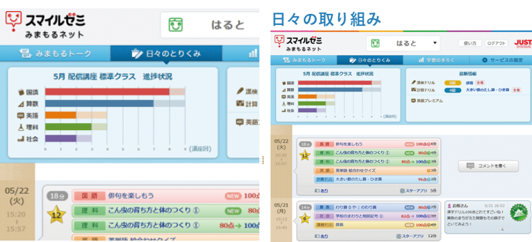
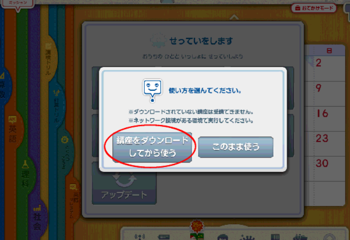

この記事では「チャレンジタッチとスマイルゼミ」の違いを解説します。

チャレンジタッチとスマイルゼミは共通点が多く、比較されることが多い教材です。

しかし、実はこの２つは全く違う教材なんです。

合わない方を選択しないためにも、2つの違いをしっかり理解しておく必要があります。

今回は、基本的な違いからサービスやタブレット機能の違いまでを細かく説明します。

チャレンジタッチとスマイルゼミで迷っている方はぜひ最後までご覧ください。

## チャレンジタッチとスマイルゼミの違い

まずは、「チャレンジタッチ」と「スマイルゼミ」の基本情報を比べて見ましょう。

### 学年・教科・レベルの比較

🐕

まずは、基礎的な違いを見てみよう

|  | **チャレンジタッチ** | **スマイルゼミ** |
| --- | --- | --- |
| 対象学年 | 小学１年生～小学6年生 | 小学１年生～小学6年生 |
| 教科 | ・小1～2   国・算・英・プログラミング  

  ・小3～小6   国・算・理・社・英・プログラミング | ・小1～2   国・算・英・プログラミング  

  ・小3～小6   国・算・理・社・英・プログラミング |
| レベル | チャレンジタッチ：基礎～応用（※調節可能）

  チャレンジ：基礎～標準 | 標準クラス：基礎～標準

  発展クラス：標準～応用（※調節可能） |

教科や対象学年は同じですが、レベルに違いがあります。

### 料金の違い

料金は一括払いで表示しているよ

|  | チャレンジタッチ | スマイルゼミ |
| --- | --- | --- |
| 1年生 | 2,980円 | 3,278円 |
| 2年生  | 3,180円 | 3,520円 |
| 3年生 | 3,740円  | 4,180円 |
| 4年生 | 4,430円 | 4,840円 |
| 5年生 | 5,320円 | 5,720円 |
| 6年生 | 5,730円 | 6,270円 |

※料金は、1年一括払い（税込み）で表示されています。

料金はスマイルゼミの方が少しだけ高いですが、1番差の大きい6年生でも500円程しか変わらないので、料金よりも機能やサービスで選んだ方がいいでしょう。

### タブレット本体料金の違い

チャレンジタッチもスマイルも専用タブレットを買う必要があります。

それぞれの料金がこちらです。

|   | チャレンジタッチ | スマイルゼミ |
| --- | --- | --- |
| 本体料金 | 9,900円 | 43,780円 |
| 割引条件 | 6か月継続で料金無料 | 1年間継続で10,978円 （32,802円の値引） |
| 保証 | 保証は、1年2,400円で加入できます。（任意で加入）  故障した場合、3,300円で新品と交換できます。 | スマイルには、入会時に1年間のメーカー保証が付いてきます。  それとは、「安心サポート」に3,600円（1年契約）で加入することができます。  タブレットが故障した時は、「メーカー保証・安心サポート」どちらでも6,000円で新品に交換されます。 |

チャレンジタッチとスマイルゼミの専用タブレットの料金が大きく違います。

料金だけ見ると「チャレンジタッチの方が安くていい」と感じるかもしれません。

ただ、性能面でみると「画面のキレイさ」「耐久性」などはスマイルゼミのタブレットの方が優れています。

では、「チャレンジタッチ「と「スマイルゼミ」それぞれの特徴を紹介していきます。

それぞれのスペックを詳しく知りたい方は資料請求してみるといいですよ。

カリキュラム内容からおためし教材で実際に問題を解いてみることができます

[チャレンジタッチの資料を請求する](//ck.jp.ap.valuecommerce.com/servlet/referral?sid=3613518&pid=887632136)

[スマイルゼミの資料を請求する](https://px.a8.net/svt/ejp?a8mat=3H9NZ4+HVAYI+2P76+614CY)

## チャレンジタッチ「向き・不向き」

🐕

チャレンジタッチはどんな人に向いていて、どんな人に向いていないのかな？

### 学習習慣をつけたい

チャレンジタッチはゲーム性が高く、勉強が嫌いな子でも抵抗なく始められるつくりとなっています。

進研ゼミでは、40年分の膨大なデータを元に1人1人に合った学習プランが作られます。

・学習量 ・レベル ・正答率 ・教科書タイプ

から判断してお子さんに合った最高の学習プランが自動で作られます。

これにより、勉強する習慣が自然に身につく仕組みで「勉強しなさい！」の声かけ不要となります。

スマイルゼミと比べると勉強習慣をつけやすいのはチャレンジタッチと言えます。

### 英語を伸ばしたい

チャレンジタッチの英語はタブレット教材でもトップクラスで評判が高いのが特徴です。

英語を伸ばしたいから進研ゼミを選ぶという人も少なくありません。

小学生の超基礎的な英単語から始まり、会話形式まで教科書に合わせた内容の勉強をすることができます。

さらに、英検の対策としても使うことができます。

※５級～準１級まで対応可能

チャレンジイングリッシュの内容は、別記事で詳しく解説してあります。

[チャレンジイングリッシュの料金は無料！？利用者の本音の口コミ](https://xn--5ckip8c4fq970ahbya2o7acu2a.com/2022/01/04/%e3%80%90%e9%80%b2%e7%a0%94%e3%82%bc%e3%83%9f%e8%8b%b1%e8%aa%9e%e3%80%91%e5%b0%8f%e5%ad%a6%e7%94%9f%e3%81%ae%e3%80%8c%e6%9c%ac%e9%9f%b3%e3%80%8d%e3%81%af%e5%8f%a3%e3%82%b3%e3%83%9f%e3%81%a7%e5%88%86/)

### 読書する習慣をつけたい

チャレンジタッチには0円で利用できる電子書籍が**約1000冊読み放題**となっています。

小学生向けの本なので興味を持てる内容の本がいっぱい用意されています。

楽しく本を読みながら国語力を同時に鍛えることができます。

### タブレット性能は低め

チャレンジタッチを利用する人の中で「タブレットの反応悪い」という声がたまに見つかります。

特に漢字の勉強では、字のバランスが悪いとバツになってしまい、その基準になれるまでは大変かもしれません。

また、反応速度もiPadやスマートフォンに慣れている人には遅く感じるかもしれません。

サクサクしたタブレットを求める人はスマイルゼミがオススメです。

チャレンジタッチの**口コミ**や**メリット・デメリット**を知りたい方は別記事で解説しています♪

[チャレンジタッチ【良い口コミ・悪い口コミ】を暴露！入会前にちょっと待ってください](https://xn--5ckip8c4fq970ahbya2o7acu2a.com/2022/01/09/%e9%80%b2%e7%a0%94%e3%82%bc%e3%83%9f-%e5%b0%8f%e5%ad%a6%e8%ac%9b%e5%ba%a7%e3%81%ae%e5%8f%a3%e3%82%b3%e3%83%9f%e8%a9%95%e5%88%a4%e5%ae%8c%e5%85%a8%e3%81%be%e3%81%a8%e3%82%81/)

### チャレンジタッチがオススメな人

・自宅で勉強する習慣をつけたい人

・英語を伸ばしたい人

・高いゲーム性を求める人

・電子書籍を1000冊を利用したい人

・読書する習慣を付けたい人

このような人にはチャレンジタッチがオススメです。

[チャレンジタッチの無料お試し教材はこちら](//ck.jp.ap.valuecommerce.com/servlet/referral?sid=3613518&pid=887632136)

## スマイルゼミ「向き・不向き」

🐕

次にスマイルゼミに向いてる人、向いていない人を見ていこう

### 集中力を鍛えたい

スマイルゼミの以下の機能が集中力UPに役立ちます。

・特定アプリの使用制限できる ・学習記録を完全管理できる ・ご褒美機能が用意されている

✅ **特定アプリの使用制限できる**

通常のタブレット端末と違いSNSやYouTubeをみる心配がありません。

せっかく集中できてもSNSやYouTubeやゲームがちょっと頭に浮かんだら人間はやりたくなるものです。

専用タブレットであれば全て制限できるので余計なことに気をつかう必要はありません。

✅ **学習記録を完全管理できる**

スマイルゼミでは、今までの勉強記録が細かく管理されています。

他の教材でもある程度は管理されています。

しかし、詳細に管理できるのは、スマイルゼミはトップクラスです。

これを利用して集中力を上げましょう。

学習記録を見ればどの教科のどの分野なら集中しやすいか一目でわかります。

勉強を始める時は、ある程度得意なものから始めましょう。

どんな子でも苦手なわからない問題は集中力を低下させやすくなります。

得意分野でもいいからまずは、集中できる分野で集中力を鍛えましょう。

✅ **ご褒美機能** スマイルゼミでは、保護者の管理のもとゲームアプリで遊ぶことができます。

もちろんゲームは、保護者が決めた時間内でしか遊べません。

ご褒美をうまく使えば集中力を鍛えることができます。

例えば、「勉強の進み具合によってご褒美時間を増やす」のも有効です。

○○分勉強できたらゲームOKというルールは子供のやる気UPに繋がります。

ただ、人によって集中できるスタイルやレベルは違うので実際に体験してみることをオススメします。

それぞれ資料請求するとお試し教材が届くので試してみるといいですよ。

### 基礎的な問題が多め

問題のレベルはチャレンジタッチと比べると基礎的な問題が多めです。

特に、小学生の問題は教科書の例題レベルがゴールなので勉強が不得意な子向けと言えます。

### Wi-Fiがない場所でも使いたい

スマイルゼミでは、受講する講座をダウンロードすることができます。

当月と前月の2か月分をダウンロードすればネット環境が整っていない場所でも勉強することが可能です。

車での移動中や電車の中でも使えるので隙間時間を無駄なく活用することができます。

### タブレットはサクサクがいい

スマイルゼミのタブレットはとても優秀で特に「書き心地」や「動作のサクサク」を重視する人にオススメです。

<iframe title="YouTube video player" src="https://www.youtube.com/embed/nazvbB-6q4U" width="853" height="480" frameborder="0" allowfullscreen="allowfullscreen"></iframe>

また、多くのタブレット教材が選択式で「①～⑤」の番号で答えるのに対してスマイルゼミでは、記述式を採用してます。

たまたま正解して分からないまま次の問題にいくことを防ぐことができます。

スマイルゼミの**口コミ**や**メリット・デメリット**を知りたい方は別記事からどうぞ♪

[「小学生」スマイルゼミを使った感想は良い・悪い？](https://xn--5ckip8c4fq970ahbya2o7acu2a.com/2021/06/30/%e3%82%b9%e3%83%9e%e3%82%a4%e3%83%ab%e3%82%bc%e3%83%9f%e5%b0%8f%e5%ad%a6%e7%94%9f%e3%81%ae%e3%80%8c%e5%8f%a3%e3%82%b3%e3%83%9f%e3%83%bb%e8%a9%95%e5%88%a4%e3%80%8d%e3%81%8c%e6%9c%80%e6%82%aa%e3%81%a8/)

### スマイルゼミがオススメな人

次にスマイルゼミが向いている人の特徴を紹介します。

・集中力を伸ばしたい

・基礎を定着させたい

・勉強に苦手意識がある

・紙に書いている感覚が欲しい人

・アニメーションにキレイさを求める人

・記述式で問題を解いていきたい人

・2週間試してから決めたい人

このような人にはスマイルゼミがおすすめです。

[スマイルゼミの無料お試し教材はこちら](https://px.a8.net/svt/ejp?a8mat=3H9NZ4+HVAYI+2P76+614CY)

「チャレンジタッチ・スマイルゼミ」以外の教材を知りたい方は↓からどうぞ♪

https://xn--5ckip8c4fq970ahbya2o7acu2a.com/2021/08/29/%e5%b0%8f%e5%ad%a6%e7%94%9f%e3%81%ae%e3%82%bf%e3%83%96%e3%83%ac%e3%83%83%e3%83%88%e5%ad%a6%e7%bf%92%e3%81%8a%e3%81%99%e3%81%99%e3%82%817%e9%81%b8%e3%80%82%e3%81%9d%e3%82%8c%e3%81%9e%e3%82%8c%e3%81%ae/
