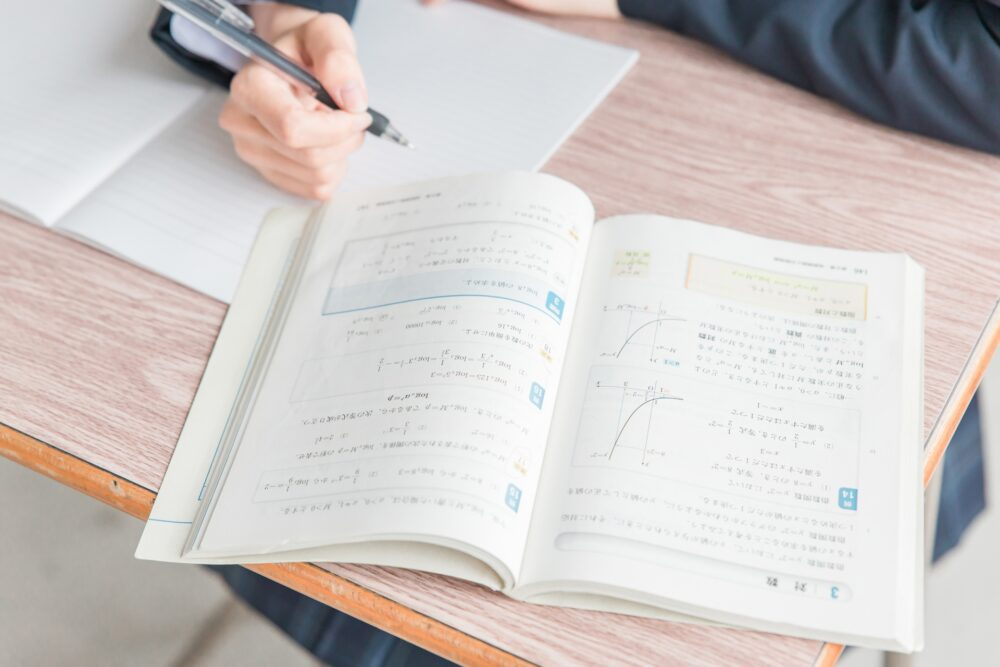

🐕

塾なしで高校受験する人の割合はどれくらいだろう？

今回は「塾に通いたくない」という人に向けて「塾なしで高校受験をする人の割合」「塾なし高校受験に向いている子・向いていない子」について詳しく解説していきます。

この記事を読み終わる頃には、塾なし高校受験が子供に合っているかどうか判断できるようになります。

塾なしで高校受験をする人におすすめのタブレット学習6選は別記事で紹介しています。気になる方は別記事からどうぞ♪

[中学生におすすめのタブレット学習6選を詳しく見る](https://xn--5ckip8c4fq970ahbya2o7acu2a.com/2024/02/05/%e5%8b%89%e5%bc%b7%e3%81%8c%e8%8b%a6%e6%89%8b%e3%81%aa%e4%b8%ad%e5%ad%a6%e7%94%9f%e3%81%ab%e3%81%8a%e3%81%99%e3%81%99%e3%82%81%e9%80%9a%e4%bf%a1%e6%95%99%e8%82%b26%e9%81%b8%ef%bc%81%e5%9c%a7%e5%80%92/)

## 塾なしで高校受験する中学生の割合は？

全国、小中学生の子どもを持つ保護者約3000人に実施したアンケート によると、塾に通う**中学3年生の割合は全体の****58.9%**ということが分かりました。

つまり、中学生の半分以上は塾に通っていることになります。反対に、**塾なしで高校を受験する割合は41.1％**ということになります。

また、文部科学省が令和3年度に「子供の学習費調査」に関して発表を行なっています。

中学生の通塾率は公立中学校に通う子どもが70.4%、私立中学校に通う子どもが53.9%です。

この内容から、多くの中学3年生が、塾に通い、高校受験の対策をしていることが分かります。

**では、塾なしで高校受験は難しいのか？**と言うと、そうではありません。

志望校のレベルにもよりますが、正しい受験対策をすれば、志望校に合格することは十分に可能です。

参考元URL:https://terakoya.ameba.jp/a000001342/

### 塾なしでどのレベルまで到達できる？

結論から言うと、塾なしで一定のレベルまで達成することは可能です。

例えば、偏差値50くらいの子が偏差値60の高校を受験する場合、塾なしでも本人の努力や勉強法次第で合格することは十分に可能です。

ただ、注意しなければならないのが、目指す学校の偏差値と本人のレベルの差が大きい場合です。

志望校と本人のレベルに大きな差があれば自力で合格するのは難しくなるでしょう。

ただ、塾に行っても**_必ず伸びるとも限りません_**。塾に通って成長する子がいれば、塾なしでも伸びる子もいます。

個人によって「塾が合う、塾が合わない」があるため、自分自身の学習スタイルや環境を考慮して、最適な方法を選ぶことが大事です。

### 塾なし高校受験に「向いていない人」

では、具体的に塾なし高校受験に向いていない人はどんな特徴をもっているのでしょうか？

塾なし高校受験に向いていない人

- 今まで勉強してこなかった人
- 勉強の仕方を理解していない人
- 勉強する習慣がない人
- 独学が苦手な人

勉強の仕方を正しく理解できていない子は、自分で効率的な勉強方法を探すよりも塾で受けたアドバイスをそのまま実践するのがおすすめです。

高校受験まで、何年も時間がある場合は独学で勉強しても問題ありません。

ただ、高校受験まで限られた期間（1年未満）しか無いのに、現状の成績が悪い。といった場合は、塾に通った方がいいかもしれません。

### 塾なし高校受験に「向いている人」

反対に、塾なし高校受験に向いている人はどんな特徴をもっているのでしょうか？

塾なし高校受験に向いている人

- 志望校と自分のレベルに大きな差が無い人
- 目標の為に努力できる人
- 勉強の仕方を知っている人
- 体力がある人（心肺機能が高い人）
- 受験までの計画を立てられる人
- １人のほうが集中できる人

今までの学校生活で、ある程度勉強してきた人、勉強の正しいやり方が分かっている人は、そのまま自宅で独学勉強を続けても問題ありません。

また、意外と知られていないのが、「体力がある（心肺機能が高い）人は受験に強い」という事です。

このような話を聞いたことはありませんか？

学生時代、あまり勉強せずに部活に没頭していた人が、部活を引退して受験勉強に取り組み始めた途端、成績が大幅に上がり難関校に合格できた。

これは心肺機能の高さに秘密があります。具体的に言うと**心肺機能が高い人は疲れにくく、集中力を維持しやすい**特徴をもっています。

そのため、今まで運動系の部活をやってきて体力に自信がある子は、独学の勉強でも成績が大幅に上がる可能性があります。

もちろん、塾に行かないで高校受験に挑むことは難しい面もあります。ただ、ここで紹介したような特徴を持っている人は、独学でも十分に高いレベルに到達できる可能性があります。

ちなみに、塾なしで高校受験をするなら、**タブレット学習がおすすめ**です。

タブレット学習では、小テストによる反復練習やAI機能による苦手対策機能がとっても充実しています。

特に、「基礎を定着させたい」「苦手を克服したい」と思っている子にはタブレット学習がピッタリですよ♪

[中学生におすすめのタブレット学習6選を見る](https://xn--5ckip8c4fq970ahbya2o7acu2a.com/2024/02/05/%e5%8b%89%e5%bc%b7%e3%81%8c%e8%8b%a6%e6%89%8b%e3%81%aa%e4%b8%ad%e5%ad%a6%e7%94%9f%e3%81%ab%e3%81%8a%e3%81%99%e3%81%99%e3%82%81%e9%80%9a%e4%bf%a1%e6%95%99%e8%82%b26%e9%81%b8%ef%bc%81%e5%9c%a7%e5%80%92/)

## 塾よりも勉強方法が大切

**受験勉強で最も大切**なのは、自分に合った正しい勉強方法を理解することです。これさえ習得すれば志望校合格の可能性は大幅にUPします。

塾に通ったからといって**必**ず**実力が身に付くわけではありません**。

塾に通う最大のメリットは、プロの先生が教えてくれる点と、周りに同じ目標を持った仲間がいる環境が整っていることです。

しかし、これらは塾でしか得られないわけではありません。家で独学する場合でも、インターネットや参考書、友達との勉強会などを利用して、同じような環境を作ることもできます。

仮に塾に通ったとしても、そこの方針がその人に合っていなかった場合、勉強の効率は悪くなってしまいます。

大切なのはその人に合った効率的な勉強方法を実践することです。

独学で合格するためには、自分自身で考え、計画を立て、行動する能力が必要です。

これは塾に通っていても、通わなくても変わりません。

実際、塾に通っている子でも、自分でしっかりと計画を立て、効率よく勉強する子の方がより多くの成果を上げています。

つまり、塾に通うかどうかよりも、自分がどのように勉強するのかがより重要となります。

## 塾なし高校受験に必要なポイント3選

では、塾なしで高校受験に合格するためには、どんな勉強法が有効なのでしょうか？

具体的にすべきポイントを3つご紹介します。

塾なし高校受験に必要なポイント3選

1. 勉強する環境を整える
2. 通信教材を利用する
3. 過去問を解く

### ①：勉強する環境を整える

受験勉強するにあたって環境作りはとっても大切です。

塾に通っていれば集中できる環境が用意されていますが、塾なしで受験勉強をするならば環境づくりにも力を入れましょう。

塾なしで<strong>難関高校に合格している人ほど</strong>、勉強する環境を大切にしているんだ

自宅で勉強する際に、テレビ、漫画、スマホ、ゲームなどが目に入る場所で勉強している人は多く見られます。

ただ、これは勉強をする環境としては最悪です。

「ちょっと遊んでから勉強しよう」となり、中々勉強を始められない。というパターンに陥りやすくなります。

このように、気が散る環境で勉強していては、集中できないのは当たり前です。

自分が一番集中できる環境を用意しましょう。

例）・・・

- 図書館で勉強する
- 親の目が届く場所（リビングなど）で勉強する
- スマホや漫画が目に入らないようにする

これはあくまで、一例ですが、実際に試してみて一番集中できる場所で受験勉強を進めましょう。

### ②：通信教材を利用する

塾なしで高校受験をするなら、タブレット学習教材を活用するのは非常にオススメです。

その理由は、塾なし高校受験とタブレット教材は**とっても相性が良い**からです。

タブレット教材の中には「基礎定着、実力診断テスト、受験対策」だけでなく、どこが苦手で合格には何が足りないのかまで判断してくれる教材もあります。

また、毎月の料金も塾と比べて安く利用することができるのも魅力の１つです。

中学3年生の塾にかける年間の平均額は**250,175円**とされています。これを毎月の料金にすると、月々20,847円となります。

高校受験において、勉強方法は**合格か不合格の大きな決め手**になります。

塾に通わずに高校受験を成功させるに独学で勉強するのも１つの方法です。

ただ、個人的にはコスパが良く、高校受験との相性が良いタブレット学習を利用するのがオススメです。

長年、高校受験を研究してきたエキスパートが「どうすれば合格できるか」を元に作られたサービスです。

教材を上手く使えると受験勉強の効率を格段に上げることができますよ♪

[中学生におすすめのタブレット学習6選を見る](https://xn--5ckip8c4fq970ahbya2o7acu2a.com/2024/02/05/%e5%8b%89%e5%bc%b7%e3%81%8c%e8%8b%a6%e6%89%8b%e3%81%aa%e4%b8%ad%e5%ad%a6%e7%94%9f%e3%81%ab%e3%81%8a%e3%81%99%e3%81%99%e3%82%81%e9%80%9a%e4%bf%a1%e6%95%99%e8%82%b26%e9%81%b8%ef%bc%81%e5%9c%a7%e5%80%92/)

### ③：過去問を解く

高校受験の対策として過去問を解くことは、その学校の傾向を知るうえで非常に有効です。

過去問を何度も解くことで、出題される問題の傾向やレベルを把握できます。

また、時間を計りながら過去問を解く練習をすることで、本番の時間配分もうまくできるようになります。

実際の試験では時間が限られているので、スムーズに問題を解けるように練習することが大事です。

このように、過去問を解くことは、多くのメリットがあります。

- 出題傾向の理解
- 時間管理
- 弱点の特定
- 自信の向上

また、過去問を解いて間違えたところは、その都度復習することで、自分の弱点が明確になります。弱点を知ることで、効率よく勉強することができますよ。

## 塾なし高校受験で失敗しないための4ステップ

塾なしで高校受験するのであれば、**合格する為の道筋**を計画しておく必要があります。

高校受験に必要な4ステップ

1. 志望校のレベルを確認する
2. 自分のレベルを確認する
3. 勉強方法を見直す
4. 学習計画を立てる

やみくもに勉強を始めるのではなく、まずは高校受験に必要な準備を整えて、今すべき優先順位をハッキリさせましょう。

### ステップ①：志望校のレベルを確認する

入試対策の最初の一歩として、志望する高校がどれくらいのレベルなのか確認しましょう。

- 過去の入試のレベル
- 入試の出題傾向
- 入試の平均点
- 最低合格点

それぞれを徹底的に調べることで、自分がどれくらいのレベルに到達すれば**合格圏内に入れるか**が明確になります。

🐕

まずは、志望校のレベルを確認するところから始めよう

### ステップ②：自分のレベルを確認する

志望校のレベルが分かったら、自分のレベルを確認しましょう。

自分のレベルは「なんとなく」ではなく、数字で見えるようにしよう

模擬試験を受けたり、過去問を解いたりして、自分のレベルをしっかり確認しましょう。

そうすることで、自分と志望校のレベルの差をハッキリさせることができるようになります。

- どれくらいの点数が取れるのか？
- 同じ高校の志望者と比べてどうか？
- 自分の偏差値はどれくらいか？
- どの科目で強いのか？
- どの教科が弱いか？

自分のレベルを細かく把握しておくことでこの先、効率よく勉強を進めることができます。

### ステップ③：勉強方法を見直す

志望校に合格する為には正しい勉強方法が**必要不可欠**です。

今の勉強方法が自分に合ってるかをもう一度見直してみよう

「ステップ①、②」で確認した、志望校のレベル・自分のレベルから、今の自分に必要な力を分析して勉強を進めてきましょう。

やみくもな勉強方法は効率が悪く、貴重な時間を無駄にしてしまいます。

志望校がどんな力を持った人を欲しがっているかを理解して勉強を進めることが合格への近道になります。

### ステップ④：学習計画を立てる

計画を立てる際は、必ずゴールまでの道のりを逆算していきます。

ステップ①～③を元に計画を立てていきましょう。

志望校合格というゴールに必要な力を書き出して、それぞれ○月までに身につける。というように計画を立てていきます。

例）・・・

4月～5月：苦手な教科を中心に基礎の徹底する

6月～7月：全教科の復習と強化を行なう

8月～10月：志望校の合格圏内に入る

11月～12月：模試や過去問題を解いて実践練習する

このような流れで、計画的に勉強を進めていきます。それぞれの時期に合わせて、具体的な目標も設定していくと、更に効率よく学習できるでしょう。

[中学生におすすめのタブレット学習6選を見る](https://xn--5ckip8c4fq970ahbya2o7acu2a.com/2024/02/05/%e5%8b%89%e5%bc%b7%e3%81%8c%e8%8b%a6%e6%89%8b%e3%81%aa%e4%b8%ad%e5%ad%a6%e7%94%9f%e3%81%ab%e3%81%8a%e3%81%99%e3%81%99%e3%82%81%e9%80%9a%e4%bf%a1%e6%95%99%e8%82%b26%e9%81%b8%ef%bc%81%e5%9c%a7%e5%80%92/)

## 塾なし高校受験のメリット

🐕

塾なし高校受験にはどんなメリットがあるんだろう

塾なし高校受験は、悪い面もありますが、メリットもたくさんあります。

塾なし高校受験のメリット

- 料金の節約
- 通塾の時間を減らせる
- 自分のペースで勉強できる
- 自己管理能力が上がる

塾なし高校受験のメリットとして大きなメリットが、**お金**と**時間**です。

塾に通えば毎月、何万円もかかる費用を節約できます。それと同時に、塾に通う時間も削減できるのも大きなメリットと言えます。

自分のペースで黙々と勉強を進められる人にとっては、塾は必ずしも必要とは言えないでしょう。

## 塾なし高校受験のデメリット

高校受験を塾なしで成功させるためには、デメリットとなる悪い面も理解しておく必要があります。

塾なし高校受験のデメリット

- 自分で全てを管理しなければならない
- 分からない部分を質問できない
- 問題集選び
- 模試選び
- 志望校別対策

このように、塾なしで高校受験対策をするには、問題集選びや模試選びは、難しい部分があります。

ただ、先ほどもオススメしましたが、通信教材を利用することで、これらの**デメリットの多くをカバー**することが出来ます。

[中学生におすすめのタブレット学習6選を詳しく](https://xn--5ckip8c4fq970ahbya2o7acu2a.com/2024/02/05/%e5%8b%89%e5%bc%b7%e3%81%8c%e8%8b%a6%e6%89%8b%e3%81%aa%e4%b8%ad%e5%ad%a6%e7%94%9f%e3%81%ab%e3%81%8a%e3%81%99%e3%81%99%e3%82%81%e9%80%9a%e4%bf%a1%e6%95%99%e8%82%b26%e9%81%b8%ef%bc%81%e5%9c%a7%e5%80%92/)

## 高校受験に関するよくある質問：まとめ

中学3年生で塾に通っている人の割合は**全体の****58.9%**という結果が出ています。

つまり、約4割が塾に通わずに高校受験対策を行なっていることになります。

しかし、塾なし高校受験には「メリット・デメリット」があり「向き・不向き」も人によって違います。

あなたが、塾なしで高校を受験するのであれば準備と対策をしておくひつ

🐕

対策方法は、今回の「[勉強法3選」](#Form1)・「[失敗しない為の4ステップ](#Form2)」で紹介しているよ♪

正しい勉強方法と対策を行なえば合格できる可能性は大幅に上がります。

これから塾なしで「受験対策をしたい」という人は、ぜひ参考にしてください♪

[中学生におすすめのタブレット学習6選を詳しく見る](https://xn--5ckip8c4fq970ahbya2o7acu2a.com/2024/02/05/%e5%8b%89%e5%bc%b7%e3%81%8c%e8%8b%a6%e6%89%8b%e3%81%aa%e4%b8%ad%e5%ad%a6%e7%94%9f%e3%81%ab%e3%81%8a%e3%81%99%e3%81%99%e3%82%81%e9%80%9a%e4%bf%a1%e6%95%99%e8%82%b26%e9%81%b8%ef%bc%81%e5%9c%a7%e5%80%92/)
