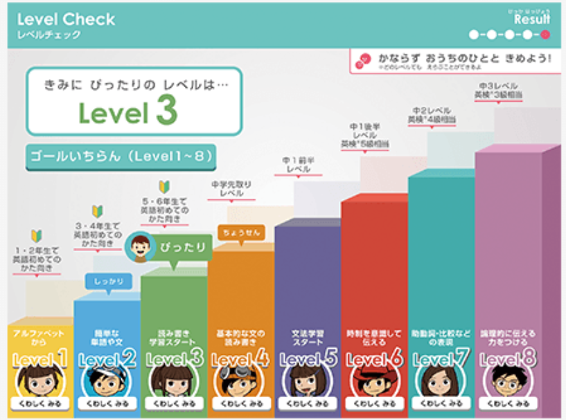

🐕

<strong>チャレンジイングリッシュ</strong>ってどんな教材？

チャレンジイングリッシュとは、**「小1～高3」までを対象**とした進研ゼミの英語学習サービスです。

今回は、そんなチャレンジイングリッシュの「料金・学習内容・良い評判・悪い評判」をまとめてお伝えします。

## チャレンジイングリッシュの料金は無料？

結論から言うと**チャレンジイングリッシュの料金は無料**で利用することができます。

ただし、利用できるのは、進研ゼミ会員の方のみです。

つまり、進研ゼミの会員費用は必ず必要になります。

進研ゼミの詳しい料金は別記事からどうぞ♪

[チャレンジタッチ【良い口コミ・悪い口コミ】を暴露！入会前にちょっと待ってください](https://xn--5ckip8c4fq970ahbya2o7acu2a.com/2021/06/28/%e9%80%b2%e7%a0%94%e3%82%bc%e3%83%9f-%e5%b0%8f%e5%ad%a6%e8%ac%9b%e5%ba%a7%e3%81%ae%e5%8f%a3%e3%82%b3%e3%83%9f%e8%a9%95%e5%88%a4%e5%ae%8c%e5%85%a8%e3%81%be%e3%81%a8%e3%82%81/)

チャレンジイングリッシュは<strong>2019年から</strong>無料になったんだ

実は、もともとチャレンジイングリッシュを受講する場合、2,040円の追加料金が必要でした。

しかし、2019年から進研ゼミを受講している人全てが無料で利用するこできるようになりました。

ただし、オンライン英会話は有料となります。

実際に外国人の先生とオンラインレッスンを希望する人は追加料金が掛ります。

オンラインレッスンは1回15分です。

料金は、1回990円となっています。

実際に講師と話を追加することができます。

### 進研ゼミの会員でなくても利用できる？

進研ゼミの会員でなくてもチャレンジイングリッシュを利用することは可能です。

ただし、進研ゼミの会員と違い料金が発生します。

|  | 小学生 （税込み） | 中学・高校生（税込み） |
| --- | --- | --- |
| 毎月払い  | 3,361円 |  5,500円 |
| 半年一括払い  | なし | 30,558円（5,093円/月） |
| 1年一括払い | 39,600円   （3,300円/月） | 49,980円（4,165円/月） |

チャレンジイングリッシュのみを受講したい方は以上の料金が必要です。

もし、英語以外にも勉強したい科目がある方は進研ゼミのチャレンジ（紙教材）またはチャレンジタッチ（タブレット教材）に入会するのがおすすめです。

特にチャレンジ（紙教材）の場合は、1科目から受講できるので、勉強したい科目の料金だけで一緒に英語の勉強をすることができますよ♪

### 専用タブレットがなくても利用できる？

チャレンジイングリッシュはタブレットを使って学習を進めていきます。

では、タブレットを使わないチャレンジ会員は利用できないかと言うとそうではありません。

専用タブレットが無い人でもパソコンやiPadから利用することができます。

もちろん正規のタブレットを購入することもできますが、特にこだわりがなければパソコンやiPadで利用することをお勧めします。

✅ **パソコンを使う場合**

|  | OS | ブラウザ |
| --- | --- | --- |
| Windows | Microsoft Windows 8.1/10 | Google Chrome 最新版 Microsoft Edge※ |
| **Mac** | ｍacOS 10.14～10.15、11 | Safari、Google Chrome最新版 |

✅ **タブレットを使う場合**

| iOS |  |
| --- | --- |
| OS | iPadOS13、14 |
| ブラウザ | Safari |

※専用タブレットなら「チャレンジパッド１～チャレンジパッド３」まで全てで利用できます。

### 1科目しか受講していない人でも利用できる？

進研ゼミのチャレンジ（紙教材）では、好きな教科を1科目から選択することができます。

仮に、1科目しか受講していなくても無料で受講できるのでしょうか？

結論から言うと、**進研ゼミの会員であれば1科目しか受講していない人でも料金無料で**自由に利用することができます。

進研ゼミの会員であればどんな人でも利用が可能となっています。

## チャレンジイングリッシュで実力はつく？

ここまでチャレンジイングリッシュについて調査してきました。

ただ、個人的に「チャレンジイングリッシュだけで実力はつくの？」という疑問も・・

そこで、チャレンジイングリッシュの口コミや評判を徹底的に調査して、本当に実力はつくのかを調べてみました。

### チャレンジイングリッシュ悪い口コミ

💬

\

💬

\

💬

\

このように悪い口コミでは、

・ネイティブな英語が身につかない ・日本語が多い

という声がありました。

では、良い口コミはどうでしょうか？

### チャレンジイングリッシュ良い口コミ

💬

\

💬

\

💬

\

💬

\

💬

\

良い口コミでは、

・楽しみながらできる ・実際に身になっていた ・実力にあった学習ができる

という口コミが見つかりました。

先ほどもお話したようにチャレンジイングリッシュは元々有料のサービスでした。

有料でも評判は良く、人気の高い教材だった完全に無料になったのは嬉しいですね♪

チャレンジイングリッシュは進研ゼミ小学講座に入会していれば無料で受けられます。

進研ゼミ小学講座の料金は、チャレンジイングリッシュを単体で受講するのとあまり変わりません。

英語以外も勉強したい人は、「チャレンジ」または「チャレンジタッチ」の受講がオススメです。

[申し込みは進研ゼミの公式サイトからどうぞ♪](https://ck.jp.ap.valuecommerce.com/servlet/referral?sid=3613518&pid=887407551)

## 実力に合わせてレベル1～12まで調節できる

チャレンジイングリッシュは、レベル1～12まであります。

個人の実力に合わせた学習で少しづつレベルUPすることができます。

|  | 学習内容 | おすすめの人 |
| --- | --- | --- |
| レベル１ | ・アルファベット ・挨拶や自己紹介 | ・小１～２年生 ・英語を始めて習う人 |
| レベル2 | ・簡単な質問に答える | ・小３～４年生 ・英語を初めて習う人 |
| レベル3 | ・簡単な質問をする ・道案内ができる | ・小５～６年生 |
| レベル4 | ・質問を考えてできる | ・中学先取りレベル |
| レベル5 | ・2文を読んで理解できる | ・中１前半レベル |
| レベル6 | ・（現在・過去・未来）についての表現ができる | ・中１後半レベル ・英検５級レベル |
| レベル7 | ・150時程度の文を読解 ・短い文章を書ける | ・中２レベル ・英検5~4級レベル |
| レベル8 | ・簡単な意見交換の会話ができる | ・中３レベル ・英検4~3級レベル |
| レベル9～12 | ・社会的な話題で意見交換ができる | ・高校レベル ・英検３～準１級レベル |

チャレンジタッチのタブレット（小学生用）では、レベル8までが受講できます。

しかし、レベル9以上になるとタブレットでは受講できなくなります。

その場合は、自宅でPCを用意する必要があります。

またレベル9以上を利用するには、会員専用窓口に電話しせん。

### 診断テストで正確にレベルを把握できる

チャレンジイングリッシュでは、レベルを選ぶ前に実力診断テストを受けられます。

このチェックテストにより、個人の実力をかなり正確に診断することができます。

ただ、このテストは時間がかかります。

普通に進めると、30分～1時間くらいかかるはずです。

しっかり時間をかけてやるテストとなっています。

そのため、**かなり正確なレベルを診断**することができます。

今まで全く英語を勉強したことがなく、始めるレベルを1からにしたい人は、テストを受けなくてもＯＫです。

タブレットに表示される「レベルチェックを受検しないでレベルを決める」を選んでください。

## チャレンジイングリッシュの進め方

チャレンジイングリッシュの進め方を３つのポイントにまとめました。

🐕

【レベル1・ステップ1】を例にして進め方を解説していくよ。

①ステップ1にある全29のレッスンをやり終える

②ステップアップテストを受ける

③テストに合格するとステップ2を受けられ

これをステップ12まで繰り返します。

最後の12ステップのテストに合格すると次のレベルに挑戦できるようになっています。

ステップテストは、全てのレッスンを終了する前に受けることも可能です。

始めたレベルが実力より下だった場合は、どんどんテストを受けて進めていくこともできるのは便利ですね。

この仕組みの良い点は、**分らないままどんどん進めない所**です。

全ての勉強がそうですが、基礎をおこたると難易度が上がった時ついて行けず、やる気低下に繋がります。

各レッスンで細かく区切られ、テストに合格しないと次に進めないのは確実に実力をつけるにはとても良い方法と言えます。

### 学習ボリュームはどれくらい？

チャレンジイングリッシュは1～12のレベルに分けられています。

それぞれのレベルの中に12のステップがあります。

さらに、1つのステップの中に20～35のレッスンが用意されています。

✅ **レベル1**

| **Step1** | **Step2** | ・・・ | **Step12** |
| --- | --- | --- | --- |
| Lesson1 | Lesson1 |  | Lesson1 |
| Lesson2 | Lesson2 |  | Lesson2 |
| ・ ・ | ・ ・ |  | ・ ・ |
| Lesson28 | Lesson28 |  | Lesson28 |
| Lesson29 | Lesson29 |  | Lesson29 |
| テスト | テスト | ・・・ | テスト （バッジが完成） |

つまりレベル1には、**300以上のレッスン**が用意されています。

それがレベル12まで続きます。

これはかなりのボリュームと言えますね。

### 1日の勉強量は？

学習ボリュームだけを見ると「毎日たくさん進めないとダメ？」と思ってしまいそうです。

しかし、公式サイトでは、1回5分のレッスンを1～2日に1度くらいが推奨されています。

焦って基礎をおろそかにするより、1つ1つを確実に終わられることが大切です。

もちろん、もっと頑張りたい人は自分のペースでどんどん進めることも可能です。

チャレンジイングリッシュは、進研ゼミの会員になれば無料で受けられます。

1科目しか受講していない人でも自由に受けることができますよ♪

[進研ゼミの公式サイトをチェックする](//ck.jp.ap.valuecommerce.com/servlet/referral?sid=3613518&pid=887407551)
