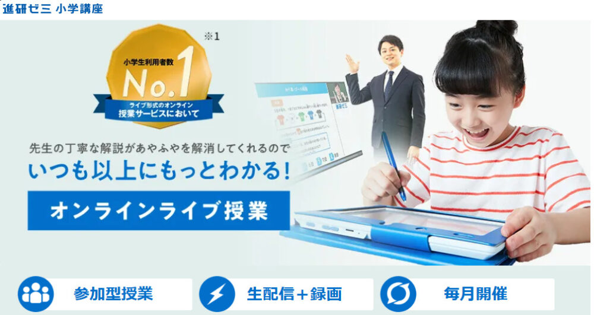
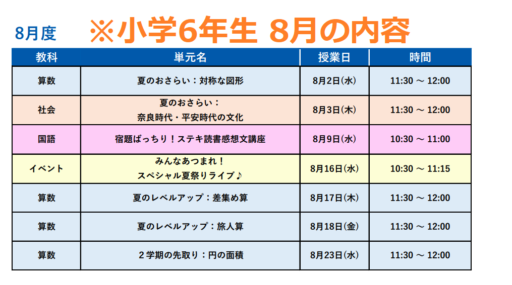
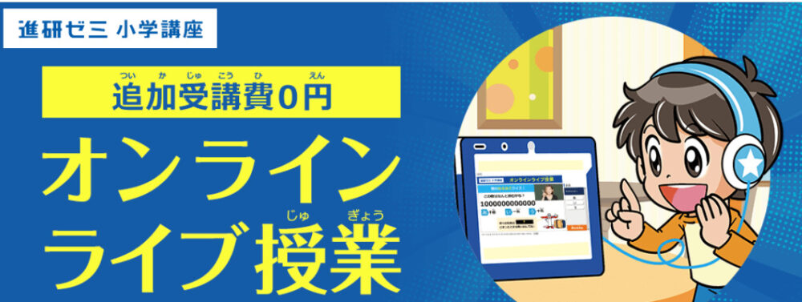
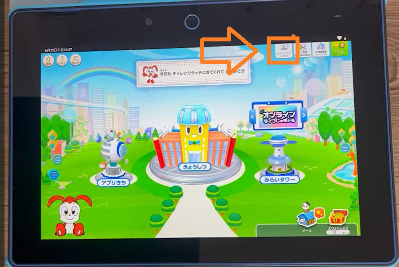
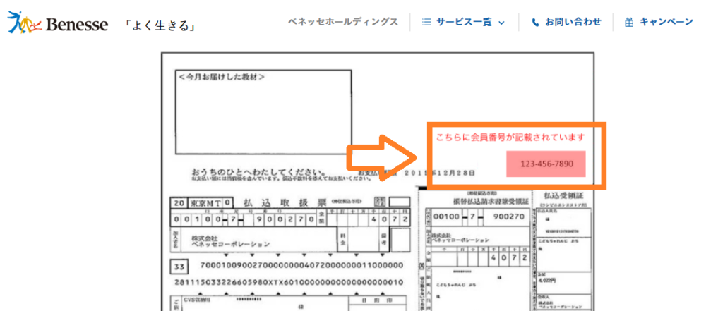
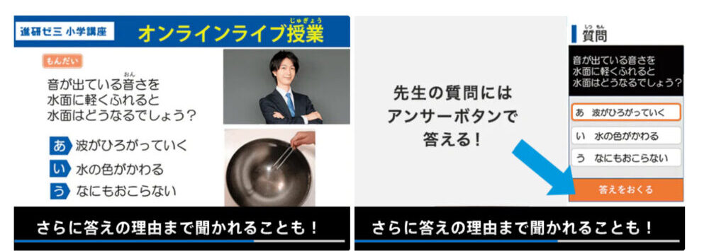
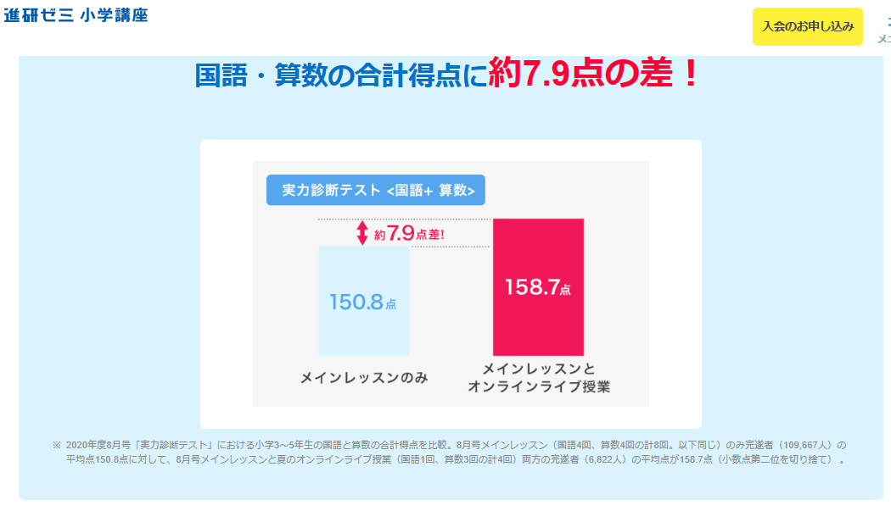
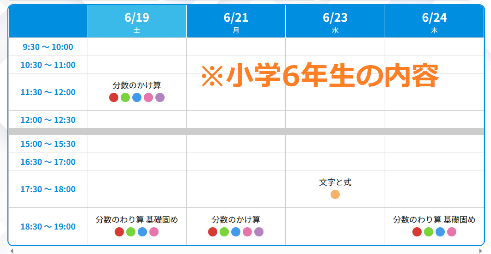
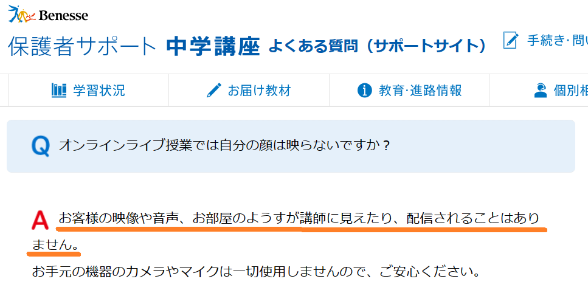
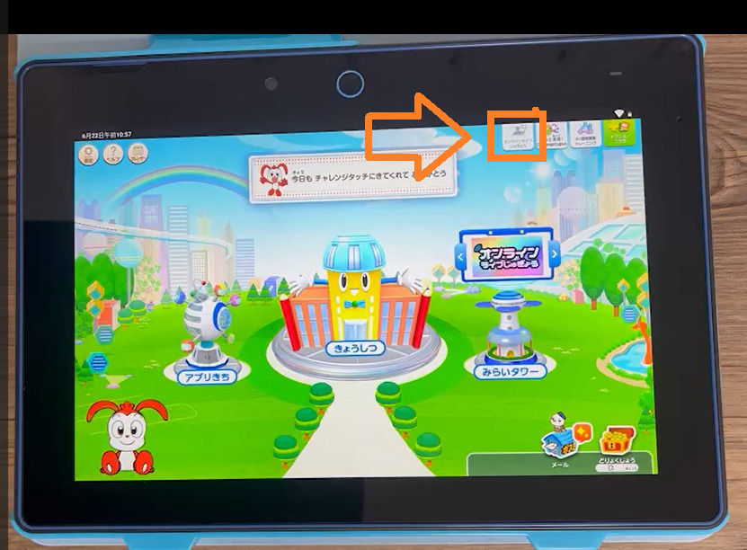

オンライン授業は、コロナの影響でいっきに主流になってきており、これから先の時代、ますます自宅で授業を受けるサービスは増えてくると予想されます。

今回紹介するのは、進研ゼミの「**チャレンジオンライン授業**」です。学校の授業だけでは理解しきれなかった内容を、自宅で一流の講師から補完することができます。

この記事では、チャレンジオンライン授業について詳しく知りたい親御さんや小、中学生、に向けた内容となっています。

この記事を最後までお読みいただくことで、「チャレンジオンライン授業とはどのようなサービスなのか」、「具体的にどのような授業を受けることができるのか」など、チャレンジオンライン授業に関する全ての疑問が解消されることでしょう。ぜひ最後までご覧ください。

## チャレンジオンライン授業ってどんなサービス？

チャレンジオンライン授業は、進研ゼミが開催している**参加自由**型の授業です。進研ゼミの会員であれば誰でも参加することができます。

チャレンジタブレットをはじめとするPC、タブレット、スマートフォンなどのデバイスを使用して、生**徒は自宅で授業を受けることができます**。

毎月、**算数の内容が中心に扱われ**、「基礎」から「挑戦」までのレベルの授業が提供されます。

夏休みの期間には、算数以外の科目や、複数の科目を組み合わせたイベントも開催される予定です。さらに、3年生以上の生徒に対しては、チャレンジタブレットの効果的な使い方についての「学習方法ガイダンス」も提供されます。

<iframe title="【小６向け】オンラインライブ授業_算数（録画）" src="https://www.youtube.com/embed/ubrM_53mprI" width="625" height="468" frameborder="0" allowfullscreen="allowfullscreen"></iframe>

[今すぐ進研ゼミ公式サイトに入会する（小学講座）](//ck.jp.ap.valuecommerce.com/servlet/referral?sid=3613518&pid=887679902)

[今すぐ進研ゼミ公式サイトから入会する（中学講座）](//ck.jp.ap.valuecommerce.com/servlet/referral?sid=3613518&pid=887697614)

### チャレンジオンライン授業は算数が中心？

チャレンジオンライン授業は、**算数**を中心に授業が行なわれます。

例えば、小学6年生の8月場合、7回行なわれる授業の内、4回が算数の授業になります。

もちろん社会や国語などの教科もありますが、1年生～6年生場合どの学年であっても6割～8割は算数の授業となります。

ただ、**中学1年生～3年生**になると、国、数、理、社、英がほとんど同じ割合で授業が行われます。

[今すぐ進研ゼミ公式サイトに入会する（小学講座）](//ck.jp.ap.valuecommerce.com/servlet/referral?sid=3613518&pid=887679902)

[今すぐ進研ゼミ公式サイトから入会する（中学講座）](//ck.jp.ap.valuecommerce.com/servlet/referral?sid=3613518&pid=887697614)

### チャレンジオンライン授業は料金無料で受講できる

チャレンジオンライン授業は進研ゼミに入会している人であれば**追加料金無料**で自由に受講することができます。

また、オンライン授業専用の教材などもないため、何かを追加で購入する必要もありません。

進研ゼミでは、オンラインライブ授業以外にも無料で受けられるサービスたいくつかあります。

進研ゼミ無料で使えるサービス一覧

- [チャレンジイングリッシュ（小１～高３レベルが使い放題）](https://xn--5ckip8c4fq970ahbya2o7acu2a.com/2022/03/28/%e3%83%81%e3%83%a3%e3%83%ac%e3%83%b3%e3%82%b8%e3%82%a4%e3%83%b3%e3%82%b0%e3%83%aa%e3%83%83%e3%82%b7%e3%83%a5%e3%81%ae%e6%96%99%e9%87%91%e3%81%af%e7%84%a1%e6%96%99%ef%bc%81%ef%bc%9f%e3%80%8c%e5%88%a9/)
- [プログラミング（基礎）](https://xn--5ckip8c4fq970ahbya2o7acu2a.com/2022/03/08/%e9%80%b2%e7%a0%94%e3%82%bc%e3%83%9f%e3%83%81%e3%83%a3%e3%83%ac%e3%83%b3%e3%82%b8%e3%82%bf%e3%83%83%e3%83%81%e3%80%8c%e5%b0%8f%ef%bc%91%ef%bd%9e%e5%b0%8f%ef%bc%96%e3%80%8d%e3%81%ae%e3%83%97%e3%83%ad/)
- [努力賞ポイント景品交換](https://xn--5ckip8c4fq970ahbya2o7acu2a.com/2023/07/10/%e3%83%81%e3%83%a3%e3%83%ac%e3%83%b3%e3%82%b8%e3%82%bf%e3%83%83%e3%83%81%e5%8a%aa%e5%8a%9b%e8%b3%9e%e3%83%9d%e3%82%a4%e3%83%b3%e3%83%88%ef%bc%81%e8%b2%b0%e3%81%88%e3%82%8b%e5%95%86%e5%93%81%e3%81%af/)
- [まなびライブラリー（1000冊の本が読み放題）](https://xn--5ckip8c4fq970ahbya2o7acu2a.com/2023/07/18/%e3%83%81%e3%83%a3%e3%83%ac%e3%83%b3%e3%82%b8%e3%82%bf%e3%83%83%e3%83%81%e3%81%ae%e6%9c%ac%e8%aa%ad%e3%81%bf%e6%94%be%e9%a1%8c%e3%82%b5%e3%83%bc%e3%83%93%e3%82%b9%e3%81%a8%e3%81%af%ef%bc%9f%e9%80%b2/)
- [実力診断テスト](https://xn--5ckip8c4fq970ahbya2o7acu2a.com/2023/06/09/%e3%83%81%e3%83%a3%e3%83%ac%e3%83%b3%e3%82%b8%e5%ae%9f%e5%8a%9b%e8%a8%ba%e6%96%ad%e3%81%af%e3%80%8c%e5%b0%8f1%ef%bd%9e%e5%b0%8f6%e3%80%8d%e3%81%a7%e5%86%85%e5%ae%b9%e3%81%8c%e9%81%95%e3%81%86%ef%bc%9f/)

それぞれ別記事で詳しく解説しています。

### チャレンジ（紙教材）コースでも利用できる？

チャレンジオンライン授業は、進研ゼミのチャレンジ（紙教材）コースを選択している人でも利用することが可能です。

スマホ、パソコン、タブレットのいずれかをお持ちであれば授業に参加することができます。

[チャレンジとチャレンジタッチの違い](https://xn--5ckip8c4fq970ahbya2o7acu2a.com/2022/02/12/%e3%83%81%e3%83%a3%e3%83%ac%e3%83%b3%e3%82%b8%e3%82%bf%e3%83%83%e3%83%81%e3%81%a8%e3%83%81%e3%83%a3%e3%83%ac%e3%83%b3%e3%82%b8%e9%81%b8%e3%81%b6%e3%81%aa%e3%82%89%e3%81%a9%e3%81%a3%e3%81%a1%ef%bc%9f/)が分からない方は別記事で詳しく解説しています。

### チャレンジオンライン授業は小1～中3まで視聴可能

チャレンジオンライン授業は、小学1年生から中学3年生までの進研ゼミ会員ならば誰でも自由に参加できる授業です。

学年によってオンライン授業の内容や日程は異なります。毎月18日から24日までに、算数の重要なポイントを詳しく説明する授業が開催されます。

さらに、夏休みなどの長期休暇中には、短期集中レビューやレベルアップを目指す特別授業も企画されます。また、学習の進行が混乱しやすい時期には、「学習法ガイダンス」のサポートも提供されます。

### チャレンジオンライン授業のレベルは？

授業は「基礎」レベルと「挑戦」レベルがあります。

**基礎レベルでは**、学校の授業で学んだ基本的な内容を確認し、理解を深めることが目的です。

**挑戦レベルでは**、より高度な内容や応用問題に取り組むことができます。これにより、学生は自分の理解度に応じて適切なレベルの授業を受けることができます​。

🐕

「小学1～2年生」と「小学３～6年生」では授業をする目的が違うんだ

| 【1・2年生】授業の目的 |
| --- |
| 教科の枠を超えて、与えられた問題について「**なぜ？どうして？**」と試行錯誤しながら、きまりや解き方を見つけていく授業を実施されます。  先生の問いかけに答えることで、自分で考える楽しさを発見。「思考力」を育み、この先のさまざまな学びにつなげます。 |

| 【3～6年生】授業の目的 |
| --- |
|   教科書の種類に応じて、重要な単元を学習内容に合わせて深く理解することが可能です。難易度の高い単元でも、教師が優しく、分かりやすく説明するため、学生は苦手な箇所を残さず、**主要なポイントをしっかりと把握**することができます。  長期休暇では、前学期の苦手な箇所を集中的に克服。難しい問題にも積極的に挑戦して、レベルアップを目指します。               |

### チャレンジオンラインの1回の授業時間は？

チャレンジオンラインの授業時間は小学生が集中力を保つのに適切な時間である、20分～30分で構成されています。

小学1年生～2年生：1回20分

小学3年生～6年生：1回30分

授業の進め方は工夫されており、初めにオンラインライブ授業を通じて先生の説明を聞き、理解を深めます。

次に、チャレンジタッチのレッスン動画で問題解決能力を育てていき、最後に「赤ペン先生の問題」で学んだ内容を確認します。これにより、解説から問題解決までを**効率的に学べる**ようになっています。

### チャレンジオンライン授業は何度も動画を見返せる

進研ゼミ小学講座のオンラインライブ授業は録画され、配信日から**約1週間程度で****視聴可能**となります。

オンライン授業で分からない部分があった場合は、何度でも見返し勉強しなおすことができます。

[今すぐ進研ゼミ公式サイトに入会する（小学講座）](//ck.jp.ap.valuecommerce.com/servlet/referral?sid=3613518&pid=887679902)

[今すぐ進研ゼミ公式サイトから入会する（中学講座）](//ck.jp.ap.valuecommerce.com/servlet/referral?sid=3613518&pid=887697614)

## チャレンジオンライン授業への入り方手順

チャレンジオンライン授業に参加する際、チャレンジタッチ（タブレットコース）とチャレンジ（紙教材コース）では、視聴する手順が違うためそれぞれの方法を解説していきます。

### チャレンジタッチで視聴する場合

チャレンジタッチをお持ちの場合は、電源を入れて画面右上の「**チャレンジライブじゅぎょう**」をタップします。

チャレンジタッチライブ授業が始まるの15分前くらいには参加準備ができるようになりますよ。

### チャレンジ（紙教材コース）で視聴する場合

チャレンジ（紙教材）コースの方が視聴する場合は、お持ちのスマホ、パソコンからログインしていきます。

1. 会員サイトにログインする
2. 「チャレンジウェブ」をタップ
3. 「会員のかた」をタップ
4. 「オンラインライブ授業」のバナーをタップ

参加授業日の授業開始時刻に、「授業入口ページ」より参加することができます。

### チャレンジオンライン授業を視聴するにはIDとパスワードが必要

ライブに参加するには**IDとパスワードが必ず必要**になります。IDとパスワードは入会時に届けられた「商品内に同封されているシート」の右上に記載されています。

[今すぐ進研ゼミ公式サイトに入会する（小学講座）](//ck.jp.ap.valuecommerce.com/servlet/referral?sid=3613518&pid=887679902)

[今すぐ進研ゼミ公式サイトから入会する（中学講座）](//ck.jp.ap.valuecommerce.com/servlet/referral?sid=3613518&pid=887697614)

## チャレンジオンライン授業：メリット3選

次にチャレンジオンライン授業を調査して分かったメリットを3つ紹介します。

チャレンジオンライン授業のメリット3選

- 一流の講師の授業が0円で受けられる
- みんなで楽しみながら勉強を進められる
- 授業に参加した子供のテストの平均点数がUPした

### メリット1：一流の講師の授業が0円で受けられる

チャレンジオンラインで授業をする先生は、**一流の講師のみ**が集められています。

「どこで手が止まりやすいのか？」「苦手になっているポイントはどこなのか？」を徹底的に研究し熟知したベテラン講師ががテスト前や長期休みなどに合わせて、ここさえつかめれば、一気に理解が進む要点に絞り解説していきます。

さらに、各授業は毎回録画されているため、**子供たちは自分のペースで何度でも復習することが可能**です。つまり、理解が浅かった部分や再度学習したい箇所について、自由に見直し、理解を深めることができます。

こうした取り組み全体を通じて、チャレンジオンラインの授業は生徒の学習効果を最大化し、より高い学習成果を実現します。

### メリット2：みんなで楽しみながら勉強を進められる

チャレンジオンライン授業はただ授業を聞いているだけではありません。参加者は、授業で問われた問題に対して選択式で回答をしていきます。

コメントで質問しながら授業が受けられる授業中の出題にはクイズ番組の「回答ボタン」のような「アンサーボタン」で自分の回答を送信することができます。

一方通行の先生の話を聞くだけの授業ではなく、自ら考えて回答することができるので、集中力が続きます。

### メリット3：授業に参加した子供のテストの平均点数がUPした

2020年年8月に行った[進研ゼミ実力診断テスト](https://xn--5ckip8c4fq970ahbya2o7acu2a.com/2023/06/09/%e3%83%81%e3%83%a3%e3%83%ac%e3%83%b3%e3%82%b8%e5%ae%9f%e5%8a%9b%e8%a8%ba%e6%96%ad%e3%81%af%e3%80%8c%e5%b0%8f1%ef%bd%9e%e5%b0%8f6%e3%80%8d%e3%81%a7%e5%86%85%e5%ae%b9%e3%81%8c%e9%81%95%e3%81%86%ef%bc%9f/)の報告によると、チャレンジオンライン授業に参加している子供は、参加していない子供に比べて約8点高かったという結果が出ています。

つまり、メインレッスンだけでなく、オンラインのライブ授業もしっかり受けることで、テストの合計得点がUPするということが分かります。

[今すぐ進研ゼミ公式サイトに入会する（小学講座）](//ck.jp.ap.valuecommerce.com/servlet/referral?sid=3613518&pid=887679902)

[今すぐ進研ゼミ公式サイトから入会する（中学講座）](//ck.jp.ap.valuecommerce.com/servlet/referral?sid=3613518&pid=887697614)

## チャレンジオンライン授業：デメリット2選

次にチャレンジオンライン授業を調査して見つかったデメリットを2つ紹介します。

チャレンジオンライン授業のデメリット2選

- 授業の内容が子供に合っていない可能性がある
- チャレンジオンライン授業は時間が固定されている

### デメリット1：授業の内容が子供に合ってない可能性がある

チャレンジオンライン授業の内容は苦手になりやすいテーマや分野の授業が行なわれます。

しかし、苦手な部分は人によって違うため、**授業のテーマが子供に合わない**ことも十分予想されます。必ずしも受けたい授業の内容であるとは言えません。

### デメリット2：チャレンジオンライン授業は時間が固定されている

チャレンジオンラインの授業は配信される時間が決まっています。

そのため、配信時間中に**塾やクラブ活動などの予定がある**子は授業に参加するのは難しいかもしれません。

※配信の時間に間に合わなかった場合は、録画された内容が配信されるので、そちらを視聴することもできますよ。

## チャレンジオンライン授業に関するＱ＆Ａ

最後にチャレンジオンライン授業に関するよくある質問をまとめました。

### チャレンジオンライン授業では顔出し・声出しはする？

チャレンジオンライン授業では、顔出しや声出しをすることはありません。

### チャレンジオンライン授業で予約は必要？

チャレンジオンライン授業に参加する際に予約は必要ありません。

オンライン授業が始まる時間になったら先ほど説明した「[チャレンジオンライン授業を視聴する手順](#Form1)」に沿って授業に参加しましょう。

ただし、チャレンジオンライン授業は開催されてる日にちが決まっているので、予め確認しておく必要があります。

### チャレンジオンライン授業の日程を確認しよう

チャレンジオンライン授業は学年によって開催される日にちは決まっています。

受講する際は、よく確認しておきましょう。配信予定日は、進研ゼミの**公式サイトより**確認することができますよ。

[チャレンジオンライン授業のスケジュール表](https://sgaku.benesse.ne.jp/sho/all/others/online/?ui_inf_rou=organic&admane_xuid=376,0,1940,xuid1x8885d40ef0x615)

チャレンジタッチをお持ちであれば画面右上の「オンラインライブじゅぎょう」から確認することができます

[今すぐ進研ゼミ公式サイトに入会する（小学講座）](//ck.jp.ap.valuecommerce.com/servlet/referral?sid=3613518&pid=887679902)

[今すぐ進研ゼミ公式サイトから入会する（中学講座）](//ck.jp.ap.valuecommerce.com/servlet/referral?sid=3613518&pid=887697614)
