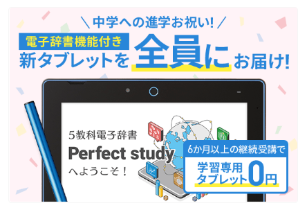
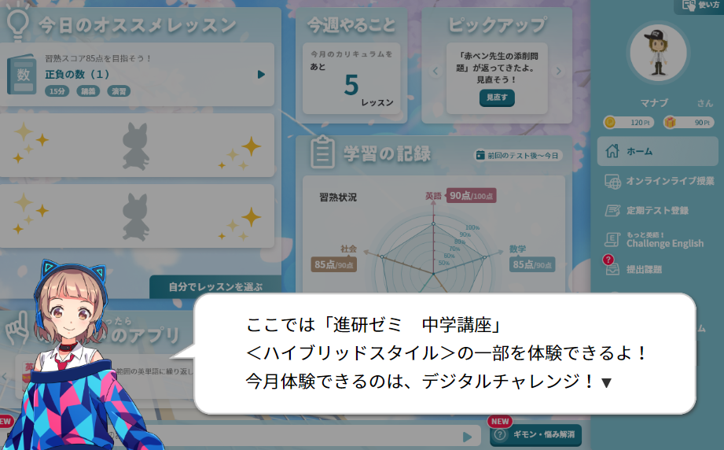
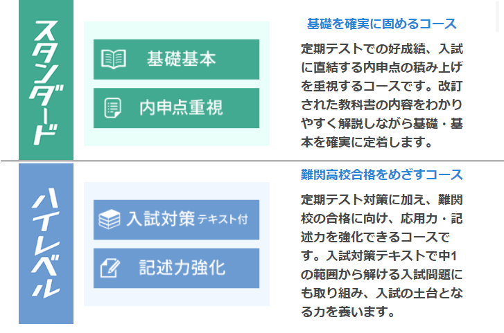
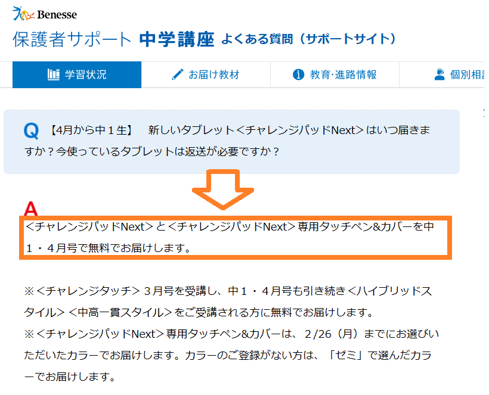
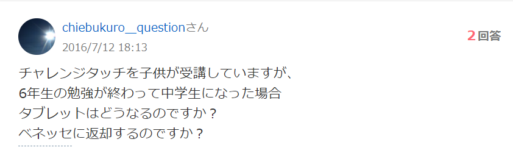
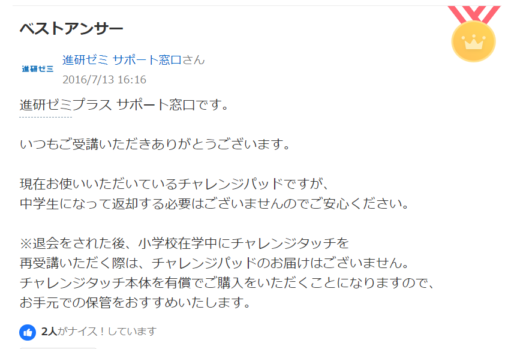

チャレンジタッチは中学生になったら勉強の進め方や学習スタイルが大きく変わります。

小学生の頃はゲーム要素が多く、楽しんで勉強を進めるスタイルでしたが、 中学生になると**「定期テスト」**や**「高校受験」**を見据えたより実践的な学習へとシフトしていきます。

また、「料金」や「問題のレベル」にも変化があります。 「中学でもこのまま続けて大丈夫？」「タブレットはどうなるの？」という疑問を、徹底解説していきます。

貰えるタブレットについてすぐに知りたい方は[ここからスキップ](#Form1)してね♪

 進研ゼミで中学受験を考えている方は[こちら](https://xn--5ckip8c4fq970ahbya2o7acu2a.com/2022/04/20/%e9%80%b2%e7%a0%94%e3%82%bc%e3%83%9f%e3%83%81%e3%83%a3%e3%83%ac%e3%83%b3%e3%82%b8%e3%82%bf%e3%83%83%e3%83%81%e3%81%ae%e3%81%bf%e3%81%a7%e4%b8%ad%e5%ad%a6%e5%8f%97%e9%a8%93%e3%81%af%e9%9b%a3%e3%81%97/)を参考にしてください。

## チャレンジタッチは中学生になると何が変わる？「遊び」から「テスト対策」へ

小学生の時とは、勉強のやり方がガラッと変わるんだね♪

チャレンジタッチ（進研ゼミ）は「小学生→中学生」になると勉強の進め方がガラリと変わります。

### ゲーム要素は減少！授業動画と定期テスト対策がメインに

小学生講座では、ゲーム要素が強く「楽しみながら勉強をする」スタイルでしたよね。

一方で、中学講座になるとゲーム要素は減り、プロ講師による講義動画や、アニメーションを使った丁寧な解説で**「理解する」**ことに重点が置かれるようになります。

中学生になると定期テストがあるので、小学講座と比べてテスト対策に特化した勉強の進め方をしていきます。 難しい問題でも基礎から丁寧に解説されているので、勉強に苦手意識のある子でも続けやすい設計です。

### 1回の学習時間は15分？部活と両立できるスキマ学習設計

部活や塾で忙しくなる中学生にとって、時間は貴重です。 中学講座の1回あたりの学習時間は**「約15分」**に設計されています。

ここがポイント！

小学４～6年生の1日の学習量の目安は「15分×2回（約30分）」でしたが、 中学講座では**「1回15分」を積み重ねるスタイル**です。

忙しい平日は1回だけ、週末にまとめてやる、といった調整がしやすいため、 部活との両立も可能です。

### 親の関わり方はどう変わる？「丸付け」から「見守り」へ

小学生の頃は「丸付け」や「進捗管理」を親御さんがすることも多かったかもしれません。

しかし、中学生向けタブレット学習（ハイブリッドスタイル）では、その役割が変化します。

- **自動採点と解説：** その場ですぐに自動採点され、解説動画が見られるため、親の丸付けは不要です。
- **AIによる進捗管理：** 学習計画をAIが自動で作成・修正してくれるため、親が細かく管理する必要がなくなります。

保護者の方は「教える」のではなく、つかず離れずの距離で**「見守る」**スタンスに移行できるのが大きなメリットです。

資料請求でお試し教材やパンフレットが貰えます。 資料請求は公式サイトから無料でできますよ♪

**＼5分で完了／**[中学講座のお試し教材をもらう](//ck.jp.ap.valuecommerce.com/servlet/referral?sid=3613518&pid=887775842)

[✅ 今すぐ進研ゼミ公式サイトに入会する（小学講座）](//ck.jp.ap.valuecommerce.com/servlet/referral?sid=3613518&pid=887679902)

[✅ 今すぐ進研ゼミ公式サイトから入会する（中学講座）](//ck.jp.ap.valuecommerce.com/servlet/referral?sid=3613518&pid=887697614)

## 【料金比較】中学講座になると受講費はどれくらい上がる？

進研ゼミ小学講座から中学講座になると料金はどれくらい変わるのでしょう？

「高くなるのでは？」と心配される方も多いですが、塾に通う費用と比較すると圧倒的に抑えられます。

### 小6と中1～中3の料金差額シミュレーション

今回は小6と「中1～中3」の料金を比較してみました。 （※料金は支払い方法や年度により異なりますが、目安としてご覧ください）

| 学年 | 一括払い（月あたり換算） | 小6との差額（月あたり） |
| --- | --- | --- |
| 小6 | 約 5,830円 | ー |
| 中1 | 約 6,570円 | +740円 |
| 中2 | 約 6,680円 | +850円 |
| 中3 | 約 6,890円 | +1,060円 |

※上記は過去の料金例に基づく概算です。最新の受講費（2025年度など）では、 中1ハイブリッドスタイル・12ヶ月一括払いで月あたり6,990円～となっています。

🐕

塾に行くと月2～3万円かかることもあるから、それに比べるとかなりお得だね♪

このように、学年が上がっても月々数百円～1,000円程度のアップにとどまります。

塾に行くと月2～3万円かかることも珍しくないため、かなり安い金額と言えます。

## 中学生からのレベル選択！「スタンダード」と「ハイレベル」の選び方

中学生になると、志望校や実力に合わせてコース（レベル）を選択できるようになります。

「いきなり難しくなるの？」と不安かもしれませんが、自分に合ったレベルを選べば大丈夫です。

### 基礎固めの「スタンダードコース」はこんな人におすすめ

結論から言うと、中学講座に進んだからといって、いきなり問題のレベルが跳ね上がることはありません。

まずは「スタンダードコース」が基本となります。

スタンダードコースの特徴

- 定期テストでの好成績を目指す
- 教科書の内容を確実に理解し、基礎を固める
- 標準的な公立・私立高校を目指す

入会者の**約70％**がこのスタンダードコースを選択しています。 「まずは授業についていけるようにしたい」「定期テストで平均点以上を取りたい」という場合はこちらを選びましょう。

### 難関校狙いの「ハイレベルコース」はいつから始める？

難関校の合格を目指すなら「ハイレベルコース」が用意されています。

ハイレベルコースの特徴

- 定期テスト対策に加え、応用力・記述力を強化する
- 中1の段階から入試を意識した問題に取り組む
- 難関公立・私立高校を目指す

ただし、問題のレベルが高いため、基礎が身についていない段階で選ぶと挫折してしまう可能性があります。

コース変更はいつでも無料でできるので、迷っている場合は**「スタンダード」から始めて、物足りなくなったら「ハイレベル」へ変更する**のが失敗しないコツです。

## 【重要】中学生になると新しいタブレット「チャレンジパッドNext」が無料でもらえる！

🐕

中学生からは、機能がアップした新しいタブレットが届くんだよ♪

小学生から中学生に進むと、今使っているタブレットではなく、新しいタブレット（チャレンジパッドNext）が送られてきます。

### なぜ新しいタブレットが届くの？旧端末が使えない理由

「今のタブレット（チャレンジパッド2や3）をそのまま使えないの？」と思うかもしれませんが、中学講座のハイブリッドスタイルでは使えません。

中学講座のアプリや動画講義は高機能になっており、古いタブレットではスペックが足りず動かせないためです。

その代わり、中学講座では高性能な「チャレンジパッドNext」と専用タッチペン＆カバーが4月号（または入会時）に届けられます。

書き心地が「紙」に近くなり、手をついて書けるようになるなど、学習効率が大幅にアップしています。

[チャレンジパッドnextについてはこちら](https://xn--5ckip8c4fq970ahbya2o7acu2a.com/2023/06/19/%e3%83%81%e3%83%a3%e3%83%ac%e3%83%b3%e3%82%b8%e3%83%91%e3%83%83%e3%83%89next%ef%bc%88%e3%83%8d%e3%82%af%e3%82%b9%e3%83%88%ef%bc%89%e3%81%a3%e3%81%a6%e3%81%a9%e3%82%93%e3%81%aa%e3%82%bf%e3%83%96/)

### 受け取り条件は？「6ヶ月継続」の縛りに注意

この新しいタブレットは、進研ゼミ中学講座を**6ヶ月以上継続**して受講すれば、代金は0円（無料）になります。

注意点

受講6ヶ月未満で退会、または学習スタイルを「オリジナル（紙）」に変更してしまった場合、タブレット代金（8,300円など）が請求されることがあるので注意が必要です。

※「チャレンジパッドNext」の定価は39,800円ですが、継続利用することで実質無料になる仕組みです。

また、万が一タブレットを破損してしまった場合に備え、安価で交換できる「チャレンジパッドサポートサービス」も用意されています。

心配な方は加入しておくと安心です。

[中学講座に入会してチャレンジパッドNextをもらう](//ck.jp.ap.valuecommerce.com/servlet/referral?sid=3613518&pid=887678571)

## 使い終わった小学生用タブレットは返却不要！賢い使い道と処分方法

では、今まで使っていた小学生用の「チャレンジパッド」はどうすればいいのでしょうか？

### 公式回答「返却の必要なし」！兄弟へのお下がりは可能？

結論から言うと、タブレットの返却は必要ありません。

進研ゼミサポート窓口の回答でも、以下のように明確に案内されています。

そのまま手元に残りますが、兄弟へのお下がり（学習用としての再利用）はできません。 進研ゼミのタブレットは契約者本人専用の仕様になっており、 一度登録すると他の兄弟のアカウントでは使えないからです。

▶ [チャレンジタッチのお下がりは兄弟で使い回しできる？](https://xn--5ckip8c4fq970ahbya2o7acu2a.com/2022/02/19/%e3%82%b9%e3%83%9e%e3%82%a4%e3%83%ab%e3%82%bc%e3%83%9f%e3%83%bb%e3%83%81%e3%83%a3%e3%83%ac%e3%83%b3%e3%82%b8%e3%82%bf%e3%83%83%e3%83%81%e3%81%af%e5%85%84%e5%bc%9f%e3%81%ae%e3%81%8a%e4%b8%8b%e3%81%8c/)

ただし、タブレット内にダウンロード済みの過去の講座（小6までの内容）は、 卒業後もしばらく閲覧できる場合があります（※期限あり）。 復習用としてしばらく保管しておくのがおすすめです。

### 【自己責任】Android化してYouTube専用機にする方法とリスク

「勉強に使えないなら……」と考えるのが、改造して普通のAndroidタブレットとして使う方法です。

ネット上には「改造してYouTubeやSNSを見る」方法が出回っていますが、 これはメーカーの保証対象外となり、自己責任での作業になります。

失敗すると全く動かなくなるリスクもあるため、基本的には推奨されません。

改造を考えている方は、リスクを十分に理解するために以下の記事も参考にしてください。

▶ [チャレンジタッチをAndroid化する注意点5つ](https://xn--5ckip8c4fq970ahbya2o7acu2a.com/2022/04/30/%e3%83%81%e3%83%a3%e3%83%ac%e3%83%b3%e3%82%b8%e3%82%bf%e3%83%83%e3%83%81%e3%81%ae%e6%94%b9%e9%80%a0%e3%81%af%e5%8d%b1%e9%99%ba%ef%bc%9fandroid%e5%8c%96%e3%81%ae%e3%83%aa%e3%82%b9%e3%82%af%ef%bc%95/)

### もう使わない場合の正しい処分方法（リサイクル・廃棄）

「もう家にあっても邪魔なだけ」という場合は、正しく処分しましょう。

タブレットは「燃えるゴミ」では捨てられません。リチウムイオン電池が含まれているため、 以下の方法で処分してください。

- **自治体の回収ボックス：** 市役所や公共施設にある「小型家電回収ボックス」に入れる。
- **家電量販店の回収：** 多くの家電量販店で小型家電のリサイクル回収を行っています。

処分する際は、必ず**「初期化（工場出荷状態に戻す）」**をして、個人情報を消去することを忘れないでくださいね。

## 中学講座への切り替え・継続に手続きは必要？

### そのまま継続なら「手続き不要」で自動更新

現在、小学講座を受講中で、そのまま中学講座の「ハイブリッドスタイル（またはオリジナルスタイル）」を続ける場合は、切り替えの手続きは必要ありません。

自動的に中学講座へ移行され、新しい教材やタブレットが届くようになります。

### 中高一貫校に通う場合のみ手続きが必要

ただし、進学先が中高一貫校の場合で、「進研ゼミ中学講座 中高一貫スタイル」を受講したい場合は、コース変更の手続きが必要です。

学校の進度が速い中高一貫校専用のカリキュラムになるため、通常の公立中学向け講座とは内容が異なります。

切り替えの手続きは、会員専用サイト（Web）または電話から簡単に行えます。

[切り替え手続きはこちらのサイト](https://www.benesse.co.jp/zemi/member/common/tel.html)からどうぞ♪

## まとめ：チャレンジタッチは中学生の「忙しさ」をカバーする最強ツール

中学生になると部活や学校行事で一気に忙しくなります。

「塾に行く時間がない」「送迎が大変」というご家庭にとって、1日15分から自宅でテスト対策ができるチャレンジタッチは、最強のパートナーになるはずです。

まとめ

- **料金：** 塾より圧倒的に安い
- **教材：** 新タブレットで動画授業＆AI学習が見放題
- **リスク：** 6ヶ月続ければタブレット代は無料

**＼5分で完了／**[中学講座のお試し教材をもらう](//ck.jp.ap.valuecommerce.com/servlet/referral?sid=3613518&pid=887775842) [✅ 今すぐ進研ゼミ公式サイトに入会する（小学講座）](//ck.jp.ap.valuecommerce.com/servlet/referral?sid=3613518&pid=887679902)

[✅ 今すぐ進研ゼミ公式サイトから入会する（中学講座）](//ck.jp.ap.valuecommerce.com/servlet/referral?sid=3613518&pid=887697614)
