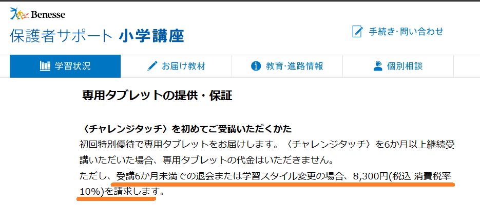
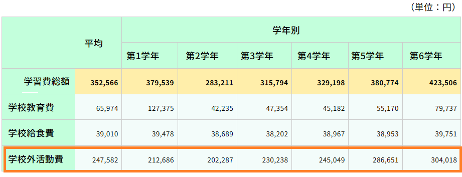

今回**はチャレンジタッチ**の「小学1年生～小学6年生」の**料金**についてまとめました。

チャレンジタッチでは、受講する学年や支払いの方法によって、1年間の総額が変わります。

何も知らないまま入会をしてしまうと、支払い方法で損をしてしまうかもしれません。

この記事を最後まで読む事で、月額料金、タブレット料金、だけでなく、一番お得な支払い方法まで分かるようになります。

入会を考えている方は、ぜひ最後までご覧下さい♪

https://xn--5ckip8c4fq970ahbya2o7acu2a.com/2024/10/17/%e3%80%902024%e5%b9%b410%e6%9c%88%e6%9c%80%e6%96%b0%e3%80%91%e9%80%b2%e7%a0%94%e3%82%bc%e3%83%9f%e3%82%ad%e3%83%a3%e3%83%b3%e3%83%9a%e3%83%bc%e3%83%b3%e7%89%b9%e5%85%b8%e4%b8%80%e8%a6%a7%ef%bc%81/

## 進研ゼミチャレンジタッチの料金（小学講座）

進研ゼミチャレンジタッチの料金は、受講する学年や、料金の支払い回数によっても変わってきます。

チャレンジタッチ料金一覧

| **学年** | **毎月払い** | **半年払い (月々)** | **一年払い (月々)** |
| --- | --- | --- | --- |
| **小学1年生** | 3,930円 | 3,530円 | 3,180円 |
| **小学2年生** | 3,930円 | 3,530円 | 3,180円 |
| **小学3年生** | 4,490円 | 4,200円 | 3,740円 |
| **小学4年生** | 5,080円 | 4,880円 | 4,530円 |
| **小学5年生** | 6,080円 | 5,850円 | 5,420円 |
| **小学6年生** | 6,540円 | 6,290円 | 5,830円 |

チャレンジタッチ料金1年間の合計支払い金額

| **学年** | **毎月払い** | **半年払い (合計)** | **一年払い (合計)** |
| --- | --- | --- | --- |
| **小学1年生** | 47,160円 | 42,360円 | 38,160円 |
| **小学2年生** | 47,160円 | 42,360円 | 38,160円 |
| **小学3年生** | 53,880円 | 50,400円 | 44,880円 |
| **小学4年生** | 60,960円 | 58,560円 | 54,360円 |
| **小学5年生** | 72,960円 | 70,200円 | 65,040円 |
| **小学6年生** |  78,480円 | 75,480円 | 69,960円 |

「毎月払い」と「1年払い」では、1年間のトータルで支払う総額の料金はかなり変わります。

実際に計算するとその差は・・・

（毎月払い総額）ー（1年払い総額）＝（1年間の料金の差）

- 小学1年生：9,000円お得
- 小学2年生：9,000円お得
- 小学3年生：9,000円お得
- 小学4年生：6,600円お得
- 小学5年生：7,920円お得
- 小学6年生：8,520円お得

比べてみると1年間で支払う総額は1年払いの方が圧倒的にお得です。

🐕

でも、途中で解約したら大損だよね？

いいえ・・1年払いで途中解約しても損をすることはありません。

なぜなら途中解約した場合、**払いすぎた差額は戻ってくる**からです。

返金される金額や計算方法などは、後で詳しく解説します。（今すぐ知りたい方は[ここからジャンプ](#Form1)）

ちなみに、今回紹介した料金はチャレンジ（紙教材コース）でも月額の料金は同じです。

ただし、「チャレンジタッチ」を選んだ場合、6ヶ月未満でやめたり、コースをチャレンジに変えたりすると、タブレット代金の8,300円（税込）が必要になります。

[チャレンジとチャレンジッタッチの違い](https://xn--5ckip8c4fq970ahbya2o7acu2a.com/2022/02/12/%e3%83%81%e3%83%a3%e3%83%ac%e3%83%b3%e3%82%b8%e3%82%bf%e3%83%83%e3%83%81%e3%81%a8%e3%83%81%e3%83%a3%e3%83%ac%e3%83%b3%e3%82%b8%e9%81%b8%e3%81%b6%e3%81%aa%e3%82%89%e3%81%a9%e3%81%a3%e3%81%a1%ef%bc%9f/)が分からない人はこちら♪

**＼5分で完了／**

[▶ 「公式」今すぐチャレンジタッチに入会する](https://ck.jp.ap.valuecommerce.com/servlet/referral?sid=3613518&pid=887679902)

### チャレンジタッチ：小学1年生の料金

小学1年生の料金価格は3,180円～となっています。

| **小学1年生** | **毎月払い** | **半年払い** | **1年払い** |
| --- | --- | --- | --- |
| **料金（毎月）** | 3,930円 | 3,530円 | 3,180円 |
| **料金（合計）** | 42,360円 | 42,360円 | 38,160円 |
| **教科** | 国語・算数・英語 |  |  |
| **選択できる難易度** | 標準コース　or　ハイレベルコース |  |  |
| **利用できるサービス** | 実力診断テスト　・　オンライン生配信授業・　赤ペン先生 1000冊の本読み放題　・　プログラミング |  |  |

その他にも、無料で利用することができる、実力診断テストや本読み放題のサービスが用意されています。

小学1年生では[チャレンジパッドnext](https://xn--5ckip8c4fq970ahbya2o7acu2a.com/2023/06/19/%e3%83%81%e3%83%a3%e3%83%ac%e3%83%b3%e3%82%b8%e3%83%91%e3%83%83%e3%83%89next%ef%bc%88%e3%83%8d%e3%82%af%e3%82%b9%e3%83%88%ef%bc%89%e3%81%a3%e3%81%a6%e3%81%a9%e3%82%93%e3%81%aa%e3%82%bf%e3%83%96/)が届けられるよ♪

もし、幼児がチャレンジタッチ1年生を先行申し込みする場合は「準備スタートボックス」というお得に入会できるキャンペーンが用意されています。

豪華特典が付いてくるので、通常に入会よりお得ですよ♪

### チャレンジタッチ：小学2年生の料金

小学2年生の料金価格は3,180円～となっています。

| **小学2年生** | **毎月払い** | **半年払い（一括）** | **1年払い（一括）** |
| --- | --- | --- | --- |
| **月額計算** | 3,930円 | 3,530円 | 3,180円 |
| **料金（合計）** | 47,160円 | 42,360円 | 3,930円 |
| **受講教科** | 国語・算数・英語 |  |  |
| **選択できる難易度** | 標準コース　or　ハイレベルコース |  |  |
| **利用できるサービス** |  実力診断テスト　・　オンライン生配信授業・　赤ペン先生 1000冊の本読み放題　・　プログラミング |  |  |

小学2年生は1年生と全く一緒の料金設定となっています。

受講する教科などは特に変わりませんが、2年生からからAIによる学習が本格的にスタートします。

さらに、1年生と勉強のボリューム増えて勉強の基礎固めをしていく学年になります。

### チャレンジタッチ：小学3年生の料金

小学3年生の料金価格は3,740円～となっています。

| **小学3年生** | **毎月払い** | **半年払い** | **1年払い** |
| --- | --- | --- | --- |
| **料金（毎月）** | 4,490円 | 4,200円 | 3,740円 |
| **料金（合計）** | 53,880円 | 50,400円 | 44,880円 |
| **受講教科** | 国語・算数・理科・社会・英語 |  |  |
| **選択できる難易度** | 標準コース　or　ハイレベルコース |  |  |
| **利用できるサービス** | 実力診断テスト　・　オンライン生配信授業・　赤ペン先生 1000冊の本読み放題　・　プログラミング |  |  |

小学3年生になると、2年生と比べて料金は600円程高くなります。

小学3年生から理科と社会の2教科が増えるため、提供される量が多くなります。

そのため、小学2年生と比べて料金は少し値上がりします。

**＼5分で完了／**

[▶ 「公式」今すぐチャレンジタッチに入会する](https://ck.jp.ap.valuecommerce.com/servlet/referral?sid=3613518&pid=887679902)

### チャレンジタッチ：小学4年生の料金

小学4年生の料金価格は4,530円～となっています。

| **小学4年生** | **毎月払い** | **半年払い** | **1年払い** |
| --- | --- | --- | --- |
| **料金（毎月）** | 5,080円 | 4,530円 | 4,530円 |
| **料金（合計）** | 60,960円 | 58,560円 | 54,360円 |
| **受講教科** | 国語・算数・理科・社会・英語 |  |  |
| **選択できる難易度** | 標準コース　or　上位コース |  |  |
| **利用できるサービス** | 実力診断テスト　・　オンライン生配信授業・　赤ペン先生 1000冊の本読み放題　・　プログラミング |  |  |

小学4年生になると、上位コースを選択することができるようになります。

より難易度の高く応用問題に挑戦したい子は上位コースの選択がおすすめです。

標準コースと上位コースはタブレットで簡単に切り替えることができます。

標準コースをやってみて、少し物足りないと思ったら手元のタブレットからの操作で3分程で切り替えることができますよ♪

### チャレンジタッチ：小学5年生の料金

小学5年生の料金価格は5,420円～となっています。

| **5年生** | **毎月払い** | **半年払い** | **1年払い** |
| --- | --- | --- | --- |
| **料金（毎月）** | 6,080円 | 5,850円 | 5,420円 |
| **料金（合計）** | 72,960円 | 35,540円 | 67,910円 |
| **受講教科** | 国語・算数・理科・社会・英語 |  |  |
| **選択できる難易度** | 標準コース　or　上位コース |  |  |
| **利用できるサービス** | 実力診断テスト　・　オンライン生配信授業・　赤ペン先生 1000冊の本読み放題　・　プログラミング |  |  |

小学5年生になってくると月額で5,000円代と料金もかなり上がってきます。

正直「高い」と感じる方もいるかもしれませんが、小学5年生になると、学校以外での教育費は平均して1万円を超えてきます。

そんな中、5,000円代で5教科にプラスしてプログラミングなども学べることを考えるとコスパはかなり高いと言えます。

**＼5分で完了／**

[▶ 「公式」今すぐチャレンジタッチに入会する](https://ck.jp.ap.valuecommerce.com/servlet/referral?sid=3613518&pid=887679902)

### チャレンジタッチ：小学6年生の料金

小学6年生の料金価格は5,830円～となっています。

| **6年生** | **毎月払い** | **半年払い** | **1年払い** |
| --- | --- | --- | --- |
| **料金（毎月）** | 6,290円 | 6,290円 | 5,830円 |
| **料金（合計）** |  78,480円 | 75,480円 | 69,960円 |
| **受講教科** | 国語・算数・理科・社会・英語 |  |  |
| **選択できる難易度** | 標準コース　or　上位コース |  |  |
| **利用できるサービス** | 実力診断テスト　・　オンライン生配信授業・　赤ペン先生 1000冊の本読み放題　・　プログラミング |  |  |

小学6年生になると、毎月の料金は6,000円近くになりますが、塾や他の通信教材と比べるるとかなり安く、コスパの高い教材となっています。

また、6年生は中学進学に向けての勉強がより本格的になり、勉強の量も増えていきます。

中学の勉強で遅れをとらない為にもチャレンジタッチで基礎を徹底しておきましょう。

## チャレンジタッチのタブレット本体の料金

チャレンジタッチのタブレット本体の料金は機種によって違います。

チャレンジパッド3・・・19,800円

チャレンジパッドＮＥＯ・・・39,800円

チャレンジパッドnext・・・39,800円

進研ゼミのタブレットは入会から**6ヶ月以上の継続**で**タブレット代は無料**になります。

ただし、受講を6か月未満で終了した場合や、学習スタイルを変更した場合には、8,300円（税込）の料金が発生しますのでご注意下さい。

通信教材の中でもタブレットが無料になるのは**チャレンジタッチだけ**の超お得なサービスです。

### タブレットが壊れたら自腹で買い換えるの？

チャレンジパッドが壊れた場合、保証が適応されれば、修理または3,300円で新品と交換することができます。

保証が適応されなければ、もう一度公式サイトからタブレットを購入する必要があります。

タブレットの保証には無料と有料の2種類が用意されています。

|  | **期間** | **料金** | **保証の対象** |
| --- | --- | --- | --- |
| 無料保証 | 入会から1年間 | 0円 | 自然故障のみ |
| 有料保証 | 支払い期間中 | 月々200円～ | 全ての故障 |

保証の月額料金は、学年や使用しているタブレットによって変わります。

詳しくは「[進研ゼミタブレット保証とは？](https://xn--5ckip8c4fq970ahbya2o7acu2a.com/2022/04/05/%e3%83%81%e3%83%a3%e3%83%ac%e3%83%b3%e3%82%b8%e3%82%bf%e3%83%83%e3%83%81%e7%ab%af%e6%9c%ab%e3%81%ae%e4%ba%a4%e6%8f%9b%e3%81%ae%e6%96%99%e9%87%91%e3%81%af%ef%bc%9f%e4%bf%9d%e8%a8%bc%e3%81%8c%e3%81%84/)」をご覧下さい。

万が一無保証でタブレットが破損した場合、定価19,800円～39,800円（税込）のタブレットをもう一度購入しなければなりません。

不安な方は、月額200円～利用できるタブレット保証サービスへの加入がおすすめです♪

**＼5分で完了／**

[▶ 「公式」今すぐチャレンジタッチに入会する](https://ck.jp.ap.valuecommerce.com/servlet/referral?sid=3613518&pid=887679902)

### タブレットが無料で貰えるタイミングがある？

進研ゼミでタブレットが**無料で貰えるタイミングは2回**あります。

1回目・・・入会時（6ヶ月以上継続）

2回目・・・「小学→中学」の進級

先ほどもお伝えしましたが、進研ゼミでは入会して6ヶ月以上チャレンジタッチを継続するとタブレット料金が無料になります。

また、小学6年生から中学1年生の進級のタイミングで[チャレンジパッドnext](https://xn--5ckip8c4fq970ahbya2o7acu2a.com/2023/06/19/%e3%83%81%e3%83%a3%e3%83%ac%e3%83%b3%e3%82%b8%e3%83%91%e3%83%83%e3%83%89next%ef%bc%88%e3%83%8d%e3%82%af%e3%82%b9%e3%83%88%ef%bc%89%e3%81%a3%e3%81%a6%e3%81%a9%e3%82%93%e3%81%aa%e3%82%bf%e3%83%96/)（定価39,800円）が無料で貰えます。

詳しくは「[中学生になったらタブレットが無料で貰える？](https://xn--5ckip8c4fq970ahbya2o7acu2a.com/2022/04/30/%e3%83%81%e3%83%a3%e3%83%ac%e3%83%b3%e3%82%b8%e3%82%bf%e3%83%83%e3%83%81-%e4%b8%ad%e5%ad%a6%e7%94%9f%e3%81%ab%e3%81%aa%e3%81%a3%e3%81%9f%e3%82%89%e4%bd%95%e3%81%8c%e5%a4%89%e3%82%8f%e3%82%8b%ef%bc%9f/)」で解説しています。

## チャレンジタッチ：月額以外で必要なお金はある？

結論から言うと、基本的に**月額料金以外にお金はかかりません**。

ただし、先ほど紹介した、タブレットの保証などは選択式のため、付けるかどうかは個人の判断になります。

また、進研ゼミでは**無料オプション**と**有料オプション**の2種類が用意されています。

普段のレッスンにプラスして「プログラミングを勉強したい」「小さい頃から思考力・問題解決力を身につけさせたい」という方に向けた内容となっています。

### チャレンジタッチ：無料オプション内容

進研ゼミには、会員であれば誰でも無料で利用することができる**無料オプション**が用意されています。

🐕

詳しく知りたい方は下のリンクを押してね♪

無料で利用できるオプション一覧

- [チャレンジイングリッシュ（小１～高３レベルが使い放題）](https://xn--5ckip8c4fq970ahbya2o7acu2a.com/2022/03/28/%e3%83%81%e3%83%a3%e3%83%ac%e3%83%b3%e3%82%b8%e3%82%a4%e3%83%b3%e3%82%b0%e3%83%aa%e3%83%83%e3%82%b7%e3%83%a5%e3%81%ae%e6%96%99%e9%87%91%e3%81%af%e7%84%a1%e6%96%99%ef%bc%81%ef%bc%9f%e3%80%8c%e5%88%a9/)
- [プログラミング（基礎）](https://xn--5ckip8c4fq970ahbya2o7acu2a.com/2022/03/08/%e9%80%b2%e7%a0%94%e3%82%bc%e3%83%9f%e3%83%81%e3%83%a3%e3%83%ac%e3%83%b3%e3%82%b8%e3%82%bf%e3%83%83%e3%83%81%e3%80%8c%e5%b0%8f%ef%bc%91%ef%bd%9e%e5%b0%8f%ef%bc%96%e3%80%8d%e3%81%ae%e3%83%97%e3%83%ad/)
- [努力賞ポイント景品交換](https://xn--5ckip8c4fq970ahbya2o7acu2a.com/2023/07/10/%e3%83%81%e3%83%a3%e3%83%ac%e3%83%b3%e3%82%b8%e3%82%bf%e3%83%83%e3%83%81%e5%8a%aa%e5%8a%9b%e8%b3%9e%e3%83%9d%e3%82%a4%e3%83%b3%e3%83%88%ef%bc%81%e8%b2%b0%e3%81%88%e3%82%8b%e5%95%86%e5%93%81%e3%81%af/)
- [まなびライブラリー（1000冊の本が読み放題）](https://xn--5ckip8c4fq970ahbya2o7acu2a.com/2023/07/18/%e3%83%81%e3%83%a3%e3%83%ac%e3%83%b3%e3%82%b8%e3%82%bf%e3%83%83%e3%83%81%e3%81%ae%e6%9c%ac%e8%aa%ad%e3%81%bf%e6%94%be%e9%a1%8c%e3%82%b5%e3%83%bc%e3%83%93%e3%82%b9%e3%81%a8%e3%81%af%ef%bc%9f%e9%80%b2/)
- [オンライン授業](https://xn--5ckip8c4fq970ahbya2o7acu2a.com/2023/06/26/%e3%83%81%e3%83%a3%e3%83%ac%e3%83%b3%e3%82%b8%e3%82%aa%e3%83%b3%e3%83%a9%e3%82%a4%e3%83%b3%e6%8e%88%e6%a5%ad%e3%82%92%e3%80%8c%e5%8f%97%e8%ac%9b%e3%81%97%e3%81%9f%e6%84%9f%e6%83%b3%e3%80%8d/)
- [実力診断テスト](https://xn--5ckip8c4fq970ahbya2o7acu2a.com/2023/06/09/%e3%83%81%e3%83%a3%e3%83%ac%e3%83%b3%e3%82%b8%e5%ae%9f%e5%8a%9b%e8%a8%ba%e6%96%ad%e3%81%af%e3%80%8c%e5%b0%8f1%ef%bd%9e%e5%b0%8f6%e3%80%8d%e3%81%a7%e5%86%85%e5%ae%b9%e3%81%8c%e9%81%95%e3%81%86%ef%bc%9f/)

チャレンジタッチには、無料で利用できるサービスが他の教材と比べ豊富に用意されています。

その内容も素晴らしく、無料で本が読み放題のサービスや、小1～英検準1級レベルまで対応したチャレンジイングリッシュなど有料級のオプションがあります。

これらの「サービスを利用したくて選んだ」という[進研ゼミ利用者の口コミ](https://xn--5ckip8c4fq970ahbya2o7acu2a.com/2022/01/09/%e9%80%b2%e7%a0%94%e3%82%bc%e3%83%9f-%e5%b0%8f%e5%ad%a6%e8%ac%9b%e5%ba%a7%e3%81%ae%e5%8f%a3%e3%82%b3%e3%83%9f%e8%a9%95%e5%88%a4%e5%ae%8c%e5%85%a8%e3%81%be%e3%81%a8%e3%82%81/)も多い程、人気のサービスとなっています。

**＼5分で完了／**

[▶ 「公式」今すぐチャレンジタッチに入会する](https://ck.jp.ap.valuecommerce.com/servlet/referral?sid=3613518&pid=887679902)

### チャレンジタッチ：有料オプションの料金

進研ゼミには有料のオプションがあります。毎月の基本レッスン以外にもプログラミングや思考力を鍛える講座を受講することができます。

利用できる有料オプションは学年によって分かれています。

有料オプションの料金は選ぶ講座によって違うよ

| **講座名** | **対象** | **料金** |
| --- | --- | --- |
| かがく組 | 1-6年生 | 1,090円～（月額） |
| オンラインスピーキング | 1-6年生 | 1,080円～（月額） |
| 漢字計算繰り返しドリル | 1～6年生 | 980円（月額） |
| 英語で海外体験ツアーIN オーストラリア | 1～6年生 | 14,980円（3日間） |
| プログラミング講座 | 1～6年生 | 2,900円～（月額） |
| 考える力・プラス（1～4年） | 1～4年生 | 2,560円～（月額） |
| 考える力・プラス（5～6年） | 5～6年生 | 4,260円～（月額） |
| 考える力・プラス （中学受験講座） | 4～6年生 | 7,480円～（月額） |
| 作文表現力講座 | 3～6年生 | 1610円～（月額） |
| キケン！はっけん講座 | 年長～2年生 | 980円（月額） |

それぞれの講座内容を詳しく知りたい方は[進研ゼミ公式サイト](https://ck.jp.ap.valuecommerce.com/servlet/referral?sid=3613518&pid=887679902)の「有料オプション」にて詳しく解説されています。

#### 有料オプションは受講しなくてもいい？

今の段階で「何が子供に必要か分からない」という方は無理して有料講座に加入する必要はありません。

🐕

有料オプションは<strong>途中からでも加入する事もできるよ</strong>

チャレンジタッチを利用する中で子供が興味を示した講座や、必要性を感じた講座だけを後から付け足してあげるのがいいでしょう♪

**＼5分で完了／**

[▶ 「公式」今すぐチャレンジタッチに入会する](https://ck.jp.ap.valuecommerce.com/servlet/referral?sid=3613518&pid=887679902)

## チャレンジタッチの支払い方法

続いて、チャレンジタッチの支払い方法について解説していきます。

基本的にチャレンジもチャレンジタッチも支払いの方法は同じです、ご自身の好きな方法で支払うことができます。

### 支払い方法は4種類ある

チャレンジタッチの支払い方法には4種類あります。

| 支払い方法 | 手数料 |
| --- | --- |
| クレジットカード | 無料 |
| コンビニ振り込み | 135円（振込額が税込31,500円以上は335円） |
| 郵便振り込み | 122円（振込額が税込50,000円以上は336円） |
| 口座引き落とし | 65円 |

それぞれ支払い方法によって支払う手数料が異なります。

クレジットカード支払いなら手数料は無料ですが、ネットでクレジットカードを使用するのに抵抗のある方はそれ以外を選択するといいでしょう。

### 12カ月一括払いなら絶対に損をしない理由は？

記事冒頭でもお伝えした通り、一番お得な支払い方法は、12カ月一括払いです。

「毎月払いと」と「12ヶ月一括払い」を比べると、1年間で約7,000～10,000円程安くなります。

🐕

でも途中で退会したら損だよね？

支払い方法に関してよくあるのが、「12カ月一括払いで、途中退会したら損だから、とりあえず毎月払いを選択する」という方がいますが**それは誤解です**。

なんと、一括払いをした後に途中解約しても払いすぎた**料金は****戻ってくる**んです。

例えば、12カ月一括払いを選択して6ヶ月後に退会した場合は、6ヶ月分の料金が返金されます。

今回の場合は、支払い方法を「12ヶ月払い」→「6ヶ月払い」で再計算して、差額が返金されます。

つまり、12カ月間一括払いを選択して途中で退会しても**損する**ことはないという事です。

途中で解約したとしても一番安くなる支払い方法に自動で再計算された後に返金されてます。

※途中解約の場合は一括払いの割引は取り消しになり、毎月払いの料金となります。

**＼5分で完了／**

[▶ 「公式」今すぐチャレンジタッチに入会する](https://ck.jp.ap.valuecommerce.com/servlet/referral?sid=3613518&pid=887679902)

## 全国の小学生が教育費にかけてる料金は？

文部科学省の調査によると、全校の小学生が学校以外にかかる活動費は平均して247,582円ということが分かりました。

参考元URL：https://www.jili.or.jp/lifeplan/lifeevent/791.html

「学校外活動費」とは、塾、ピアノ、水泳など学校以外でかかる教育費のことを言います。

つまり、全国の小学生は、年間で平均で毎月2万円以上の学校外教育費を支払っていることになります。

また、この「学校外教育費」の半分以上が塾などに使われていることが分かっています。

小さい頃から教育にお金をかけることで、「子供の知識や能力を広げ、将来的な選択肢を増やすことができる」という理由から、習い事や塾などに費用を費やす家庭が多いようです。

最近では、教育に投資することは子供の成長と将来への投資と考える家庭も増えています。

しかし、その投資は家庭の経済状況に合わせて、最も効果的な方法で行うことが重要です。

**＼5分で完了／**

[▶ 「公式」今すぐチャレンジタッチに入会する](https://ck.jp.ap.valuecommerce.com/servlet/referral?sid=3613518&pid=887679902)

## まとめ：チャレンジタッチの料金はコスパが最強！

今回紹介したチャレンジタッチの料金を、塾や他の通信教材と比べてもコスパが高いことが分かります。

学校の授業で習う内容だけでなく、大人になってからも必要な力である「問題解決力」や「論理的思考」が自然と鍛えられる仕組みになっています。

基本教科だけでなく、読書習慣やプログラミングなどチャレンジタッチならではの無料サービスも多くあります。

楽しみながら自宅で勉強する習慣を付けるのにピッタリのサービスになっています。チャレンジタッチについてもっと知りたい方は[進研ゼミを利用した人の口コミ](https://xn--5ckip8c4fq970ahbya2o7acu2a.com/2022/01/09/%e9%80%b2%e7%a0%94%e3%82%bc%e3%83%9f-%e5%b0%8f%e5%ad%a6%e8%ac%9b%e5%ba%a7%e3%81%ae%e5%8f%a3%e3%82%b3%e3%83%9f%e8%a9%95%e5%88%a4%e5%ae%8c%e5%85%a8%e3%81%be%e3%81%a8%e3%82%81/)を確認してみてね♪

[▶ 「公式」進研ゼミから今すぐ入会する](https://ck.jp.ap.valuecommerce.com/servlet/referral?sid=3613518&pid=887679902)
