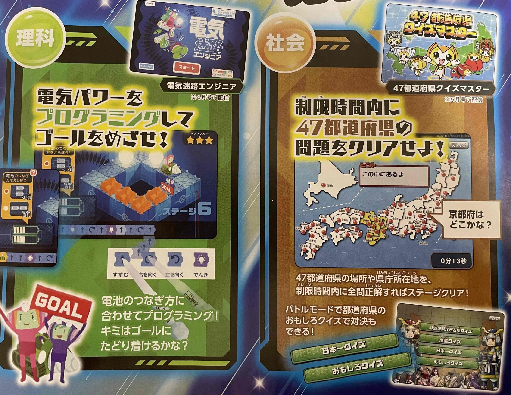
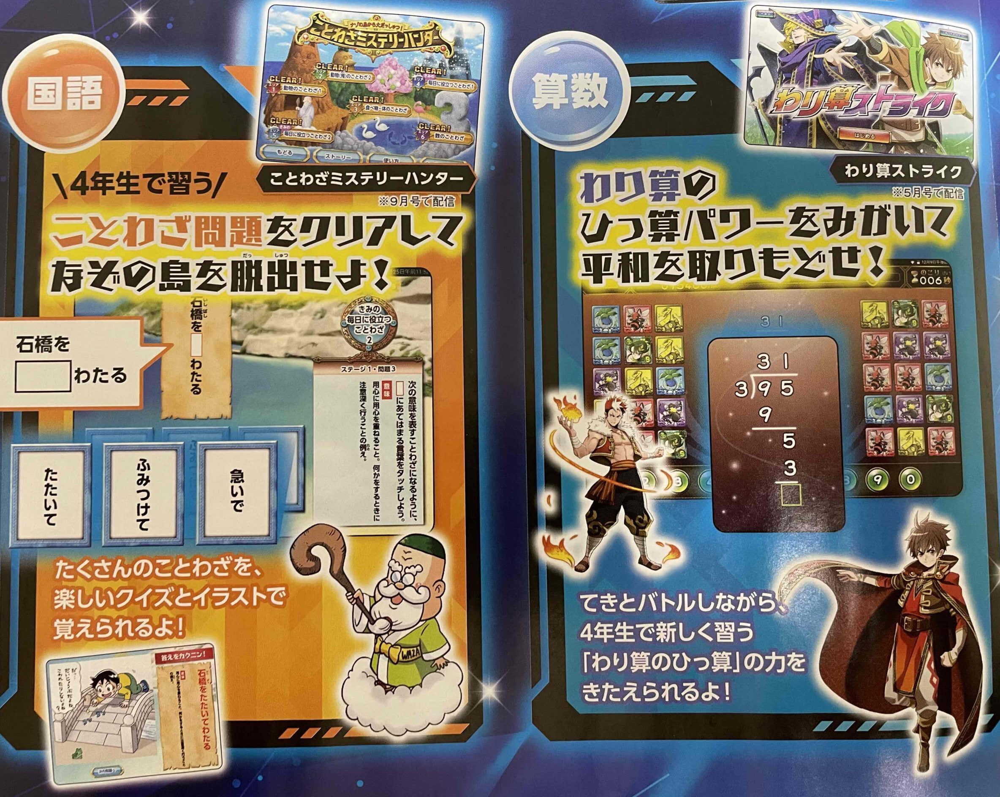
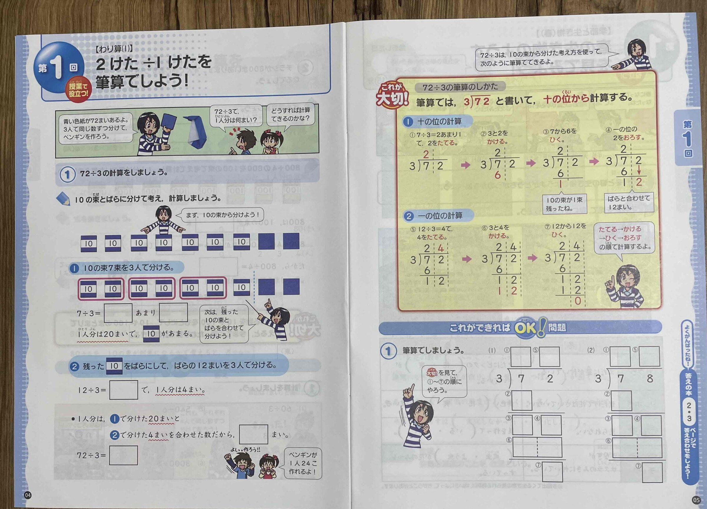
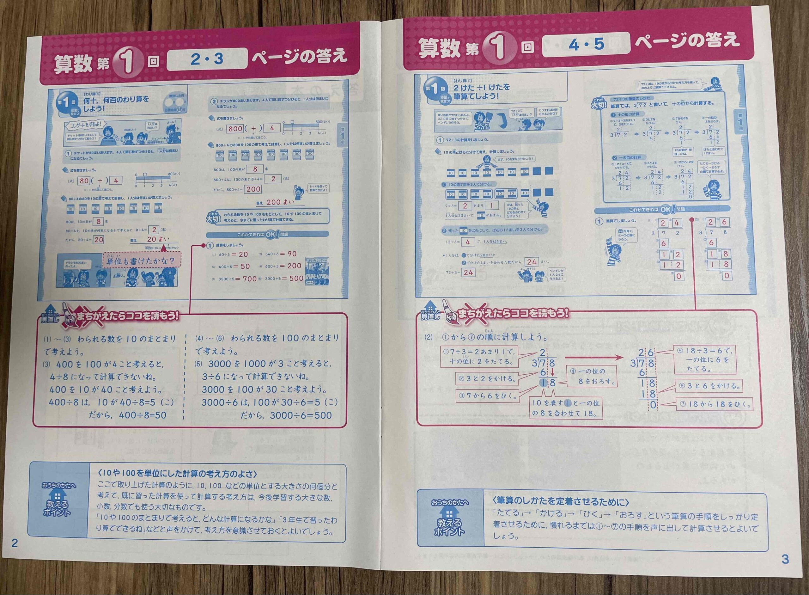
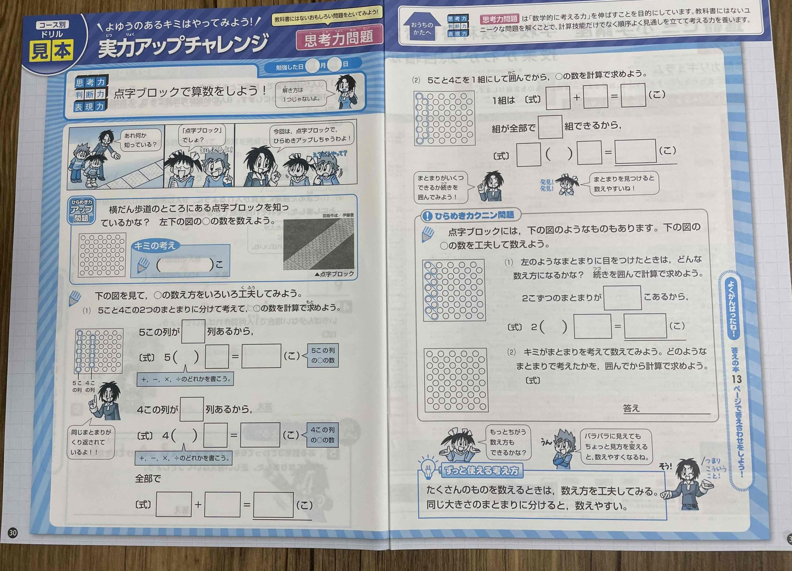

進研ゼミには、チャレンジタッチとチャレンジの2つのコースが用意されています。

しかし、具体的に2つのコースで何が違うのかよく分からないですよね？

進研ゼミへの入会を考えているけど、「チャレンジタッチとチャレンジの２つの違いがよく分からなくて迷っている」方も多いのではないでしょうか？

今回は、そんな2つのコースの違いやそれぞれのコースのメリット・デメリットについて詳しく解説していきます。

## チャレンジタッチとチャレンジは何が違う？

結論から言うと**学習スタイルが大きく違います**。

チャレンジタッチ・・・タブレット中心で勉強

チャレンジ・・・・紙教材中心で勉強

このように進研ゼミでは、タブレットを使って勉強するチャレンジタッチ、紙教材で勉強を進めるチャレンジの2つのコースから選ぶことが出来ます。

タブレットコースを選んだら進研ゼミ専用のタブレットが届けられるよ。

[タブレット本体の料金](https://xn--5ckip8c4fq970ahbya2o7acu2a.com/2023/06/19/%e3%83%81%e3%83%a3%e3%83%ac%e3%83%b3%e3%82%b8%e3%83%91%e3%83%83%e3%83%89next%ef%bc%88%e3%83%8d%e3%82%af%e3%82%b9%e3%83%88%ef%bc%89%e3%81%a3%e3%81%a6%e3%81%a9%e3%82%93%e3%81%aa%e3%82%bf%e3%83%96/)や[タブレットの保証](https://xn--5ckip8c4fq970ahbya2o7acu2a.com/2022/04/05/%e3%83%81%e3%83%a3%e3%83%ac%e3%83%b3%e3%82%b8%e3%82%bf%e3%83%83%e3%83%81%e7%ab%af%e6%9c%ab%e3%81%ae%e4%ba%a4%e6%8f%9b%e3%81%ae%e6%96%99%e9%87%91%e3%81%af%ef%bc%9f%e4%bf%9d%e8%a8%bc%e3%81%8c%e3%81%84/)についてはそれぞれ別記事からご覧下さい。

### チャレンジタッチとチャレンジで料金や学習量に違いはある？

これら２つの学習スタイルに**料金の違いはありません**。

1日の学習量や赤ペン先生の添削も形は違いますがどちらも同じように利用できます。

料金や口コミを詳しく知りたい方は以下のリンクからどうぞ♪

[チャレンジタッチ【良い口コミ・悪い口コミ】を暴露！](https://xn--5ckip8c4fq970ahbya2o7acu2a.com/2022/01/09/%e9%80%b2%e7%a0%94%e3%82%bc%e3%83%9f-%e5%b0%8f%e5%ad%a6%e8%ac%9b%e5%ba%a7%e3%81%ae%e5%8f%a3%e3%82%b3%e3%83%9f%e8%a9%95%e5%88%a4%e5%ae%8c%e5%85%a8%e3%81%be%e3%81%a8%e3%82%81/)

## チャレンジタッチとチャレンジでは進め方が違う！

チャレンジタッチとチャレンジでは勉強していく流れが大きく違います。

🐕

それぞれ問題にはどんな違いがあるんだろう？

### チャレンジタッチの問題形式

チャレンジタッチは数あるタブレット教材の中でもトップレベルにゲーム性が高い教材です。

国語,算数,理科,社会それぞれをゲーム形式で楽しめるようになっています。

また、授業動画やアニメーションを見て理解しやすいので基礎の部分を定着させたい子にオススメです。

ただ、問題出題は（①番～⑤番）までの中から選んで答える選択式を採用しています。

<iframe title="YouTube video player" src="https://www.youtube.com/embed/MBMndjeMyEs" width="1380" height="487" frameborder="0" allowfullscreen="allowfullscreen"></iframe>

たまたま正解してしまうと、理解していないまま次に進めてしまうデメリットもあります。

### チャレンジの問題形式

チャレンジでは、始めに問題を理解する為の解説が用意されています。

※（小学4年生の問題）

チャレンジでは、始めに問題を理解する為の解説が用意されています。

進研ゼミでは基礎を固める問題が多いので、チャレンジでも問題の基礎の部分は丁寧に解説してあります。

答えの別紙では「間違えたらここを読もう」というよくある**間違えや迷いやすいポイントについての説明**があります。

回答用紙の下の部分には「保護者に方に対してのアドバイス」も書いてあります。

子供に教える時のポイントがページごとに書かれているので、お子さんに教える時はまず答えから見るといいですよ。

チャレンジのお試し教材は進研ゼミの公式サイトから資料請求でもらえます。

[今すぐチャレンジのお試し教材をもらう](//ck.jp.ap.valuecommerce.com/servlet/referral?sid=3613518&pid=887662397)

🐕

次に、身に勉強習慣や英語力をつけるにはチャレンジタッチとチャレンジのどちらがいいかを比較するよ

## チャレンジタッチのメリット・デメリット

次にチャレンジタッチの強みと弱みをみていきましょう。

人によって教材に求めるものは違いますよね？

・勉強習慣をつけたい

・応用問題をしっかり解けるようになりたい

といった「譲れない部分」「妥協できる部分」に優先順位をつけて選ぶといいですよ。

### チャレンジタッチのメリット：①勉強習慣がつく

勉強を習慣にするには短い時間でも良いから毎日継続することがもっとも大切です。

そして、**毎日継続するならチャレンジタッチはとてもオススメです。**

タブレット学習には、面倒な答え合わせがなく、机に向かわなくても勉強できるので、勉強に対して抵抗がある子でも比較的、勉強する習慣は付けやすいでしょう。

チャレンジでも習慣化することは可能ですが、勉強に対して「嫌い・苦手」という意識がある人はレベルの調節ができ、ゲーム感覚で続けやすいチャレンジタッチの方がオススメです。

🐕

勉強を習慣化させたいならやる気に頼らず簡単なことでも続けることが大切だよ

https://xn--5ckip8c4fq970ahbya2o7acu2a.com/2022/01/09/%e9%80%b2%e7%a0%94%e3%82%bc%e3%83%9f-%e5%b0%8f%e5%ad%a6%e8%ac%9b%e5%ba%a7%e3%81%ae%e5%8f%a3%e3%82%b3%e3%83%9f%e8%a9%95%e5%88%a4%e5%ae%8c%e5%85%a8%e3%81%be%e3%81%a8%e3%82%81/

### チャレンジタッチのメリット：②プログラミングがしやすい

プログラミングは全国の小学校で2020年度から必修化されました。

すでに「学校でプログラミングの勉強をした」という子も多いはず

そんなプログラミングを勉強するなら圧倒的にタブレットの方が勉強しやすいです。

**プログラミングの流れ（****チャレンジタッチ）**

**自分で仮説を立てる**

↓

**動かして結果を見る**

↓

**結果を元に改善策を考える**

このようにプログラミングでは、実際に自分でプログラムした内容を動かして確かめることでより興味をもち楽しく学ぶことができます。

・どこが間違っていたのか？

・どうすれば改善できるのか？

このように考えるため「問題を解決する能力」や「論理的な思考」が自然と身に付いていきます。

一方で、チャレンジのプログラミング内容はすごろくや漫画を使います。

指示した命令通りに実行されるかを体験し習得できる教材が用意されています。

ただ、やはり紙教材ではプログラミングには向きません。

本当にプログラミングの勉強をしたいのであればチャレンジタッチがオススメです。

「将来プログラミングの仕事するか分からないのに勉強する必要あるの？」と思う方もいるかもしれません。

ただ、プログラミングは、「問題を解決する力」や「計画力」といった社会に出てた時に必要な力を身につけることができます。

小さいころからプログラミングを身につけておけば「中、高」の勉強にもきっと役に立つはずだよ

▶ [チャレンジタッチのプログラミング内容の詳細はこちら](https://xn--5ckip8c4fq970ahbya2o7acu2a.com/2022/03/08/%e9%80%b2%e7%a0%94%e3%82%bc%e3%83%9f%e3%83%81%e3%83%a3%e3%83%ac%e3%83%b3%e3%82%b8%e3%82%bf%e3%83%83%e3%83%81%e3%80%8c%e5%b0%8f%ef%bc%91%ef%bd%9e%e5%b0%8f%ef%bc%96%e3%80%8d%e3%81%ae%e3%83%97%e3%83%ad/)

▶ [Z会のプログラミング「有料・無料の違い」～口コミ・評判まとめ](https://xn--5ckip8c4fq970ahbya2o7acu2a.com/2022/03/17/z%e4%bc%9a%e3%81%ae%e3%83%97%e3%83%ad%e3%82%b0%e3%83%a9%e3%83%9f%e3%83%b3%e3%82%b0%e3%80%8c%e6%9c%89%e6%96%99%e3%83%bb%e7%84%a1%e6%96%99%e3%81%ae%e9%81%95%e3%81%84%e3%80%8d%ef%bd%9e%e5%8f%a3%e3%82%b3/)

### チャレンジタッチのメリット：③無料サービスが使いやすい

進研ゼミに入会すると無料で利用できるサービスがたくさんあります。

進研ゼミ会員が無料で使えるサービス一覧

- [チャレンジイングリッシュ（小１～高３レベルが使い放題）](https://xn--5ckip8c4fq970ahbya2o7acu2a.com/2022/03/28/%e3%83%81%e3%83%a3%e3%83%ac%e3%83%b3%e3%82%b8%e3%82%a4%e3%83%b3%e3%82%b0%e3%83%aa%e3%83%83%e3%82%b7%e3%83%a5%e3%81%ae%e6%96%99%e9%87%91%e3%81%af%e7%84%a1%e6%96%99%ef%bc%81%ef%bc%9f%e3%80%8c%e5%88%a9/)
- [進研ゼミオンライン授業（生配信）](https://xn--5ckip8c4fq970ahbya2o7acu2a.com/2023/06/26/%e3%83%81%e3%83%a3%e3%83%ac%e3%83%b3%e3%82%b8%e3%82%aa%e3%83%b3%e3%83%a9%e3%82%a4%e3%83%b3%e6%8e%88%e6%a5%ad%e3%82%92%e3%80%8c%e5%8f%97%e8%ac%9b%e3%81%97%e3%81%9f%e6%84%9f%e6%83%b3%e3%80%8d/)
- [まなびライブラリー（1000冊の本が読み放題）](https://xn--5ckip8c4fq970ahbya2o7acu2a.com/2023/07/18/%e3%83%81%e3%83%a3%e3%83%ac%e3%83%b3%e3%82%b8%e3%82%bf%e3%83%83%e3%83%81%e3%81%ae%e6%9c%ac%e8%aa%ad%e3%81%bf%e6%94%be%e9%a1%8c%e3%82%b5%e3%83%bc%e3%83%93%e3%82%b9%e3%81%a8%e3%81%af%ef%bc%9f%e9%80%b2/)
- [プログラミング（基礎）](https://xn--5ckip8c4fq970ahbya2o7acu2a.com/2022/03/08/%e9%80%b2%e7%a0%94%e3%82%bc%e3%83%9f%e3%83%81%e3%83%a3%e3%83%ac%e3%83%b3%e3%82%b8%e3%82%bf%e3%83%83%e3%83%81%e3%80%8c%e5%b0%8f%ef%bc%91%ef%bd%9e%e5%b0%8f%ef%bc%96%e3%80%8d%e3%81%ae%e3%83%97%e3%83%ad/)
- [進研ゼミ実力診断テスト](https://xn--5ckip8c4fq970ahbya2o7acu2a.com/2023/06/09/%e3%83%81%e3%83%a3%e3%83%ac%e3%83%b3%e3%82%b8%e5%ae%9f%e5%8a%9b%e8%a8%ba%e6%96%ad%e3%81%af%e3%80%8c%e5%b0%8f1%ef%bd%9e%e5%b0%8f6%e3%80%8d%e3%81%a7%e5%86%85%e5%ae%b9%e3%81%8c%e9%81%95%e3%81%86%ef%bc%9f/)
- [努力賞ポイント景品交換](https://xn--5ckip8c4fq970ahbya2o7acu2a.com/2023/07/10/%e3%83%81%e3%83%a3%e3%83%ac%e3%83%b3%e3%82%b8%e3%82%bf%e3%83%83%e3%83%81%e5%8a%aa%e5%8a%9b%e8%b3%9e%e3%83%9d%e3%82%a4%e3%83%b3%e3%83%88%ef%bc%81%e8%b2%b0%e3%81%88%e3%82%8b%e5%95%86%e5%93%81%e3%81%af/)

それぞれ別記事で詳しく解説しています。

これらのほとんどがインターネットを利用するサービスのため、専用タブレットがある方がサービスを使いやすくなります。

チャレンジを受講している人でもiPadやパソコンがあれば利用できます。しかし、専用タブレット以外だとゲームやYouTubeといったコンテンツが自由に使えてしまうという[タブレットの落とし穴](https://xn--5ckip8c4fq970ahbya2o7acu2a.com/2022/02/16/%e3%82%bf%e3%83%96%e3%83%ac%e3%83%83%e3%83%88%e5%ad%a6%e7%bf%92%e3%83%87%e3%83%a1%e3%83%aa%e3%83%83%e3%83%88%ef%bc%81%e3%82%b2%e3%83%bc%e3%83%a0%e3%82%84sns%e3%81%ab%e6%99%82%e9%96%93%e3%82%92/)があるので注意が必要です。

### チャレンジタッチのデメリット：①Wi-Fi環境が必要

チャレンジタッチは基本的にタブレットを使用して学習をします。

タブレットで学習するにはWi-Fiに繋げておく必要があります。

Wi-Fiがなくてもあらかじめダウンロードした一部の講座は学習することはできますが、学習できる量としてはかなり少ないため、「移動中にしっかり勉強したい」という人にはむきません。

「移動中や外出先のちょっとした時間に勉強をしたい」という人にはWi-Fiがない環境でもタブレットで学習できるスマイルゼミをオススメします。

▶ [スマイルゼミ「お出かけモード」で移動中でも勉強が可能？](https://xn--5ckip8c4fq970ahbya2o7acu2a.com/2022/03/01/%e3%82%b9%e3%83%9e%e3%82%a4%e3%83%ab%e3%82%bc%e3%83%9f%e3%80%8c%e3%81%8a%e5%87%ba%e3%81%8b%e3%81%91%e3%83%a2%e3%83%bc%e3%83%89%e8%a8%ad%e5%ae%9a%e3%83%bb%e8%ac%9b%e5%ba%a7%e3%83%80%e3%82%a6%e3%83%b3/)

### チャレンジタッチのデメリット：②途中計算がしにくい

これは全てのタブレット教材に言えますが、**タブレット学習ではメモや途中式が書きにくいのがデメリットとして挙げられます**。

特にレベルの高い問題では途中式を書いて考えながら正解を導きます。

進研ゼミ自体がそれほどレベルの高い問題は多くありませんが、途中式が必要な応用問題を解きたい人にはおすすめできません。

レベルの高い問題や応用問題に挑戦したい人にはZ会がオススメです。

Zもタブレットと紙教材で選択することが可能ですよ♪

▶ [Z会小学生の口コミ・評判](https://xn--5ckip8c4fq970ahbya2o7acu2a.com/2022/01/17/z%e4%bc%9a%e5%8f%a3%e3%82%b3%e3%83%9f/)

### チャレンジタッチがオススメな人

🐕

チャレンジタッチは<strong>勉強に対して苦手意識</strong>がある人にお勧め

**チャレンジタッチが向いている子**

・ゲームが好きで勉強も楽しく進めたい子

・勉強の習慣をつけたい子

・答え合わせなどの面倒な作業を省略したい子

・楽しくプログラミング学習をしたい子

・読書を習慣にしたい子

チャレンジタッチは、考えるという行程が細分化して説明してあるので、覚えるのが苦手な方に向いています。

また、動画や音声を使ったでデジタル学習が中心ですので、直感的に学ぶことができるタイプの子にもオススメです。

また、進研ゼミでは1000冊以上の電子書籍が読み放題の「学びライブラリー」が用意されています。※チャレンジの人はタブレットまたはパソコンで利用できます。

進研ゼミの電子書籍については別記事からご覧ください。

https://xn--5ckip8c4fq970ahbya2o7acu2a.com/2022/01/09/%e9%80%b2%e7%a0%94%e3%82%bc%e3%83%9f-%e5%b0%8f%e5%ad%a6%e8%ac%9b%e5%ba%a7%e3%81%ae%e5%8f%a3%e3%82%b3%e3%83%9f%e8%a9%95%e5%88%a4%e5%ae%8c%e5%85%a8%e3%81%be%e3%81%a8%e3%82%81/

## チャレンジのメリット・デメリット

次にチャレンジ（紙教材）の強み、弱みを見ていきましょう。

テキストで勉強を進めていくチャレンジにももちろん良い点と悪い点があります。

### チャレンジのメリット：①考える力が付く

チャレンジでは、実際に紙に書いて勉強を進めていくので、じっくり考えながら勉強を進めていけます。

小学校4年～6年になってくるとじっくり考える応用問題が増えてきます。

自分の頭で考えるなければいけない問題は「算数なら途中式」「国語ならメモをとる」といった実際に紙に書いく方が考える力を養いやすくなります。

(小学4年生の問題）

チャレンジではこのような思考力を鍛える問題が用意されています。

もちろんチャレンジタッチでも考える力をつけることはできます。

ただ、問題のレベルが上がってくるにつれて「ああでもない」「こうでもない」と紙に書きながら考える方がより思考力が養われていきます。

### チャレンジのメリット：②漢字の練習に使いやすい

当然ですが、漢字や英単語といった文字の練習は紙教材のチャレンジの方がより正確に漢字を覚えることができます。

チャレンジタッチの場合、**タブレットに直接書くスタイルのため実際に紙に書く感覚とはかなり違います**。

また、タブレットの漢字の正解、不正解の判断もあいまいなこともあり、正確に言うと少し違う場合でもマルになることもあります。

チャレンジタッチを使いたい人は漢字などは別の紙教材ドリルと併用して使った方が良いかもしれません。

### チャレンジのメリット：③お試し体験教材がたくさんある

チャレンジでは、資料請求すると全ての学年でお試し教材としてテキストが送られてきます。

お試し教材の問題レベルや勉強量は実際のチャレンジと同じのため、自分に合っているのか判断することができます。

教科も国語、算数、理科、社会とまんべんなく載っていますよ。

[チャレンジのお試し教材はこちらから](//ck.jp.ap.valuecommerce.com/servlet/referral?sid=3613518&pid=887662397)

### チャレンジのデメリット：①ゲーム性が少ない

チャレンジタッチがゲーム性が高いのに対してチャレンジは、基本テキストで勉強を進めていくのでゲーム性はかなり低いです。

教材にゲーム性を求めない人はいいですが、**「少しでも楽しく勉強したい」と思う子にはチャレンジタッチを選んで上げると良いでしょう**。

### チャレンジのデメリット：②教材がたまって邪魔になる

チャレンジの場合毎月教材が送られてくるので1年、2年も経つとかなりの量になります。

テキストが貯まっていくため散らかりやすくなる可能性があります。

収納できるスペースがあればいいですが、片付けが苦手な人は、チャレンジタッチのようにタブレットに教材が配信される方を選ぶといいですよ。

### チャレンジがオススメな人

チャレンジは、比較的勉強に<strong>拒否反応がない子</strong>にオススメ

**チャレンジに向いている子**

・考える力をつけたい子

・実際に書いて勉強したい子

・メモを取りながら勉強を進めたい子

・テストや受験などの試験対策として使いたい子

紙に書きながらじっくり考えながら取り組みたいお子さまにオススメです。

特に、算数などで問題が難しくなってくると計算式は、紙に書きながら答えを導き出す方がより頭を使い、考える力が養われていきます。

しっかり紙に書いて学習をするので、自分でじっくり考えながら取り組みたいお子さんはチャレンジを選ぶといいでしょう。

チャレンジは資料請求をすることで実際に「お試し教材」で問題に挑戦することができます。

[お試し教材は進研ゼミ公式サイトの資料請求から](//ck.jp.ap.valuecommerce.com/servlet/referral?sid=3613518&pid=887662397)

## どちらを選べばいいか迷っている人は？

ここまで2つの違いの説明を聞いたけど「まだ決めきれない」

という人は、個人的にはチャレンジタッチがオススメです。

今回チャレンジタッチとチャレンジを比べてみましたが、やはり便利性や効率性が高く、なにより楽しみやすいというメリットがあります。

これから先、ますますタブレットやパソコンを使った学習が増えていきます。

小さい頃からタブレット学習することで将来きっと役に立ちます。

また今の時代は、大人がスマホやタブレットを触っているのを見て子供は憧れを持っています。

自分専用のタブレットがあれば勉強への興味が生まれるかもしれません。

チャレンジタッチを受講して自分に合わないと思ったら途中でチャレンジに変更することも簡単にできます。

他のタブレット教材と違い一度解約してから変更する必要はありません。

進研ゼミの資料請求ではチャレンジタッチとチャレンジについて詳しく説明されています。

また、お試し教材では国、算、理、英、社の5教科分の教材が送られてきます。

興味のあるかたは進研ゼミ公式サイトからどうぞ♪

[今すぐ進研ゼミの資料請求をする](//ck.jp.ap.valuecommerce.com/servlet/referral?sid=3613518&pid=887662352)
