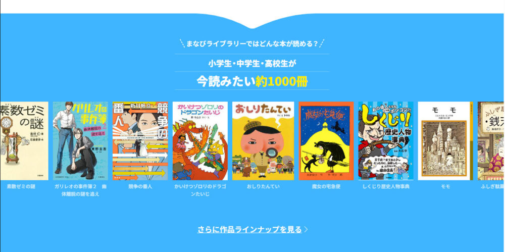
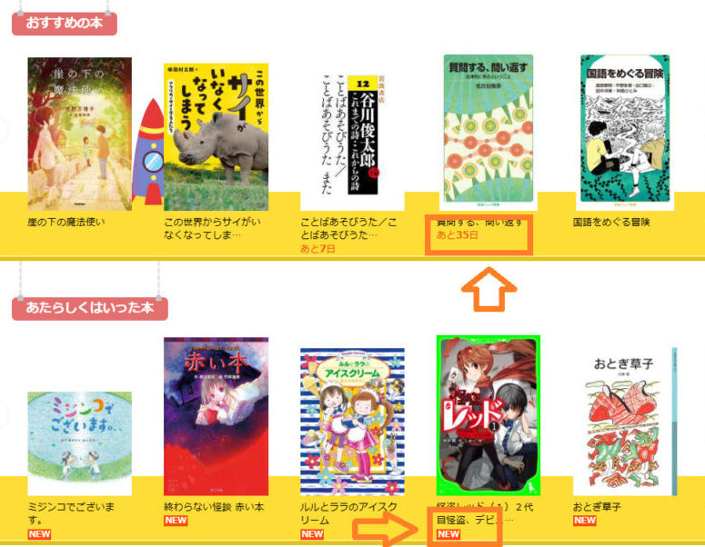
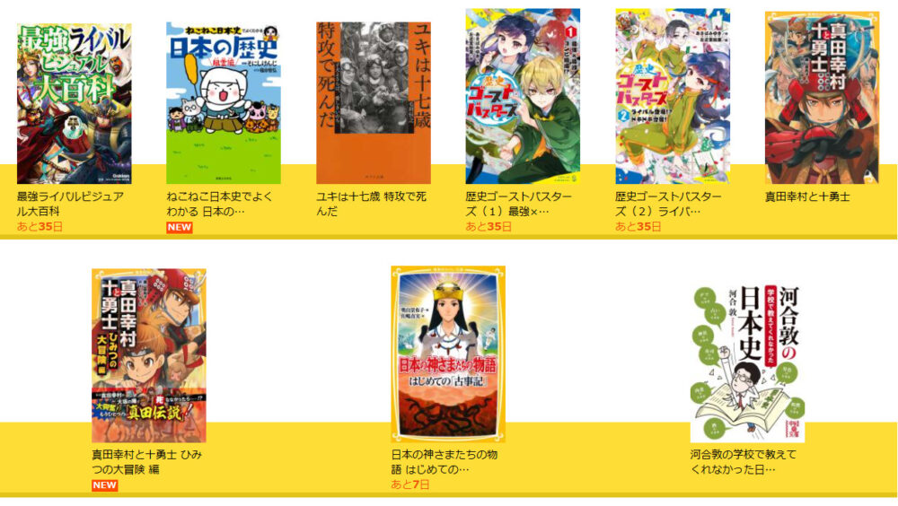
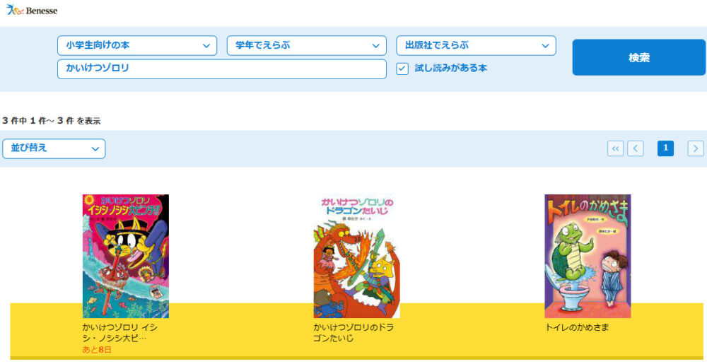
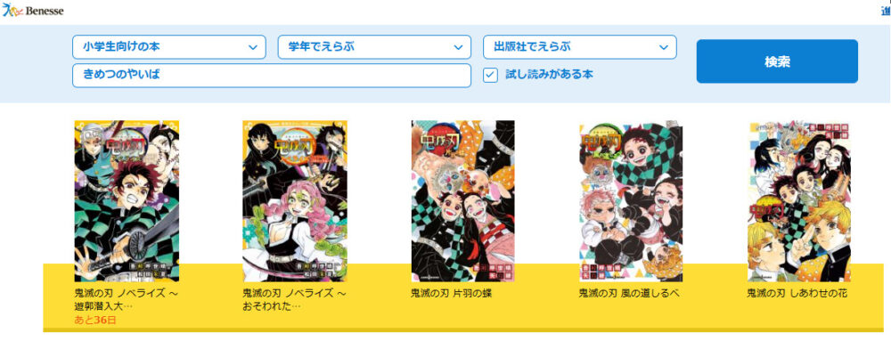
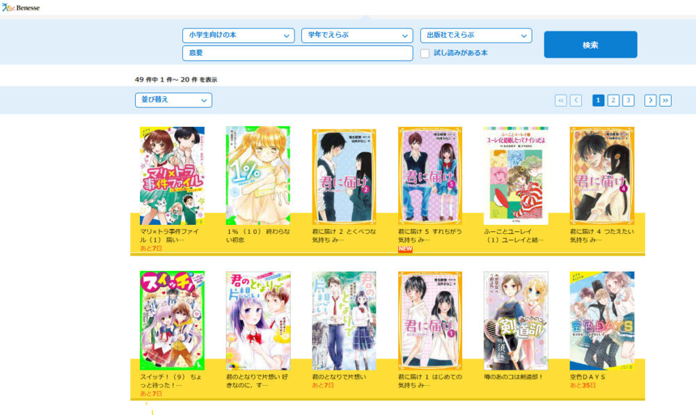
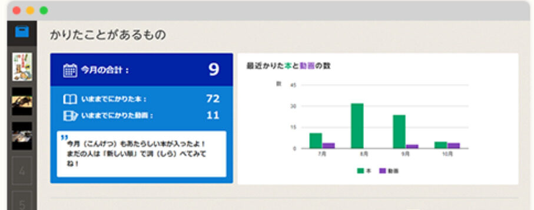

自分の子どもに本を読ませたい・・・しかし、1冊1,000円以上する本も多い上に「せっかく買ってあげたのに全然読んでくれない」と悩みを抱えている親御さんは多くいます。

できれば本を読む子になって欲しいけど、何冊も何冊も本を買い与えるのは、費用もかかるため、できれば安く抑えたいですよね？

そこで、今回紹介するのが、**進研ゼミ会員なら無料で利用できる**本読み放題サービスです。約1000冊の本をいつでも読み放題の「まなびライブラリー」の内容を詳しく紹介します。

この記事では、以下の内容を詳しく紹介していきます。

- 「まなびライブラリー」にはどんな本がある？
- 成績UPにも繋がるのか？
- 「まなびライブラリー」の始め方

興味のある方は是非最後までご覧下さい。

## 進研ゼミチャレンジタッチの本読み放題サービスとは？

進研ゼミには、約1000冊の本をいつでも読み放題の「まなびライブラリー」というサービスがあります。

**読める本は定期的に入れ替わる**ので、最新の本や人気作、話題作が定期的に加えられ、図書館のように貸し出し中などもありません。読みたい本をすぐに読むことができるのも魅力的ですね！

さらに、まなびライブラリーでは特集や季節、作品に関連した特設サイトも毎月提供されています。これにより、子供は読書に関心を持ち、新たな興味や発見、想像力を育むことができます。

小学生から高校生に対応した本が取り集められているため、子供の好みや興味を満たすことができます。

タブレット、パソコン、スマホなどのデバイスを持っていれば、好きなだけ本を読むことができますよ。

**＼今すぐ進研ゼミに入会して「1000冊読み放題」を始めよう／**

[進研ゼミ「小学講座」まなびライブラリーを利用する](//ck.jp.ap.valuecommerce.com/servlet/referral?sid=3613518&pid=887679902)

[進研ゼミ「中学講座」まなびライブラリーを利用する](//ck.jp.ap.valuecommerce.com/servlet/referral?sid=3613518&pid=887697614)

[進研ゼミ「高校講座」まなびライブラリーを利用する](//ck.jp.ap.valuecommerce.com/servlet/referral?sid=3613518&pid=889453352)

### まなびライブラリーの本は毎月入れ替わる？

1000冊の本が読み放題のまなびライブラリーですが、その内容は定期的に入れ替えられます。

このように、一部の本は「**あと〇〇日**」と表示され、利用できる期間が定められています。また、新しく追加された本には「**NEW**」と表示されています。

読みたい本は利用できる期限を確認しておこう

新たに追加される本は、その時期に話題となっている作品や、小、中、高が好む様々なジャンルから選ばれます。

たくさんの新しい本が定期的に追加されるため、「読みたい本がなくなる」ということもありません。

また、人気作や話題作も待ち時間なしにすぐに読むことが可能です。

### スマホやタブレットがなくても利用できる？

「まなびライブラリー」を利用するには、スマホ、タブレット、パソコンのいずれかが必ず必要です。

もし、「どれも持っていない」または「子供にはスマホやタブレットを与えたくない」という方は進研ゼミ**チャレンジタッチへの入会がオススメ**です。

進研ゼミでは、チャレンジ（紙教材コース）とチャレンジタッチ（タブレットコース）の2つのコースが用意されています。

チャレンジタッチのコースに入会すると、進研ゼミの**_学習専用のタブレットが届けられます_**。このタブレットを利用することで、YouTubeやSNSは使用できないので、安心して勉強と読書だけをさせることができますよ。

🐕

これならタブレットがなくても安心だね

### まなびライブラリーは動画も視聴できる

まなびライブラリーでは、本だけでなく、約20本の動画も用意されています。

**動画のジャンル**

科学・技術・自然・生物・アニメ・ニュース・ドラマ・映画

芸術・趣味・社会・文化・哲学・歴史・地理

以上のようなジャンルの動画が定期的に配信され、内容も定期的に入れ替わります。ただし、実際に利用してみたところ、興味関心の引く動画が多いという印象はありませんでした。

また動画の本数も20本と少なく、ハッキリ言うと、1000冊読み放題読書の**おまけ程度の内容**なので、あまり期待できる内容とは言えないものでした。

**＼今すぐ進研ゼミに入会して「1000冊読み放題」を始める／**

[進研ゼミ「小学講座」まなびライブラリーを利用する](//ck.jp.ap.valuecommerce.com/servlet/referral?sid=3613518&pid=887679902)

[進研ゼミ「中学講座」まなびライブラリーを利用する](//ck.jp.ap.valuecommerce.com/servlet/referral?sid=3613518&pid=887697614)

[進研ゼミ「高校講座」まなびライブラリーを利用する](//ck.jp.ap.valuecommerce.com/servlet/referral?sid=3613518&pid=889453352)

### 「まなびライブラリー」進研ゼミ会員なら誰でも無料！？

まなびライブラリーは、進研ゼミの会員なら小学生～高校生の誰でも無料で利用することが出来ます。

入会して会員番号をもらったその日から好きなだけ本を読むことが出来ます。

🐕

進研ゼミには、他にも<strong>無料で利用できるサービス</strong>がたくさんあるよ

<strong>進研ゼミ会員が無料で利用できるサービス一覧</strong>

- [チャレンジイングリッシュ（小１～高３レベルが使い放題）](https://xn--5ckip8c4fq970ahbya2o7acu2a.com/2022/03/28/%e3%83%81%e3%83%a3%e3%83%ac%e3%83%b3%e3%82%b8%e3%82%a4%e3%83%b3%e3%82%b0%e3%83%aa%e3%83%83%e3%82%b7%e3%83%a5%e3%81%ae%e6%96%99%e9%87%91%e3%81%af%e7%84%a1%e6%96%99%ef%bc%81%ef%bc%9f%e3%80%8c%e5%88%a9/)
- [プログラミング（基礎）](https://xn--5ckip8c4fq970ahbya2o7acu2a.com/2022/03/08/%e9%80%b2%e7%a0%94%e3%82%bc%e3%83%9f%e3%83%81%e3%83%a3%e3%83%ac%e3%83%b3%e3%82%b8%e3%82%bf%e3%83%83%e3%83%81%e3%80%8c%e5%b0%8f%ef%bc%91%ef%bd%9e%e5%b0%8f%ef%bc%96%e3%80%8d%e3%81%ae%e3%83%97%e3%83%ad/)
- [努力賞ポイント景品交換](https://xn--5ckip8c4fq970ahbya2o7acu2a.com/2023/07/10/%e3%83%81%e3%83%a3%e3%83%ac%e3%83%b3%e3%82%b8%e3%82%bf%e3%83%83%e3%83%81%e5%8a%aa%e5%8a%9b%e8%b3%9e%e3%83%9d%e3%82%a4%e3%83%b3%e3%83%88%ef%bc%81%e8%b2%b0%e3%81%88%e3%82%8b%e5%95%86%e5%93%81%e3%81%af/)
- [オンライン授業](https://xn--5ckip8c4fq970ahbya2o7acu2a.com/2023/06/26/%e3%83%81%e3%83%a3%e3%83%ac%e3%83%b3%e3%82%b8%e3%82%aa%e3%83%b3%e3%83%a9%e3%82%a4%e3%83%b3%e6%8e%88%e6%a5%ad%e3%82%92%e3%80%8c%e5%8f%97%e8%ac%9b%e3%81%97%e3%81%9f%e6%84%9f%e6%83%b3%e3%80%8d/)
- [実力診断テスト](https://xn--5ckip8c4fq970ahbya2o7acu2a.com/2023/06/09/%e3%83%81%e3%83%a3%e3%83%ac%e3%83%b3%e3%82%b8%e5%ae%9f%e5%8a%9b%e8%a8%ba%e6%96%ad%e3%81%af%e3%80%8c%e5%b0%8f1%ef%bd%9e%e5%b0%8f6%e3%80%8d%e3%81%a7%e5%86%85%e5%ae%b9%e3%81%8c%e9%81%95%e3%81%86%ef%bc%9f/)

気になる記事をタップしてね♪

## まなびライブラリーは成績UPにつながる？

読書は子供の学校の成績に大きな影響を与えます。これは、本を読むことで、自然と文章の構成が理解できるようになり、読解力が高まることが理由と言えます。

**読解力が高まると、**先生の授業を聞くだけで、その勉強の内容が理解できるようになり、勉強の効率がめちゃめちゃ上がります。

まなびライブラリーは、この読解力向上を目指したサービスです。豊富な電子書籍を与えることで、子供たちの読書量を増やし、それによって読解力を向上させることを目指して作られました。

🐕

本を読むだけで、読解力、情報処理能力、理解力、記憶力、が同時に鍛えられるんだね

特に、普段の生活で、漫画やYouTubeなどを多く利用している子供には、その時間を本を読ませるだけで、理解力が高まる、いわゆる地頭の良い子に成長する可能性を大幅に高めてくれますよ。

### まなびライブラリーで読書する習慣が身に付けられる

まなびライブラリーでは、約1000冊というたくさんの種類の本が取り揃えられているため、子供たちが興味を持った本だけを自由に読むことができます。

まなびライブラリーには、人気の本や過去の読書記録から子供に最適な本をおすすめする機能があります。

これにより、子供たちは自分に合った本を見つけやすくなり、**読書のハードルが下がります**。

こうして純粋に本を読む楽しさを感じることができ、次に何を読むかを楽しみにするなど、**自然と読書の習慣が身に付きます**。

無理に本を読ませるのではなく、子供たちに本を読む楽しさを自然に理解させることで、読書を苦手だと感じることなく、日常の一部として読書を取り入れるようになります。

**＼今すぐ進研ゼミに入会して「1000冊読み放題」を始める／**

[進研ゼミ「小学講座」まなびライブラリーを利用する](//ck.jp.ap.valuecommerce.com/servlet/referral?sid=3613518&pid=887679902)

[進研ゼミ「中学講座」まなびライブラリーを利用する](//ck.jp.ap.valuecommerce.com/servlet/referral?sid=3613518&pid=887697614)

[進研ゼミ「高校講座」まなびライブラリーを利用する](//ck.jp.ap.valuecommerce.com/servlet/referral?sid=3613518&pid=889453352)

## まなびライブラリーでどんな本が読める？

まなびライブラリーでは、小学生～高校生が「思わず読みたい」と思う本が約1000冊提供されています。その本の内容を一部紹介します。

- かいけつゾロリのドラゴンたいじ
- おしりたんてい
- 鬼滅の刃
- あいがあれば名探偵
- 魔女の宅急便
- しくじり歴史人物事典
- モモ
- ふしぎ駄菓子屋 銭天堂
- くらべてわかる地球のこと
- マララ 教育のために立ち上がり、世界を変えた少女
- SPY×FAMILY　家族の肖像
- 素数ゼミの謎
- ガリレオの事件簿２　幽体離脱の謎を追え
- 競争の番人

これらの作品は、冒険物語、ミステリー、歴史、科学、社会問題など、さまざまなジャンルの本が用意されています。子どもたちは自分の興味に合わせて様々な本を選び、読むことができます。

**＼今すぐ進研ゼミに入会して「1000冊読み放題」を始める／**

[進研ゼミ「小学講座」まなびライブラリーを利用する](//ck.jp.ap.valuecommerce.com/servlet/referral?sid=3613518&pid=887679902)

[進研ゼミ「中学講座」まなびライブラリーを利用する](//ck.jp.ap.valuecommerce.com/servlet/referral?sid=3613518&pid=887697614)

[進研ゼミ「高校講座」まなびライブラリーを利用する](//ck.jp.ap.valuecommerce.com/servlet/referral?sid=3613518&pid=889453352)

### 楽しく学べる「歴史まんが」

まなびライブラリーには、「角川漫画学習シリーズ、日本の歴史」が用意されています。

この漫画は**中学、高校受験対策としても使われる**ことが多く、「角川漫画学習シリーズ」では、歴史的な事実を興味深く、分かりやすく伝えるために、まんがという形式を採用しています。

🐕

歴史に興味のある子供以外にも楽しく勉強することができるね

子供たちは、キャラクターや実在の人物を通じて、日本の歴史の重要な出来事やエピソードを楽しく学ぶことができます。

また、「角川漫画学習シリーズ」だけでなく、他にも様々な歴史の本や漫画、さらにはライトノベルまで用意されています。

### 小学生に人気の高い「かいけつゾロリ」

「かいけつゾロリ」は、冒険とユーモラスなエピソードが詰まった物語で、特に小学校の低学年の子供たちから高い人気を誇っています。

まなびライブラリーはこのような人気のあるシリーズを提供することで、子供たちが本を開く楽しさを発見し、読書習慣を身につける機会を作り出しています。

さらに、こうした興味を引きつける本を選ぶことで、子供たちは自主的に読書を進めようとします。

「かいけつゾロリ」をはじめとする、子供たちの興味に合わせた本の提供により、まなびライブラリーは読書習慣を育む重要な場となっています。

読書は知識を増やすだけでなく、想像力を育み、新たな視点や考え方を与えてくれます。

### ライトノベルで読みやすい「鬼滅の刃」

「鬼滅の刃」は、日本だけでなく海外の子供たちにも人気の高い小説で、その独特なストーリーや魅力的なキャラクターのおかげで、**普段小説などを読まない子供たち**にとっても楽に読める内容となっています。

「鬼滅の刃」の小説は、ライトノベルのため、小学生でも読みやすく、すらすら理解ができるように工夫されています。

どの世代にも人気の「鬼滅の刃」は、普段本を読む習慣がない子供たちにとって、読書への興味を引き立てる良いきっかけとなりうるでしょう。

### 女の子から人気の恋愛小説

「まなびライブラリー」の恋愛小説は、特に女の子からの人気の高く、たくさんの種類が用意されています。

物語の中で描かれるキュートな恋愛シーンは、読者を思わずキュンとさせる内容が多く、小学生でも読みやすいのが特徴です。

**＼今すぐ進研ゼミに入会して「1000冊読み放題」を始める／**

[進研ゼミ「小学講座」まなびライブラリーを利用する](//ck.jp.ap.valuecommerce.com/servlet/referral?sid=3613518&pid=887679902)

[進研ゼミ「中学講座」まなびライブラリーを利用する](//ck.jp.ap.valuecommerce.com/servlet/referral?sid=3613518&pid=887697614)

[進研ゼミ「高校講座」まなびライブラリーを利用する](//ck.jp.ap.valuecommerce.com/servlet/referral?sid=3613518&pid=889453352)

## まなびライブラリーの始め方3ステップ

実際に「まなびライブラリー」の始め方はとっても簡単だよ

**まなびライブラリーの始め方3ステップ**

1. まなびライブラリーのログインページにアクセスする
2. 進研ゼミの会員番号とパスワードを入力する。
3. 読みたい本を選ぶ

会員番号とパスワードは、進研ゼミの会員サイトで使用しているものと同じです。

まなびライブラリーは進研ゼミに入会して会員番号とパスワードが発行され瞬間から利用することができます。

**＼まだ、入会前の方は進研ゼミの公式サイトから入会をどうぞ／**

[進研ゼミ「小学講座」まなびライブラリーを利用する](//ck.jp.ap.valuecommerce.com/servlet/referral?sid=3613518&pid=887679902)

[進研ゼミ「中学講座」まなびライブラリーを利用する](//ck.jp.ap.valuecommerce.com/servlet/referral?sid=3613518&pid=887697614)

[進研ゼミ「高校講座」まなびライブラリーを利用する](//ck.jp.ap.valuecommerce.com/servlet/referral?sid=3613518&pid=889453352)

## チャレンジタッチ本読み放題を利用した人に口コミ

🐕

まなびライブラリーを利用した人の口コミを調べてみたよ

<blockquote class="twitter-tweet">
進研ゼミの授業以外のメリットは本編授業以外の特典が充実しているところ。 まなびライブラリーは本読み放題なの最高。 動画で一週間のニュースが観れるのもいい。 AI国語算数トレーニングと言うのがあり、まず自分のレベルをチェックし、無学年で学習 が進められる。
— はちて (@hachite) <a href="https://twitter.com/hachite/status/1680577708562980868?ref_src=twsrc%5Etfw">July 16, 2023</a></blockquote>

<blockquote class="twitter-tweet">
昔チャレンジやってた時、まなびライブラリーで本読んでた。まじで良いシステムなので進研ゼミ会員の方は利用するべき
— 雪花 (@sekka_0829) <a href="https://twitter.com/sekka_0829/status/1674692451456675840?ref_src=twsrc%5Etfw">June 30, 2023</a></blockquote>

<blockquote class="twitter-tweet">
長女ももっとまなびライブラリーを活用すれば良いのにな。 結構女の子が好きそうな読みもの沢山あるのに。
— フラワー☆８歳＋５歳 (@1981Gimomo) <a href="https://twitter.com/1981Gimomo/status/1659550930013159424?ref_src=twsrc%5Etfw">May 19, 2023</a></blockquote>

<blockquote class="twitter-tweet">
娘、進研ゼミ。 電子図書サービスの『まなびライブラリー』が大好きすぎて。3年生までは紙を読ませていたけど、読むスピードに私の図書館通いが追いつかなくなり電子に。4年間で1528冊読んだらしい。平均月32冊かな。他に学校で月10冊、市立図書館で月10冊〜
あ〜よく読んだ😂 <a href="https://t.co/T57QdsWhDC">pic.twitter.com/T57QdsWhDC</a>

— ちょこ@家庭学習&amp;おうち英語(保育士+ﾜﾝｵﾍﾟ歴12年) (@cyokosanda) <a href="https://twitter.com/cyokosanda/status/1636980015790448641?ref_src=twsrc%5Etfw">March 18, 2023</a></blockquote>

「まなびライブラリー」に関する口コミを調査したところ、そのほとんどが「最高」「素晴らしい」といった内容でした。

その中でも、「無料で利用できる」「本の種類がたくさんある」といったことに対して満足感を感じる人が非常に多く見つかりました。

まだ「まなびライブラリー」を利用したことが無い方は公式サイトから始めることができますよ♪

**＼今すぐ進研ゼミに入会して「1000冊読み放題」を始める／**

[進研ゼミ「小学講座」まなびライブラリーを利用する](//ck.jp.ap.valuecommerce.com/servlet/referral?sid=3613518&pid=887679902)

[進研ゼミ「中学講座」まなびライブラリーを利用する](//ck.jp.ap.valuecommerce.com/servlet/referral?sid=3613518&pid=887697614)

[進研ゼミ「高校講座」まなびライブラリーを利用する](//ck.jp.ap.valuecommerce.com/servlet/referral?sid=3613518&pid=889453352)

## まなびライブラリーに関するよくある質問

最後に、「まなびライブラリー」に関するよくある質問をまとめました。

今までに「まなびライブラリー」を**利用した事が無い方**は知っておいた方が良い内容となっています。

### チャレンジパッドが無い人はどうやって読む？

まなびライブラリーは、チャレンジパッド（進研ゼミ専用タブレット）がなくても利用することができます。

どのデバイスからでもまなびライブラリーを利用することができるよ。

- チャレンジタッチタブレット
- タブレット
- スマホ
- パソコン

ただし、まなびライブラリーを利用するにはネット環境が必要です。Wi-Fiなどのネット環境が整っていない場合は利用することができないので注意しましょう。

### 本を読むほど記録がたまる

まなびライブラリーでは、借りた本や視聴した動画の数やタイトルが自動で記録されます。

これにより、子供は自分がどのような本を読んだのか、どの動画を視聴したのかを**一目で確認**することができます。

また、これらの記録は読書ノートとして活用することも可能です。例えば、読んだ本の感想や学んだことをメモとして追加したり、視聴した動画から得た知識を記録したりすることができます。

🐕

今まで、どんなジャンルの本を何冊読んだかが一目で分かるね

さらに、これらの記録は子供の読書・学習傾向を分析するための貴重なデータとなります。子供がどのようなジャンルの本を好むのか、どの動画が興味を引くのかといった情報を基に、システムは子供に合ったおすすめの作品を紹介してくれます。

### まなびライブラリーは兄弟で共有もできる？

「まなびライブラリー」は基本的に１つのアカウントに対して一人しか利用することができません。

どうしても兄弟で共有したいのであれば１つの端末を、兄弟で交代しながら使う方法しいかないでしょう。

### まなびライブラリーの電子書籍で目が悪くならないか心配

結論から言うと、間違った方法で画面を長時間見続けると視力低下の原因となり得ます。

ただ、個人的には「目に悪いからまなびライブラリーを利用させない」というのもオススメしません。

理由として、現代の子供たちはスマホやタブレットに囲まれた環境でこれから生活していきます。

タブレットやスマホを使用してYouTubeを視聴したり、ゲームを楽しんだりすることが一般的です。このような状況では、スマホの使用を禁止するのではなく、**小さい頃から目に負担をかけない使い方を教えることが重要**となります。

また、小さい頃から、タブレットやスマホは適切な利用方法を身につけることで、このリスクは大幅に軽減できます。

まなびライブラリーの電子書籍も同様で、適切な利用方法を守ることで、視力への影響を最小限に抑えることが可能です。例えば、適切な明るさの設定、適度な休憩時間の確保、適切な読書距離の維持などが挙げられます。

🐕

小さな子供ほど目を悪くしない見方を教えてあげようね

具体的な「[タブレット学習で目に負担をかけない方法](https://xn--5ckip8c4fq970ahbya2o7acu2a.com/2021/12/24/%e3%82%bf%e3%83%96%e3%83%ac%e3%83%83%e3%83%88%e5%ad%a6%e7%bf%92%e3%81%a7%e3%80%90%e8%a6%96%e5%8a%9b%e3%81%8c%e4%bd%8e%e4%b8%8b%e3%80%91%e3%81%99%e3%82%8b%e7%b5%b6%e5%af%beng%e3%81%aa%e8%a1%8c%e7%82%ba/)」については、別記事で詳しく解説していますので、そちらからどうぞ♪

**＼今すぐ進研ゼミに入会して「1000冊読み放題」を始める／**

[進研ゼミ「小学講座」まなびライブラリーを利用する](//ck.jp.ap.valuecommerce.com/servlet/referral?sid=3613518&pid=887679902)

[進研ゼミ「中学講座」まなびライブラリーを利用する](//ck.jp.ap.valuecommerce.com/servlet/referral?sid=3613518&pid=887697614)

[進研ゼミ「高校講座」まなびライブラリーを利用する](//ck.jp.ap.valuecommerce.com/servlet/referral?sid=3613518&pid=889453352)
