「チャレンジタッチのタブレットやカバーの色は何色があるの？」これは、チャレンジタッチに入会を考えている人からよくある質問です。

チャレンジタッチの色は、学年によって種類や色が違いがあり、キャンペーン中とそうでない時とでは、選べる色が違う為、かなりややこしい部分があります。

この記事では、チャレンジタッチのタブレットとカバーについて、学年ごとに選べる色や種類詳しく解説しています。知りたい方は是非最後までご覧ください。

## チャレンジタッチのタブレット本体は何色？

結論から言うと、チャレンジタッチ本体の色は**1色のみ**となっています。そのため、タブレット本体の色を選ぶことはできません。

また、チャレンジパッドの種類によっても色が異なります。

チャレンジパッド2　＝　白色

チャレンジパッド3　＝　白白

チャレンジパッドNEO　＝　黒色

チャレンジパッドnext　＝　黒色

チャレンジパッド2やチャレンジパッド3が白色に対して、NEOとnextは黒色ベースのタブレットとなっています。

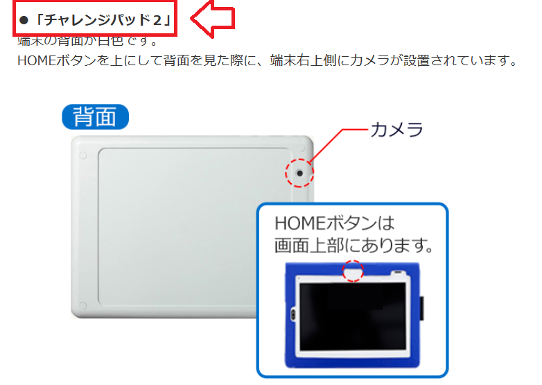 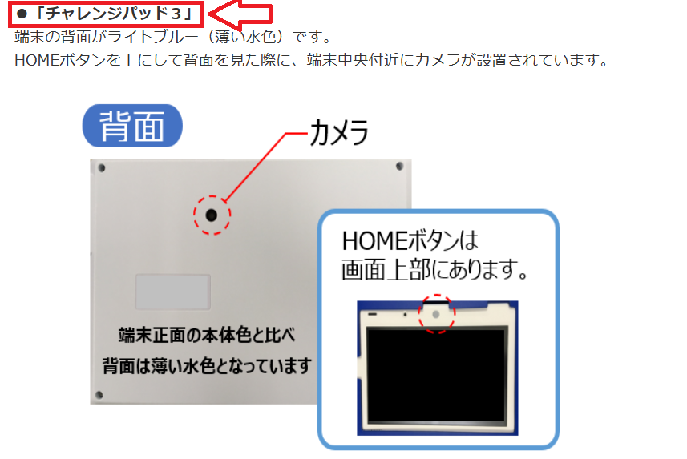

入会時にチャレンジパッド2や3だった方は、途中タブレットが故障したり、買い換えたりしない限りこのタブレットを使用し続けることになります。

また、チャレンジパッド2，3から最新のnextに買い換えを行なう場合は、前のチャレンジパッドはAndroidとして使用することができます。

それぞれ別記事で詳しく解説しています。

[✅ 進研ゼミのタブレット保証について](https://xn--5ckip8c4fq970ahbya2o7acu2a.com/2022/04/05/%e3%83%81%e3%83%a3%e3%83%ac%e3%83%b3%e3%82%b8%e3%82%bf%e3%83%83%e3%83%81%e7%ab%af%e6%9c%ab%e3%81%ae%e4%ba%a4%e6%8f%9b%e3%81%ae%e6%96%99%e9%87%91%e3%81%af%ef%bc%9f%e4%bf%9d%e8%a8%bc%e3%81%8c%e3%81%84/)

[✅ 進研ゼミタブレットをAndroid化する方法](https://xn--5ckip8c4fq970ahbya2o7acu2a.com/2022/04/30/%e3%83%81%e3%83%a3%e3%83%ac%e3%83%b3%e3%82%b8%e3%82%bf%e3%83%83%e3%83%81%e3%81%ae%e6%94%b9%e9%80%a0%e3%81%af%e5%8d%b1%e9%99%ba%ef%bc%9fandroid%e5%8c%96%e3%81%ae%e3%83%aa%e3%82%b9%e3%82%af%ef%bc%95/)

ちなみに・・・

学年によって届けられるタブレットの種類が違います。詳しく知りたいかたは「[チャレンジパッドnext](https://xn--5ckip8c4fq970ahbya2o7acu2a.com/2023/06/19/%e3%83%81%e3%83%a3%e3%83%ac%e3%83%b3%e3%82%b8%e3%83%91%e3%83%83%e3%83%89next%ef%bc%88%e3%83%8d%e3%82%af%e3%82%b9%e3%83%88%ef%bc%89%e3%81%a3%e3%81%a6%e3%81%a9%e3%82%93%e3%81%aa%e3%82%bf%e3%83%96/)」の記事で詳しく解説しています。

**チャレンジパッドnextの実際の写真**

チャレンジパッドNextのデザインはとてもシンプルで、表には薄い青色の枠があり、裏面は濃いグレーのような色となっています。

側面に設置されているボタン（電源と音量）は青色となっています。

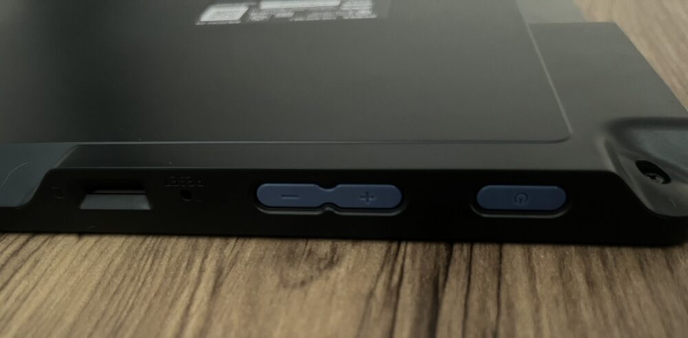

**＼2分で完了／**

[▶ 「公式」進研ゼミ小学講座に入会する](https://ck.jp.ap.valuecommerce.com/servlet/referral?sid=3613518&pid=887679902)

### 「小学生～中学生」で使用するタブレットで色は変わる？？

結論から言うと、2022年4月以降に入会した全ての小学生、中学生にチャレンジパッドNextが届けられます。

よって、学年が変わっても記事冒頭で紹介したチャレンジパッドNextを使用することになります。

写真を見ても分かる通り、シンプルで飽きにくいデザインとなっているため、小学生の低学年から中学3年生になっても問題無く使用できるでしょう。

チャレンジパッドには専用のカバーが用意されているよ

## チャレンジタッチのカバーの色は基本的に選べない？

チャレンジタッチのカバーの色は基本的に選択することができません。チャレンジタッチの申し込みフォームに進むと「※専用タブレットカバー、タッチペンはゼミが選んだ色でお届けします。ご自身ではお選びいただけません。」と表示されます。

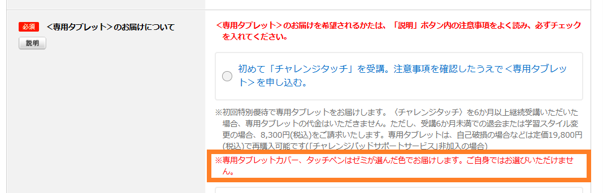

🐕

基本的には、クールブルー（青色）が届けられるよ

ただし、チャレンジタッチでは「**カラーを選ぼうキャンペーン**」というキャンペーンが定期的に開催されているので、期間中であれば色を選択することができます。

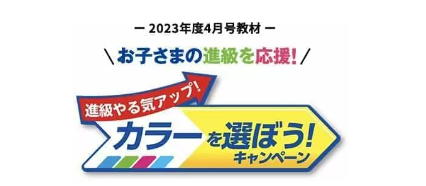

**＼2分で完了／**

[▶ 「公式」進研ゼミ小学講座に入会する](https://ck.jp.ap.valuecommerce.com/servlet/referral?sid=3613518&pid=887679902)

### チャレンジタッチカラーを選ぼうキャンペーンって何？

チャレンジタッチのタブレットカバーは基本的にはクールブルー（青色）が届けられます。しかし、「カラーを選ぼうキャンペーン」というキャンペーンの期間中であれば好きな色のカバーを選択することができます。

カバーの色は4種類用意されているよ

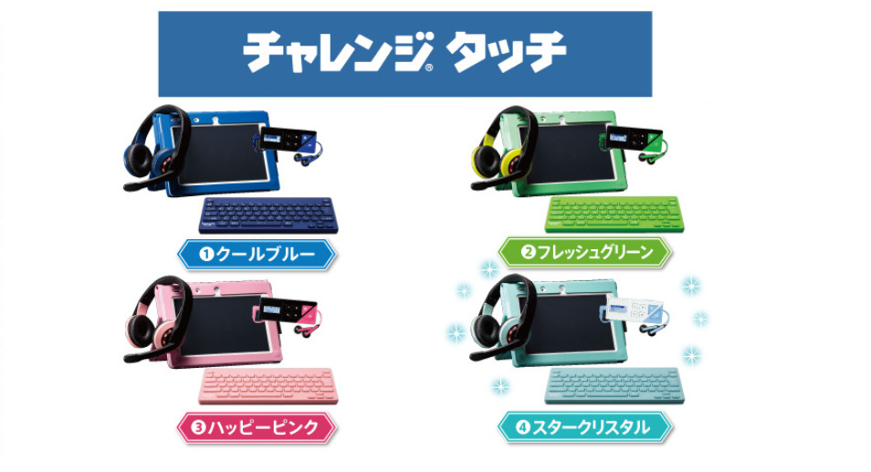※ヘッドフォンとキーボードは小学5年生限定の教材です。

| 学年 | 選べる色 |
| --- | --- |
| 小学1年生　 | コスモブルー ハッピーピンク |
| 小学2年生 | クールブルー フレッシュグリーン ハッピーピンク スタークリスタル |
| 小学3年生 | クールブルー フレッシュグリーン ハッピーピンク スタークリスタル |
| 小学4年生 | クールブルー   フレッシュグリーン   ハッピーピンク   スタークリスタル |
| 小学5年生 | クールブルー   フレッシュグリーン   ハッピーピンク   スタークリスタル |
| 小学6年生 | クールブルー   ハッピーピンク   スタークリスタル   フレッシュグリーン |

カラーを選ぼうキャンペーンは定期的に開催されていますので、気になる方は公式サイトからご確認下さい。

**＼2分で完了／**

[▶ 「公式」進研ゼミ小学講座に入会する](https://ck.jp.ap.valuecommerce.com/servlet/referral?sid=3613518&pid=887679902)

### 中学生はタブレットカバーの色を選択できない

小学生の場合、キャンペーン中であれば色を選択することができましたが、中学生は青色一択となり、これ以外の色は選べません。

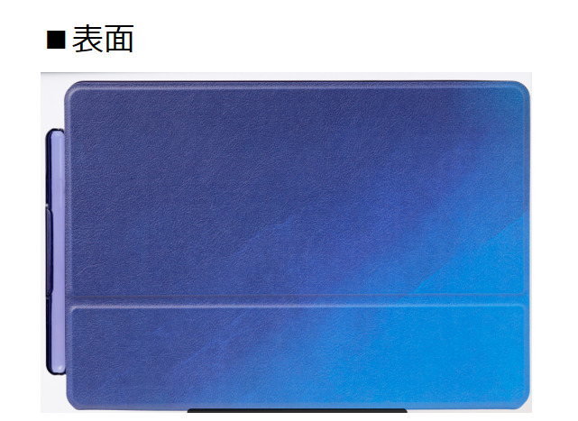表面は、小学生で提供される青色よりも濃く、青色の大人っぽいグラデーションで、裏面は黒っぽい地に青い炎のような模様があり、やる気をアップさせるデザインとなっています。

カバー表面と裏面の両方にはグラデーションがかかっており、色が変化しています。この斬新なデザインは、澄川伸一氏がリオ五輪と東京五輪で卓球台のデザインを手がけたことでも有名です。

[今すぐ進研ゼミ公式サイトから入会する（中学講座）](//ck.jp.ap.valuecommerce.com/servlet/referral?sid=3613518&pid=887679893)

### 集中力を高めたいなら青色のカバーがオススメ

色は、人間の心理や行動に大きな影響を及ぼすことが科学的に証明されています。

特に青色は、集中力を高めるだけでなくリラックス効果もあるとされており、穏やかで落ち着いた雰囲気を醸し出し、認知機能を活性化させ、集中力を高める効果があることも証明されています。

そのため、学習環境において青色を取り入れることは非常に有効です。

ピンクや緑もリラックス効果はありますが、集中力を高めるという観点からは青色が特に推奨されます。

このことから、チャレンジタッチの基本的なカバーカラーである青色は、学習をサポートする効果的な選択と言えるでしょう。

タブレットカバーの色に強いこだわりがない場合、集中力を高める効果とリラックス効果を兼ね備えた青色のカバーを選択することをおすすめですよ。

**＼2分で完了／**

[▶ 「公式」進研ゼミ小学講座に入会する](https://ck.jp.ap.valuecommerce.com/servlet/referral?sid=3613518&pid=887679902)

### 努力賞ポイントで好きな色のカバーと交換できる

チャレンジタッチでは、努力賞ポイント（24ポイント）をためると**4種類のカバー**を選ぶことができます。

交換するには24ポイントが必要だよ

- パープルスター
- 宇宙ブラック
- ラブリーフラワー
- ドリームパステル

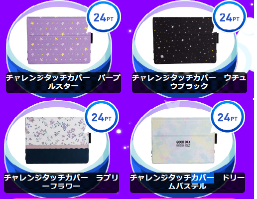ポイントで効果できるカバーは単色ではなく、それぞれ全く違ったデザインとなっています。

ポイントをためる手順

1. 月のメインレッスンをクリアする（4ポイント/月）
2. 赤ペン先生の問題（記述力指導）を提出する（1教科につき1ポイント/月）
3. 実力診断テストをクリアする（8ポイント/号）

✅ [進研ゼミの努力賞ポイント](https://xn--5ckip8c4fq970ahbya2o7acu2a.com/2023/07/10/%e3%83%81%e3%83%a3%e3%83%ac%e3%83%b3%e3%82%b8%e3%82%bf%e3%83%83%e3%83%81%e5%8a%aa%e5%8a%9b%e8%b3%9e%e3%83%9d%e3%82%a4%e3%83%b3%e3%83%88%ef%bc%81%e8%b2%b0%e3%81%88%e3%82%8b%e5%95%86%e5%93%81%e3%81%af/)について詳しく知りたいかたはこちら

## チャレンジタッチのカバーは公式サイトから購入できる

チャレンジタッチのカバーは、公式サイトの会員専用の「[消耗品、付属品購入ページ](https://bfg.benesse.ne.jp/m01/p/o/a11stk/stk0010/?product_course=TABLET)」から購入することができます。

ただし、購入できる色は**青色のみ**しか選択することができません。

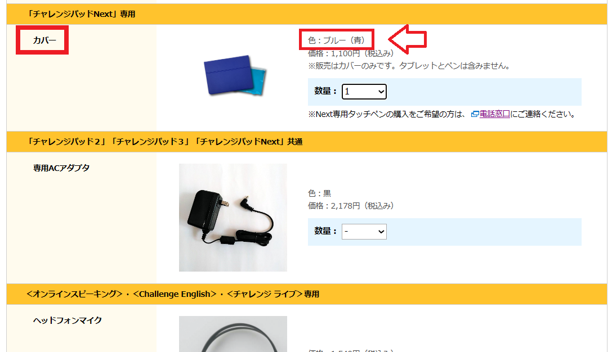基本的に「カラーを選ぼうキャンペーン」の期間中で無ければ青色以外の色を選択することはできないようです。

このため、使用しているカバーが破損した場合の為に用意されたサービスと言えます。

※カバーの料金は送料込みで1,100円（税込み）となります。

**＼2分で完了／**

[▶ 「公式」進研ゼミ小学講座に入会する](https://ck.jp.ap.valuecommerce.com/servlet/referral?sid=3613518&pid=887679902)

### 公式サイトから消耗品を購入する場合は「会員番号」が必要

購入手続きには会員番号が必要となります。会員番号は、チャレンジタッチ入会時に送られてくる会員番号シールに記載されています。

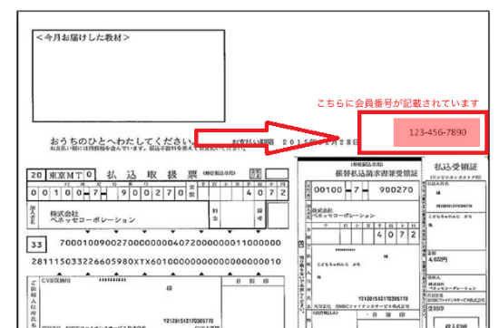

右上の赤枠の10桁の番号を入力することで、消耗品を購入することができます。

## チャレンジタッチタブレットの色に関するQ＆A

最後に、チャレンジタッチのカバーの色に関して、よくある質問をまとめました。

### チャレンジタッチの限定色を購入したい

チャレンジタッチのカバーには、先ほどカラーを選ぼうキャンペーンで紹介した４色以外に、シャイニースカイという限定色があります。

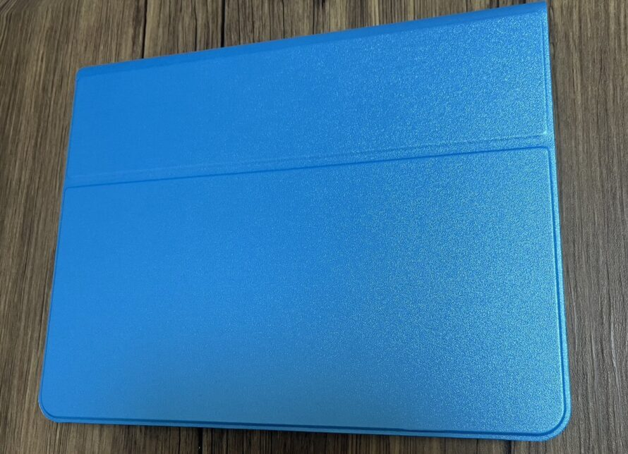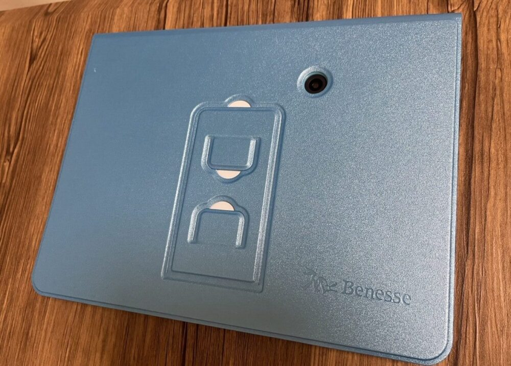この色は、新学年の早期入会特典の対象となっています。2023年度分の受付は終了しとなっていました。

**＼2分で完了／**

[▶ 「公式」進研ゼミ小学講座に入会する](https://ck.jp.ap.valuecommerce.com/servlet/referral?sid=3613518&pid=887679902)

### チャレンジタッチのカバーはメルカリなどのフリマで購入することもできる

中古品に対する抵抗感がない方なら、メルカリやヤフオクなどのオンラインフリーマーケットでチャレンジタッチのカバーを探してみるのもいいでしょう。

タイミングによっては限定色のカバーが出品されていることもあります。通常は手に入りにくい色やデザインのカバーを見つけることができるかもしれません。

どうしても欲しい色のカバーがある場合は一度探してみるといいですよ。

### タブレットの保護フィルムはブルーライトカットがオススメ

タブレットで勉強させる際には、ブルーライトをカットできる保護フィルムを貼るのをオススメします。

タブレットは、勉強するために何度も使用するものですから、できるだけ目にかかる負担を減らしてあげるといいですよ。

タブレット学習のブルーライトに関する関する内容は別の記事で解説しています。

✅ [タブレット学習「視力低下の原因」多くの人がやりがちなアレが目に悪い？](https://xn--5ckip8c4fq970ahbya2o7acu2a.com/2021/12/24/%e3%82%bf%e3%83%96%e3%83%ac%e3%83%83%e3%83%88%e5%ad%a6%e7%bf%92%e3%81%a7%e3%80%90%e8%a6%96%e5%8a%9b%e3%81%8c%e4%bd%8e%e4%b8%8b%e3%80%91%e3%81%99%e3%82%8b%e7%b5%b6%e5%af%beng%e3%81%aa%e8%a1%8c%e7%82%ba/)

### チャレンジタッチのペンの色は選べる？

チャレンジタッチのペンは、タブレットカバーと同じ色が送られてきます。

うちの場合、シャイニースカイのカバーの色だった為、タッチペンも同じ色が送られてきました。

ちなみに、タッチペンは電池式となっているため電池がなくなったら交換する必要があります。

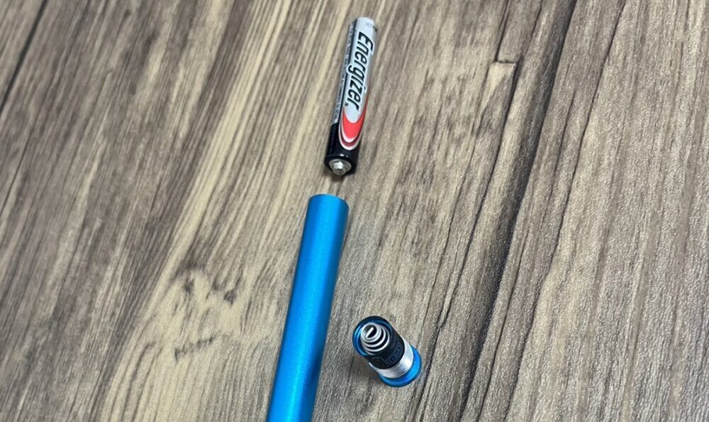

**＼2分で完了／**

[▶ 「公式」進研ゼミ小学講座に入会する](https://ck.jp.ap.valuecommerce.com/servlet/referral?sid=3613518&pid=887679902)
