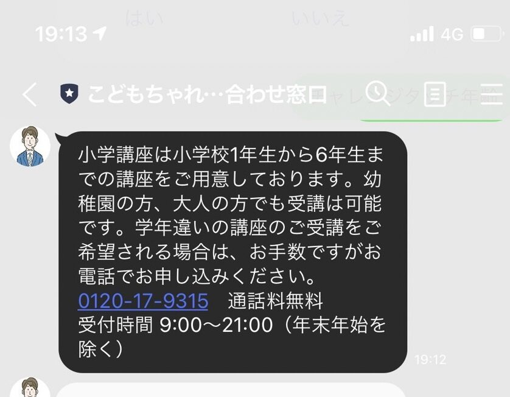
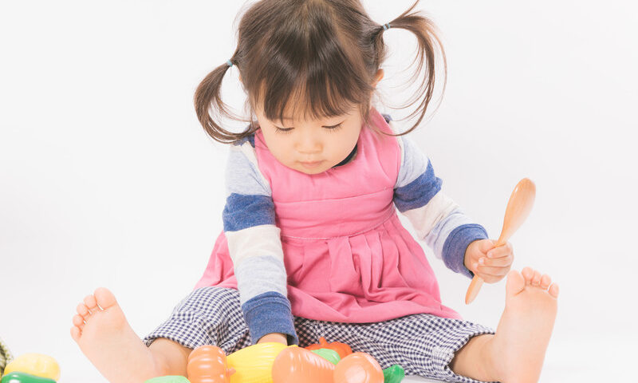

🐕

進研ゼミチャレンジタッチには「何歳～何歳まで」という年齢制限はあるの？

今回は、こどもちゃれんじ（幼児向け）ではなく、小学生向けのチャレンジタッチを利用できる年齢を紹介します。

また、小さいお子さんが進研ゼミでタブレット学習をする際の注意点も同時に解説していきます。

## チャレンジタッチは何歳から始められる？

結論から言うと**進研ゼミチャレンジタッチは何歳からであっても始めることができます**。

幼児の子供が小学生の勉強を先取りすることも可能です。[進研ゼミの幼児先取り学習](https://xn--5ckip8c4fq970ahbya2o7acu2a.com/2023/05/10/%e5%b9%bc%e5%85%90%ef%bd%9e%e5%b0%8f%e5%ad%a61%e5%b9%b4%e7%94%9f%ef%bc%9a%e3%83%81%e3%83%a3%e3%83%ac%e3%83%b3%e3%82%b8%e3%82%bf%e3%83%83%e3%83%81%e3%81%ae%e5%85%88%e5%8f%96%e3%82%8a%e3%81%af%e5%85%88/)については別記事で詳しく解説しています。

チャレンジタッチ窓口に問い合わせた内容を紹介するよ

チャレンジタッチには、ＬＩＮＥから直接質問できる窓口が用意されています。

今回はチャレンジタッチ小学講座のについて問い合わせをしてみました。

**返答内容**

小学講座は小学校1年生から6年生までの講座をご用意しております。幼稚園の方、大人の方でも受講は可能です。学年違いの講座のご受講をご希望される場合は、お手数ですがお電話でお申し込みください。 0120-17-9315　通話料無料 受付時間 9:00～21:00（年末年始を除く）

返答にある通り、チャレンジタッチは幼児から大人まで希望者は全て申し込みをすることが可能です。

ただし、1つ注意点があります。

学習レベルがお子さんに合っていないと勉強に対して「苦手・嫌い」といった意識を持つ原因になってしまいます。

先取り学習を考えている方は子供に合った適切なレベルを選んであげることが大切になります。

🐕

幼児がチャレンジタッチに先行申し込みする場合、準備スタートボックスというキャンペーンを利用することができるよ

[✅ 準備スタートボックスに申し込みをすると8個の豪華特典](https://xn--5ckip8c4fq970ahbya2o7acu2a.com/2023/07/03/1%e5%b9%b4%e7%94%9f%e6%ba%96%e5%82%99%e3%82%b9%e3%82%bf%e3%83%bc%e3%83%88%e3%83%9c%e3%83%83%e3%82%af%e3%82%b9%e3%81%ae%e8%b1%aa%e8%8f%af%e7%89%b9%e5%85%b88%e3%81%a4%e3%81%a8%e3%81%af%ef%bc%9f%e7%99%bb/)が貰えます。

[✅ 幼児用のこどもチャレンジ資料請求はこちら](//ck.jp.ap.valuecommerce.com/servlet/referral?sid=3613518&pid=887747681)

### 学年を超えた申し込みは電話が必要

お問い合わせ内容の返答にも記載されていたように、**学年が違う講座の受講を希望する場合は、**電話で申し込み****をしなければいけません。

これには、申し込みの際に間違えて違う学年を選択していないかを確認する目的があると考えられます。

ネット申し込みをしたい人には面倒くさいかもしれませんが、学年が違う講座を申し込むには電話からの申し込みが必須となっているようです。

電話番号　　0120-17-9315 受付時間 9:00～21:00（年末年始を除く）

[今すぐ「チャレンジタッチ」に入会する](//ck.jp.ap.valuecommerce.com/servlet/referral?sid=3613518&pid=887747673)

[今すぐ「こどもちゃれんじ」に入会する](//ck.jp.ap.valuecommerce.com/servlet/referral?sid=3613518&pid=887747681)

## 進研ゼミは何歳から始めるべき？

**人間のIQは3歳までにどれだけ多くの良質な経験をしたかによって大きく変わります。**

「ＩＱは３歳までにいかに脳回路のネットワークを育てることができるか」によって決定することが分かっています。

🐕

ただ、「3歳を過ぎてしまった子にはもう遅いのか？」と言うとそうではありません。

3歳～6歳までの間に**「解決力・思考力・想像力」**の力が身に付きます。

**いわゆる「地頭が良い子」**に育てるために3歳～6歳までの教育が非常に重要と言えます。

つまり、

「0歳～3歳」までがＩＱの成長に大切

「3歳～6歳」までが地頭の良さに繋がる

小さい子供の教育にはとっても有効です。

キャラクターと一緒にたくさんの感覚を使った学習をすることで、「解決力・思考

[今すぐ「チャレンジタッチ」に入会する](//ck.jp.ap.valuecommerce.com/servlet/referral?sid=3613518&pid=887747673)

[今すぐ「こどもちゃれんじ」に入会する](//ck.jp.ap.valuecommerce.com/servlet/referral?sid=3613518&pid=887747681)

## 小さい子供にタブレット学習の悪影響は？

小さいうちからタブレット学習をして悪影響がないか心配な方も多いのではないでしょうか？

小さい子供のタブレットで学習は記憶に定着しやすくなるメリットがあります。

一方、長時間の連続使用は子供の視力の低下に繋がる可能性があります。

**合わせて読みたい**

[子供のタブレット学習は視力が心配？](https://xn--5ckip8c4fq970ahbya2o7acu2a.com/2021/12/24/%e3%82%bf%e3%83%96%e3%83%ac%e3%83%83%e3%83%88%e5%ad%a6%e7%bf%92%e3%81%a7%e3%80%90%e8%a6%96%e5%8a%9b%e3%81%8c%e4%bd%8e%e4%b8%8b%e3%80%91%e3%81%99%e3%82%8b%e7%b5%b6%e5%af%beng%e3%81%aa%e8%a1%8c%e7%82%ba/)

タブレット学習、タブレットやＰＣなどの画面を見ることになるので、長時間の使用は避けましょう。

🐕

子供のうちは30分～1時間以内に1回は10分くらい目をやすませて使うのがいいよ

少し休憩を入れることで目への負担を格段に減らす事ができます。

進研ゼミでは、「タブレット学習と紙教材」の2つのスタイルから選択することができます。

心配な方は紙教材を選択すると良いでしょう。

## 進研ゼミの対象レベルを確認する方法

進研ゼミの対象レベルを確認するには**資料請求のお試し教材で体験するのが一番です**。

資料請求には、学年別でお試し教材を取り寄せすることが可能です。

・こどもちゃれんじ（幼児用）

・チャレンジタッチ（小学生用）

🐕

実際に問題を解いたり、学習内容に触れるだけでもかなり違うよ

適正学年が分からない人はまずは資料請求をしてみましょう。

[「](//ck.jp.ap.valuecommerce.com/servlet/referral?sid=3613518&pid=887747673)[チャレンジタッチ」の資料請求をする](//ck.jp.ap.valuecommerce.com/servlet/referral?sid=3613518&pid=887747673)

[「こどもチャレンジ」の資料請求はこちら](//ck.jp.ap.valuecommerce.com/servlet/referral?sid=3613518&pid=887747681)
