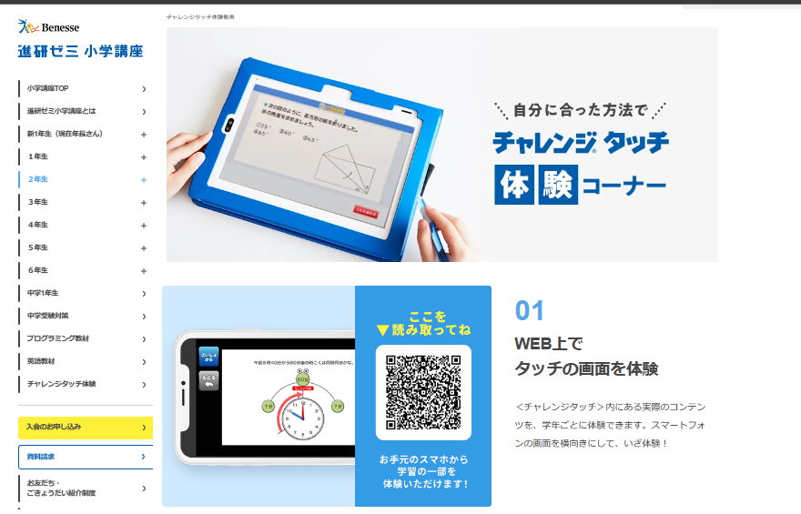

タブレット教材の中でも1番人気で利用者の多いチャレンジタッチですが、受講者の中には途中で辞めて、入会したことを**後悔**している人も一定数いるようです。

せっかくお金を払って受講させているのに、「途中でやらなくなってしまった」とはなってほしくないですよね？

そこで今回は、チャレンジタッチに入会したいけれど、子供が続けられるか不安を感じている方に向けて、**チャレンジタッチを辞めた人の理由**を徹底調査してみました。

チャレンジタッチを辞めた理由をあらかじめ知っておくことで、どんな子には合わないのか？逆にどんな子が受講すれば成績を伸ばすことができるのかを判断することができるようになります。

チャレンジタッチへの入会を考えている方は、是非最後までご覧ください。

## チャレンジタッチを辞めた理由：①紙教材の方がよかった

チャレンジタッチを辞めた理由として、「タブレットで勉強するよりも紙の方が良かった」という声がありました。

<blockquote class="twitter-tweet">
チャレンジタッチ退会。 そのまま2年生講座に行けなかったけど 毎日楽しく使っていた息子 (ゲームばっかり) ゲームはタブレットで勉強は紙でと わけないとダメな事がわかった。
息子に合うやり方やレベルを模索する。子どもは勝手に育つ、はずがない🥺

— だいたい毎日リュック&amp;スニーカー (@wNZvm5fCUiB48PG)&nbsp;<a href="https://twitter.com/wNZvm5fCUiB48PG/status/1593581924819251200?ref_src=twsrc%5Etfw">November 18, 2022</a></blockquote>

確かに、これは[タブレット学習のデメリット](https://xn--5ckip8c4fq970ahbya2o7acu2a.com/2022/02/16/%e3%82%bf%e3%83%96%e3%83%ac%e3%83%83%e3%83%88%e5%ad%a6%e7%bf%92%e3%83%87%e3%83%a1%e3%83%aa%e3%83%83%e3%83%88%ef%bc%81%e3%82%b2%e3%83%bc%e3%83%a0%e3%82%84sns%e3%81%ab%e6%99%82%e9%96%93%e3%82%92/)の1つで、子供はゲームや動画の方が楽しいからそればかりやってしまうことはタブレット学習でも1つの問題です。

しかし、チャレンジタッチでは、今の所ゲームを制限する機能は用意されていません。

おそらく、チャレンジタッチのゲームは勉強の一環として配信されているからだと思われます。

進研ゼミには紙教材のチャレンジもあるよ

「うちの子はゲームが大好きだから、タブレット学習でゲームばかりしそうで心配」という方は、紙教材で勉強を進めるチャレンジがおすすめです。

チャレンジでは、毎月届く紙教材で勉強を進めていきます。ゲームの制限だけでなく、紙に書かせて勉強させたいという方はチャレンジを選択するといいですよ♪

[チャレンジタッチとチャレンジの違い](https://xn--5ckip8c4fq970ahbya2o7acu2a.com/2022/02/12/%e3%83%81%e3%83%a3%e3%83%ac%e3%83%b3%e3%82%b8%e3%82%bf%e3%83%83%e3%83%81%e3%81%a8%e3%83%81%e3%83%a3%e3%83%ac%e3%83%b3%e3%82%b8%e9%81%b8%e3%81%b6%e3%81%aa%e3%82%89%e3%81%a9%e3%81%a3%e3%81%a1%ef%bc%9f/)は別の記事で詳しく解説しています♪

🐕

スマイルゼミならゲームの制限がかけられるよ

タブレット学習でゲームの制限をかけたいならスマイルゼミがオススメです。

「[スマイルゼミの機能制限」](https://xn--5ckip8c4fq970ahbya2o7acu2a.com/2021/06/30/%e3%82%b9%e3%83%9e%e3%82%a4%e3%83%ab%e3%82%bc%e3%83%9f%e5%b0%8f%e5%ad%a6%e7%94%9f%e3%81%ae%e3%80%8c%e5%8f%a3%e3%82%b3%e3%83%9f%e3%83%bb%e8%a9%95%e5%88%a4%e3%80%8d%e3%81%8c%e6%9c%80%e6%82%aa%e3%81%a8/)では、ゲームの使用制限を０分～６０分まで１０分刻みで設定できるようになっています。

しっかり勉強を頑張った月はゲームが使用できる時間を長くするなど、うまく使えば、子供の勉強のやる気をＵＰさせることもできますよ。

[スマイルゼミとチャレンジタッチの違い](https://xn--5ckip8c4fq970ahbya2o7acu2a.com/2022/01/24/%e3%80%8c%e3%83%81%e3%83%a3%e3%83%ac%e3%83%b3%e3%82%b8%e3%82%bf%e3%83%83%e3%83%81%e3%83%bb%e3%82%b9%e3%83%9e%e3%82%a4%e3%83%ab%e3%82%bc%e3%83%9f%e3%80%8d%e5%8b%89%e5%bc%b7%e3%81%ae%e7%bf%92%e6%85%a3/)はこちら

## チャレンジタッチを辞めた理由：②塾だけでいい

「塾だけでいい」これもチャレンジタッチを解約した人によくある口コミですね！

<blockquote class="twitter-tweet">
２年生からやってたチャレンジタッチ解約したわぁ 毎度やってはいるんだけど面倒臭がりで言われないとやらなくなってきたのでね…しかも授業の方が先行して進んでるのと先生の方が分かりやすいとな… テストの点数もほぼ満点だから自主学習か分からなくなったら塾でいいかも…
— みなき (@minakiyuu1103) <a href="https://twitter.com/minakiyuu1103/status/1594521298772054016?ref_src=twsrc%5Etfw">November 21, 2022</a></blockquote>

チャレンジタッチは、教科書に沿って、アニメーションを使って楽しく勉強できる教材で、基礎を1から習得するにはとっても良い教材と言えます。

その一方で、塾だけで基礎～応用までの範囲をカバーできており、子供が勉強に対してやる気をなくさない環境がととのっている場合、チャレンジタッチを使う**必要はない**と言えます。

ただ、通っている塾が特定の科目だけに力を入れている場合や、「この分野のここだけは基礎からやり直したい」という方にはチャレンジタッチは効果を発揮します。

なかなか子供だけでは何が必要で、何が必要ではないのかを判断するのが難しいです。親御さんが普段の宿題やテストの結果から子供に合った学習方法を探してあげるといいですよ♪

## チャレンジタッチを辞めた理由：③物足りなかった

難易度や勉強量に対して「物足りなさを感じる」というのもチャレンジタッチを利用している人の口コミでよく見かけます。

<blockquote class="twitter-tweet">
娘、チャレンジタッチ解約決定～～～😌😌😌 楽しいけど物足りないらしい。そっか。しょうがないね🙄🙄🙄
でもやはり娘はタブレット学習派。 やはりここは私オススメのビノバシリーズかなwwwww 今日娘のタブレットに入れたらずっとやってる💪💪💪 基礎基礎の基礎には持ってこい💪💪💪

— 里緒＠♂2026🏠中受&nbsp;♀2028中受2031♪̊̈♪̆̈受 (@rio_gift_iq)&nbsp;<a href="https://twitter.com/rio_gift_iq/status/1403313483253383169?ref_src=twsrc%5Etfw">June 11, 2021</a></blockquote>

<blockquote class="twitter-tweet">
息子には進研ゼミだと簡単すぎる気がしてたから、ある程度大きくなったらZ会に変更しようかな〜と考えていた。でもまさか小学生なる前に、チャレンジ簡単だからやめたいというとは思わなかった。プレゼントも、化石以外いらないってクールな感じだし💦同じ育て方でも全然違う💦
— れいさん (@rei_0_san) <a href="https://twitter.com/rei_0_san/status/1636940824251633664?ref_src=twsrc%5Etfw">March 18, 2023</a></blockquote>

チャレンジタッチは、他のタブレット教材の中でも難易度は低めに設定されています。そのため、「たくさん勉強して応用問題にもバンバン挑戦してテストで90点以上を目指したい」という子どもたちには、向かない教材と言えます。

チャレンジタッチでは、**徹底的に基礎を定着させることを大切にしており**、勉強が得意な子供よりも、比較的勉強が苦手で、テストの点数にも自信がない子に向いている教材です。

そのため、「簡単すぎる」と感じる子も多いかもしれませんが、勉強の基礎をかためることができれば、学年が上がったり、中学、高校生になった際に勉強をスムーズに進めるためにはとっても大切になります。

「基礎がすでにできている」こどもには、必要ないかもしれませんが、少しでも勉強に対して苦手意識がある子には、有効な教材と言えます。

すでに基礎に自信があり、「もう少し応用問題や難易度の高い問題に挑戦したい」という子には、[スマイルゼミの特進クラス](https://xn--5ckip8c4fq970ahbya2o7acu2a.com/2022/02/09/%e3%82%b9%e3%83%9e%e3%82%a4%e3%83%ab%e3%82%bc%e3%83%9f%e7%89%b9%e9%80%b2%e3%82%af%e3%83%a9%e3%82%b9%e3%81%af%e3%81%84%e3%81%a4%e3%81%8b%e3%82%89%e5%a7%8b%e3%82%81%e3%82%8b%e3%81%b9%e3%81%8d%ef%bc%9f/)や[Z会](https://xn--5ckip8c4fq970ahbya2o7acu2a.com/2022/01/17/z%e4%bc%9a%e5%8f%a3%e3%82%b3%e3%83%9f/)がオススメです。

ちなみに、進研ゼミにも「[ハイレベルコース](https://xn--5ckip8c4fq970ahbya2o7acu2a.com/2023/08/30/%e3%83%81%e3%83%a3%e3%83%ac%e3%83%b3%e3%82%b8%e3%82%bf%e3%83%83%e3%83%81%e3%83%8f%e3%82%a4%e3%83%ac%e3%83%99%e3%83%ab%e3%82%b3%e3%83%bc%e3%82%b9%e3%81%ae%e5%a4%89%e6%9b%b4%e8%a8%ad%e5%ae%9a%e3%81%af1/)」というレベルの高いコースも用意されています。気になる方は別記事をご覧下さい。

**＼5分で完了／**

[▶ 「公式」今すぐチャレンジタッチに入会する](https://ck.jp.ap.valuecommerce.com/servlet/referral?sid=3613518&pid=887679902)

## チャレンジタッチを辞めた理由：④時間に余裕がなくなった

次に、「チャレンジタッチ自体をやる時間がなくなった」という理由です。

<blockquote class="twitter-tweet">
2学年先取りのチャレンジタッチ、解約しましたー‼️
さすがに小学校受験を控える中、2学年もの先取りの余裕なし😅 掛け算だって半分しか覚えてないし。

チャレンジEnglishだけは捨て難くてやってたけど、やむなし。

来年の今頃、また続きから受講するかもしれません。

— 夏恋🌹2028中受&amp;おうち英語7y2y (@nanatsukoikoi)&nbsp;<a href="https://twitter.com/nanatsukoikoi/status/1401847646977871876?ref_src=twsrc%5Etfw">June 7, 2021</a></blockquote>[中学受験](https://xn--5ckip8c4fq970ahbya2o7acu2a.com/2022/04/20/%e9%80%b2%e7%a0%94%e3%82%bc%e3%83%9f%e3%83%81%e3%83%a3%e3%83%ac%e3%83%b3%e3%82%b8%e3%82%bf%e3%83%83%e3%83%81%e3%81%ae%e3%81%bf%e3%81%a7%e4%b8%ad%e5%ad%a6%e5%8f%97%e9%a8%93%e3%81%af%e9%9b%a3%e3%81%97/)を控えている子や、習い事をたくさんやってい子は、チャレンジタッチをする時間を作ること自体が難しいかもしれません。

当然ですが、どんなに忙しくても小学生にとっては遊ぶ時間も大切です。

もし今の時点での他の習い事（塾など）でカバーできていれば、[チャレンジタッチを解約](https://xn--5ckip8c4fq970ahbya2o7acu2a.com/2021/09/18/1175/)しても問題はないでしょう。

大切なのは、子供が自分自身に合ったペースで勉強し、必要な基礎知識をしっかりと身につけることです。

そのための手段は一つではありません。それがチャレンジタッチであれ、他の習い事であれ、自分に合った学び方を見つけて、楽しみながら学んでいくことが大切です。

## チャレンジタッチを辞めた理由：⑤宿題だけで手一杯

「学校の宿題だけで時間がかかり、チャレンジタッチを進める時間がない」このような悩みを抱える子も意外は多くいました。

<blockquote class="twitter-tweet">
あかん… 小3長男、週末だけ日記を書く宿題が追加されたら日記にめちゃくちゃ時間かかってチャレンジタッチまで行きつかない…… プログラミングなんて無理無理の無理。 なんで受講しちゃったかなと後悔するレベルで手を付けてないプログラミング😭
— あずみち (@azum_no) <a href="https://twitter.com/azum_no/status/1393764863403466755?ref_src=twsrc%5Etfw">May 16, 2021</a></blockquote>

これは「[勉強しない中学生](https://xn--5ckip8c4fq970ahbya2o7acu2a.com/2023/08/09/%e5%8b%89%e5%bc%b7%e3%81%97%e3%81%aa%e3%81%84%e4%b8%ad%e5%ad%a6%e7%94%9f%e3%80%8c%e3%81%bb%e3%81%a3%e3%81%a8%e3%81%8f%e3%80%8d%e3%83%aa%e3%82%b9%e3%82%af%e3%81%a8%e3%81%af%ef%bc%81%ef%bc%9f%e4%b8%ad/)」の理由としてもあげられています。

勉強が苦手な子にとって、分からない内容の宿題が出ると、それを終わらせるだけでもかなりの時間がかかってしまいます。

そのため、チャレンジタッチをやっている暇がなく「全然進められないから解約する」というパターンが多いようです。

ただ、基本的に学校で出される宿題は、先生が授業でやった内容をもとにクラスの子全員が解けるレベルの問題が出題されているはずです。

学校で出た宿題に時間がかかってしまうのは、基礎ができていない証拠でもあります。

このように、**宿題に時間がかかる子**は、勉強の基礎ができておらず、チャレンジタッチをやる時間が取れなくなっている可能性があります。

ただ、このように基礎ができていない子にこそ、チャレンジタッチのような教材を使って基礎を完璧にすることでテストで良い点数を取る近道です。

もちろん、チャレンジタッチだけが基礎を身につける方法ではないので、他に子どもに合った勉強方法があれば、そちらを選択してもらってもＯＫです。

基礎ができるようになれば自然と宿題も短い時間で終わらる力が身に付きます。

**＼5分で完了／**

[▶ 「公式」今すぐチャレンジタッチに入会する](https://ck.jp.ap.valuecommerce.com/servlet/referral?sid=3613518&pid=887679902)

## チャレンジタッチを辞めた理由：⑥タブレット学習が合わなかった

最近では、「今流行のタブレット学習を子どもにさせたい」という思いから、チャレンジタッチを受講させる家庭が増えています。

しかし、中にはタブレットで勉強することが合わない子もいます。

<blockquote class="twitter-tweet">
チャレンジタッチ解約！最初は漢字もタブレットならやりやすいって言ってたのにやはり書くことには変わらないとダメだった… タブレットならいけるかなーと思ったんだけどなー 高い勉強代だったわ😭
— ぴやこ (@ttpyapya) <a href="https://twitter.com/ttpyapya/status/1400817585277476865?ref_src=twsrc%5Etfw">June 4, 2021</a></blockquote>

チャレンジタッチのタブレット学習は、新しい形の学習法として人気があります。アニメーションの解説で理解を深めたり、直接画面に書き込んで学べるので、効率的で楽しく勉強を進めることができます。

しかし、その反面、タブレット学習には「書きにくい」「ゲームばかりやってしまう」といったデメリットもあります。（最新型の[チャレンジパッドnext](https://xn--5ckip8c4fq970ahbya2o7acu2a.com/2023/06/19/%e3%83%81%e3%83%a3%e3%83%ac%e3%83%b3%e3%82%b8%e3%83%91%e3%83%83%e3%83%89next%ef%bc%88%e3%83%8d%e3%82%af%e3%82%b9%e3%83%88%ef%bc%89%e3%81%a3%e3%81%a6%e3%81%a9%e3%82%93%e3%81%aa%e3%82%bf%e3%83%96/)では手をついてかくことが出来ます。）

タブレット学習には、向き不向きがあり、タブレットを使って勉強することで集中力を高め、成績を上げられる子もいれば、その逆にタブレット学習が合わず集中力が下がってしまう子もいます。

こればかりは実際にタブレット学習を体験してみないと、向き・不向きを判断することは難しいので実際に体験してみるといいですよ♪

進研ゼミの公式サイトでは、スマホでは手元にあるスマホで、タブレット学習を体験することができます。

また、資料請求をすればお試しの無料教材が届けられます。興味のある方は公式サイトからどうぞ♪

**＼5分で完了／**

[▶ 「公式」今すぐチャレンジタッチの資料請求をする](https://ck.jp.ap.valuecommerce.com/servlet/referral?sid=3613518&pid=887679902)

## チャレンジタッチに入会して後悔した人の特徴：まとめ

ここまで、チャレンジタッチを実際に利用して辞めた人の声を紹介しました。

チャレンジタッチを辞めた理由

- タブレットではなく紙教材の方が良かった
- 塾だけで十分
- 応用問題にも適度に挑戦したかった
- 塾などの習い事でチャレンジタッチをやっている余裕がない
- 学校の宿題だけで手一杯

チャレンジタッチは、基礎を身につけたい子や勉強に苦手意識がある子には「丁寧な解説で分かりやすい」と好評です。

しかし逆に「基礎的な問題ではなく応用問題にたくさん挑戦したい」という子にとっては**物足りなさ**を感じているようです。

今回は、チャレンジタッチを辞めた理由について調査しました。

ただ、チャレンジタッチに関する良い口コミもたくさん見つかりました。気になる方は別記事で紹介ているので、そちらをご覧下さい。

あわせて読みたい

- [チャレンジタッチの良い口コミ・悪い口コミ](https://xn--5ckip8c4fq970ahbya2o7acu2a.com/2022/01/09/%e9%80%b2%e7%a0%94%e3%82%bc%e3%83%9f-%e5%b0%8f%e5%ad%a6%e8%ac%9b%e5%ba%a7%e3%81%ae%e5%8f%a3%e3%82%b3%e3%83%9f%e8%a9%95%e5%88%a4%e5%ae%8c%e5%85%a8%e3%81%be%e3%81%a8%e3%82%81/)
- [チャレンジタッチの1年生～6年生の料金](https://xn--5ckip8c4fq970ahbya2o7acu2a.com/2023/10/18/%e3%83%81%e3%83%a3%e3%83%ac%e3%83%b3%e3%82%b8%e3%82%bf%e3%83%83%e3%83%81%e3%80%8c%e5%b0%8f%e5%ad%a6%e7%94%9f%e3%80%8d%e6%96%99%e9%87%91%e3%81%be%e3%81%a8%e3%82%81%ef%bc%8112%e3%83%b6%e6%9c%88-2/)
- [無料で貰えるチャレンジパッドnextとは？](https://xn--5ckip8c4fq970ahbya2o7acu2a.com/2023/06/19/%e3%83%81%e3%83%a3%e3%83%ac%e3%83%b3%e3%82%b8%e3%83%91%e3%83%83%e3%83%89next%ef%bc%88%e3%83%8d%e3%82%af%e3%82%b9%e3%83%88%ef%bc%89%e3%81%a3%e3%81%a6%e3%81%a9%e3%82%93%e3%81%aa%e3%82%bf%e3%83%96/)

## チャレンジタッチを継続して成績が向上する子の特徴は？

ここまで、読んでいただいた方なら分かると思いますが、基本的にチャレンジタッチという教材は、勉強が苦手な子に向けて作られた教材です。

すでに基礎ができている子や、応用問題を中心に勉強したい子は、入会しても辞める傾向にあるようです。

✅ では、チャレンジタッチを利用した方がテストの成績が上がる子は、どんな特徴があるのでしょうか？

チャレンジタッチが他のタブレット教材と比べて**優れてい**るのは、勉強の基礎をみにつけやすいという点です。

このメリットを生かし、チャレンジタッチでは、基礎を完璧にするために使用するだけでも、元々勉強が苦手な子には十分成績の向上につながります。

🐕

子どもの特徴に合わせた教材を選ぶことが成績UPにつながるよ

**＼5分で完了／**

[▶ 「公式」今すぐチャレンジタッチに入会する](https://ck.jp.ap.valuecommerce.com/servlet/referral?sid=3613518&pid=887679902)
