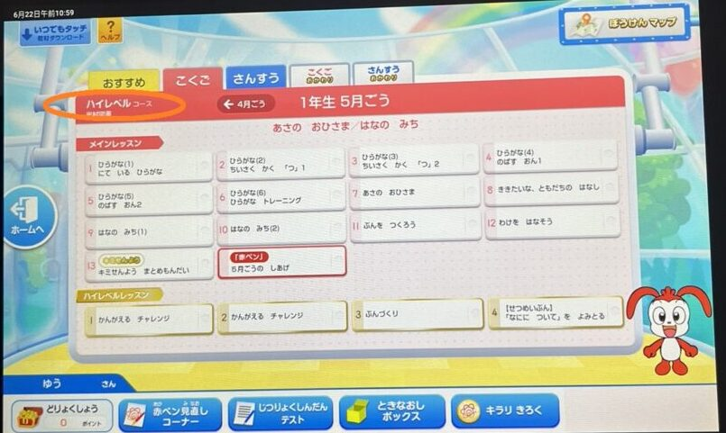
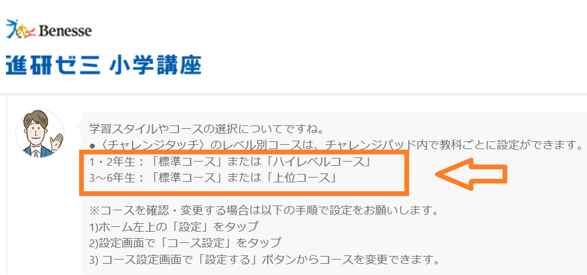
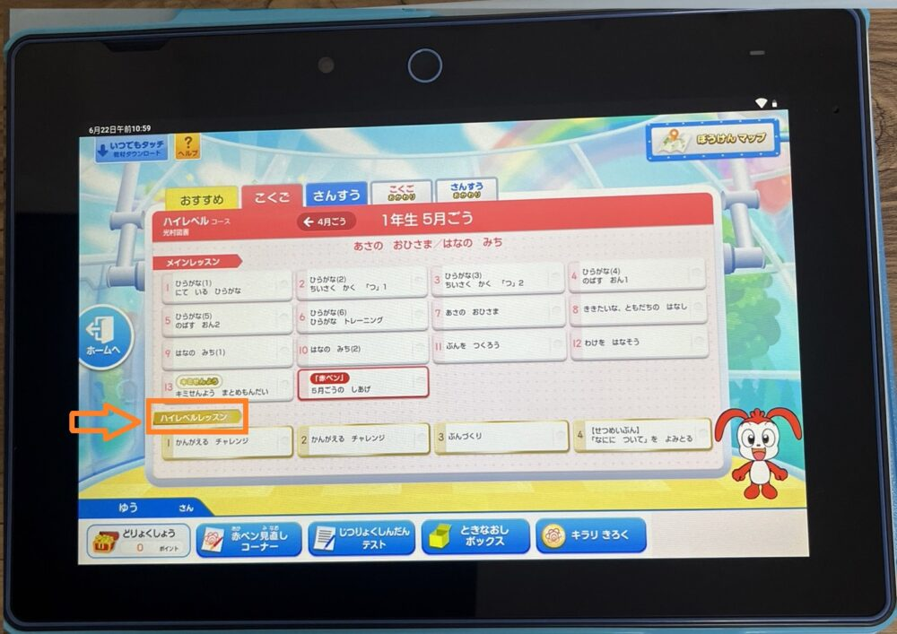
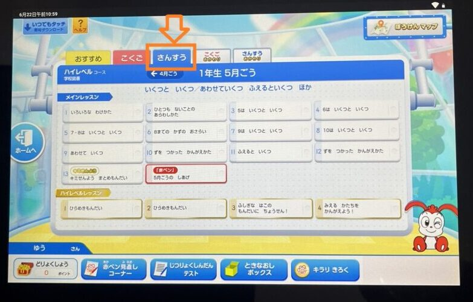
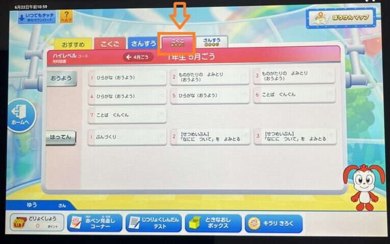
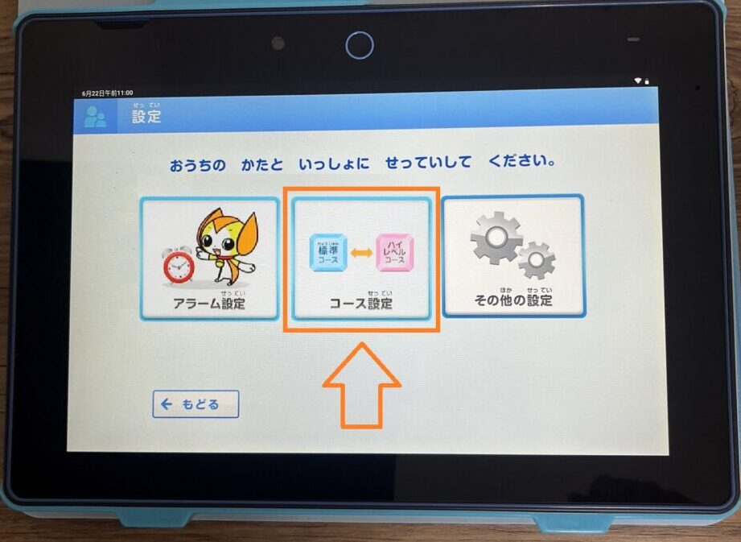
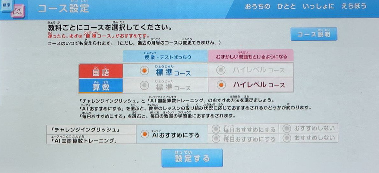

チャレンジタッチでは2023年度から標準コースとハイレベルコースで自由に選べるようになりました。

ただ、ハイレベルコースと言っても、「難易度・問題量・コース切り替え方」などよくわからないですよね？

今回はチャレンジタッチのハイレベルコースに関して、以下のポイントについて詳しく解説していきます。

- 問題の難易度
- 問題の量
- 標準コースとの違い
- 対象学年
- 料金について
- コースの変更方法

この記事を最後まで読むと、ハイレベルコースがどんなコースで、どれくらいの難易度なのかを理解することができます。

さらに、お子さんのレベルにあったコースを判断できるようになるので、是非最後までご覧下さい。

ハイレベルコースの変更設定が知りたい人は[ここからスキップ](#Form1)してね♪

## チャレンジタッチのハイレベルコースとは？

チャレンジタッチのハイレベルコースとは、進研ゼミの小学生講座（チャレンジタッチ）における**レベルの高い上級コース**のことです。

🐕

ハイレベルコースはチャレンジタッチ（タブレットコース）を選択している人が対象だよ

[✅ チャレンジとチャレンジタッチの違い](https://xn--5ckip8c4fq970ahbya2o7acu2a.com/2022/02/12/%e3%83%81%e3%83%a3%e3%83%ac%e3%83%b3%e3%82%b8%e3%82%bf%e3%83%83%e3%83%81%e3%81%a8%e3%83%81%e3%83%a3%e3%83%ac%e3%83%b3%e3%82%b8%e9%81%b8%e3%81%b6%e3%81%aa%e3%82%89%e3%81%a9%e3%81%a3%e3%81%a1%ef%bc%9f/)は別記事で解説しています♪

✅ 進研ゼミ入会した全ての人が対象：[無料で1000冊読み放題](https://xn--5ckip8c4fq970ahbya2o7acu2a.com/2023/07/18/%e3%83%81%e3%83%a3%e3%83%ac%e3%83%b3%e3%82%b8%e3%82%bf%e3%83%83%e3%83%81%e3%81%ae%e6%9c%ac%e8%aa%ad%e3%81%bf%e6%94%be%e9%a1%8c%e3%82%b5%e3%83%bc%e3%83%93%e3%82%b9%e3%81%a8%e3%81%af%ef%bc%9f%e9%80%b2/)に関する記事はこちら♪

標準コースでは、基礎を中心に、教科書に沿って学習して苦手をなくしていくことを目的としています。

その一方で、ハイレベルコースでは基礎を元に思考力が必要な問題にも挑戦していきます。

**＼5分で完了／**

[今すぐチャレンジタッチ（小学講座）へ入会しよう♪](//ck.jp.ap.valuecommerce.com/servlet/referral?sid=3613518&pid=889549576)

 

### ハイレベルコースは小学1～2年生が対象

チャレンジタッチの**ハイレベルコースは小学1.2年生が対象**です。小学3年生以降の学年は選択することができません。

<strong>3年生～6年生には、上位コース</strong>が用意されているよ

標準コースとハイレベルコースの切り替えはお持ちのチャレンジパッドから自由に行なうことができます。（[コースの切り替え方法はこちら](#Form1)）

### ハイレベルコースは教科ごとに選べる

「標準コース」と「ハイレベルコース」は**教科ごとに選択することができます**。

そのため、得意な科目は「ハイレベルコース」を選んで、苦手な科目は標準コースを選択して基礎を中心に勉強することができるようになっています。

例えば、以下のように使い分けをすることができます。

- 得意な算数はハイレベルコースを選択して応用問題に挑戦
- 苦手な国語は標準コースを選んで基礎を固める

途中からコースを変更することもできるので、基礎を十分に身につけて標準コースでは「物足りない」と感じたらハイレベルコースに変更することができますよ。

### ハイレベルコースの追加料金は0円

進研ゼミ公式サイトでも記載されている通り、標準コース、ハイレベルコースのどちらを選んでも追加料金はかかりません。

何度コースを変更しても料金はそのまま0円で利用できます♪

**＼5分で完了／**

[今すぐチャレンジタッチ（小学講座）へ入会しよう♪](//ck.jp.ap.valuecommerce.com/servlet/referral?sid=3613518&pid=889549576)

## ハイレベルコースと標準コースの違い

🐕

標準コースとハイレベルコースは、何が違うの？

2つのコースの違いを以下の点から比べてみましょう。

- 問題の難しさ
- 問題の量
- 問題の内容

### ハイレベルコースの「難易度」は思ったより高い！？

当然ですが、ハイレベルコースを選択すると、標準コースと比べて応用的な問題が増えるので、難易度はあがります。

💬

\

実際に私が標準コースとハイレベルコースの「国語、算数」の**両方を試して**みました。

その結果・・・「**ハイレベルコースは思っていたより難易度が高い**」という印象を受けました。

標準コースと比べると応用的な問題が増え、問題文の意味をしっかりと理解できていないと解くのが難しい問題も多くありました。

そのため、基礎ができていない子は、まずは標準コースでしっかり基礎固めをしてから挑戦するのがオススメです。

反対に、既に基礎ができている子にとっては、ハイレベルコースは普段勉強している内容にプラスして自分で考えて問題を解く力が養われます。

### 「問題の量」に違いはある？

結論から言うと、ハイレベルコースを選択すると、ハイレベルレッスンが追加されるため、**挑戦できる問題の量が増えます**。

進研ゼミ小学講座（1、2年生）には、以下の5つの内容が用意されています。

1. メインレッスン
2. キミ専用問題
3. 赤ペン先生
4. ハイレベルレッスン（ハイレベルコースのみ）
5. おかわりレッスン

ハイレベルコースを選択した場合、メインレッスン、キミ専用問題は標準コースと難易度と問題量は**全く同じ**です。

「赤ペン先生」と「おかわりレッスン」は問題の量はほとんど一緒ですが、ハイレベルコースの方が難易度が上がっています。

**大きな違い**として挙げられるのは「ハイレベルレッスン」です。」ハイレベルコースを選ぶと国語、算数それぞれに4つのハイレベルレッスンが追加されます。

「ハイレベルレッスン」はハイレベルコース専用の講座です。標準コースと比べて応用力が必要な問題であったり、基礎が十分にできていないと難しい問題が出題されます。

**＼5分で完了／**

[今すぐチャレンジタッチ（小学講座）へ入会しよう♪](//ck.jp.ap.valuecommerce.com/servlet/referral?sid=3613518&pid=889549576)

### ハイレベルコース「算数」の内容

**標準コースの算数**は、教科書で勉強した単元の基礎から文章問題まで出題されます。

それに対して、**ハイレベルコースの算数**は、教科書で勉強した基礎から、複数の条件を読み取って問題を解いていきます。

文章問題、図に書く・印を付けるなど、基礎を元に応用力が必要な問題が出題されます。

実際に**両方のコースの算数を試してみた**ところ、ハイレベルコースの方が、かなりレベルが上がった印象を受けました。

「算数が得意でない子」はまずは標準コースを受講するのがオススメです。

### ハイレベルコース「国語」の内容

標準コースの国語は、教科書に対応した文章から基礎を中心に勉強していきます。

それに対して、ハイレベルコースの国語は、教科書の内容と違った文章を使って問題が出題されます。

メインレッスンで勉強した**読み取り方や考え方**を元にして、応用問題に取り組むことを重視しているため、より国語力が鍛えられる仕組みとなっています。

**＼5分で完了／**

[今すぐチャレンジタッチ（小学講座）へ入会しよう♪](//ck.jp.ap.valuecommerce.com/servlet/referral?sid=3613518&pid=889549576)

## ハイレベルコースへの切り替え設定：3ステップ

標準コースからハイレベルコースへの変更は好きなタイミングで行なうことができます。

例えば、標準コースの全ての問題を解き終わってから、ハイレベルコースへ移動したとしましょう。

ハイレベルコースには、標準コースに無い問題もたくさんあるので、**追加で勉強することができます**。

🐕

コースの切り替えは1～2分でできるよ♪

コースの変更手続きはご自身の持っているチャレンジパッドから簡単に行えます。

### ①：ホーム画面左上の「設定」をタップ

画面の電源をONにしてホーム画面左上の「設定」をタップしましょう。

### ②：画面真ん中の「コース設定」をタップ

設定画面に進むと表示される「コース設定」をタップします。

### ③：変更したい教科のコースを選択して「設定する」をタップ

変更したい教科の標準コース、ハイレベルコースそれぞれ好きなコースを選んで「設定する」をタップすれば変更の設定は完了です。

ハイレベルコースを選ぶ際は、勉強の進捗などに応じて選ぶのがオススメです。

例えば・・

基礎も十分に出来ているのに標準コースを続けると物足りなさを感じて、勉強が退屈になるかも知れません。

もちろん、コースの切り替えはご自身の好きなタイミングで行なうことができるので、ハイレベルコースを選択して合わないと思ったら直ぐに標準コースに戻ることも可能です。

**＼5分で完了／**

[今すぐチャレンジタッチ（小学講座）へ入会しよう♪](//ck.jp.ap.valuecommerce.com/servlet/referral?sid=3613518&pid=889549576)

### ハイレベルコースに英語は無いの？

チャレンジタッチの英語に、**標準コース、ハイレベルコースはありません**。

ただ、ガッカリする必要はありません。進研ゼミには「チャレンジイングリッシュ」というサービスが用意されています。

チャレンジイングリッシュでは、12段階のレベルがあり、細かく個人のレベルに合わせた学習が可能です。

🐕

<strong>小学1年生のアルファベット</strong>から<strong>英検準一級の社会人レベルまで</strong>幅広く対応しているよ

[「チャレンジイングリッシュ」に関しての詳しい内容](https://xn--5ckip8c4fq970ahbya2o7acu2a.com/2022/03/28/%e3%83%81%e3%83%a3%e3%83%ac%e3%83%b3%e3%82%b8%e3%82%a4%e3%83%b3%e3%82%b0%e3%83%aa%e3%83%83%e3%82%b7%e3%83%a5%e3%81%ae%e6%96%99%e9%87%91%e3%81%af%e7%84%a1%e6%96%99%ef%bc%81%ef%bc%9f%e3%80%8c%e5%88%a9/)は別記事で詳しく解説していますので、気になる方はどうぞ♪

### 注意！入会申し込み時にコースの選択は出来ない

標準コース、ハイレベルコースの選択は入会申し込みの時点では、選択することはできません。

新規で入会する際には、自動的に標準コースのスタートとなります。

コースの変更設定ができるのは、入会してから届いたタブレットから行なうことができます。

**＼5分で完了／**

[今すぐチャレンジタッチ（小学講座）へ入会しよう♪](//ck.jp.ap.valuecommerce.com/servlet/referral?sid=3613518&pid=889549576)

## チャレンジタッチハイレベルコース：「迷ったら一度挑戦してみよう」

ここまで、チャレンジタッチのハイレベルコースについて解説しましたが、「うちの子にはどっちのコースが向いているんだろう？」と迷った方は、両方のコースを実際に試してみるのがオススメです。

先ほども説明したように、ハイレベルコースと標準コースは好きなタイミングで自由に切り替えることができます。

標準コースを試してみて、お子さんが**物足りなさを感じた**らハイレベルコースに変更してあげましょう。

標準コースと比べてハイレベルコースは難易度が上がるため「基礎がある程度身に付いている子」でないと難しいかもしれません。

ただ、難しいと感じる部分もあるかもしれませんが、その分考える力が身に付き、成長できるコースとなっています。迷っている方は一度挑戦してみるといいですよ♪

**＼5分で完了／**

[今すぐチャレンジタッチ（小学講座）へ入会しよう♪](//ck.jp.ap.valuecommerce.com/servlet/referral?sid=3613518&pid=889549576)
