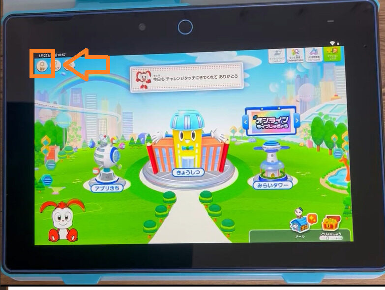
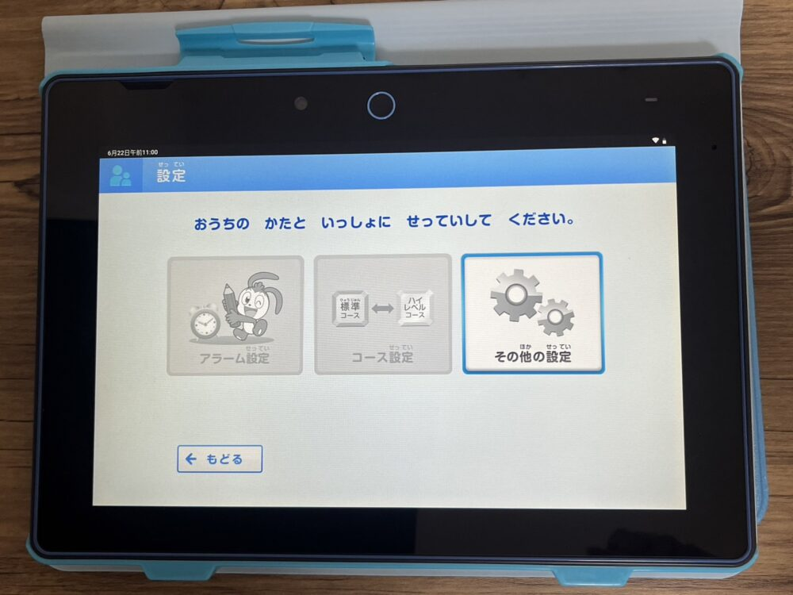
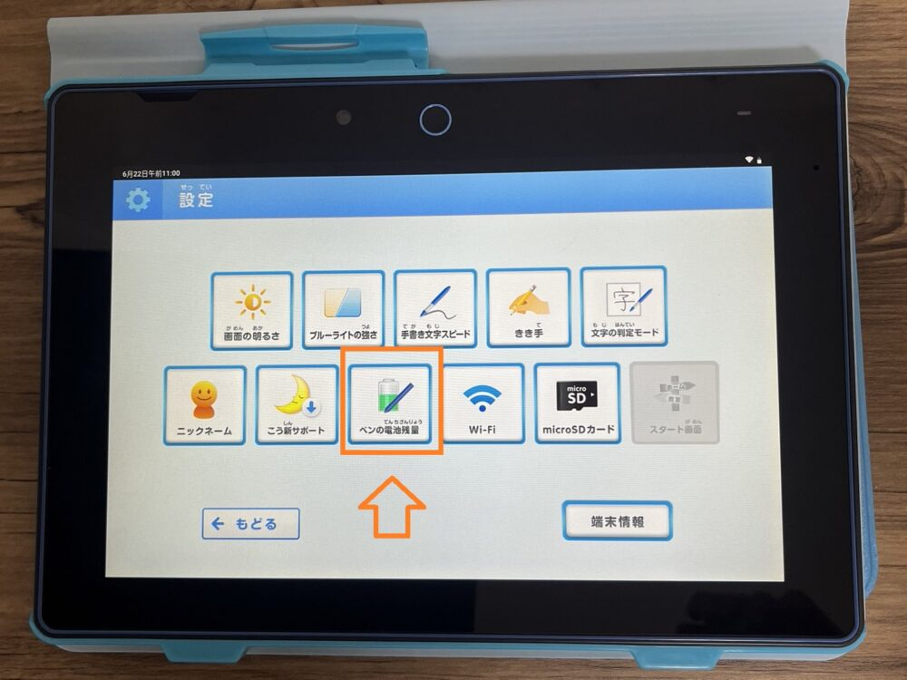
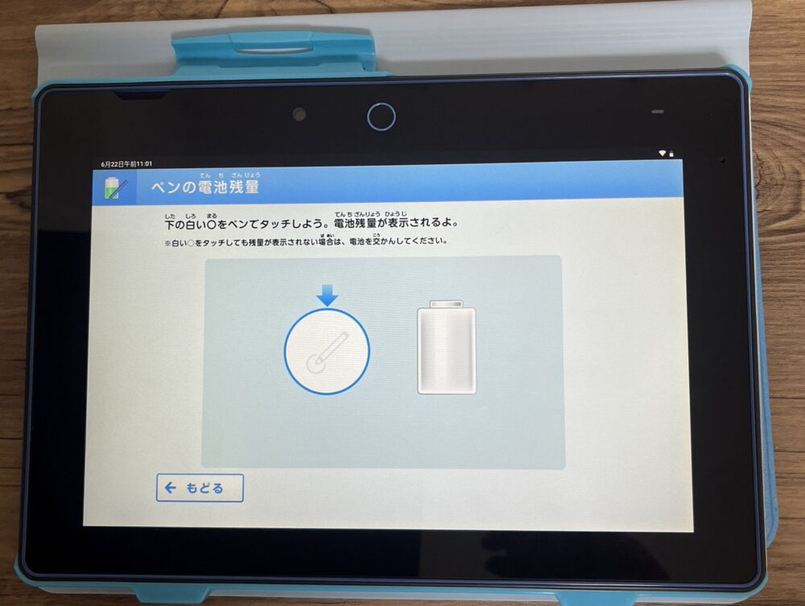
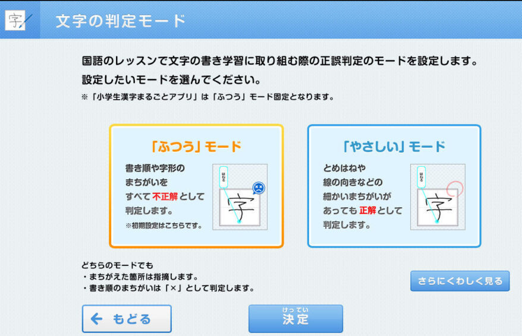
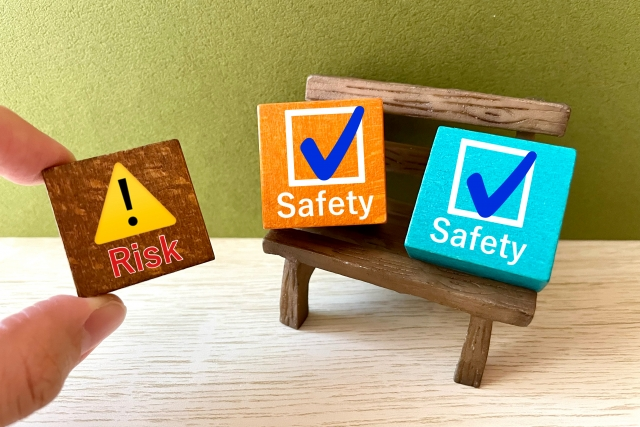
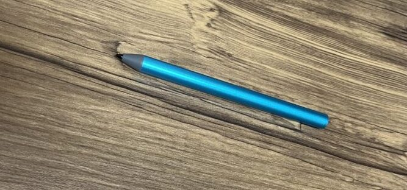

今回は、「**チャレンジタッチが反応しない**」と悩んでいる方に向けて、原因と対処法をお伝えします。

反応が悪い**チャレンジタッチペン**や**タブレット**を我慢したまま使うと、ストレスの原因になってしまいます。

特に「**漢字が書きづらい**」「うまく漢字が書けず、何度も書き直しをした」といった声もあります。

そのせいで、本人のやる気が下がってしまう可能性も・・・

「イライラするから、もう進研ゼミはやらない」なんて言い出したら最悪ですよね？

そんなことになる前に、しっかりと対策をしてきましょう。

チャレンジタッチが反応しない理由は、おそらく以下2つのどちらかに原因があります。

1：チャレンジタッチのペンに原因がある

2：チャレンジタッチのタブレットに原因がある

原因を正しく理解することで、場合によっては5分程度で解決できるので、しっかり確認しておきましょう。

あなたのチャレンジタッチが反応しない理由をハッキリさせることができますので、是非最後までご覧ください♪

[「中学生」におすすめのタブレット学習6選](https://xn--5ckip8c4fq970ahbya2o7acu2a.com/2024/02/05/%e5%8b%89%e5%bc%b7%e3%81%8c%e8%8b%a6%e6%89%8b%e3%81%aa%e4%b8%ad%e5%ad%a6%e7%94%9f%e3%81%ab%e3%81%8a%e3%81%99%e3%81%99%e3%82%81%e9%80%9a%e4%bf%a1%e6%95%99%e8%82%b26%e9%81%b8%ef%bc%81%e5%9c%a7%e5%80%92/)

[「小学生」におすすめのタブレット学習6選](https://xn--5ckip8c4fq970ahbya2o7acu2a.com/2021/08/29/%e5%b0%8f%e5%ad%a6%e7%94%9f%e3%81%ae%e3%82%bf%e3%83%96%e3%83%ac%e3%83%83%e3%83%88%e5%ad%a6%e7%bf%92%e3%81%8a%e3%81%99%e3%81%99%e3%82%817%e9%81%b8%e3%80%82%e3%81%9d%e3%82%8c%e3%81%9e%e3%82%8c%e3%81%ae/)

## チャレンジタッチペン 反応しない原因はコレ！

まずは、**チャレンジタッチのペン**が反応しない原因を解説していきます。

ペンが反応しにくい原因は大きく以下の3つです。当てはまるものがないかを確認しましょう。

ペンが反応しない原因３つ

1. チャレンジタッチペンの電池がない
2. チャレンジタッチペンの故障
3. タブレットの故障の可能性

原因によって対処方法は違うよ♪ しっかり確認してね！

### 原因１：チャレンジタッチペンの電池がない

チャレンジタッチNEO、nextを使用している場合、電池が内蔵されています。 ※チャレンジパッド2，3のペンは電池は使用しません。

単純にペンの電池がなくなっている可能性があります。

タッチペンの<strong>電池残量</strong>は、手持ちのタブレット画面から確認できるよ♪

#### **①：ホーム画面の左上「設定」をタップ**

#### **②：「その他の設定」をタップ**

#### **③：「ペンの電池残量」をタップ**

#### **④：○の中にペン先を当ててペンの電池残量を確認する**

○の中をタッチしても反応がない場合は、電池残量0がだからすぐに交換しましょう♪

### 原因２：チャレンジタッチペンの故障

タッチペンの電池残量に問題がないのに、反応しない場合はペン自体が故障している可能性があります。

特に、指だと反応するの、にペンだと反応しない場合は、ペンが故障している可能性が非常に高いです。

🐕

チャレンジタッチのペンは強い衝撃や強い磁石に近づけると故障の原因になるから注意してね！

タッチペンが故障した場合はもう一度購入する必要があります。タッチペンは進研ゼミの公式サイトから購入することができます。

[「進研ゼミ」消耗品・付属品購入ページ](https://bfg.benesse.ne.jp/m01/p/o/a11stk/stk0010/?product_course=TABLET&ui_inf_rou=organic&admane_xuid=376,0,1940,xuid2x8b6901744fxac8)

### 原因３：タブレット故障の可能性

仮に、タブレットが故障している場合は、ペンだけでなく、指で操作することもできません。

故障している場合は、お持ちのタブレットを修理、または新品と交換する必要があります。

故障かどうかを自分で判断するのが難しい場合は、進研ゼミのカスタマーサポートに電話してみましょう。

|  | **電話番号** | **受付時間** |
| --- | --- | --- |
| 小学講座 | 0120-977-377 | 9:00～21:00 ※年末年始を除く |
| 中学講座 | 0120-929-100 | 9:00～21:00 ※年末年始を除く |

電話をする際は会員番号が必要です。あらかじめ用意しておきましょう。

タブレットを新品と交換する場合は定価での購入となってしまいます。 ※[チャレンジパッドnext](https://xn--5ckip8c4fq970ahbya2o7acu2a.com/2023/06/19/%e3%83%81%e3%83%a3%e3%83%ac%e3%83%b3%e3%82%b8%e3%83%91%e3%83%83%e3%83%89next%ef%bc%88%e3%83%8d%e3%82%af%e3%82%b9%e3%83%88%ef%bc%89%e3%81%a3%e3%81%a6%e3%81%a9%e3%82%93%e3%81%aa%e3%82%bf%e3%83%96/)の場合39,800円

もし、進研ゼミのタブレット保証に入っていれば1回3,300円で新品と交換することができます。

保証に入っていない場合は、タブレットをもう一度定価で買わなければいけませんので覚えておきましょう。

[進研ゼミタブレット保証に関して](https://xn--5ckip8c4fq970ahbya2o7acu2a.com/2022/04/05/%e3%83%81%e3%83%a3%e3%83%ac%e3%83%b3%e3%82%b8%e3%82%bf%e3%83%83%e3%83%81%e7%ab%af%e6%9c%ab%e3%81%ae%e4%ba%a4%e6%8f%9b%e3%81%ae%e6%96%99%e9%87%91%e3%81%af%ef%bc%9f%e4%bf%9d%e8%a8%bc%e3%81%8c%e3%81%84/)は別記事で詳しく紹介しています♪

**＼5分で完了♪／**

[今すぐ進研ゼミ「小学講座」に入会する](//ck.jp.ap.valuecommerce.com/servlet/referral?sid=3613518&pid=887679902)

[今すぐ進研ゼミ「中学講座」に入会する](//ck.jp.ap.valuecommerce.com/servlet/referral?sid=3613518&pid=887697614)

## チャレンジタッチ反応が悪くて「漢字が書けない」を解決しよう

チャレンジタッチを使用していると「漢字が書きづらい」と思うことがあるかもしれません。

チャレンジタッチのペンに問題が無い場合、**タブレットの設定や使用方法に原因**があるかもしれません。

チャレンジタッチ漢字が反応しにくい原因3つ

1. 画面に手が触れている
2. 反応位置がズレている
3. 文字判定モードの設定

1つ1つの対処法を見ていきましょう♪

### 漢字が書けない原因①：画面に手が触れている

記事後半で詳しく解説しますが、チャレンジパッド2、3はタッチペンの**圧力を感知**する仕組みとなっています。

🐕

画面に手や他の物が触れていると、<strong>誤って操作と認識してしまう</strong>かもしれないよ

特に、漢字を書く時には、精密な動きが求められるため、画面に手が触れていると、うまく認識されないことがあります。

チャレンジパッド2、3を使用している方はタブレットに手を触れずにペンだけで操作を行うようにしましょう。

タブレットに力を入れずに、指の先端や専用のペンで軽く触れる（タップする）よう心がけましょう。

この軽い「トントン」とタップする方法は、タブレットの反応を良くするコツです。

ちなみに、進研ゼミの最新タブレットの[チャレンジパッドnext](https://xn--5ckip8c4fq970ahbya2o7acu2a.com/2023/06/19/%e3%83%81%e3%83%a3%e3%83%ac%e3%83%b3%e3%82%b8%e3%83%91%e3%83%83%e3%83%89next%ef%bc%88%e3%83%8d%e3%82%af%e3%82%b9%e3%83%88%ef%bc%89%e3%81%a3%e3%81%a6%e3%81%a9%e3%82%93%e3%81%aa%e3%82%bf%e3%83%96/)ならこの問題は改善されており、画面に手を触れたままでも漢字を書くことができるようになっています。

### 漢字が書けない原因②：画面の反応位置のズレ

2つ目に考えられる理由は、**タッチしている部分と反応している部分がずれている**可能性です。

具体的に言うと、漢字の枠の中心に文字を書こうとしても、タブレットが感知する位置が枠の外側になってしまい、うまく文字が表示されないという現象です。

反応位置がズレていると、漢字を書く時に枠の中に書いても、実際に反応しているのは枠の外になってしまうため、うまく漢字を書くことができません。

🐕

画面のずれはチャレンジパッド２,３で起こる現象だよ。

反応位置のずれは、タブレットの設定画面から修正することができます。

チャレンジタッチ2，3画面ずれの修正方法

１．「チャレンジ スタートナビ」の電源を入れる

２．右下にある設定メニュー（レンチのアイコン）をタッチする

３．「ここからは、おうちのひとにわたそう」という案内が出たら、「すすむ」タッチする

４．「タッチ補正」をタッチする

５．画面の○（線が交わっている中心）をタッチ

※画面のズレがある場合は、アイコンをタッチしても反応しませんので、アイコンの周りを反応があるまでタッチしましょう。

以上の設定方法で画面の反応のずれは解消されます。

ちなみに、チャレンジパッドNEO、nextでは画面がずれることはありません。反応が悪いタブレットは違う原因が考えられます。

### 漢字が書けない原因③：文字判定モードの設定

3つ目に紹介するのが「文字判定モード」についてです。

「<strong>漢字は書けているのに不正解になる</strong>」のはコレが原因かもしれないよ♪

進研ゼミでは、漢字練習では「やさしいモード」と「ふつうモード」が用意されています。

**ふつうモード**・・・とめ、はね、はらい、だけでなく、書き順を間違えていても全て不正解となります。

**やさしいモード**・・・とめ、はね、はらい、などの細かい間違いは不正解とせず、「まずは漢字を覚えたい」人向けのモードです。

「文字判定モード」の設定方法

1. ホーム画面左上の「設定」をタップ
2. 「その他の設定」をタップ
3. 「文字の判定モード」をタップ
4. 「ふつうモード」「やさしいモード」のどちらかを選択する

以上の手順で設定することができます。

「ふつうモード」を選択した場合、とめ、はね、はらい、書き順まで細かく判定されます。そのため、漢字自体は正解しているように見えても、どこかで間違えている可能性が高いです。

「まずは、漢字を覚える練習がしたい」という人は、チャレンジパッドから設定を変更しましょう♪

**＼5分で完了♪／**

[今すぐ進研ゼミ「小学講座」に入会する](//ck.jp.ap.valuecommerce.com/servlet/referral?sid=3613518&pid=887679902)

[今すぐ進研ゼミ「中学講座」に入会する](//ck.jp.ap.valuecommerce.com/servlet/referral?sid=3613518&pid=887697614)

### タブレットの種類によって反応しない原因が違う？

進研ゼミのタブレットには<strong>大きく２つの種類</strong>があるんだ♪

タブレットの種類によって**画面の感知する方式が違う**ため、反応の特性も違います。

タブレットの機種と反応の方式は以下の通りです。

| **機種** | **感知する方式** |
| --- | --- |
| チャレンジパッド2 | 圧力感知 |
| チャレンジパッド3 | 圧力感知 |
| チャレンジパッドNEO | 静電式 |
| チャレンジパッドnext | 静電式 |

圧力感知の方式では、ペンの押し付ける力、つまり筆圧によって反応します。強く押すと反応するという特性があります。

一方、静電式は、指や専用のペンが近づくだけで反応する方式です。

この場合、軽くタッチするだけで反応するので、筆圧を気にせずに操作ができるため、多くの人々にとって反応が良いと感じられることが多くなります。

ちなみに、圧力感知式と静電式ペンは全く違います。反応しない原因がタブレットでなければ、タッチペンに原因があるかもしれません。

**＼5分で完了♪／**

[今すぐ進研ゼミ「小学講座」に入会する](//ck.jp.ap.valuecommerce.com/servlet/referral?sid=3613518&pid=887679902)

[今すぐ進研ゼミ「中学講座」に入会する](//ck.jp.ap.valuecommerce.com/servlet/referral?sid=3613518&pid=887697614)

## 反応が悪いチャレンジタッチを交換する条件

使用しているタブレットに不具合が多く、「新品と交換したい」場合は、以下の条件に当てはまっていれば、**無料**または**安く交換**することができます。

タブレットをお得に交換できる条件2つ

1. 進研ゼミに入会から1年未満
2. 進研ゼミのタブレット保証（有料）サービスに加入している

タブレット保証（有料）に加入している場合は、自分でうっかり落として壊してしまったような場合でも、**3,300円で新品と交換**することができます。

一方、進研ゼミに入会してから1年未満の場合は、自然故障のみ無償で修理または交換が受けられます。

ただし、自分のミスによる故障は保証の対象外なので注意してください。

もし、「保証サービスに未加入」「入会から1年以上が経過している」状態でタブレットが故障した場合は、進研ゼミの公式サイトから改めて購入する必要があります。

**＼5分で完了♪／**

[今すぐ進研ゼミ「小学講座」に入会する](//ck.jp.ap.valuecommerce.com/servlet/referral?sid=3613518&pid=887679902)

[今すぐ進研ゼミ「中学講座」に入会する](//ck.jp.ap.valuecommerce.com/servlet/referral?sid=3613518&pid=887697614)

タブレットを購入したくない方は、[チャレンジ（紙教材コース）](https://xn--5ckip8c4fq970ahbya2o7acu2a.com/2022/02/12/%e3%83%81%e3%83%a3%e3%83%ac%e3%83%b3%e3%82%b8%e3%82%bf%e3%83%83%e3%83%81%e3%81%a8%e3%83%81%e3%83%a3%e3%83%ac%e3%83%b3%e3%82%b8%e9%81%b8%e3%81%b6%e3%81%aa%e3%82%89%e3%81%a9%e3%81%a3%e3%81%a1%ef%bc%9f/)へ変更するのも1つの方法です。

チャレンジ（紙教材）コースの場合タブレットは使用しないので、追加料金が発生することはありません。

チャレンジコースに変更したくない。でも高いタブレットも購入したくない。

という方は中古のタブレットを購入する方法もあります。詳しくは以下の記事で解説しています♪

[✅ 進研ゼミ再入会はもう一度タブレット購入が必須？中古チャレンジタッチは使える？](https://xn--5ckip8c4fq970ahbya2o7acu2a.com/2022/02/24/%e9%80%b2%e7%a0%94%e3%82%bc%e3%83%9f%e3%83%81%e3%83%a3%e3%83%ac%e3%83%b3%e3%82%b8%e3%82%bf%e3%83%83%e3%83%81%e5%86%8d%e5%85%a5%e4%bc%9a%e3%81%ab%e3%81%af%e3%82%bf%e3%83%96%e3%83%ac%e3%83%83%e3%83%88/)

## あなたの使っているペンの種類を確認しよう

チャレンジタッチのペンには2つの種類があります。

チャレンジタッチペンの2種類

1. 筆圧感知式のペン（チャレンジパッド2，3）
2. 静電式のペン（チャレンジパッドNEO、next）

タブレットによって使用するペンの種類が違います。

使用しているペンによって反応が悪い原因も違うので覚えておきましょう。

### チャレンジパッド2、3のタッチペン

チャレンジパッド2，3で使用するタッチペンは、筆圧感知式のペンとなっています。

このタッチペンは電池を使用せず、筆圧を感知します。つまり、電池を交換する心配がなく、持続的に使うことができます。

壊れなければずっと使えるので、丁寧に使えば、長期間は壊れる心配はありません。

もし壊れてしまった場合やなくしてしまった場合は、進研ゼミの公式サイトから新しいものを購入することができますよ♪

公式サイトでの販売価格は550円（税込み）となっています。

### チャレンジパッドNEO,nextのタッチペン

チャレンジパッドNEOとnextで使うタッチペンは静電式のペンで、1本の電池が必要です。

静電式になることで、ペンの動きがスムーズになり、タブレット画面との反応がとても良くなりました。

筆圧式と違い、弱い力でもしっかり反応してくれるのが特徴です。

ただし、このタイプのペンは価格が2,970円（税込）と、ちょっと高めです。

また、ペンに使用されている電池は、**LR61,AAAA（単6形）**という珍しいタイプの電池です。

この単6タイプの電池は、家電量販店でも中々販売されていないので購入の際は、通販での購入がオススメです。

## 入会から1年以内のペンは無料で交換できる

入会から1年以内であればチャレンジタッチのペンが壊れても無料で新品と交換することができます。

交換の受付は進研ゼミサポートにて受付をしています。

|  | **電話番号** | **受付時間** |
| --- | --- | --- |
| 小学講座 | 0120-977-377 | 9:00～21:00 ※年末年始を除く |
| 中学講座 | 0120-929-100 | 9:00～21:00 ※年末年始を除く |

ちなみに、入会から1年以内であれば、**タッチペンの電池も****1本無償で交換**してくれますよ♪

**＼5分で完了♪／**

[今すぐ進研ゼミ「小学講座」に入会する](https://ck.jp.ap.valuecommerce.com/servlet/referral?sid=3613518&pid=887679902)

[今すぐ進研ゼミ「中学講座」に入会する](https://ck.jp.ap.valuecommerce.com/servlet/referral?sid=3613518&pid=887697614)

### 1年過ぎたら保証は使えない？

タッチペンやタッチペンに使用する電池は1年を過ぎたら無料で交換することはできません。

仮に、[チャレンジパッド保証サービス](https://xn--5ckip8c4fq970ahbya2o7acu2a.com/2022/04/05/%e3%83%81%e3%83%a3%e3%83%ac%e3%83%b3%e3%82%b8%e3%82%bf%e3%83%83%e3%83%81%e7%ab%af%e6%9c%ab%e3%81%ae%e4%ba%a4%e6%8f%9b%e3%81%ae%e6%96%99%e9%87%91%e3%81%af%ef%bc%9f%e4%bf%9d%e8%a8%bc%e3%81%8c%e3%81%84/)に加入していたとしても、タッチペンは対象外となります。保証期間内でもタッチペンの交換は含まれていないことになりますので、ご注意ください。

もし新しいタッチペンを購入したい場合は、進研ゼミの公式サイトから購入することができますよ♪

## チャレンジタッチは市販のペンでも代用できる？

結論から言うと、チャレンジパッド2，3のペンであれば、市販のタッチペンでも代用することができます。

一方で、チャレンジパッドNEO、nextでは、タブレットに付属している**専用のタッチペン以外は使用できません**。

そのため、もし故障した場合は、もう一度公式サイトから購入しなければなりません。

### 100均のペンでも代用できる？

チャレンジパッド2、3のペンであれば100均のペンでも代用することができます。。

ただし、100均のペンはすぐ壊れたり、反応が悪かったりするので、購入するならば500円以上のしっかりしたペンがオススメです。

## チャレンジタッチペン・タブレットの不具合に関するよくある質問

最後に、チャレンジタッチペンとタブレットに関するよくある質問をまとめました。

### チャレンジタッチペンを紛失したらどうすればいい？

チャレンジタッチのペンをなくした場合は、進研ゼミの公式サイトから購入することができます。

【販売商品一覧】

- 「チャレンジパッド2・3」専用タッチペン  550円 （税込）
- 「チャレンジパッドNEO、next」専用タッチペン2,970円（税込）
- 全機種共通　専用ACアダプター　 2,178円（税込）
- 専用カバー 1,100円（税込)

購入の際には、会員番号が必要です。進研ゼミ会員以外の方は購入することができませんので注意しましょう。

### タッチペンの電池がすぐなくなるのは故障？

タッチペンの電池がすぐになくなる場合、いくつかの理由が考えられます。

1. 使用頻度：使う回数や時間が多いと、当然電池は早くなくなります。
2. ペン自体の問題：内部の電子部品が劣化している可能性があります。
3. 電池の品質：安い電池や偽造品を使っていると、持ちが悪いことがあります。

特に多く使っているわけではないのに電池がすぐなくなるのであれば、製品自体に何らかの問題がある可能性が高いです。

1年以内の保証期間内であれば新品と交換してもらえるので、カスタマーサポートに連絡することをオススメします。

**＼5分で完了♪／**

[今すぐ進研ゼミ「小学講座」に入会する](https://ck.jp.ap.valuecommerce.com/servlet/referral?sid=3613518&pid=887679902)

[今すぐ進研ゼミ「中学講座」に入会する](https://ck.jp.ap.valuecommerce.com/servlet/referral?sid=3613518&pid=887697614)

### 画面が真っ黒になった時はどうすればいい？

今まで普通に使えていたのに、電源を入れたら突然画面が真っ暗になり、時計のみが表示されている。

🐕

こんな時は、再起動を試してみよう♪

電源を長押しして電源をOFFにした後、再度電源を入れると再起動が完了します。

これでも直らない場合は、故障の可能性も考えられます。進研ゼミサポートセンターに問い合わせて、タブレットの状態を伝えてみましょう♪

|  | **電話番号** | **受付時間** |
| --- | --- | --- |
| 小学講座 | 0120-977-377 | 9:00～21:00 ※年末年始を除く |
| 中学講座 | 0120-929-100 | 9:00～21:00 ※年末年始を除く |

🐕

スタッフさんがタブレットの状態を1つ1つ確認しながら丁寧に対応してくれるよ♪

### チャレンジタッチの電源がつかない時はどうする？

チャレンジタッチの電源がつかない時は、以下2つの方法を試してみましょう。

1. **充電を確認する**: 充電ケーブルを挿して、ちゃんと充電されるかをチェックしましょう。充電マークが表示されない場合は、充電器やケーブルに問題があるかもしれません。
2. **別の充電器を試す**: 別の充電器やケーブルを使ってみて、それでもダメな場合は、タブレットの故障が考えられます。

**＼5分で完了♪／**

[今すぐ進研ゼミ「小学講座」に入会する](//ck.jp.ap.valuecommerce.com/servlet/referral?sid=3613518&pid=887679902)

[今すぐ進研ゼミ「中学講座」に入会する](//ck.jp.ap.valuecommerce.com/servlet/referral?sid=3613518&pid=887697614)
