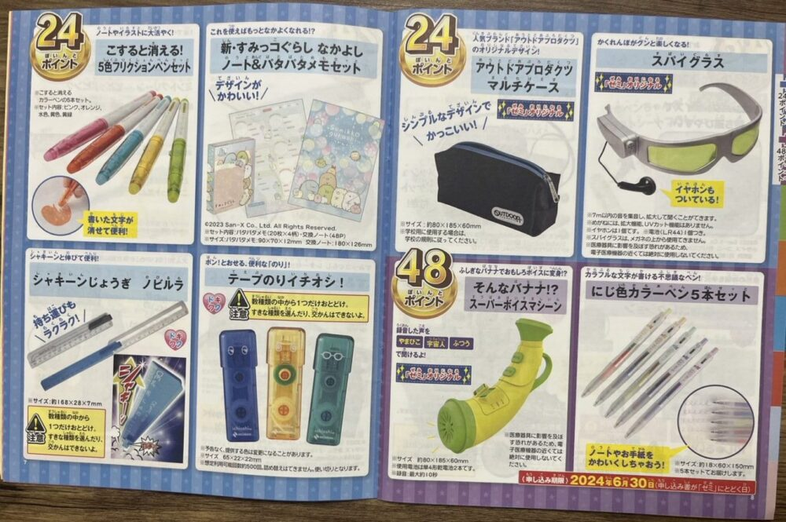
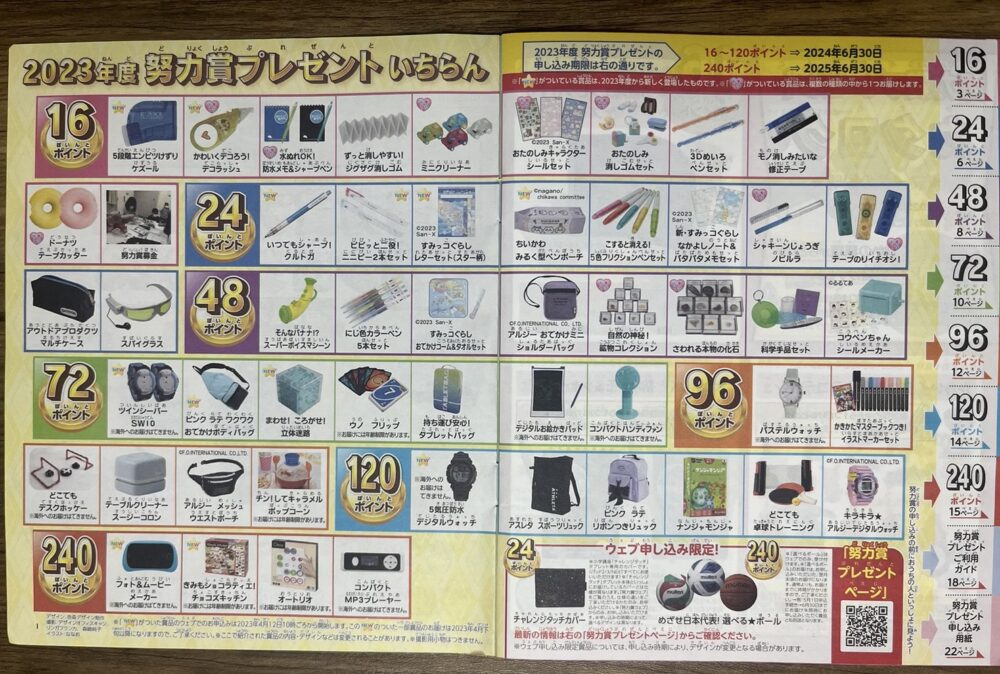
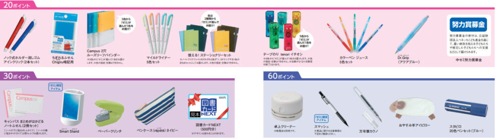
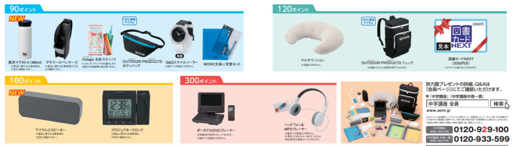
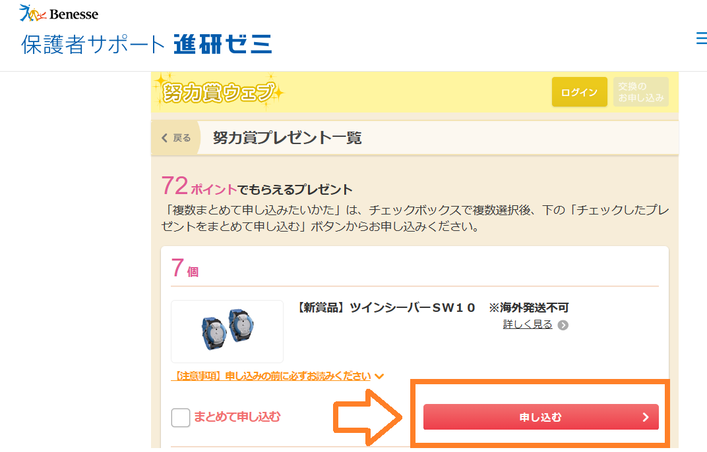
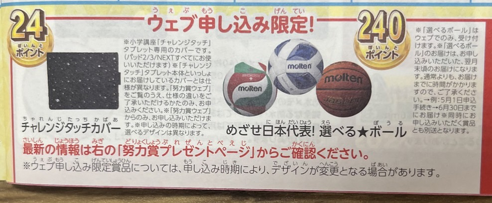
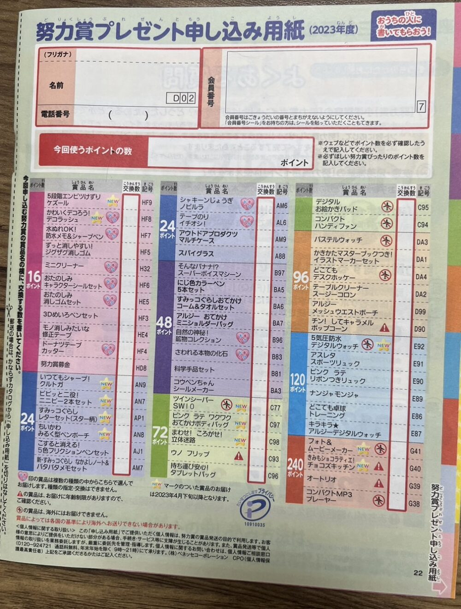
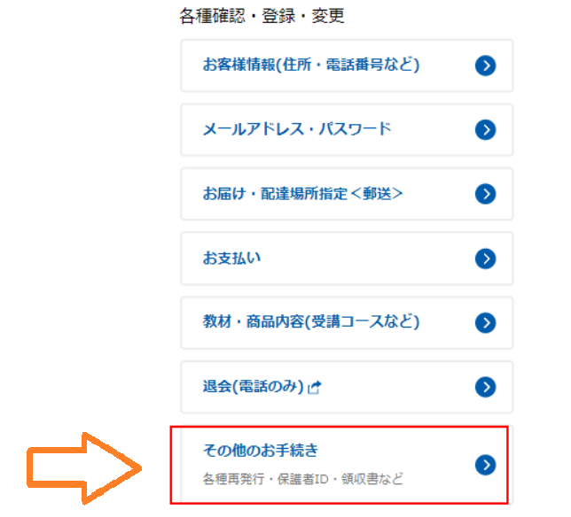
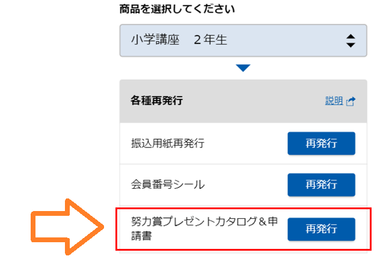

チャレンジタッチの努力賞ポイントとは、子供がメインレッスンを終えたり、テストを提出したりしたときに獲得できるポイントです。

1年に1～2回開催されるキャンペーンやログインするだけでもポイントを獲得することができます。しかし、努力賞ポイントと言っても・・・

- 何と交換できるのはよく分からない
- どうやったら貯められるの？
- どうやって交換すればいいの？
- 効率的に努力賞ポイントを増やす方法が知りたい

🐕

このように、よく分からない部分はありますよね？

今回は、進研ゼミチャレンジタッチの努力賞ポイントについて詳しく解説していきます。

努力賞ポイントで貰える景品（小学講座、中学講座）や努力賞ポイントに関する注意事項、よくある質問をまとめています。

特に、「努力賞ポイントをこれから貯めたい人」「努力賞ポイントを貯めてる途中の人」は是非最後まで読んで下さいね♪

## チャレンジタッチ努力賞ポイントと交換できる景品の種類は？

チャレンジタッチの努力賞ポイントと交換できる景品は、**50種類以上**あり、使用するポイント数によって、貰える景品にも差があります。

🐕

たんさんポイントを貯めて豪華景品と交換しよう

景品は、16、24、48，72，96、120、240、のポイント数で分けられており、16ポイントで交換できるのは、色ペンや消しゴムなどの文房具となっています。

120ポイント以上になると、腕時計、スポーツリュックなど豪華景品と交換できるので、**子供のやる気を引き出してくれます**。

ちなみに、進研ゼミのタブレットカバーもポイントで交換することができます。青や緑などの単色ではなく、「宇宙ブラック、ラブリーフラワー」といったデザインのカバーと交換することが出来ます。

進研ゼミタブレットカバーの色、交換できるカバーデザインを詳しく知りたい方はこちらの記事からどうぞ♪[進研ゼミタブレットカバーの種類と選び方を解説](https://xn--5ckip8c4fq970ahbya2o7acu2a.com/2023/05/19/%e3%83%81%e3%83%a3%e3%83%ac%e3%83%b3%e3%82%b8%e3%82%bf%e3%83%83%e3%83%81%e3%81%ae%e8%89%b2%e3%81%8c%e9%81%b8%e3%81%b9%e3%82%8b%e6%9d%a1%e4%bb%b6%e3%81%a8%e3%81%af%ef%bc%9f%e3%82%bf%e3%83%96%e3%83%ac/)

進研ゼミに入会すると努力賞ポイントを貯めてもらえる商品のカタログが送られてきます。申し込み用紙とセットになっているので、ポイントが貯まればすぐに欲しい商品と交換することができます。

<strong>カダログは公式サイトから資料請求</strong>で貰うことができるよ♪

[✅ 「進研ゼミ公式」資料請求でカタログを貰う（小学講座）](//ck.jp.ap.valuecommerce.com/servlet/referral?sid=3613518&pid=887679902)

[✅ 「進研ゼミ公式」資料請求でカタログを貰う（中学講座）](//ck.jp.ap.valuecommerce.com/servlet/referral?sid=3613518&pid=887697614)

努力賞ポイントは、様々なアイテムと交換することが可能です。例えば、学習に役立つペンや修正テープ、生活に役立つバッグや腕時計、スポーツ用品などがあります​。

また、小学講座と中学講座では貰える商品の種類が違うため、それぞれを詳しくみていきましょ。

進研ゼミでは、努力賞ポイント以外にも無料で利用できるサービスが充実しています。それぞれ別記事で詳しく紹介しています。

<strong>進研ゼミ会員が無料で利用できるサービス一覧</strong>

- [チャレンジイングリッシュ（小１～高３レベルが使い放題）](https://xn--5ckip8c4fq970ahbya2o7acu2a.com/2022/03/28/%e3%83%81%e3%83%a3%e3%83%ac%e3%83%b3%e3%82%b8%e3%82%a4%e3%83%b3%e3%82%b0%e3%83%aa%e3%83%83%e3%82%b7%e3%83%a5%e3%81%ae%e6%96%99%e9%87%91%e3%81%af%e7%84%a1%e6%96%99%ef%bc%81%ef%bc%9f%e3%80%8c%e5%88%a9/)
- [プログラミング（基礎）](https://xn--5ckip8c4fq970ahbya2o7acu2a.com/2022/03/08/%e9%80%b2%e7%a0%94%e3%82%bc%e3%83%9f%e3%83%81%e3%83%a3%e3%83%ac%e3%83%b3%e3%82%b8%e3%82%bf%e3%83%83%e3%83%81%e3%80%8c%e5%b0%8f%ef%bc%91%ef%bd%9e%e5%b0%8f%ef%bc%96%e3%80%8d%e3%81%ae%e3%83%97%e3%83%ad/)
- [努力賞ポイント景品交換](https://xn--5ckip8c4fq970ahbya2o7acu2a.com/2023/07/10/%e3%83%81%e3%83%a3%e3%83%ac%e3%83%b3%e3%82%b8%e3%82%bf%e3%83%83%e3%83%81%e5%8a%aa%e5%8a%9b%e8%b3%9e%e3%83%9d%e3%82%a4%e3%83%b3%e3%83%88%ef%bc%81%e8%b2%b0%e3%81%88%e3%82%8b%e5%95%86%e5%93%81%e3%81%af/)
- [まなびライブラリー（1000冊の本が読み放題）](https://xn--5ckip8c4fq970ahbya2o7acu2a.com/2023/07/18/%e3%83%81%e3%83%a3%e3%83%ac%e3%83%b3%e3%82%b8%e3%82%bf%e3%83%83%e3%83%81%e3%81%ae%e6%9c%ac%e8%aa%ad%e3%81%bf%e6%94%be%e9%a1%8c%e3%82%b5%e3%83%bc%e3%83%93%e3%82%b9%e3%81%a8%e3%81%af%ef%bc%9f%e9%80%b2/)
- [オンライン授業](https://xn--5ckip8c4fq970ahbya2o7acu2a.com/2023/06/26/%e3%83%81%e3%83%a3%e3%83%ac%e3%83%b3%e3%82%b8%e3%82%aa%e3%83%b3%e3%83%a9%e3%82%a4%e3%83%b3%e6%8e%88%e6%a5%ad%e3%82%92%e3%80%8c%e5%8f%97%e8%ac%9b%e3%81%97%e3%81%9f%e6%84%9f%e6%83%b3%e3%80%8d/)
- [実力診断テスト](https://xn--5ckip8c4fq970ahbya2o7acu2a.com/2023/06/09/%e3%83%81%e3%83%a3%e3%83%ac%e3%83%b3%e3%82%b8%e5%ae%9f%e5%8a%9b%e8%a8%ba%e6%96%ad%e3%81%af%e3%80%8c%e5%b0%8f1%ef%bd%9e%e5%b0%8f6%e3%80%8d%e3%81%a7%e5%86%85%e5%ae%b9%e3%81%8c%e9%81%95%e3%81%86%ef%bc%9f/)

気になる記事をタップしてね♪

### 小学講座の努力賞でもらえる賞品は？

小学講座の努力賞では、色ペンや消しゴム、メモ帳などの**普段の勉強に役立つアイテム**と交換することができます。

ポイントが増えていくと、腕時計やリュックなどのより豪華な商品と交換することも可能です。

進研ゼミでは、資料請求するとお試し教材が無料で提供されるだけでなく、努力賞商品のカタログ一覧も同梱されます。

興味のある方は、[進研ゼミ小学講座のサイトから資料請求](https://ck.jp.ap.valuecommerce.com/servlet/referral?sid=3613518&pid=887679902)をしてみてください♪

### 中学講座の努力賞でもらえる賞品は？

中学講座では、シャーペンやルーズリーフのバインダーのような勉強に役立つ商品が、少ないポイントでも交換することができます。

ポイントが貯まっていくと、図書券（2000円分）やDVDプレイヤーなどと交換することが可能です。

中学講座でも資料請求すると努力賞のカタログ一覧が無料で届けられます。

興味のある方は[進研ゼミ公式サイト中学講座から資料請求](//ck.jp.ap.valuecommerce.com/servlet/referral?sid=3613518&pid=889445471)をどうぞ♪

## 進研ゼミ努力賞ポイントの貯め方

🐕

早速、努力賞ポイントの貯め方を見ていこう

進研ゼミには、タブレットコースと紙教材コースの2種類がありますが、基本的にキャンペーンを除けば、どちらのコースでも**一年間で集められるポイント数は同じ**です。全ての活動を完了すれば、一年間で約90ポイントを獲得できます。

ただ、進研ゼミの努力賞ポイントの貯め方は、小学生と中学生で違うため、それぞれの講座でも貯め方を詳しく紹介します。

### 進研ゼミ努力賞ポイントの貯め方：小学講座

小学講座の**努力賞ポイントを貯める方法**はチャレンジ（紙教材コース）とチャレンジタッチ（タブレットコース）で**少し違います**。

| 努力賞ポイントの貯め方 |  |
| --- | --- |
| チャレンジ |   - 課題の提出（1号分）：8ポイント獲得 - 赤ペン先生の問題提出（1号分）：8ポイント獲得 - 実力診断テスト提出（1号分）：8ポイント獲得   |
| チャレンジタッチ |   - メインレッスンの提出（1ヶ月）：4ポイント獲得 - 赤ペン先生の問題提出（1号分）：一教科1ポイント - 実力診断テスト提出（1号分）：8ポイント獲得   |

🐕

ただし、以下の点に注意が必要だよ

「赤ペン先生の記述力指導」と「実力診断テスト」には**提出期限**があります。提出期限を過ぎると努力賞ポイントが貰えなくなってしまいます。ポイント獲得するためには、期日を厳守しましょう。

**赤ペン先生の提出期限**

小1～小5：1学年後の3月15日まで

小6：小学校卒業後の5月15日まで

**実力診断テストの提出期限**

小1～小5：1学年後の3/31まで

小6：小学校卒業後の６/24まで

[✅ 今すぐ進研ゼミ公式サイトに入会する（小学講座）](//ck.jp.ap.valuecommerce.com/servlet/referral?sid=3613518&pid=887679902)

### 進研ゼミ努力賞ポイントの貯め方：中学講座

🐕

中学講座では、1教科提出するごとに2ポイントが貰えるよ

2ポイントが貰える対象

- 赤ペン先生の添削問題（デジタル「赤ペン」を含む）
- 実力診断マークテスト
- ニガテ診断マークテスト
- 合格可能性判定模試
- リハーサルテスト

※ただし以下の2つは中高一貫講座のみとなります。

- 添削課題
- 実力判定テスト（実力診断テストではない）

中学講座では、基本的に1教科2ポイントが貰えます。提出する課題が小学講座よりも多い為、年間のポイントが貯まるスピードも速くなりますよ。

[✅ 今すぐ進研ゼミ公式サイトから入会する（中学講座）](//ck.jp.ap.valuecommerce.com/servlet/referral?sid=3613518&pid=887697614)

## 進研ゼミ努力賞ポイントの交換方法

努力賞ポイントの使い方には、小学講座、中学講座で大きな違いはありません。努力賞ポイントの交換方法は以下の2つから選択できます。

1. WEBから申し込む
2. 郵便で申し込む

 それぞれの手順を詳しく見ていきましょう。

### 努力賞ポイント：WEBから交換する

WEBから交換を行なう場合は、以下の3つの手順となります。

WEBから努力小ポイントを交換する

1. 進研ゼミ保護者サポートから努力賞Webにアクセスする。
2. ログインしたら、欲しい商品を選択する
3. 「申し込みボタン」をクリックします。

 

🐕

ログインは「会員番号」と「パスワード」が必要だよ

WEBからの努力賞ポイントポイント交換は保護者サポートのページから申し込みを行ないます。一度にまとめて数種類の商品を申し込むことも可能です。

中には、**Web申し込みでしか手入らない****「**選べるボール」や「チャレンジタッチカバー」などの商品もありますよ。

[✅ 今すぐ進研ゼミ公式サイトに入会する（小学講座）](//ck.jp.ap.valuecommerce.com/servlet/referral?sid=3613518&pid=887679902)

[✅ 今すぐ進研ゼミ公式サイトから入会する（中学講座）](//ck.jp.ap.valuecommerce.com/servlet/referral?sid=3613518&pid=887697614)

### 努力賞ポイント：郵便で交換する

郵便で努力賞ポイントを交換する場合は、教材と一緒に送られてくる申し込み用紙を使用しましょう。

郵送での申し込み方法

1. 名前、郵便番号、電話番号、会員番号を記入する。
2. 使用するポイント数を記入する。
3. 欲しい商品欄の横に使用するポイント数を記入する
4. 申し込み用紙を封筒に入れて郵送する

申し込み用紙を無くしてしまった場合は、以下の手順で再発行することが可能です。

- Webでの「手続き」（お客様サポート）にログイン
- 「各種確認・登録・変更」の「その他のお手続き」をタップ
- 表示された画面で「再発行」をタップ

[✅ 今すぐ進研ゼミ公式サイトに入会する（小学講座）](//ck.jp.ap.valuecommerce.com/servlet/referral?sid=3613518&pid=887679902)

[✅ 今すぐ進研ゼミ公式サイトから入会する（中学講座）](//ck.jp.ap.valuecommerce.com/servlet/referral?sid=3613518&pid=887697614)

### 今のポイント数を確かめる方法

チャレンジタッチのアプリやウェブサイトを通じて、自分の努力賞ポイントの残高を確認することができるはずです。具体的な手順は次のとおりです。

現在の保有ポイントを確かめるには、このサイトから「ポイント・記録」をクリックして下さい。会員番号をパスワードを入力すると持っているポイント数が表示されますよ。

## チャレンジタッチ努力賞ポイント貯めるコツはたった2つ

🐕

進研ゼミの努力賞ポイントを貯めるコツはないかな？

進研ゼミの努力賞ポイントを効率的に貯めるには以下の2つさえ守ればポイントは確実に増やすことができます。

### ①課題を期限内に提出する

努力賞ポイントをもらうには、**「赤ペン先生」や「**[実力診断テスト](https://xn--5ckip8c4fq970ahbya2o7acu2a.com/2023/06/09/%e3%83%81%e3%83%a3%e3%83%ac%e3%83%b3%e3%82%b8%e5%ae%9f%e5%8a%9b%e8%a8%ba%e6%96%ad%e3%81%af%e3%80%8c%e5%b0%8f1%ef%bd%9e%e5%b0%8f6%e3%80%8d%e3%81%a7%e5%86%85%e5%ae%b9%e3%81%8c%e9%81%95%e3%81%86%ef%bc%9f/)**」を確実に提出する**ことが大切です。

これらの課題には提出期限があります。期日を忘れない為にも**今月提出する課題の一覧表**などを作っておくと、「ついつい忘れてしまった」を防ぐことができるのでオススメです。

### ②努力賞ポイントキャンペーンを活用する

進研ゼミでは、定期的に努力賞ポイントが倍増するキャンペーンが開催されています。。これらのキャンペーンを上手く活用することで、**一気にポイントを稼ぐ**ことが可能です。

1年間を通して、一番努力賞ポイントを貯められるのが課題提出です。学年によっては、1年で貰える努力賞ポイントの半分が課題提出となっています。課題を優先して取り組めば、**確実にポイントを増やせます**よ。

また、努力賞ポイントUPキャンペーンもポイントを効率的に稼ぐチャンスです。このキャンペーンをうまく活用しましょう。

この2つのコツ守りつつ、自分の学習ペースと目標を考慮に入れながら学習を進めることが、努力賞ポイントを効率よく貯めるための最良の方法です。

[✅ 今すぐ進研ゼミ公式サイトに入会する（小学講座）](//ck.jp.ap.valuecommerce.com/servlet/referral?sid=3613518&pid=887679902)

[✅ 今すぐ進研ゼミ公式サイトから入会する（中学講座）](//ck.jp.ap.valuecommerce.com/servlet/referral?sid=3613518&pid=887697614)

### 努力賞ポイントのキャンペーンをうまく利用しよう

進研ゼミでは、努力賞ポイントが多く貰えるキャンペーンを定期的に開催しています。中には普段の倍のポイントが貰えるキャンペーンもあります。

過去の努力賞ポイント倍増キャンペーンを見てみよう

**過去の努力賞キャンペーン**

1. 「チャレンジタッチ」に5日連続でログインで4ポイント貰える 

2. チャレンジタッチの学習を24日間で完了で4ポイント貰える 

3. サクセスナビに5日以上ログインすると通常の5ポイントが10ポイントの2倍

このようなキャンペーンを逃さず確実にポイントをゲットすることで、努力賞ポイントを効率よく集めることができます。毎日の学習を続けることが重要なので、コツコツと取り組んでいきましょう。

[✅ 今すぐ進研ゼミ公式サイトに入会する（小学講座）](//ck.jp.ap.valuecommerce.com/servlet/referral?sid=3613518&pid=887679902)

[✅ 今すぐ進研ゼミ公式サイトから入会する（中学講座）](//ck.jp.ap.valuecommerce.com/servlet/referral?sid=3613518&pid=887697614)

## チャレンジタッチ努力賞ポイントのQ＆A

最後に、努力賞に関するよくある質問をまとめました。実際に努力賞ポイントを利用する前に、分からない事がある場合はよく確認しておきましょう。

### チャレンジタッチを辞めるとポイントは無くなる？

チャレンジタッチを辞めた後でも以前貯めていた努力賞ポイントが無くなることはありません。

再入会した後でも保有していた努力賞ポイントはそのまま使用することができます。

ただし、再入会する際は、以前使用していたアカウントでなければポイントの引き継ぎはできません。

[進研ゼミ再入会](https://xn--5ckip8c4fq970ahbya2o7acu2a.com/2022/02/24/%e9%80%b2%e7%a0%94%e3%82%bc%e3%83%9f%e3%83%81%e3%83%a3%e3%83%ac%e3%83%b3%e3%82%b8%e3%82%bf%e3%83%83%e3%83%81%e5%86%8d%e5%85%a5%e4%bc%9a%e3%81%ab%e3%81%af%e3%82%bf%e3%83%96%e3%83%ac%e3%83%83%e3%83%88/)については別記事で解説しています。

### 貰える努力賞ポイントは問題の正解率と関係ある？

結論から言うと、もらえる努力賞ポイントは**問題の正答数は関係ありません**。

問題の半分以上を間違えようと、全問正解しようと、「赤ペン先生」や「実力テスト」で貰えるポイント数は同じになります。

### 努力賞ポイントが貰えるタイミングは？

努力賞ポイントが反映されるタイミングは、提出する課題によって少し違いがあります。

| 赤ペン先生 | 赤ペン先生返却後から約3日後 |
| --- | --- |
| 実力診断テスト | 郵便提出：「ゼミ」受付から約1週間 ネット提出：「ゼミ」受付から約3日後 |
| チャレンジイングリッシュ | チャレンジイングリッシュのステップアップテストやレベルアップテストに合格した場合、合格した月の翌月15日までにポイントが加算 |

以上がポイントが反映されるまでの日数の目安となります。ただし、上記の日数は目安であり、必ずしもその期間内にポイントが反映されるとは限りません。

日曜、祝日、年末年始をはさむ場合、上記の日数以上かかる可能性があります。

[✅ 今すぐ進研ゼミ公式サイトに入会する（小学講座）](//ck.jp.ap.valuecommerce.com/servlet/referral?sid=3613518&pid=887679902)

[✅ 今すぐ進研ゼミ公式サイトから入会する（中学講座）](//ck.jp.ap.valuecommerce.com/servlet/referral?sid=3613518&pid=887697614)

### 注文した商品はいつ届く？

努力賞ポイントを使用して申し込みをした商品は、通常**約２週間**で自宅に届けられます。

ただし、多くの人が同時に申し込みをした場合は、商品の発送に時間がかかるため、商品の到着までに2週間以上かかってしまうかもしれません。

また、商品を2種類以上で同時に申し込みをした場合は、**準備が整った商品からの発送**となる為、別々に届けられる可能性があります。

### 努力賞ポイントに有効期限はある？

「努力賞ポイント」には利用期限があります。最長で高校卒業の年の6月末日まで有効となります。

ただ、個人情報を一度削除してしまった場合、「努力賞ポイント」の履歴も**完全に消え**てしまい、以降のポイント利用ができなくなるので、注意しましょう。

[✅ 今すぐ進研ゼミ公式サイトに入会する（小学講座）](//ck.jp.ap.valuecommerce.com/servlet/referral?sid=3613518&pid=887679902)

[✅ 今すぐ進研ゼミ公式サイトから入会する（中学講座）](//ck.jp.ap.valuecommerce.com/servlet/referral?sid=3613518&pid=887697614)

### 退会後も努力賞ポイントは使用できる？

進研ゼミを退会した後でも努力賞ポイントは使用することができます。

ポイントの交換方法は、郵送での申し込みとなります。詳しくは先ほど紹介した「[郵便でポイント交換する](#Form1)」をご覧下さい。

### 努力賞ポイントは小学→中学への進級に持ち込める？

「努力賞ポイント」は、小学生から中学生への昇進時にも引き続き保持できます。

ただし、注意すべき点は、「努力賞ポイント」は、あなたが以前に受講した講座で得られる努力賞とのみ交換可能だということです。つまり、過去に受講した講座の中から交換できる努力賞を選ぶことになります。

このように、「努力賞ポイント」は長期間に貯めて活用できる制度なので、今欲しい商品が無くても、積極的に学習に取り組み、ポイントを貯めておくといいですよ。

### 届いた商品をキャンセルや返品することは可能ですか？

努力賞ポイントで獲得した商品は、**破損などの不良品が届いた場合のみキャンセルや返品をすることが可能です。**

万が一不良品が届いた場合は、進研ゼミから発送された日から1年以内に限り新品とと交換してもらうことができます。

[✅ 今すぐ進研ゼミ公式サイトに入会する（小学講座）](//ck.jp.ap.valuecommerce.com/servlet/referral?sid=3613518&pid=887679902)

[✅ 今すぐ進研ゼミ公式サイトから入会する（中学講座）](//ck.jp.ap.valuecommerce.com/servlet/referral?sid=3613518&pid=887697614)
