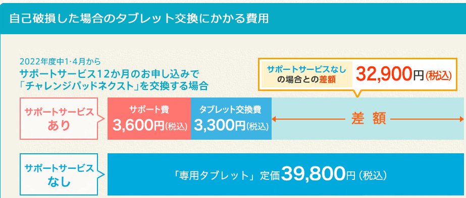
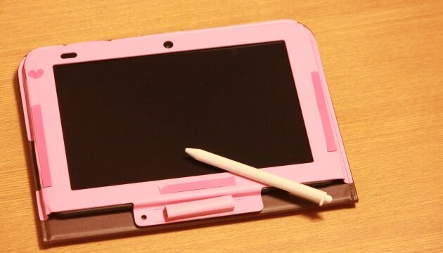
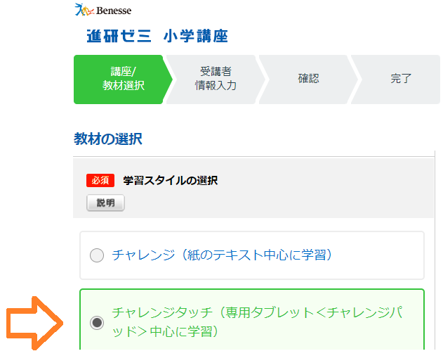
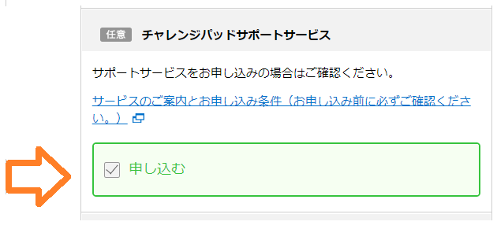
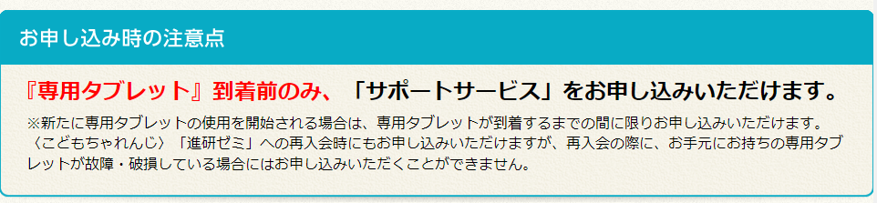
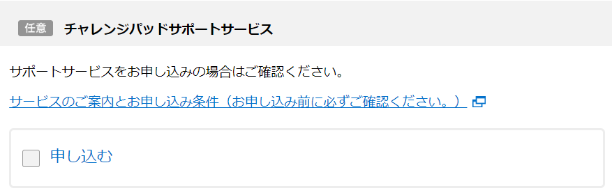

進研ゼミの**チャレンジパッド保証サービス**（有料）に加入しておけば、自然故障、自己故障の場合でも、**新品と交換**することが可能です。

しかし、チャレンジパッド保証サービスは月額で追加料金（240円～）がかかるため**加入すべきかどうか迷いますよね？**

この記事では、チャレンジパッド保証サービスの**必要性を追求**しました。

さらに、保証未加入で故障した時にかかる料金や保険が適応される範囲についても紹介していますので、ぜひ最後までご覧下さい。

## チャレンジタッチの保証サービス

**チャレンジタッチの保証とは**、万が一使用しているタブレットが故障した場合に適応される保証サービスです。

「落として故障した」「水に濡れて壊れた」という自己破損でも**3,300円で新品と交換**することができます。

| **チャレンジタッチ保証サービス概要** |  |
| --- | --- |
| 対象 | 小学2～中学3 （進研ゼミのタブレット利用者） |
| 自然故障 | ○ |
| 自己故障 | ○ |
| 月額料金 | 240円～ |
| 交換料金 | 3,300円（1回につき） |
| 契約期間 | 1ヶ月、6ヶ月、12ヶ月の中から選択可能 |

チャレンジタッチの保証は進研ゼミで**タブレットコースの全ての講座で利用することが可能**です。

<blockquote class="twitter-tweet">
サポートサービス入ってたよな？…いや、入ってなかったかも？…いやいや、さすがに入ってるでしょ？どっちだ？ ってドキドキしながらベネッセに電話しました。
サポートサービス．．．幸い入ってました！ おかげで3300円で交換してもらえるそう✨ 入会時の私グッジョブだよ😭

— うい (@uiuiko3939) <a href="https://twitter.com/uiuiko3939/status/1432524349349642241?ref_src=twsrc%5Etfw">August 31, 2021</a></blockquote>

🐕

<strong>タブレット保証の登録</strong>は進研ゼミ公式サイトに入会する時に設定できるよ♪

[進研ゼミ「小学講座」に入会する](https://ck.jp.ap.valuecommerce.com/servlet/referral?sid=3613518&pid=887390659)

[進研ゼミ「中学講座」に入会する](//ck.jp.ap.valuecommerce.com/servlet/referral?sid=3613518&pid=889445471)

### 保証が適応される範囲

タブレットが故障した場合、ほとんどが保証の対象となります。しかし、中には保証の対象外になる場合もあるので、覚えておきましょう。

保証が適応される故障

- 水濡れ
- 火災
- 落下
- 落雷

保証が適応されない故障

- 自信などの自然災害
- 故意に分解した場合など

### 保証期間中であれば何回でも交換可能

**保証期間内**にタブレットが故障した場合であれば**何回でも3,300円で修理交換することができます。**

**特に小さなお子さん**は、床に落としたり、水をこぼしたりといったケースはよくあるので、心配な方は入会時に加入しておくことをオススメします。

### チャレンジタッチ保証に未加入で故障した場合

チャレンジタッチの保証に未加入でタブレットが故障してしまった場合、**もう一度タブレットを再購入**しなくてはなりません。

再購入する**タブレットの料金**は、あなたが使用している機種によって異なります。

| 　機種 | 端末料金 | 対象者 |
| --- | --- | --- |
| チャレンジパッド2 | 19,800円 | 年長、小1 中1～中2 |
| チャレンジパッド3 | 19,800円 |
| チャレンジタッチnext | 39,800円 | 小2～小6 中3 |
| チャレンジパッドNEO | 39,800円 |

🐕

タブレットを買い直す場合は、<strong>2万円～4万円</strong>が必要だよ

[今すぐ進研ゼミ「小学講座」に入会する](https://ck.jp.ap.valuecommerce.com/servlet/referral?sid=3613518&pid=887390659)

[今すぐ進研ゼミ「中学講座」に入会する](//ck.jp.ap.valuecommerce.com/servlet/referral?sid=3613518&pid=889445471)

## チャレンジタッチ保証の料金はいくら？

チャレンジタッチ保証の料金は、現在**あなたが使用しているタブレット**の種類によって変わります。

| **保証の料金** | 1年払い | 半年払い | 毎月払い |
| --- | --- | --- | --- |
| 幼児（年長） | 3,600円 | 1,950円 | 360円 |
| 小1 | 3,600円 | 1,950円 | 360円 |
| 小2～小6 | 2,400円　 | 1,350円 | 240円 |
| 中1～中2 | 3,600円 | 1,950円 | 360円 |
| 中3 | 2,400円 | 1,950円 | 240円 |

タブレット本体の料金が高いNEOやnextを使う幼児や中1、中2の方が毎月にかかる料金は高くなるようです。

ただ、もしタブレットが壊れた場合、交換にかかる費用には大きく差が生まれます。

保証にはいっていれば年間の保証料とタブレット交換代だけで済みますが、保証に入ってない人は2万～4万円支払う事になります。

入会する前に保証サービスの申し込みについても一度考えておきましょう。

保証に加入していない人でタブレットが壊れた場合はメルカリなどのフリマで購入するのも方法の1つです。

[今すぐ進研ゼミ「小学講座」に入会する](https://ck.jp.ap.valuecommerce.com/servlet/referral?sid=3613518&pid=887390659)

[今すぐ進研ゼミ「中学講座」に入会する](//ck.jp.ap.valuecommerce.com/servlet/referral?sid=3613518&pid=889445471)

### 入会から1年間はメーカー保証（無料）がある

チャレンジタッチには、<strong>2種類の保証</strong>があるんだ

| 機器保証 | チャレンジパッドサービス |
| --- | --- |
| 料金 | 無料 （タブレット到着から1年間のみ） | 有料 240円～ |
| 加入方法 | 進研ゼミタブレット講座に入会している全ての人（自動加入） | タブレット到着前に申し込み |
| 初期不良 | ○ | ○ |
| 自然故障 | ○ | ○ |
| 自己故障 | × | ○ |

進研ゼミでは、入会と同時に1年間の**機器保証というサービスがついてきます**。これは先ほど紹介した保証(チャレンジパッド)とは違い、自然故障の場合のみ適応されます。

タブレット到着から1年間は**「初期不良・自然故障」の場合のみ**無料で交換することができます。

💬

\

[今すぐ進研ゼミ「小学講座」に入会する](https://ck.jp.ap.valuecommerce.com/servlet/referral?sid=3613518&pid=887390659)

[今すぐ進研ゼミ「中学講座」に入会する](//ck.jp.ap.valuecommerce.com/servlet/referral?sid=3613518&pid=889445471)

## 保証がいらない人は付けなくてもいい？

もちろん、チャレンジパッドサポートの保証は強制ではないので、「いらない」と感じる人は保証を付けずに利用しても問題ありません。

特に、「壊れたらまた買い直せばいい」と思える人は、むしろ保証に入らずに利用した方が良いかもしれません。

逆に、「タブレットの再購入は避けたい」と思う方は保証に加入することをおすすめします。

追加料金がかかると言っても月々240円のため、6年間払い続けても17,280円です。つまり、1回でも交換すれば元がとれることになります。

1年一括払いならもっと安く保証を利用できるよ♪

## 新品以外のタブレットでも保証はつけられる？

結論から言うと「サポートサービス」は新品以外のタブレットでも加入することができます。

一度[進研ゼミを解約](https://xn--5ckip8c4fq970ahbya2o7acu2a.com/2021/09/18/1175/)してから、[進研ゼミに再入会](https://xn--5ckip8c4fq970ahbya2o7acu2a.com/2022/02/24/%e9%80%b2%e7%a0%94%e3%82%bc%e3%83%9f%e3%83%81%e3%83%a3%e3%83%ac%e3%83%b3%e3%82%b8%e3%82%bf%e3%83%83%e3%83%81%e5%86%8d%e5%85%a5%e4%bc%9a%e3%81%ab%e3%81%af%e3%82%bf%e3%83%96%e3%83%ac%e3%83%83%e3%83%88/)した方は、以前使用していたタブレットで保証に加入することができますよ♪

ただし、故障や破損しているタブレットの場合は保証に加入することはできません。

タブレットに不具合があった場合、新たにタブレットを購入する必要があるので覚えておきましょう♪

## チャレンジタッチの保証に加入の手続き

チャレンジタッチの保証サポートに入るには、入会する時に申し込みが必要です。

保証サービスの加入手続き

1. [進研ゼミの公式サイト](https://ck.jp.ap.valuecommerce.com/servlet/referral?sid=3613518&pid=887390659)から申し込む学年を選択する
2. 学習スタイルからチャレンジタッチ（専用タブレット）にチェックを入れる
3. 下にスクロールしてチャレンジパッドサービスの「申し込む」にチェックを入れる

### 保証サポートの申し込みはタブレットが到着する前までに

チャレンジタッチの保証サポートの申し込みは、**専用タブレットが自宅に到着する前**までにしなくてはいけません。

タブレット到着後に慌てて保証に申し込みをしようとしてもできないので、注意してね

チャレンジパッドサービスは入会する時に申し込みするか選択することができます。

申し込みを希望する方は、入会手続きので「チャレンジパッドサービス」にチェックを入れましょう。

[今すぐ進研ゼミ「小学講座」に入会する](https://ck.jp.ap.valuecommerce.com/servlet/referral?sid=3613518&pid=887390659)

[今すぐ進研ゼミ「中学講座」に入会する](//ck.jp.ap.valuecommerce.com/servlet/referral?sid=3613518&pid=889445471)

## チャレンジタッチ保証に関するＱ＆Ａ

🐕

チャレンジタッチ保証に関するよくある質問をチェックしよう

### 交換する時の3,300円はどうやって支払うの？

タブレットが故障して交換する際の3,300円の**支払い方法**は以下の中から選択できます。

タブレット交換代金の支払い方法

- コンビニ振込
- 郵便振込
- クレジットカード

### 充電器が壊れた場合は？

チャレンジタッチの保証サービスは、タブレットが故障した場合のみ交換することができます。

充電器やタッチペンが壊れても交換することができないため、再度購入が必要です。

### バッテリーの不具合も交換の対象になる？

チャレンジパッドのバッテリーに不具合がある場合、チャレンジパッド保証サービスの交換対象となります。

ただし、「バッテリーのみ交換したい」などの修理対応はしてないので、ご注意ください。

### タブレットが壊れた時に修理はできる？

チャレンジパッドが壊れた時は、交換対応のみとなっています。

チャレンジパッド保証サービスに加入している方は、3,300円で交換することができますが、未加入の場合は、定価で再度購入する必要があります。

### 別のチャレンジパッドへの交換も可能？

残念ながらチャレンジパッドは**機種変更の目的で交換することはできません**。

交換で送られてくるチャレンジタブレットは、今まで使っていた物と同じ機種になります。

ただ、小学生→中学生に進級するする場合には、無料でタブレットが送られてきます。

詳しく知りたい方は以下の記事で記載されていますので、参考にしてください♪

✅ [中学生になったら新しいタブレットが無料でもらえる？](https://xn--5ckip8c4fq970ahbya2o7acu2a.com/2022/04/30/%e3%83%81%e3%83%a3%e3%83%ac%e3%83%b3%e3%82%b8%e3%82%bf%e3%83%83%e3%83%81-%e4%b8%ad%e5%ad%a6%e7%94%9f%e3%81%ab%e3%81%aa%e3%81%a3%e3%81%9f%e3%82%89%e4%bd%95%e3%81%8c%e5%a4%89%e3%82%8f%e3%82%8b%ef%bc%9f/?preview_id=3554&preview_nonce=3672077cd2&_thumbnail_id=3625&preview=true)

[今すぐ進研ゼミ「小学講座」に入会する](https://ck.jp.ap.valuecommerce.com/servlet/referral?sid=3613518&pid=887390659)

[今すぐ進研ゼミ「中学講座」に入会する](//ck.jp.ap.valuecommerce.com/servlet/referral?sid=3613518&pid=889445471)
