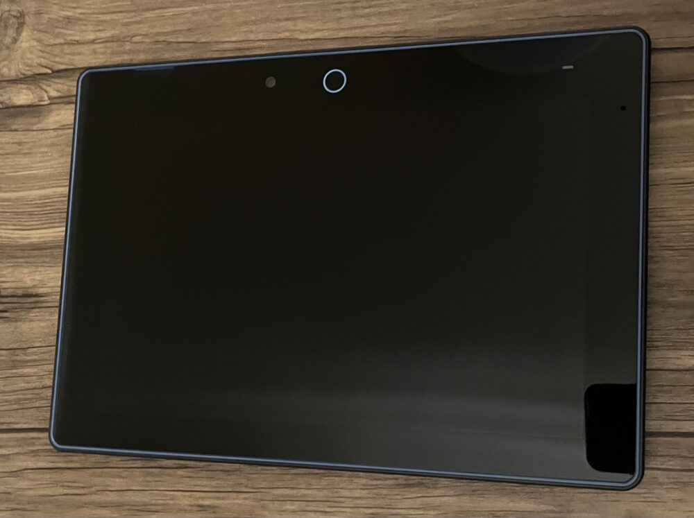
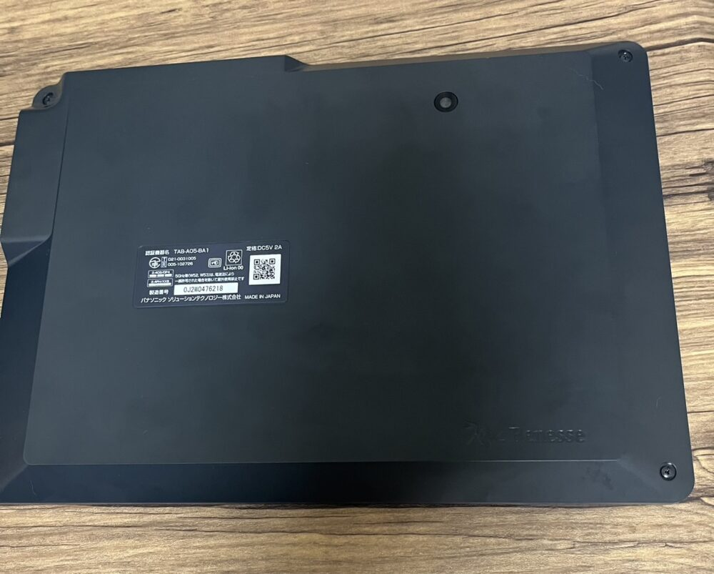
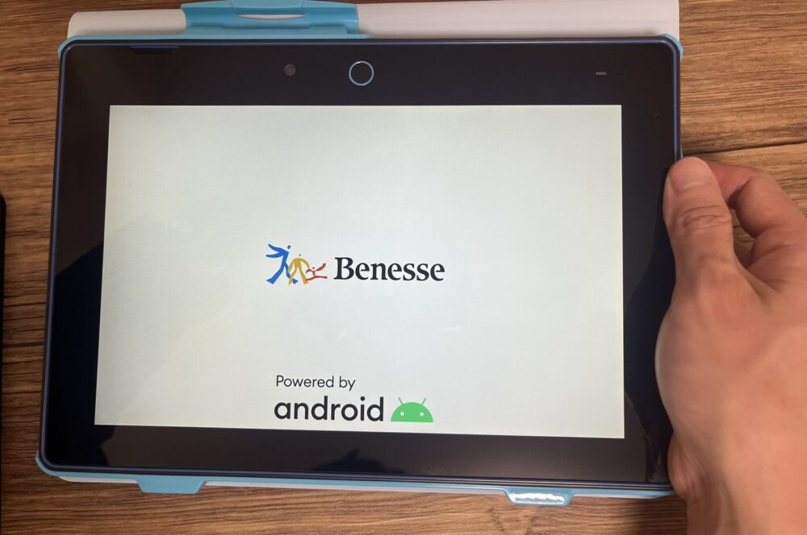
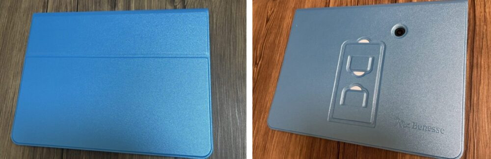
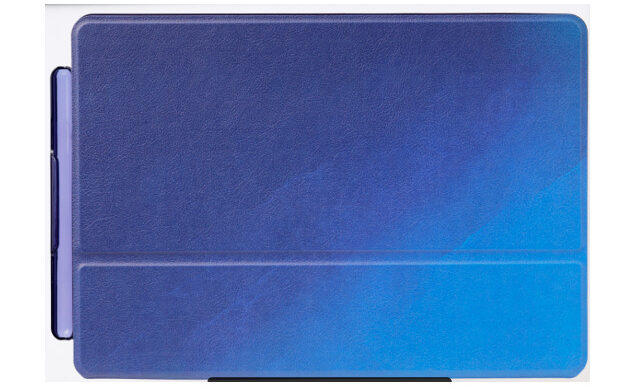
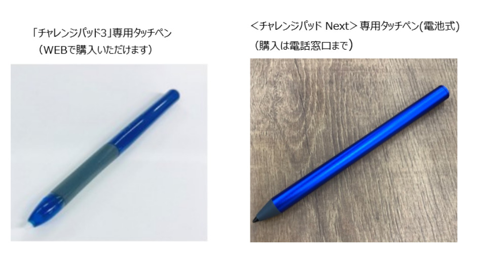

今回は進研ゼミの最新タブレット、**チャレンジパッドnext**について詳しく知りたい方に向けて、詳しく解説していきます。

- チャレンジパッドnextの基本情報が知りたい
- チャレンジパッドnextって何が進化したの？
- チャレンジパッドnextが使用できる学年が限られてるの？

1つでも当てはまる場合は、この記事を最後まで読む事でチャレンジパッドnextに関する疑問を解消することができますので、是非最後までご覧ください。

「旧タブレットから**チャレンジタッチnextに交換したい**」人は[ここからジャンプ](#Form1)してね♪

## チャレンジパッドnext（ネクスト）はどんなタブレット？

チャレンジパッドnext（ネクスト）は、進研ゼミが提供しているタブレットの中で最新のチャレンジパッドです。今までのチャレンジタッチのタブレットよりもあらゆる面で性能が向上しています。

チャレンジパッドnextと**以前のチャレンジタッチの大きな違い**は、ペンと液晶画面の接続方式の変更です。

従来のタブレットでは手を画面に置くと接触部分と認識されてしまいましたが、チャレンジパッドnextではペン先と指だけが接触部分として認識されるようになりました​。

これにより、紙のようにタブレットに**手をついたまま文字を書く**事ができるようになりました。

また、静電容量方式のタッチパネルと電磁誘導方式のペン入力を採用したことで、強くペンを押さなくても筆圧を感知するので、筆圧が元々弱い子供でも書きやすくなりました​。

[今すぐ進研ゼミ公式サイトに入会する（小学講座）](//ck.jp.ap.valuecommerce.com/servlet/referral?sid=3613518&pid=887679902)

[今すぐ進研ゼミ公式サイトから入会する（中学講座）](//ck.jp.ap.valuecommerce.com/servlet/referral?sid=3613518&pid=887697614)

### チャレンジパッドnext（ネクスト）：基本情報

| **チャレンジパッドnext基本スペック** |  |
| --- | --- |
| 液晶サイズ | 10.1インチ(1920×1200ドット) |
| 主な機能 | 静電容量AES方式、カードスロット（microSD/microSDHCメモリーカードスロット）、カメラ（前面500万画素 背面500万画素）、MiniUSB端子、無線LAN(Wi-Fi)IEEE802.11b/g/n/a/ac (周波数帯域：2.4GHz/5GHz) |
| 本体サイズ | 高さ：約185mm×幅：約264mm×厚さ：約15mm |
| ストレージ容量 | 16GB |
| 重量 | 約630g |
| スピーカー | モノラル |
| バッテリー | リチウムイオン電池 |
| 付属品 | 専用カバー、専用AESタッチペン（付属電池使用）、 専用AC電源アダプター |

タブレットカバーのサイズを含めると縦約21.5cm、横約27.5cm××厚さ約1.7cmだよ

チャレンジパッドnextは、大人である私が持っても違和感の無い、操作しやすいサイズ感となっています。

### チャレンジパッドnext（ネクスト）：反応速度

チャレンジパッドnextの反応速度は、普段iPadなどの高性能なタブレットの使用に慣れている人にとっては、**動きが遅く感じられるかもしれません**。

🐕

タブレットの反応速度は家庭のインターネット環境によっても違うよ

チャレンジパッドnextは主に勉強を目的として使用されます。そのため、一般的なタブレットと比べ、高度なグラフィックを処理したり、大量のアプリケーションを同時に実行する能力は必要とされていません。

このような理由から、そのスペックは一般的に動画やアプリケーションを楽しむためのタブレットよりも低めに設定されていることが多いです。

しかし、基本的な学習ツールとして使用する場合には、**その反応速度は充分に満足できるレベル**であると言えます。

逆に、勉強専用タブレットには、YouTubeやSNSを制限できるメリットがあるため「ついついTwitterやYouTubeを見てしまう」という問題は解消されます。

### チャレンジパッドnext（ネクスト）：画質

チャレンジパッドnextの解像度は1920×1200ピクセルと非常に良くなっています。

これは、チャレンジパッド3の解像度（1280×800）と比べて大幅に向上しており、より鮮やかで詳細な画像を楽しむことができます。その結果、子供はより豊かな視覚的情報を得ることができます。

### 新しいチャレンジパッドnext（ネクスト）の進化

チャレンジパッドnextは今までのタブレットから大きく進化したのは以下の2点です。

チャレンジパッドnextの進化

- 手をついて書けるようになった
- 画面の反応が良くなった

今までのタブレットでは「筆圧が弱くなると書いてる途中で文字が途切れてうまく書けない」ということがあり、**口コミでも不満の声**がありました。

チャレンジパッドnextでは、静電容量方式のタッチパネルと電磁誘導方式が採用されました。

これにより、純正のペンか指だけがタブレットに反応するように設計されたため、手をついてまま文字を書くことが可能になりました。

また、ペンを強く書かなくても筆圧を感知するようになっており、筆圧がもともと弱い子供にとっても書きやすくなっています。

[今すぐ進研ゼミ公式サイトに入会する（小学講座）](//ck.jp.ap.valuecommerce.com/servlet/referral?sid=3613518&pid=887679902)

[今すぐ進研ゼミ公式サイトから入会する（中学講座）](//ck.jp.ap.valuecommerce.com/servlet/referral?sid=3613518&pid=887697614)

## チャレンジパッドnext（ネクスト）が届く学年は？

チャレンジパッドnextは、入会した全ての学年に届けられるわけでなく、**学年によって届けられるタブレットが変わります**。

今回は、チャレンジパッドnext（ネクスト）が届けられるがが学年を小学生、中学生別で紹介します。

なお、紙教材コースを選択する場合は、タブレットは届けらませんので、覚えておきましょう。

### チャレンジパッドnextが届く学年：「小学講座」

小学生で、チャレンジパッドnextが届けられるのは、小学1～２年生のみとなっています。それ以外の学年には、チャレンジパッド３が届けられます。

| 学年 | タブレットの機種 |
| --- | --- |
| 小学1年 | チャレンジパッドnext |
| 小学2年 | チャレンジパッドnext |
| 小学３年 | チャレンジパッド３ |
| 小学４年 | チャレンジパッド３ |
| 小学５年 | チャレンジパッド３ |
| 小学６年 | チャレンジパッド３ |

※小学6年生から中学1年生に進級する際には、チャレンジパッドnextが無料プレゼントされます。

詳しく知りたい方は「[進研ゼミ中学生になったら](https://xn--5ckip8c4fq970ahbya2o7acu2a.com/2022/04/30/%e3%83%81%e3%83%a3%e3%83%ac%e3%83%b3%e3%82%b8%e3%82%bf%e3%83%83%e3%83%81-%e4%b8%ad%e5%ad%a6%e7%94%9f%e3%81%ab%e3%81%aa%e3%81%a3%e3%81%9f%e3%82%89%e4%bd%95%e3%81%8c%e5%a4%89%e3%82%8f%e3%82%8b%ef%bc%9f/)」の記事をご覧下さい♪

### チャレンジパッドnextが届く学年：「中学講座」

中学講座では、１～２年生までに入会した場合は、チャレンジパッドnextが届き、中学3年生に入会した場合は、チャレンジパッドneoが届けられます。

| 学年 | タブレットの機種 |
| --- | --- |
| 中学1年 | チャレンジパッドnext |
| 中学2年 | チャレンジパッドnext |
| 中学３年 | チャレンジパッドneo |

※中学1～2年の内に入会した場合、3年生でもそのままチャレンジパッドnextを使用することになります。

[今すぐ進研ゼミ公式サイトに入会する（小学講座）](//ck.jp.ap.valuecommerce.com/servlet/referral?sid=3613518&pid=887679902)

[今すぐ進研ゼミ公式サイトから入会する（中学講座）](//ck.jp.ap.valuecommerce.com/servlet/referral?sid=3613518&pid=887697614)

## チャレンジパッドnext（ネクスト）と他社の専用タブレットを比較

チャレンジパッドnextは、他の専用の学習タブレットと比較して性能はどうでしょうか？

大手のタブレット教材の中で専用タブレットがあるのは、スマイルゼミと進研ゼミの2社のみです。

🐕

チャレンジパッドnextとスマイルゼミのタブレットを比較してみよう

### スマイルゼミとチャレンジパッドnextの比較

チャレンジパッド3以前はスマイルゼミのタブレットの方が、「サクサク動く」「手をついて書ける」とスマイルゼミのタブレットの方が評判がよく高性能と言われていました。

しかし、チャレンジパッドnextでは、**以前の欠点となっていた部分が解消**されたため。2つの機種を比較した場合、チャレンジパッドnextの方が性能は高いと言えます。

[今すぐ進研ゼミ公式サイトから入会する](//ck.jp.ap.valuecommerce.com/servlet/referral?sid=3613518&pid=887679902)

|  | チャレンジパッドnext | スマイルゼミタブレット３ |
| --- | --- | --- |
| 価格 | 39,800円 | 43,780円 |
| サイズ | 高さ：約184.5mm 幅：約264mm 厚さ：約15.3mm | 高さ：180mm 幅：270mm 厚さ：10.2mm |
| 重さ | 約550g | 約630g |
| ディスプレイ | 10.1インチ | 10.1インチ |
| 解像度 | 1920×1200 | 1280×800 |
| メモリ （RAM） | 4GB | 2GB |
| ストレージ容量 （RAM） | 16GB | 16GB |
| ペン入力 | アクティブ静電結合方式 Active Electro Static | 電磁誘導式 |

## チャレンジタッチnext（ネクスト）の付属品は？

チャレンジパッドnextには、専用カバーと専用タッチペンとACアダプター（充電器）の3つが付属品として付いてきます。

今回は、カバーとタッチペンを詳しく見ていきましょう。

### チャレンジタッチnext（ネクスト）付属品：専用カバー

チャレンジパッドnextの専用カバーは、小学生と中学生では送られてくる種類が違います。

**小学生の専用タブレットカバー**

小学生のタブレットカバーには、いくつか色と種類がありますが、申し込む期間やキャンペーンによって選べる種類が変わります。

[✅ チャレンジタッチのタブレット専用カバーの色や種類](https://xn--5ckip8c4fq970ahbya2o7acu2a.com/2023/05/19/%e3%83%81%e3%83%a3%e3%83%ac%e3%83%b3%e3%82%b8%e3%82%bf%e3%83%83%e3%83%81%e3%81%ae%e8%89%b2%e3%81%8c%e9%81%b8%e3%81%b9%e3%82%8b%e6%9d%a1%e4%bb%b6%e3%81%a8%e3%81%af%ef%bc%9f%e3%82%bf%e3%83%96%e3%83%ac/)について詳しく知りたい方は別記事で紹介しています。

**中学生の専用タブレットカバー**

中学生が選べるタブレットのカバーはこの1種類のみとなっています。性別や学年を問わず入会すると、この青色のタブレットカバーが届けられます。

### チャレンジタッチnext（ネクスト）付属品：専用タッチペン

チャレンジパッドnextでは、タブレットの接続方式が変更されたため、タッチペンも従来のペンから変更されています。

チャレンジパッド３までは市販のタッチペンでも反応するように設計されていましたが、チャレンジパッドnextからは、100均などの市販のタッチペンが使用できないようになりました。

🐕

チャレンジパッドnextのペンは電池式だよ

もしペンが故障した場合や失くした場合には、初期不良や自然故障であれば1年以内に無料で交換が可能です。また、1年以上経過している場合や自然故障（勝手に動かなくなった場合など）以外の故障、紛失した場合には、公式のオンラインページや電話で新たに購入することができます。

[今すぐ進研ゼミ公式サイトに入会する（小学講座）](//ck.jp.ap.valuecommerce.com/servlet/referral?sid=3613518&pid=887679902)

[今すぐ進研ゼミ公式サイトから入会する（中学講座）](//ck.jp.ap.valuecommerce.com/servlet/referral?sid=3613518&pid=887697614)

## チャレンジパッドnext（ネクスト）：Q＆A

最後に、チャレンジパッドnextに関するよくある質問をまとめました。

### 途中からチャレンジパッドnext（ネクスト）に交換できる？

結論から言うと、基本的に旧型のチャレンジパッドからチャレンジタッチnextへの**機種変更をすることは可能です。**ただ、新規購入と違い、割引が対ため本体価格の料金（nextなら39,000円）となりますう。一度進研ゼミを退会して[再入会](https://xn--5ckip8c4fq970ahbya2o7acu2a.com/2022/02/24/%e9%80%b2%e7%a0%94%e3%82%bc%e3%83%9f%e3%83%81%e3%83%a3%e3%83%ac%e3%83%b3%e3%82%b8%e3%82%bf%e3%83%83%e3%83%81%e5%86%8d%e5%85%a5%e4%bc%9a%e3%81%ab%e3%81%af%e3%82%bf%e3%83%96%e3%83%ac%e3%83%83%e3%83%88/)する場合も同じです。

また、小学講座6年生から進級して、そのまま進研ゼミ中学講座1年生に進む人には級のタイミングで無料でチャレンジパッドnextが送られてきます。

新規に進研ゼミを申し込む場合でも、送られてくるのがチャレンジタッチNEXTであるとは限らないので、ご自身が進研ゼミに入会した際に送られてくるタブレットをよく確認しておきましょう。（学年ごとに送られてくるタブレットは[ここからジャンプ](#Form1)）

ちなみに、チャレンジパッドを新しく購入した場合、以前使用していたタブレットはAndroidとして改造することもできますが、注意点もあるので、詳しく知りたい方はこちらの記事をどうぞ♪

[✅ チャレンジパッドのAndroid化の方法と注意点](https://xn--5ckip8c4fq970ahbya2o7acu2a.com/2022/04/30/%e3%83%81%e3%83%a3%e3%83%ac%e3%83%b3%e3%82%b8%e3%82%bf%e3%83%83%e3%83%81%e3%81%ae%e6%94%b9%e9%80%a0%e3%81%af%e5%8d%b1%e9%99%ba%ef%bc%9fandroid%e5%8c%96%e3%81%ae%e3%83%aa%e3%82%b9%e3%82%af%ef%bc%95/)

### チャレンジパッドnext（ネクスト）本体の料金はいくら？

チャレンジパッドは機種によって本体の料金が分かります。

| 機種 | 本体料金 |
| --- | --- |
| チャレンジパッド3 | 定価19,800円（税込・消費税率10％） |
| チャレンジパッドnext | 定価39,800円（税込・消費税率10%) |
| チャレンジパッドNEO | 定価39,800円（税込・消費税率10%) |

新しいモデルのチャレンジパッドnextやNEOはチャレンジパッド3と比べると約2倍の本体価格となっています。

この為、保証にはいらずにタブレットが故障した場合は全額自己負担となります。

[今すぐ進研ゼミ公式サイトに入会する（小学講座）](//ck.jp.ap.valuecommerce.com/servlet/referral?sid=3613518&pid=887679902)

[今すぐ進研ゼミ公式サイトから入会する（中学講座）](//ck.jp.ap.valuecommerce.com/servlet/referral?sid=3613518&pid=887697614)

https://xn--5ckip8c4fq970ahbya2o7acu2a.com/2024/10/17/%e3%80%902024%e5%b9%b410%e6%9c%88%e6%9c%80%e6%96%b0%e3%80%91%e9%80%b2%e7%a0%94%e3%82%bc%e3%83%9f%e3%82%ad%e3%83%a3%e3%83%b3%e3%83%9a%e3%83%bc%e3%83%b3%e7%89%b9%e5%85%b8%e4%b8%80%e8%a6%a7%ef%bc%81/

### チャレンジパッドnext（ネクスト）に保証はつけるべき？

進研ゼミには、タブレットが故障しても安く新品と交換できるチャレンジパッドサポートサービスが用意されています。

この保証に入会していれば、万が一タブレットが故障しても1回あたり3,300円(税込)で新品と交換することができます。

**チャレンジパッドサポートサービス月額料金**

毎月払い：240円（年間2,880円）

半年払い：1,350円（年間2,750円）

1年払い：2,400円

「落として壊れた」などの自己破損でも交換してもらえるよ

[✅ 進研ゼミのタブレット保証](https://xn--5ckip8c4fq970ahbya2o7acu2a.com/2022/04/05/%e3%83%81%e3%83%a3%e3%83%ac%e3%83%b3%e3%82%b8%e3%82%bf%e3%83%83%e3%83%81%e7%ab%af%e6%9c%ab%e3%81%ae%e4%ba%a4%e6%8f%9b%e3%81%ae%e6%96%99%e9%87%91%e3%81%af%ef%bc%9f%e4%bf%9d%e8%a8%bc%e3%81%8c%e3%81%84/)に関しては別記事で詳しく解説しています。

[今すぐ進研ゼミ公式サイトに入会する（小学講座）](//ck.jp.ap.valuecommerce.com/servlet/referral?sid=3613518&pid=887679902)

[今すぐ進研ゼミ公式サイトから入会する（中学講座）](//ck.jp.ap.valuecommerce.com/servlet/referral?sid=3613518&pid=887697614)
