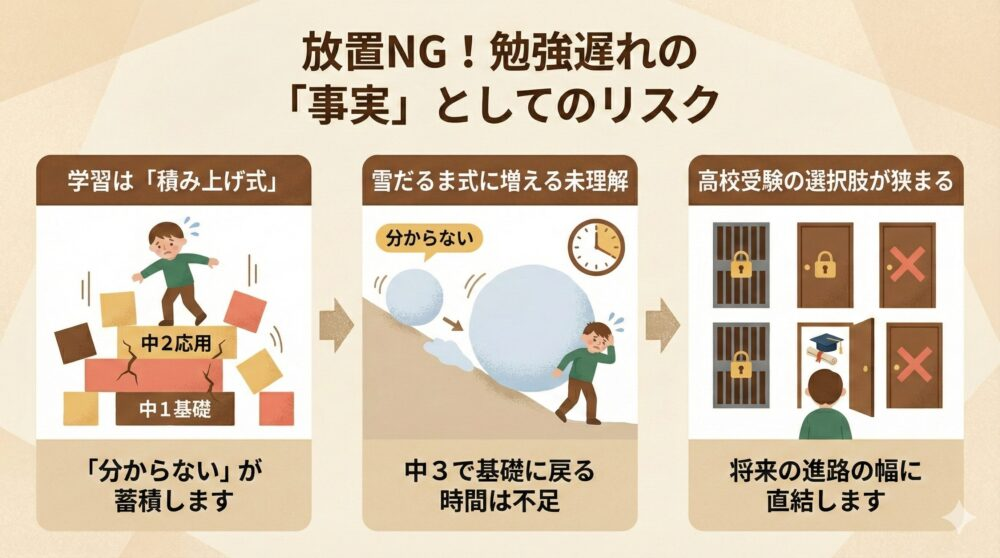
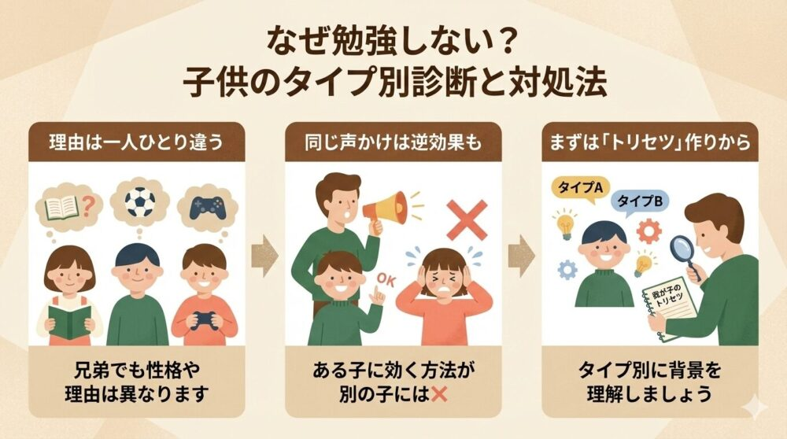

「勉強しなさい！」と言い疲れていませんか？ 中学生のお子さんが勉強しないのには、単なる「怠け」ではない明確な理由があります。

本記事では、思春期の脳の仕組みから、ガミガミ言わずにやる気を引き出す声かけ術までを徹底解説。

読むだけで親のイライラが減り、お子さんが自ら机に向かうための**「損しない始め方」**が見つかります。

## ほっとくとどうなる？脅しではなく「事実」としてのリスク

🐕

放置しすぎるとどうなるの？ 今のうちに事実を知っておきたいワン…。

「今は見守るべき」という言葉を信じて放置しすぎると、**取り返しのつかないリスク**を招くことがあります。

最大の懸念は、**高校受験の選択肢が物理的に狭まる**ことです。 中1・中2の学習内容は積み上げ式のため、一度つまづくと「分からない」が雪だるま式に増え、中3で慌てても基礎に戻る時間が足りないケースが多々あります。

脅すわけではありませんが、今の遅れは将来の進路の幅に直結するという事実は、 親として冷静に把握しておく必要があります。

 

 

### 高校受験の選択肢が狭まるだけではない「本当のデメリット」

中学時代に「コツコツ取り組む」という習慣がつかないまま高校に上がると、さらに難易度が上がる授業で完全についていけなくなります。

高校では義務教育のような手厚いフォローがないことも多く、留年や退学のリスクも現実味を帯びてきます。

中学時代の「勉強しない」は、高校生活の基盤をも揺るがす**地盤沈下**のようなものだと認識しておきましょう。

### 「授業についていけない」が招く学校生活への影響

「勉強が分からない」ストレスは、生活リズム全体を狂わせます。 宿題が終わらないので夜更かしになり、朝起きられず遅刻が増える…。

また、成績不振で部活への参加停止処分などを受けると、**唯一の居場所さえ失ってしまいます**。 勉強のつまずきは、楽しいはずの学校生活全体に暗い影を落とす可能性があるのです。

## 子供のタイプ別診断と対処法

🐕

勉強しない理由は一人ひとり違うんだ。 まずは我が子のタイプを知ることが大切だよ！

兄弟でも性格が違うように、勉強しない理由も一人ひとり異なります。 ある子には効果的だった声かけが、別の子には逆効果になることも。

重要なのは**「なぜ動かないのか」**という背景をタイプ別に理解することです。 我が子のトリセツ（取扱説明書）を作るつもりで、以下のタイプ診断を参考にしてみてください。

| タイプ | 主な原因 | 最優先アクション |
| --- | --- | --- |
| **タイプA** | 部活疲れ・燃え尽き | まずは休息と回復 |
| **タイプB** | スマホ・ゲーム依存 | 排除ではなく管理 |
| **タイプC** | やり方が分からない | 前の学年へ戻る |

 

### 【タイプA】部活疲れ・燃え尽き症候群タイプ

（生活リズム優先・睡眠） 部活を全力で頑張っているお子さんや、中学受験を終えたばかりのお子さんに多いタイプです。

エネルギーが枯渇している状態で無理に机に向かわせても、効率は上がりません。

まずは**「休息」**をスケジュールに組み込みましょう。

帰宅後に15分仮眠をとる、食事とお風呂を先にしてリフレッシュするなど、まずは身体の回復を優先させることが、結果的に学習への集中力を取り戻す近道です。

### 【タイプB】スマホ・ゲーム依存タイプ

スマホを取り上げても、勉強するようにはなりません。 むしろ隠れてやるようになり、関係が悪化します。

大切なのは**「排除」ではなく「管理」**です。 「宿題が終わったらゲームOK」「勉強部屋には持ち込まない」など、親子で話し合ってルールを決めましょう。

一方的に決めるのではなく、子供にも言い分を聞き、**納得できる妥協点**を探るのが成功の鍵です。

### 【タイプC】勉強のやり方がわからない・基礎力不足タイプ

「やろうとしても手が動かない」のは、やり方が分からないからです。 中学生でも、つまづきの原因が小学校の算数にあることは珍しくありません。

恥ずかしがらずに、**分からない学年まで戻って復習**することが最短ルートです。 薄いドリルや簡単な問題集を使い、「解ける！」という感覚を取り戻させてあげましょう。

## 親子関係を壊さずに勉強させる「コーチング」

🐕

言い方を変えるだけで、子供の反応が変わるかも！ コーチングの技術を使ってみよう。

**「させる」から「引き出す」へ**、親のマインドセットを変えましょう。 コーチングとは、答えを与えることではなく、本人の中に答えがあることを信じてサポートする技術です。

失敗する権利を子供に返し、転んだ時にどう立ち上がるかを考えさせることが、本当の自立支援につながります。

### 指示・命令よりも「質問」で考えさせる

「勉強しなさい」は命令ですが、「何時から始める？」は質問です。 質問されると、脳は勝手に答えを探し始めます。

自分で決めたことには責任感が生まれるため、「夕食の前にやる」「数学からやる」と子供自身に選ばせましょう。

親は**決定権を委ね**、出た答えを尊重することが大切です。

### 結果ではなく「プロセス」を褒める技術

他人との比較は厳禁ですが、**過去の子供自身との比較**は最高の褒め材料です。 「前より計算が速くなったね」「先週より単語を覚えたね」と成長を言葉にして伝えましょう。

小さな進歩に気づいてあげることで、子供は「自分は成長している」と実感でき、モチベーションが維持されます。

## まとめ：子供の「自立」を信じて、適切な距離感を見つけよう

親が変われば、子供も変わる！ まずは環境づくりから始めてみよう！

やる気スイッチは親が押すものではなく、**子供自身が押すもの**です。 親にできるのは、スイッチを押しやすい環境を整え、邪魔な障害物を取り除いてあげることだけ。

今日からできること

- まずは子供のタイプ（A・B・C）を見極める
- 「勉強しなさい」を「何時から始める？」に変換する
- 結果ではなく、過去との比較で成長を褒める

今日からできる「声かけの変換」や「環境の見直し」を一つずつ試してみてください。 親が変われば、子供も必ず変わります。
