タブレット学習は、近年ものすごい勢いで普及しており、多くの小学生が利用しています。

文部科学省の調査では、公立の学校におけるタブレットの導入が平成26年から2年間で3.5倍も増えています。

小学生のうちからタブレット学習に慣れておくことも大切になってきます。

今回は、オススメできるタブレット教材を6つに厳選しました。

| 料金 | 特徴 |  |
| --- | --- | --- |
| [進研ゼミ](https://xn--5ckip8c4fq970ahbya2o7acu2a.com/2021/06/28/%e9%80%b2%e7%a0%94%e3%82%bc%e3%83%9f-%e5%b0%8f%e5%ad%a6%e8%ac%9b%e5%ba%a7%e3%81%ae%e5%8f%a3%e3%82%b3%e3%83%9f%e8%a9%95%e5%88%a4%e5%ae%8c%e5%85%a8%e3%81%be%e3%81%a8%e3%82%81/) | 2,980円～5,730円 | ・ゲーム性が高く取り組みやすい |
| [すらら](https://px.a8.net/svt/ejp?a8mat=3BOQS8+8HFMLM+4CT0+60OXE) | 8,228円～ | ・完全個別指導で勉強が苦手な子供でも安心  ・基礎をマスターしたい人向け |
| [スタディサプリ](https://px.a8.net/svt/ejp?a8mat=3HEHQP+CIPGIQ+36T2+TX15E) | 1,980円 | ・一流講師の神授業が見放題  ・料金が安い |
| [スマイルゼミ](https://px.a8.net/svt/ejp?a8mat=3H9NZ4+HVAYI+2P76+5YJRM) | 3,278円～6,270円 | ・高性能のタブレットで勉強を進めやすい  ・「2週間の完全全額保証」 |
| [Z会](https://px.a8.net/svt/ejp?a8mat=3HG23U+A3S676+E0Q+BXB8X) | 2,992円～7,480円 | ・応用問題にたくさん挑戦できる  ・受験対策に最強 |
| [デキタス](https://px.a8.net/svt/ejp?a8mat=3HEHQP+K925E+2MJW+HVFKY) | 3,300円～ | ・アニメで学びやすい  ・無学年制なのでレベルに合わせて学習可能 |

## 小学生タブレット学習おすすめ教材6選

多くの学校や塾でも利用されているタブレット教材ですが、

たくさん種類があってどれを選んだらいいか分からない。

このように悩んでいる方も多いかと思います。

🐕

この記事では、

・質の高さ ・分かりやすさ ・使いやすさ

を考えて教材を6つに厳選しました

それぞれの「特徴」や「向き、不向き」から判断しましょう。

### **①：進研ゼミ・チャレンジタッチ**

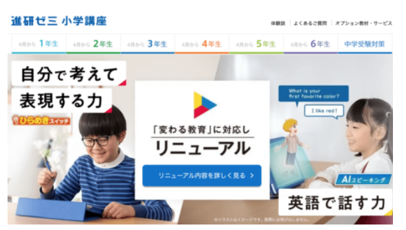

チャレンジタッチは全国の小学生、<strong>4人に1人</strong>が利用している人気教材だよ

| 対象 | 小学１～6年生 |
| --- | --- |
| 教科 | 1～2年 国語、算数、英語3～6年 国語、算数、理科、社会、英語 |
| 学習スタイル | チャレンジタッチ・・・タブレット学習  チャレンジ・・・紙教材 |
| 専用タブレット | あり |
| 料金 | 入会金無料  月2,980円～  ※学年により料金は異なります。 |
| 難易度 | 基礎～標準（※調節可能） |

 

**特徴**

・先生の指導（添削・ライブ映像）

・1000冊以上の本が読み放題

・保護者に進歩状況をメールでお知らせ

・全国規模の診断テストを受けられる

・有料級の英語が0円で受講できる

・小1～小6までプログラミング学習が0円

・「考える力」などのプションの追加ができる

🐕

チャレンジタッチでは、勉強を無理なく続けるための工夫がたくさんあるんだ

✅ **ゲーム感覚で楽しく進められる**

チャレンジタッチは「楽しく勉強したい」という子にピッタリの教材です。

分数のたし算・引き算も、**友人との対戦モード**で楽しく力を付けることができます。

また、チャレンジタッチにはご褒美が用意されています。

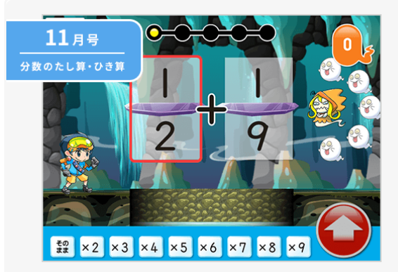

勉強した分だけ学習ゲームやアバターなどと交換できるごほうびがもらえます。

ご褒美は、楽しいだけでなく、頭のトレーニングにもなるので1石2鳥ですね♪

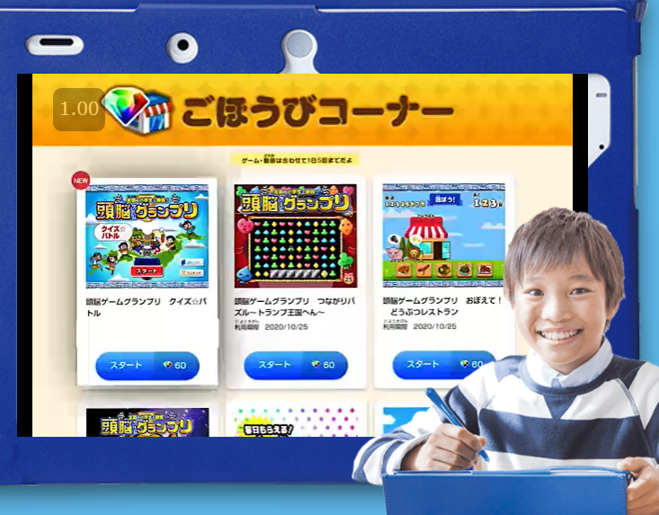

 

✅ **チャレンジイングリッシュの英語がすごい**

小1～高校3年までを対象としています。

レベルが1～12まで用意されており、診断テストから適切なレベルを判断します。

この英語の内容が**超有料級**なんです。

じつは、元々進研ゼミの英語は2018年まで有料（2,040円）だったんです。

2019年から無料で利用することができるようになりました。

進研ゼミの英語に関しては、詳しい内容を別記事で紹介しています。

[【進研ゼミ英語】小学生の「本音」は？チャレンジイングリッシュの口コミを分析](https://xn--5ckip8c4fq970ahbya2o7acu2a.com/2021/10/02/%e3%80%90%e9%80%b2%e7%a0%94%e3%82%bc%e3%83%9f%e8%8b%b1%e8%aa%9e%e3%80%91%e5%b0%8f%e5%ad%a6%e7%94%9f%e3%81%ae%e3%80%8c%e6%9c%ac%e9%9f%b3%e3%80%8d%e3%81%af%e5%8f%a3%e3%82%b3%e3%83%9f%e3%81%a7%e5%88%86/)

🐕

そんなチャレンジタッチの「<strong>向いてる人</strong>・<strong>向いてない人</strong>」の特徴は何だろう？

| **向いている人** | **向いていない人** |
| --- | --- |
| ・ゲーム感覚で学習を進めたい人  ・学習習慣を身につけたい人  ・好奇心が旺盛な人  ・全教科まんべんなく学びたい人  ・読書する習慣をつけたい人 | ・付録や添削など、多くのサービスはいらない人  ・教科書ペースより、オリジナル問題をメインにやりたい人  ・算数のみなど、特定の教科だけを受講したい人  ・専用タブレットを使いたい人 |

ゲームと交えた取り組みやすさから学習習慣を身につけたい人にはオススメです。

[進研ゼミの公式サイトはこちら](//ck.jp.ap.valuecommerce.com/servlet/referral?sid=3613518&pid=887390659)

進研ゼミ小学講座の「口コミ」「メリット・デメリット」は別記事で解説しています。

気になる方はここからどうぞ↓

[チャレンジタッチ【良い口コミ・悪い口コミ】を暴露！入会前にちょっと待ってください](https://xn--5ckip8c4fq970ahbya2o7acu2a.com/2021/06/28/%e9%80%b2%e7%a0%94%e3%82%bc%e3%83%9f-%e5%b0%8f%e5%ad%a6%e8%ac%9b%e5%ba%a7%e3%81%ae%e5%8f%a3%e3%82%b3%e3%83%9f%e8%a9%95%e5%88%a4%e5%ae%8c%e5%85%a8%e3%81%be%e3%81%a8%e3%82%81/)

### **②：すらら**　

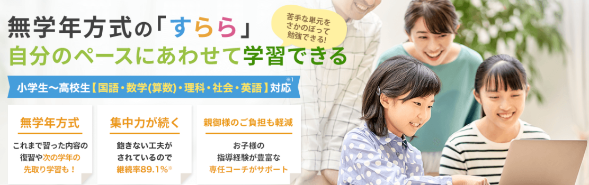

すららは、アニメーションを交えたゲーム性の高い設計となっています。

集中力が無い人にでも続けられるよう研究されています。

コツコツ進めていくことで確実に基礎を定着させる教材として人気の高いすらら。

そんなすららの特徴を紹介します。

すららは、1人1人の子供に合わせた<strong>完全個別指導</strong>なんだ。

| 対象 | 小学１～高校3年生 |
| --- | --- |
| 教科 | 国語、算数、理科、社会、英語  ※国、数、英の3教科のみ受講も可能 |
| 学習スタイル | タブレット、紙 |
| 専用タブレット | なし |
| 料金 | 入会金7,700円～  月額8,800円～ |
| 難易度 | 基礎（レベルに合わせて調節可能） |

**特徴**

・無学年方式で自分に合ったレベルで学習可能

・保護者へのサポートサービスが充実

・料金は高め

・お子さん1人1人に合った学習計画ををプロが設計

・AIが個人の学習データから適切な学習箇所、学習量を判断

・1人でもできるAI搭載ドリルが個人のレベルに合う問題を出題

・「見る、書く、聞く」の五官を使った記憶に残りやすい学習方法

・不登校の場合、すららの受講で出席扱いにできる

・学校の勉強につていけない子でも理解がしやすい設計

🐕

すららは、成績を上げる為に必要な要素の3つである、

1：理解 2：定着 3：活用

これらを全て満たす数少ない教材なんだ

✅ **無学年方式でレベルを調節**

すららでは、完全な無学年方式なので得意な科目は学年関係なくどんどん力を付けられます。

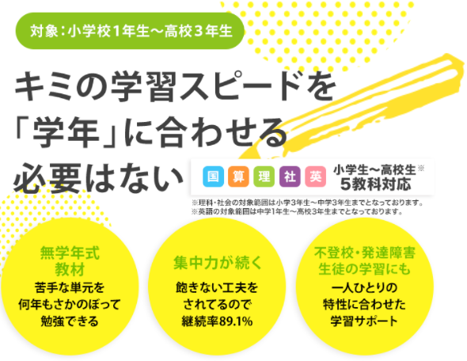

国語や社会は好きだからもっとレベルを上げたい。

そんな人には無学年方式はピッタリです。

逆に<strong>さかのぼる</strong>こともできるんだ

算数は小学校の勉強は基本的に1年～6年まで繋がっています。

**小学生の算数「数量関係」の例**

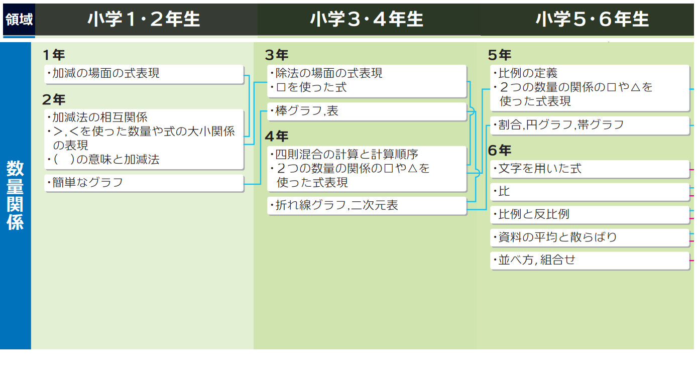小学6年の算数でつまずいた時は関係している分野までさかのぼって勉強できます。

わまりくどく感じるかもしれませんが、この方法は、負担やストレスをかけず確実に理解できる方法として最適なんです。

[参考元URL　 shozen\_keitouzu\_180209 (chuoh-kyouiku.co.jp)](http://www.chuoh-kyouiku.co.jp/pdf/corporation/product/test/shozen-tool5.pdf)

 

✅ **記憶に残りやすい仕組み**

すららでは、色々な感覚を使って勉強していきます。

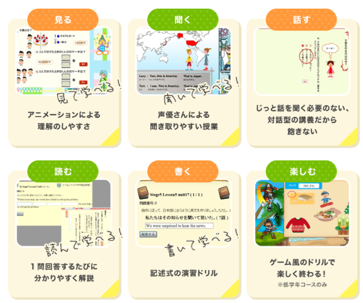

「耳・目・口」を同時に使うことでただ勉強している時と比べると圧倒的に記憶に残りやすくなります。

🐕

すららの向き・不向きを確認しよう

| **向いている人** | **向いていない人** |
| --- | --- |
| ・学校の授業に遅れがちな人  ・集中力が低い人  ・基礎をしっかり身につけたい人  ・悩んだ時に質問できる教材を利用したい人  ・手厚いサポートが欲しい人  ・正しい方向性に導いてもらいたい人  ・発達障害がある人  ・不登校で、家で勉強したい人 | ・既に基礎ができていて応用問題をたくさん解きたい人  ・安い通信教材を求めている人  ・勉強にアニメーションやゲーム性を求めていない人  ・専用タブレットを使用して勉強したい人       |

基礎固め中心のすららでは、応用問題をどんどん解きたい人には向かないようだね。

[すららの公式サイトはここから](https://px.a8.net/svt/ejp?a8mat=3BOQS8+8HFMLM+4CT0+60OXE)

すららの「口コミ」や「メリット・デメリット」は別記事で紹介しています。

気になる方はここからどうぞ↓

[すらら「口コミ最悪」と言われる原因はコレ！たった3分でまるわかり](https://xn--5ckip8c4fq970ahbya2o7acu2a.com/2021/06/14/%e6%9c%80%e6%82%aa%e3%81%99%e3%82%89%e3%82%89%e3%81%ae%e5%8f%a3%e3%82%b3%e3%83%9f%e8%a9%95%e5%88%a4%e3%81%be%e3%81%a8%e3%82%81%ef%bc%81%e6%84%8f%e5%a4%96%e3%81%a8%e7%9f%a5%e3%82%89%e3%81%aa%e3%81%84/)

### **③：スタディサプリ**　

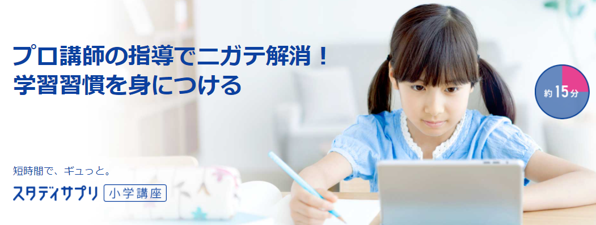

一流講師による授業の良い所は分かりやすさだけではありません。

別角度からみた問題の考え方や勉強の取り組み方など役に立つこと間違えなし。

コスパの高さからも人気の教材となっています。

🐕

スタディサプリの強みはなんと言っても<strong>神授業</strong>

| 対象 | 小学4～高校3年生 |
| --- | --- |
| 教科 | 国語、算数、理科、社会 |
| 学習スタイル | PC、タブレット、スマホ |
| 専用タブレット | なし |
| 料金 | 月額2,178円（税込）～ |
| 難易度 | 基礎～応用 |

スタディサプリの特徴がこちら

**特徴**

・料金が格安

・超一流講師による授業が見放題

・学年関係なく授業動画が見放題

・授業動画はダウンロード可能で好きな場所で勉強できる

・難関中学受験対策が可能

・個別指導コースあり

・小学4年生以上が対象

・料金無料で先取り学習が可能

・全科目に授業テスト・演習問題付

 

✅ **神受業が見放題**

スタディサプリの授業動画は「日本最高峰と呼ばれる講師」が見放題となっています。

授業の質の高さも人気の理由の1つとされています。

<iframe title="YouTube video player" src="https://www.youtube.com/embed/6tP-UGbt9Ko" width="853" height="480" frameborder="0" allowfullscreen="allowfullscreen"></iframe>

このように、紙教材ではイメージしにくい実験も実際に目でみて理解できるようになります。

このようなことができるのも、動画受業ならではですね。

実際のスタディサプリでは、動画速度を０.75～2.0倍まで調節することができます。

慣れてくれば勉強時間を短縮することも可能です。

 

✅ **コスパ最強**

スタディサプリの料金は、他教材と比べても圧倒的にお得です。

学年関係なく、月額2,170円で「小4～高3」まで授業が見放題です。

さらに、1年払い（一括払い）だと、月額1,815円（税込み）と2ヶ月分安くなります。

料金が安いので、「**塾や学校で分からない部分だけ神授業で勉強したい**」と言う人にもオススメです。

そんなスタディサプリの

・向いてる人 ・向いていない人

の違いはこれ

| **向いている人** | **向いていない人** |
| --- | --- |
| ・1人でどんどん進められる人  ・安い料金で受講したい人  ・塾と一緒に利用したい人  ・授業をダウンロードして家以外でも勉強したい人  ・中学受験対策に活用したい人 | ・小学3年生以下の人  ・1人だけで進める自信が無い人 ※講師による個人サポート体制は充実していない為  ・専用タブレットを使って勉強したい人    |

これらが向いている人・向いていない人の特徴となります。

どの教材でもそうですが、お子さんに合った教材を見つけてあげることが**成績UPには非常に大切**となります。

[スタディサプリの公式サイトはここから](https://px.a8.net/svt/ejp?a8mat=3HEHQP+CIPGIQ+36T2+TX15E)

スタディサプリの「口コミ」や「メリット・デメリット」は別記事で解説しています。

気になる方はここからどうぞ↓

[スタディサプリ口コミ評判はどう？ちょっとしたコツで伸び率を飛躍的に上げる](https://xn--5ckip8c4fq970ahbya2o7acu2a.com/2021/05/31/%e3%82%b9%e3%82%bf%e3%83%87%e3%82%a3%e3%82%b5%e3%83%97%e3%83%aa%e5%8f%a3%e3%82%b3%e3%83%9f%e8%a9%95%e5%88%a4%e3%81%af%e3%81%a9%e3%81%86%ef%bc%9f%e3%81%a1%e3%82%87%e3%81%a3%e3%81%a8%e3%81%97%e3%81%9f/)

### **④：スマイルゼミ**　

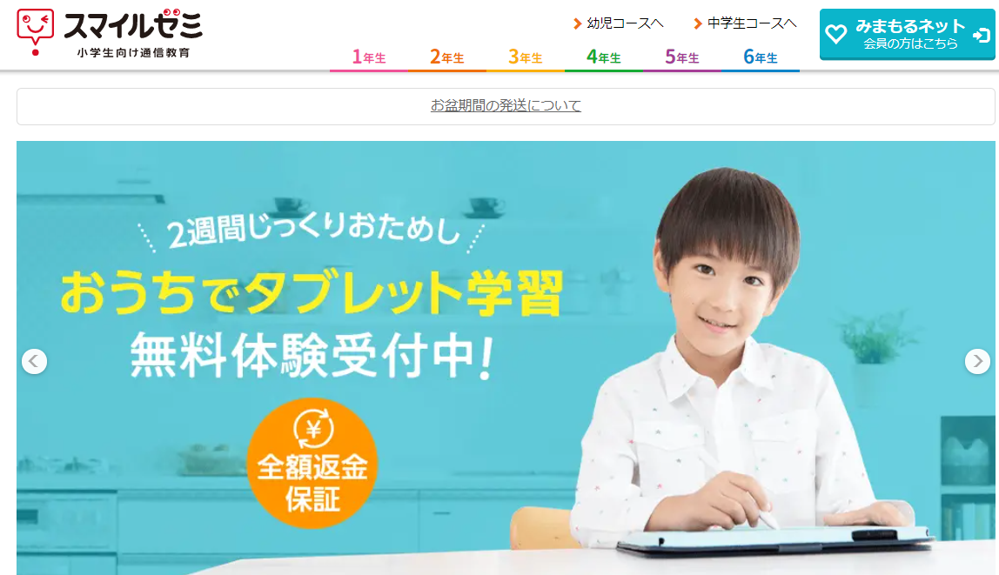

スマイルゼミは、とにかくタブレットの性能が高いのが特徴です。

そのため、ほぼ1人で学習を進められるの設計となっています。

さらに、スマイルゼミでは、2週間以内なら**全額返金のキャンペーン**も実施しています。

「うちの子供に合わないか不安」という方にもおすすめできる教材となります。

🐕

<strong>タブレット性能</strong>で選ぶならスマイルゼミ

| 対象 | 小学1年生～中学3年生 |
| --- | --- |
| 教科 | （小１、小２）国語・算数・英語  （小３～小６）国語・算数・理科・社会・英語 ※オプションでプログラミング講座も受講可能 |
| 学習スタイル | 専用タブレット |
| 専用タブレット | あり |
| 料金 | 月額3,278円～ |
| 難易度 | 標準クラス：基礎～標準 発展クラス：標準～応用（レベルに合わせて対応可能） |

 

**特徴**

・タブレット性能が業界最高クラス

・全額返金保証がある

・実力に合わせてコース変更が可能 ※コースは（標準・発展）クラスの2種類

・ゲーム要素は少なめ

・保護者のスマホからゲームの時間制限が可能

・追加料金0円でプログラミング学習が可能

・学力診断後すぐに個人に適した対策講座を配信

・教科書に完全準拠

・2021年イード・アワード子ども英語教材にて最優秀賞を受賞

スマイルゼミは、・難易度・学習量全てがバランスが良い教材と言えます。

料金も安く満足度の高いタブレット教材となっています。

 

✅ **タブレット性能が高い**

スタディサプリ専用タブレットは性能の高さでは業界トップクラスです。

・画面のキレイさ ・操作性の良さ ・耐久性の高さ ・手をついたまま書ける ・学習状況を的確に把握 ・有害サイトへのアクセスをブロック ・1人1人に合う最適なプログラムが自動作成

スマイルゼは、タブレット性能が高いのが特徴です。

そのため、「書き心地のよさ」や「アニメーションの細かさ」は他のタブレットより優れています。

多くのタブレット教材が①～⑤の選択式のような形で解いていく中スマイルゼミ**は記述式が採用**されています。

より紙書いている感覚が欲しい人にオススメです。

また、アニメーションのキレイさもダントツです。

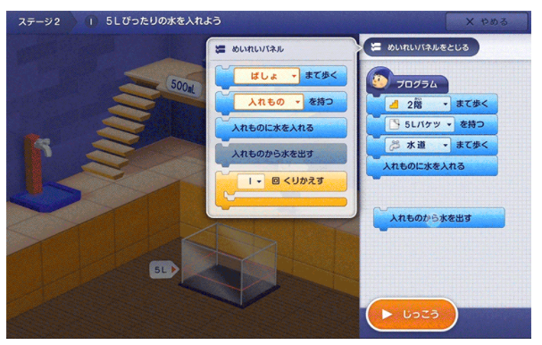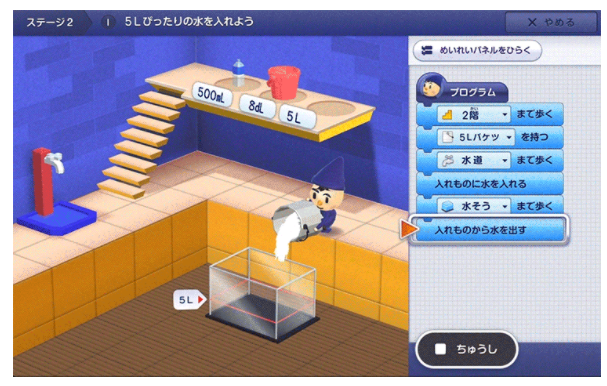

プログラミング学習も、キレイな映像で楽しむことができます。

このようなタブレット性能の高さはスマイルゼミの特徴となります。

しかし、その分タブレット本体の料金は高めです。

本体料金は43,780円（税込み）と、やはりタブレット代だけでもかなり高額です。

ただ、1年間スマイルゼミを継続すると**大幅な割引**があります。

その額なんと**43,780円**　➡　**10,978円**（税込み）で購入することができます。

32,802円も値引されるんです♪

✅ **２週間の全額返金保証**

スマイルゼミは、2週間使用して「合わない」と感じたら全額返金を受けることができます。

もちろん、2週間中は「全国学力診断テスト」「授業動画」「タブレット操作」とすべて利用することができます。

まずは公式サイトから[資料請求](https://px.a8.net/svt/ejp?a8mat=3H9NZ4+HVAYI+2P76+5YJRM)をするといいですよ

 

| **向いている人** | **向いていない人** |
| --- | --- |
| ・紙に書いているような感覚を求める人  ・高性能タブレットでストレスなく勉強がしたい人  ・1度体験してから入会を決めたい人  ・保護者と一緒に学習状況を把握したい人  ・プログラミング学習もしっかり勉強したい人  ・特に英語を伸ばしたい人 | ・紙（テキスト）でも学習したい人  ・ゲーム方式で学習を進めていきたい人  ・自分の持っているタブレットで学習したい人          |

スマイルゼミでは、勉強を進めないとゲームができない仕組みとなっています。

ゲームだけに熱中する心配はしなくてよさそうですね。

[スマイルゼミ公式サイトはここから](https://px.a8.net/svt/ejp?a8mat=3H9NZ4+HVAYI+2P76+5YJRM)

スタディサプリの「口コミ～料金」までの詳しい内容は別記事で紹介しています。

気になる方はここから↓

[スタディサプリ口コミ評判はどう？ちょっとしたコツで伸び率を飛躍的に上げる](https://xn--5ckip8c4fq970ahbya2o7acu2a.com/2021/05/31/%e3%82%b9%e3%82%bf%e3%83%87%e3%82%a3%e3%82%b5%e3%83%97%e3%83%aa%e5%8f%a3%e3%82%b3%e3%83%9f%e8%a9%95%e5%88%a4%e3%81%af%e3%81%a9%e3%81%86%ef%bc%9f%e3%81%a1%e3%82%87%e3%81%a3%e3%81%a8%e3%81%97%e3%81%9f/)

### **⑤：Z会**

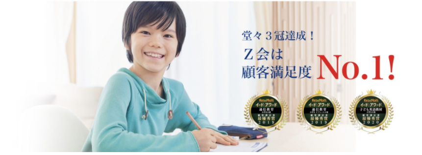教材の質の良さで人気の高いZ会。

ゲーム性は少なく、問題をたくさん解いていく学習スタイルです。

問題をコツコツ解いていくことで考える力が養われます。

🐕

<strong>応用問題</strong>をバンバン解きたい人にオススメだよ。

| 対象 | 小学1年生～小学6年生 |
| --- | --- |
| 教科 | 小１～小２　国語・算数・経験学習  小３～小６　国語・算数・理科・社会（１教科からの受講が可能）  タブレット学習は４教科＋英語・総合学習がついた６教科となります。 |
| 学習スタイル | PC、タブレット、紙 |
| 専用タブレット | なし |
| 料金 | 月額1,870円～ |
| 難易度 | 標準～応用 |

**特徴**

・応用問題が多い

・レベルは高め

・追加料金0円でプログラミングが学べる

・難関中学の受験対策ができる

・ゲーム性は低い

・読解力や考える力が身につく

・料金はやや高め

・個人のレベルに合わせ問題が自動で出題される ※タブレットコースのみ

🐕

そんなZ会の強はなんといってもコレ

✅ **自分で考える力が身につく**

Z会では「自分で考える」力が鍛えられます。

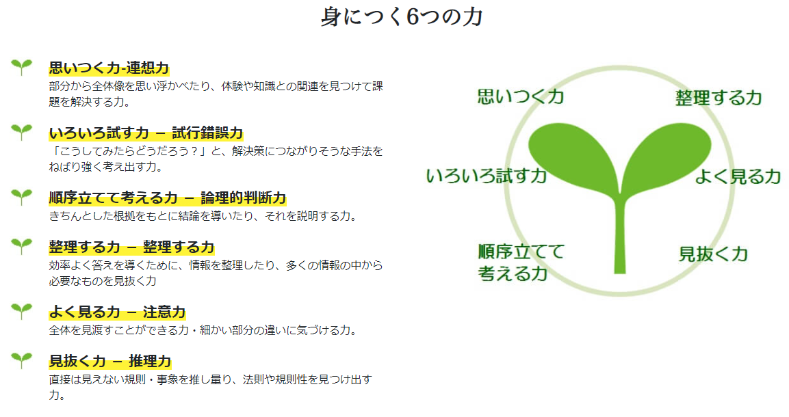

難しく思える課題でも、ねばり強く考え、試行錯誤することで答えを導きます。

解き方がひらめいたときの「快感・達成感」は、とても気持ちのいいものです。

この「考えるって楽しい」と実感できるのがZ会の素晴らしい点です。

問題をじっくり考えて解決することで、**思考することが好きになれる**仕組みです。

 

✅ **教材のレベルが高い**

Z会のレベルは、普通～高め（クラスのテストで平均点以上）を対象に作られています。

進研ゼミのようなゲーム性は少なく、問題をどんど解いてん実力を伸ばすのに特化した教材です。

ただ、アニメーションを使った分かりやすい解説があるので、特別難しいというわけでもありません。

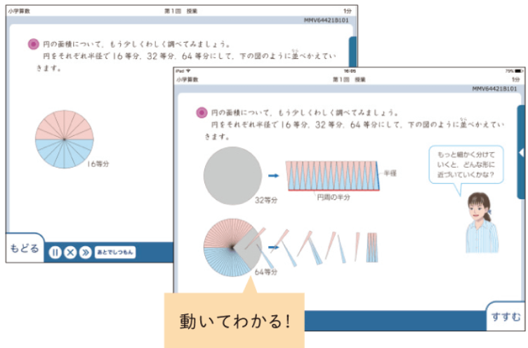

・今は普通レベルだけど、努力して上のレベルを目指したい

・もっとレベルの高い問題を解きたい

Z会はこんな人にオススメです。

さらに、ハイレベルコースというさらにレベルの高いコースも用意されています。

 

Z会のレベルがお子さんに合うかは、資料請求でもらえるお試し教材で判断できますよ。

[Z会のお試し教材はここから](https://px.a8.net/svt/ejp?a8mat=3HG23U+A3S676+E0Q+BXB8X)

🐕

Z会の向いてる人・向いていない人の違いは？

| **向いている人** | **向いていない人** |
| --- | --- |
| ・基礎ができていて更に高いレベルの問題を解きたい人  ・読解力や表現力を伸ばしたい人  ・考える力を身につけたい人  ・難関中学を目指したい人  ・学校のテストで平均点以上の人 | ・ゲーム性を交えて楽しく学習したい人  ・勉強の基礎ができていない人  ・勉強に苦手意識がある人  ・専用タブレットで勉強を進めたい人 |

Z会はレベルの高い教材となっています。

基礎ができていない人にとっては難しいと感じる可能性があります。

逆に、より高いレベルを目指したい人にとってはコレ以上ないタブレット教材となっています。

[Z会の公式サイトはこちら](https://px.a8.net/svt/ejp?a8mat=3HG23U+A3S676+E0Q+BXB8X)

ちなみに、子どもの学習習慣づくりとあわせて、家族全体で学びの時間を持ちたい方には、大人向け講座の探し方も参考になります。

[江東区で習い事を大人が選ぶ完全ガイド　体験や公的講座も楽しく賢く始めよう](https://stepuvia.com/essay/koto-adult-lessons-guide/)

### **⑥：****デキタス**　

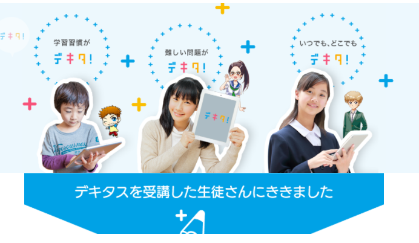

デキタスは料金の安さに対してサービスがとても充実した教材です。

基礎的な問題が多いのが特徴となります。

🐕

<strong>コスパ</strong>よく<strong>基礎</strong>を身につけたいならコレ。

| 対象 | 小学1年生～中学3年生 |
| --- | --- |
| 教科 | 小1～2 国語・　算数・　英語・　生活の4教科 小3～6 国語・算数・英語・理科・社会の5教科  中１～３ 国語・数学・英語・理科・地理 歴史・公民・国文法の8教科   |
| 学習スタイル | PC、タブレット |
| 専用タブレット | なし |
| 料金 | 小学生3,300円（税込み）  中学生4,400円（税込み） ※入会金0円 |
| 難易度 | 易しい～標準 |

**特徴**

・無学年制なのでレベルに合わせて学習可能

・アニメーションでわかりやすい

・問題の解き方は選択式かタイピングがほとんど

・基礎的な問題が多い

・「テストモード」で、テスト勉強したい単元の問題が選べる

・「さかのぼり学習」で前の学年の関連分野までさかのぼり可能

・「さきどり学習」で先の学年の関連分野までさきどり学習可能

・「穴埋め式デキタ’ｓノート」授業動画を見ながら学習できる、穴埋め形式のノート

・間違えた問題集が自動で作成される

 

✅ **基礎の基礎から理解を深められる**

デキタスは学校の授業を確実に理解できることを目的として開発された教材です。

基礎の徹底をしたい人にオススメです。

デキタスでは、学校で習った内容の「****予習・復習**」を手助け**する機能がたくさんあります。

・テストモード

・さかのぼり学習

・先取り学習

・間違えた問題の問題集が自動作成

・穴埋め式デキタ’ｓノート

勉強が苦手な子は特に「予習・復習」をやらないですが、これ超もったいないです。

学校で勉強した内容は、たとえ分からなくても、頭の中に情報がいっぱい入った状態です。

その状態で、**復習**することで短時間で理解することができます。

逆に、自宅で**予習**しておくと頭に情報を入れた状態になります。

この状態で学校の授業を受けることで、普段の何倍も理解しやすくなります。

デキタスは、スモールステップでも確実に伸ばしていく教材です。

「まずは、学校の勉強を理解したい」という人にオススメです。

教材自体もゲーム性が高く、勉強するハードルはグッと低いものになります。

<iframe title="YouTube video player" src="https://www.youtube.com/embed/qliybn9ah6c" width="761" height="426" frameborder="0" allowfullscreen="allowfullscreen"></iframe>

🐕

デキタスに向いている人の特徴は？

| **向いている人** | **向いていない人** |
| --- | --- |
| ・基礎を学びたい人  ・ゲーム感覚で勉強を進めたい人  ・集中力があまり続かない人  ・「予習・復習」に使いたい人  ・コスパのいい教材を選びたい人 | ・応用問題をたくさん解きたい人  ・個別サポートが必要な人  ・タブレットでも記述式で答えたい人    |

ここまでで思った方もいるかもしれませんが、デキタスはすららとコンセプトがよく似ています。

✅ **すららとデキタスの違い**

「どちらがいいのか分からない」人の為に2つの違いを紹介します。

デキタスとすららの大きく違う点は以下の4つ

|  | すらら | デキタス |
| --- | --- | --- |
| 個別の先生のサポート | ◎ | × |
| 科目数が多い | ◎ | ○ |
| 料金の安さ　 | × | ◎ |
| 進め方 | 学校で学ぶ範囲はすべてカバーしているが、進め方が教科書と同じではない | 自分の学校の教科書に沿って学べる |

「個別指導」や「授業の分かりやすさ」などを細かい点を重視する方にはすらら。

「とにかく安くしたい」「教科書と同じように進めたい」という人にはデキタスがおすすめです。

[デキタスの公式サイトはここから](https://px.a8.net/svt/ejp?a8mat=3HEHQP+K925E+2MJW+HVFKY)

デキタスの、「口コミ」や「メリット・デメリット」は別記事で紹介しています。

気になる方はこちらから

[【デキタス・口コミ調査】注意すべきタブレット学習のデメリットとは？評判・料金・退会方法まで解説](https://xn--5ckip8c4fq970ahbya2o7acu2a.com/2021/06/14/%e3%80%90%e3%83%87%e3%82%ad%e3%82%bf%e3%82%b9%e3%83%bb%e5%8f%a3%e3%82%b3%e3%83%9f%e3%80%91%e6%b3%a8%e6%84%8f%e3%81%99%e3%81%b9%e3%81%8d%e3%83%87%e3%83%a1%e3%83%aa%e3%83%83%e3%83%88%e3%81%a8%e3%81%af/)

**タブレット教材の比較****総合****まとめ**

ここまで紹介したタブレット教材は、ランキング形式ではありません。

人それぞれ「難易度」「料金」「機能」と求めるものが違います。

それぞれの教材には良い点もあれば悪い点もあります。

お子さんの学力や性格から判断してみるのも良いですよ。

|  | 料金 | 特徴 |
| --- | --- | --- |
| [進研ゼミ](https://sho.benesse.co.jp/) | 2,980円～5,730円 | ・ゲーム性が高く取り組みやすい |
| [すらら](https://px.a8.net/svt/ejp?a8mat=3BOQS8+8HFMLM+4CT0+60OXE) | 8,228円～ | ・完全個別指導で勉強が苦手な子供でも安心  ・基礎をマスターしたい人向け |
| [スタディサプリ](https://px.a8.net/svt/ejp?a8mat=3HEHQP+CIPGIQ+36T2+TX15E) | 1,980円 | ・一流講師の神授業が見放題  ・料金が安い |
| [スマイルゼミ](https://px.a8.net/svt/ejp?a8mat=3H9NZ4+HVAYI+2P76+5YJRM) | 3,278円～6,270円 | ・高性能のタブレットで勉強を進めやすい  ・「2週間の完全全額保証」 |
| [Z会](https://px.a8.net/svt/ejp?a8mat=3HG23U+A3S676+E0Q+BXB8X) | 2,992円～7,480円 | ・応用問題にたくさん挑戦できる  ・受験対策に最強 |
| [デキタス](https://px.a8.net/svt/ejp?a8mat=3HEHQP+K925E+2MJW+HVFKY) | 3,300円～ | ・アニメで学びやすい  ・無学年制なのでレベルに合わせて学習可能 |

## 小学生タブレット学習のデメリットって何？

まずはタブレット学習のデメリットを3つ紹介するよ。

詳しく見ていこう。

### デメリット①：記述式に対応できない

基本的にタブレット学習は選択式やタイピングで回答していきます。

そのため「書いて勉強する」ということは今までよりも減っていくでしょう。

「タブレット学習でも記述にこだわりたい」

そんな方は、スマイルゼミや進研ゼミチャレンジタッチが良いですよ。

特にスマイルゼミは書くことにこだわりが強く、紙に書いてる感覚で使用することができます。

また、スタディサプリのような「タブレット＋紙テキスト」といったバランスのいい教材を選ぶのもオススメです。

### デメリット②：タブレット故障の心配

タブレット端末を使用する場合どうしても気になるの故障の心配です。

特に子供ははわざとでなくても簡単に物を壊してしまいますよね？

タブレットが壊れるのは

・外部からの衝撃（床に落とすなど） ・内部に異常が起きる（突然つかなくなるなど）

の2つが考えられます

外部からの衝撃は保護シートやカバーを貼って対策しておきましょう。

それでも故障が心配・・・

という方は「進研ゼミチャレンジタッチ」や「スマイルゼミ」などの専用タブレットがある教材を選びましょう。

専用タブレットがある場合は必ず保険や保証が用意されています。

毎月300円程度、追加で払う必要はありますが、万が一壊れても特別料金で交換することができます。

例）スマイルゼミの場合

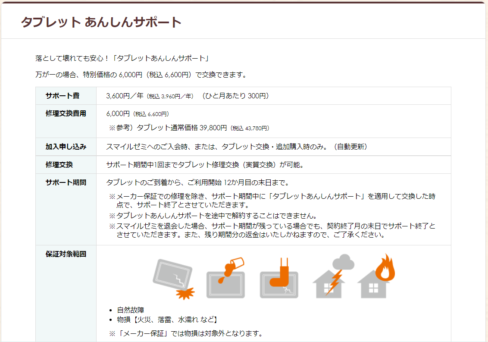

このようにスマイルゼミの場合ひと月300円でサポート保証が受けられます。

タブレットの通常価格が（税込 43,780円）を考えると入っておくと安心です。

### デメリット③：SNSやYouTubeをついつい見てしまう

タブレット端末を使用するとどうしてもSNSやYouTubeなど膨大なコンテンツが使い放題になってしまいます。

子供だけでなく大人でもついついYouTubeやツイッターを見てしまうことはあるはずです。

そんなは、使用しているタブレットのSNSやYouTubeに制限をかけましょう。

子供の気がそれる心配が無くなります。

しかし、制限をかけられないタブレットもあります。

そんな時は「[スマイルゼミ](https://px.a8.net/svt/ejp?a8mat=3H9NZ4+HVAYI+2P76+5YJRM)」や「[進研ゼミチャレンジタッチ](https://ck.jp.ap.valuecommerce.com/servlet/referral?sid=3613518&pid=887390659)」などの専用タブレットが付いてくる教材がオススメです。

これならSNSやYouTubeの制限はもちろん。

ゲームをする場合でも保護者が時間制限の設定ができるので**遊びすぎる心配がありません**。

## 小学生タブレット学習メリットは？

🐕

タブレット学習のメリットって何だろう？

### メリット①：五感を使うことで記憶に残りやすい

視覚・聴覚・嗅覚・味覚・触覚。五感を鍛えるということは、脳の活性化に直に繋がります。

タブレット学習では、紙学習と比べ五感をより多く使いながら進められます。

このため、視覚以外からの情報もあり、記憶に残りやすくなります。

アニメーションによる問題解説やプロの声優による音声解説により飽きずに勉強することができますよ。

### メリット②：勉強嫌いな子でも取り組みやすい

タブレット学習ではアニメーションやゲーム性が高いものが多く楽しみながら勉強できます。

✅ **子供たちがテレビゲームやアプリゲームになぜ没頭してしまうか存知でしょうか？**

理由は簡単で、ゲームははまるように計算されて作られているからです。

つまり、ゲームにはかなり強い中毒性があるんです。

それは「報酬を手に入れる」だったりアプリゲームであれば「ガチャを回すドキドキ」だったり。

タブレット学習ではこのゲームの中毒性を利用して作られています。

そのため紙教材にはない喜びや快感を得られることができます。

勉強きらいの子供でも取り組みやすく、1度ゲームにはまると一気に進む子も珍しくありません。

特に[進研ゼミチャレンジタッチ](https://sho.benesse.co.jp/)などが当てはまります。

ゲーム感覚なので習慣化されやすく、集中すると物すごい集中力でとり組んでくれるように工夫されています。

### メリット③：時間効率が圧倒的に高い

タブレット学習は基本的に効率的に学習できます。

それは、紙教材では時間のかかる作業が大幅に短縮できるからです。

タブレットでの勉強の流れ

・電源を入れた瞬間からその日やるべき講座や内容を教えてくれる ・授業動画やアニメーション解説で基礎を理解 ・簡単な小テストが自動で出題 ・問題の答え合わせが一瞬で終わる ・間違えた問題から苦手な問題や分野が簡単に分かる ・子供の学習時間を自動管理

どうでしょうか？

✅ **これ紙教材でやろうと思うとかなり時間がかかりますよね？**

タブレット学習では、超効率的に勉強を進められるので無駄な勉強時間を減らせます。

メリハリをつけて勉強することができるので子供にとっても勉強時間が短く感じられるはずです。

### メリット④：子供が本当に勉強したのかが丸わかり

親子間でよく耳にする

・勉強やった？ ・早く勉強しなさい ・いつまで遊んでるの？

多くの親御さんが口にしてきた言葉だと思います。

しかし、子供に「やった」と言われれば保護者には本当にやったかどうかは分かりません。

でもタブレット学習の場合本当にやったかどうかは保護者用の管理画面を見れば一発で分かります。

本当に勉強した時にゲームや見たいテレビを自由にされるということも子供の意欲ＵＰには効果的なんだね。

