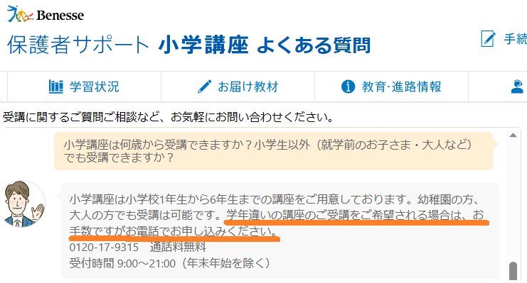
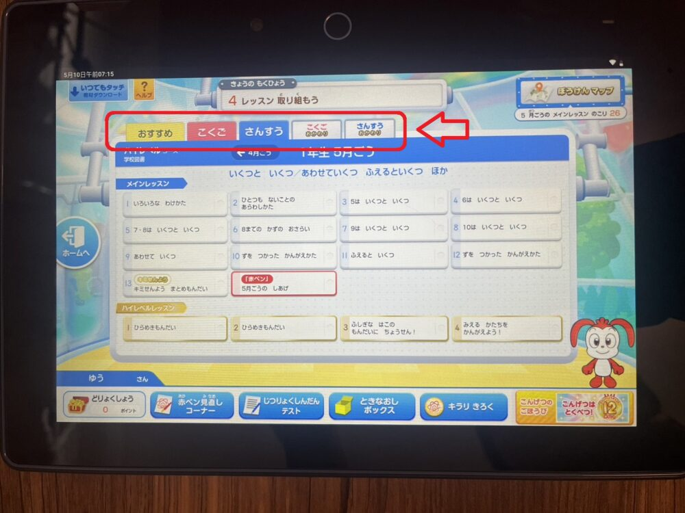

幼児～小学1年生がチャレンジタッチの1年生を先取り学習することは**可能**です。

ただ、先取りと言っても、**どれくらい先の内容**を学習したいかによって、申し込みの方法が変わります。

どれくらい先の内容を先取りする？

- 1学年上げて先取りしたい
- 学年を変えず数ヶ月先の内容を先取りしたい

このように、希望する内容によってチャレンジタッチの申し込み方法が異なります。正しい先取りの入会方法を知らないまま、申し込みをしてしまうと**間違った入会**をしてしまう可能性があるので注意しましょう。

この記事では、幼児～小学1年生がチャレンジタッチ1年生を先取りする際の「申し込み方法～知っておくべき注意点」を詳しくまとめてあるので、是非最後までご覧ください。

## 幼児にチャレンジタッチを先取りさせる方法「学年を変えず」

幼児（年長）が数ヶ月分だけ先取りをしたい場合はどうするの？

翌年に小学1年生になる幼児（年長）が数ヶ月といった短い期間分を先取りするには、**先行申し込みが必要**になります。

先行申し込みすると、小学1年生の4月に届く教材が、12月あたりにお届けされるので、通常より4ヶ月先の内容を学習することができます。

### チャレンジ1年生を先行申し込みする必須条件

幼児（年長）がチャレンジ1年生の内容を数ヶ月早く先取りするには、**こどもちゃれんじ年長コース**に入会している必要があります。

先行申し込みをするには、こどもちゃれんじを受講していないといけないんだね

すでに受講している人は、ご自身の良いタイミングでいつでも先行申し込みをすることができます。

先行申し込みの方法は「[進研ゼミ1年生準備スタートボックス](https://xn--5ckip8c4fq970ahbya2o7acu2a.com/2023/07/03/1%e5%b9%b4%e7%94%9f%e6%ba%96%e5%82%99%e3%82%b9%e3%82%bf%e3%83%bc%e3%83%88%e3%83%9c%e3%83%83%e3%82%af%e3%82%b9%e3%81%ae%e8%b1%aa%e8%8f%af%e7%89%b9%e5%85%b88%e3%81%a4%e3%81%a8%e3%81%af%ef%bc%9f%e7%99%bb/)」で紹介しています。

### 先行申し込みでチャレンジ1年生の教材が12月に届く

こどもちゃれんじ受講中にチャレンジ1年生の先行申し込みをしておくことで、12月に先行で教材が届けられます。

通常チャレンジ1年生が届くのは、3月25日の為、先行申し込みをしておくことで、通常よりも**4ヶ月早く**先取り学習をすることが可能となっています。

### 先行申し込みなしで先取りはできない

通常、チャレンジ1年生を受講すると教材が配信されるタイミングは、前の月の25日になります。

例えば・・・

10月分の教材を先取り学習したいと思っても、教材が配信されるタイミングは、9月25日から。ということになります。

🐕

学年を変えずに先取りしたい方は、先行申し込みが必要だよ

[今すぐこどもちゃれんじに入会して先行申し込みする](//ck.jp.ap.valuecommerce.com/servlet/referral?sid=3613518&pid=889236321)

## 幼児にチャレンジタッチを先取りさせる方法「1学年上げて」

現在、幼児のお子さんが1学年超えてチャレンジ1年生に先取りで入会する場合は、**電話での申し込み**が必要です。

「進研ゼミ 小学講座」お問い合わせ窓口（電話） [0120-17-9315](tel:0120-17-9315)　通話料無料 ※受付時間：9：00～21：00（年末年始を除く）

「進研ゼミの小学講座」に電話でお問い合わせをして、「子供に先取り学習をさせたい」と伝えればあとはスタッフさんが丁寧に対応してくれますよっ♪

[チャレンジタッチ1年生の先取りに関するお問い合わせは公式サイトからどうぞ](//ck.jp.ap.valuecommerce.com/servlet/referral?sid=3613518&pid=889236691)

また、幼児が進研ゼミに先行で申し込みをする場合、準備スタートボックスというキャンペーンが利用出来ます。

このキャンペーンを利用すると、8つの豪華特典がお値段そのままで受けられます。

詳しくは「[準備スタートボックス](https://xn--5ckip8c4fq970ahbya2o7acu2a.com/2023/07/03/1%e5%b9%b4%e7%94%9f%e6%ba%96%e5%82%99%e3%82%b9%e3%82%bf%e3%83%bc%e3%83%88%e3%83%9c%e3%83%83%e3%82%af%e3%82%b9%e3%81%ae%e8%b1%aa%e8%8f%af%e7%89%b9%e5%85%b88%e3%81%a4%e3%81%a8%e3%81%af%ef%bc%9f%e7%99%bb/)」の記事からご覧下さい♪

### 幼児に1学年上の先取りさせても大丈夫？

結論から言うと、チャレンジタッチ1年生の先取りは、幼児が取り組んでも十分に効果が期待できます。

もともと「[チャレンジタッチには何歳から](https://xn--5ckip8c4fq970ahbya2o7acu2a.com/2022/04/03/%e3%83%81%e3%83%a3%e3%83%ac%e3%83%b3%e3%82%b8%e3%82%bf%e3%83%83%e3%83%81%e3%81%af%e4%bd%95%e6%ad%b3%e3%81%8b%e3%82%89%e5%88%a9%e7%94%a8%e3%81%a7%e3%81%8d%e3%82%8b%ef%bc%9f%e5%b9%bc%e5%85%90%e3%81%a7/)」という年齢制限はないため、子供が進研ゼミに興味を持ったタイミングで始めさせるのも良いでしょう。

チャレンジ1年生では、キャラクターによる説明が多く、小さい子供でも楽しんで取り組むことができるような工夫が散りばめられています。

さらに、小学1,2年生には、「[標準コースとハイレベルコース](https://xn--5ckip8c4fq970ahbya2o7acu2a.com/2023/08/30/%e3%83%81%e3%83%a3%e3%83%ac%e3%83%b3%e3%82%b8%e3%82%bf%e3%83%83%e3%83%81%e3%83%8f%e3%82%a4%e3%83%ac%e3%83%99%e3%83%ab%e3%82%b3%e3%83%bc%e3%82%b9%e3%81%ae%e5%a4%89%e6%9b%b4%e8%a8%ad%e5%ae%9a%e3%81%af1/)」の2種類が用意されていて、ご自身の好きなタイミングコースを切り替える事が可能です。

ただし、幼児がチャレンジ1年生に取り組む際には、保護者のサポートが大切です。

お子さんの理解度や興味に合わせて進めることで、無理なく学習することができます。また、適切なフィードバックや励ましを行い、子どもたちに自信を持たせることが大切です。

さらに、進研ゼミでは、会員なら無料で利用できるサービスが充実しています。

進研ゼミ会員が無料で利用できるサービス一覧

- [まなびライブラリー（1000冊の本が読み放題）](https://xn--5ckip8c4fq970ahbya2o7acu2a.com/2023/07/18/%e3%83%81%e3%83%a3%e3%83%ac%e3%83%b3%e3%82%b8%e3%82%bf%e3%83%83%e3%83%81%e3%81%ae%e6%9c%ac%e8%aa%ad%e3%81%bf%e6%94%be%e9%a1%8c%e3%82%b5%e3%83%bc%e3%83%93%e3%82%b9%e3%81%a8%e3%81%af%ef%bc%9f%e9%80%b2/)
- [チャレンジオンライン生配信授業](https://xn--5ckip8c4fq970ahbya2o7acu2a.com/2023/06/26/%e3%83%81%e3%83%a3%e3%83%ac%e3%83%b3%e3%82%b8%e3%82%aa%e3%83%b3%e3%83%a9%e3%82%a4%e3%83%b3%e6%8e%88%e6%a5%ad%e3%82%92%e3%80%8c%e5%8f%97%e8%ac%9b%e3%81%97%e3%81%9f%e6%84%9f%e6%83%b3%e3%80%8d/)
- [プログラミング（基礎）](https://xn--5ckip8c4fq970ahbya2o7acu2a.com/2022/03/08/%e9%80%b2%e7%a0%94%e3%82%bc%e3%83%9f%e3%83%81%e3%83%a3%e3%83%ac%e3%83%b3%e3%82%b8%e3%82%bf%e3%83%83%e3%83%81%e3%80%8c%e5%b0%8f%ef%bc%91%ef%bd%9e%e5%b0%8f%ef%bc%96%e3%80%8d%e3%81%ae%e3%83%97%e3%83%ad/)
- [チャレンジイングリッシュ（小1～高3レベルの英語が使い放題）](https://xn--5ckip8c4fq970ahbya2o7acu2a.com/2022/03/28/%e3%83%81%e3%83%a3%e3%83%ac%e3%83%b3%e3%82%b8%e3%82%a4%e3%83%b3%e3%82%b0%e3%83%aa%e3%83%83%e3%82%b7%e3%83%a5%e3%81%ae%e6%96%99%e9%87%91%e3%81%af%e7%84%a1%e6%96%99%ef%bc%81%ef%bc%9f%e3%80%8c%e5%88%a9/)

もちろん、先行申し込みで入会した幼児の子供でも利用することができます。気になるかたは別記事からご覧下さい。

## 9割が誤解している幼児にチャレンジタッチを先取りさせるコツ

ほとんどの人は、先取り学習の目的を「授業で勉強する前に知識を得ること」だと考えています。

しかし、小さい子供に先取り学習をさせる場合は、**勉強＝****得意なこと「楽しいこと」**という**良いセルフイメージ**を持たせることにあります。これが1番大切です。

**セルフイメージとは・・・？**

セルフイメージとは、自分自身をどう見ているか、自分自身についての「自分の能力、見た目、性格、価値」などの印象のことを表しています。

たとえば、自分が数学が得意だと思っているなら、それはセルフイメージの一部です。また、自分が優しくて友達思いだと思っている場合も、それはあなたのセルフイメージに含まれます。

このため、自分のセルフイメージを理解し、良い方向に育てることは非常に重要です。

🐕

ココを間違えると逆効果だよ

そのため、お子さんに先取り学習をさせる際に、以下のように言われると、子供は自然と悪いセルフイメージを持ってしまいます。

言ってはいけない言葉

- 「字の書き方がなってない」
- 「○○が間違っている」
- 「何回言ったら分かるの？」

このように叱られると、子供は「自分は勉強ができないんだ」「勉強なんか楽しくない」というイメージを持ってしまいます。

人は自己イメージに沿った行動を**自然と選択**していきます。悪いセルフイメージを持つと子供は勉強自体を嫌いになり、本末転倒になってしまいまうので、注意が必要です。

🐕

「最初はできなくて当たり前」と思って根気強く教えてあげよう

**＼5分で完了／**

[今すぐこどもちゃれんじに入会する「幼児コース」](//ck.jp.ap.valuecommerce.com/servlet/referral?sid=3613518&pid=889236321)

[今すぐ進研ゼミに入会する「小学講座」](//ck.jp.ap.valuecommerce.com/servlet/referral?sid=3613518&pid=889236463)

## メリット：幼児チャレンジタッチ1年生を先取りさせる効果とは？

先取り学習は、幼児や小学1年生などの小さい子供のうちから始めることで、より効果を実感できると言われています。

具体的には、数の理解が早まる幼児期の頃からで、適切な方法で先取り学習をさせておくことで、大きなメリットを得ることができます。

### 先取りで分からなくても、授業を聞いて理解できるようになる

あなたは、「何時間考えても理解できなかった問題が、数日後に挑戦したらすんなり分かった」という経験はありませんか？

人間は一度考えて分からなかった内容を無意識に考える性質があります。

そのため、先取り学習をしておくことで、理解できない内容でも後日先生の授業を聞いたら「分かった」となる可能性は格段に高くなります。

**＼5分で完了／**

[今すぐこどもちゃれんじに入会する「幼児コース」](//ck.jp.ap.valuecommerce.com/servlet/referral?sid=3613518&pid=889236321)

[今すぐ進研ゼミに入会する「小学講座」](//ck.jp.ap.valuecommerce.com/servlet/referral?sid=3613518&pid=889236463)

### 劣等感を感じにくくなる

人間は周りと自分を**無意識に比較**する性質がある為、 小学校で授業が始まると嫌でも周りの子と比較してしまいます。

そんな時、授業についていけないと他の子は理解できているのに「自分はできない」と**劣等感を感じてしまう**可能性があります。

先取り学習で、基本的な知識やスキルを身につけておくことで、周囲の子どもたちと比較しても遅れを感じることが少なくなり、劣等感を感じにくくなります。

### 「自分は勉強が得意」というセルフイメージが身に付く

先ほども説明しましたが、幼児が先取り学習をしておくことで、学校の授業が理解でき、「勉強は楽しい、得意」という良いセルフイメージを持たすことができます。

幼い頃からこのセルフイメージを持つことで、**勉強に対する苦手意**識がなくなり、将来的にも勉強を進んで取り組む可能性が高くなります。

### 授業で習った内容の理解が深まる

あらかじめ先取り学習で勉強した内容は、学校の授業を受けることで、より理解を深めることができます。

学校の授業が復習になるため、苦手な内容でもついていけるようになり、得意な内容であれば、理解をさらに深め、応用問題にも取り組むことができるようになります。

**＼5分で完了／**

[今すぐこどもちゃれんじに入会する「幼児コース」](//ck.jp.ap.valuecommerce.com/servlet/referral?sid=3613518&pid=889236321)

[今すぐ進研ゼミに入会する「小学講座」](//ck.jp.ap.valuecommerce.com/servlet/referral?sid=3613518&pid=889236463)

## デメリット：幼児にチャレンジタッチ1年生を先取りさせるリスクとは？

先取り学習をさせる場合、間違った方法で無理に勉強させてしまうと、逆効果のとなってしまう可能性があります。

特に、小さい子への先取り学習を考えている方は、デメリットがあることも理解しておきましょう。

不安を感じる方は、こどもちゃれんじ（幼児用）で、コツコツ勉強させてあげてね♪

### 授業に対する興味が薄れてしまう可能性がある

先取り学習によって、子供が学校で習う内容を既に理解している場合、授業が退屈に感じてしまう可能性があります。

そのため、先取り勉強をするときは、子どものペースや興味を考慮して、**ちょうどいいレベル**の勉強を選ぶことが大切です。

家で勉強するために、いい環境とサポートを用意することで、子どもが興味を持ち続けて、授業にも積極的に参加できるようになります。

### 先取り学習は親のサポートが必要

小さなお子さんの場合、はじめのうちは分からない所だらけの為、放っておくとやらなくなってしまう可能性が高為、保護者のサポートは必要不可欠となります。

米国心理学会（APA）が発表した研究によると、親のサポートがある場合、子供の学習継続率が20%向上することがが確認されています。

このことからも、小さい子供に先取り学習をさせる際は、必ずサポートをしてあげましょう。

ただ、チャレンジタッチのように、アニメーションを使った音声ガイドや自動丸付け機能が搭載されていれば、慣れてくればある程度は子供一人で進められるようになります。

自動採点機能もあるため、子供が問題を解いた後に間違えた部分だけを保護者が解説してあげることで、理解できるようになります。

### 挫折してしまう可能性がある

子供のレベルに合わない無理な先取り学習は、挫折につながることがあるので、注意が必要です。

子どもの興味やペースを理解し、適切なレベルの勉強を選ぶことが大切です。励ましやアドバイスで子どもをサポートし、達成感を感じられるよう目標を分けて進めましょう。

親のサポートと評価が、子どもが自信を持って学ぶ力を育てる助けとなります。

## 幼児がチャレンジタッチ1年生を先取りする際の注意点

<figure style="text-align:center;margin:16px 0">

 mother and child playing with a tablet PC in the room

</figure>

幼児がチャレンジタッチ1年生を先取りする際、**適切な学習量・ペース設定、興味・適性**を考慮し、無理せず楽しく取り組み、サポートしてあげることが必要です。

ここで、幼児がチャレンジタッチ1年生を先取り学習する際に知っておくべき注意点をいくつか紹介します。

### 教科ごとに学年を変えることはできない

進研ゼミチャレンジタッチでは、教科ごとに学年を変えて先取りすることはできません。

進研ゼミのカリキュラムは一定の**学習範囲**を設けており、個別の教科で学年を変えることはできないようになっています。

例えば・・「算数は得意だけど、国語が苦手」という場合でも算数だけ1学年上げて勉強することができないので覚えておきましょう。

### コースを途中から変更することは可能

進研ゼミでは、タブレット学習のチャレンジタッチと紙教材学習のチャレンジの[2種類のコース](https://xn--5ckip8c4fq970ahbya2o7acu2a.com/2022/02/12/%e3%83%81%e3%83%a3%e3%83%ac%e3%83%b3%e3%82%b8%e3%82%bf%e3%83%83%e3%83%81%e3%81%a8%e3%83%81%e3%83%a3%e3%83%ac%e3%83%b3%e3%82%b8%e9%81%b8%e3%81%b6%e3%81%aa%e3%82%89%e3%81%a9%e3%81%a3%e3%81%a1%ef%bc%9f/)があります。

どの学年のコースを受講していた場合でも好きなコースに変更することができます。

途中からコースを変更する場合の問い合わせ方法は以下の2種類から選ぶことができます。

1. 公式サイトのお客様サポートからコース変更
2. 電話からのコース変更

コース変更の連絡先

0120-55-4103

どちらからでもコースを変更することは可能ですが、個人的には電話からのお問い合わせをオススメします。

途中からコースを変更する場合

- 複雑な差額の計算
- いつから変更可能か
- 先取りした場合の手続き

途中からコースを変更する場合、差額の計算などのややこしい問題がたくさんあります。

WEBと比べ、電話対応の方が分からない部分を全て質問することができる為、分からないままコース変更する可能性が無くなりますよっ♪

**＼5分で完了／**

[今すぐこどもちゃれんじに入会する「幼児コース」](//ck.jp.ap.valuecommerce.com/servlet/referral?sid=3613518&pid=889236321)

[今すぐ進研ゼミに入会する「小学講座」](//ck.jp.ap.valuecommerce.com/servlet/referral?sid=3613518&pid=889236463)

### 学年が上がるほど先取りの難易度は上がる

チャレンジタッチを先行申し込みで先取り学習をしていく場合、学年が上がるにつれて**難易度**も徐々に上がっていきます。

小学1年生の先取りは問題なくできていたのに、2年生に上がると、分からない問題が増えていき、「ついていけない」ということもあります。

そのため、先取り学習をするべきかどうかは保護者の方がしっかりと**判断してあげる**必要があります。

お子さんが先取り学習の内容についていけているならば全く問題はありませんが、そうでない場合は、無理に先取りせずにお子さんに合ったレベルで学習をさせてあげましょう。

## まとめ：幼児にチャレンジタッチを先取り場合は先行申し込みが必要

幼児にチャレンジタッチ1年生を先取り学習させる場合は、以下の2つによって方法が異なります。

- 学年を変えずに先取りする場合→[先行申し込みが必要](#Form1)
- 1学年先の内容を先取りする場合→[電話からの申し込みが必要](#Form2)※みたい場所にジャンプできます

進研ゼミのチャレンジ1年生は、小学校1年生向けの学習教材ですが、幼児たちにも先取り学習として利用することができます。

チャレンジ1年生では、算数、国語、英語といった基本的な科目を「楽しみながら」をテーマに進めるため、幼児の先取り学習としてもオススメです。

しかし、内容は小学1年生のものになる為、子供によっては難しいと感じる場合もあります。そんな時は無理して勉強をさせると逆効果となってしまう為注意が必要です。

進研ゼミでは、資料請求でお試し教材が貰えるので、一度2つを試してみるといいですよ♪

**＼5分で完了／**

[今すぐこどもちゃれんじに入会する「幼児コース」](//ck.jp.ap.valuecommerce.com/servlet/referral?sid=3613518&pid=889236321)

[今すぐ進研ゼミに入会する「小学講座」](//ck.jp.ap.valuecommerce.com/servlet/referral?sid=3613518&pid=889236463)
