通信教材の中でも圧倒的な人気を誇る進研ゼミチャレンジタッチですが、実際に使った人の口コミ気になりませんか？

今回は、チャレンジタッチを使って何が**良かった**のか？反対にどこに**不満を感じた**のか？などの口コミをまとめましたので、紹介します。

また、記事後半では、私自身が実際にチャレンジタッチを利用した感想をお伝えします。

この記事を最後まで読むことで、「チャレンジタッチはどんな人に向いているのか？」「どんな人には向かないのか？」を理解できるようになります。

チャレンジタッチへの入会を考えているなら、是非最後まで読んでくださいね♪

## チャレンジタッチ小学講座の基本情報

チャレンジタッチとは、進研ゼミ**小学講座の会員が選択できるタブレットコースのこと**を言います。

数あるタブレットの教材の中でも王道と言われる程人気が高く多くの小学生に利用されています。

| **チャレンジタッチの基本情報** |  |
| --- | --- |
| 会社 | [ベネッセ](https://www.benesse.co.jp/) |
| 対象 | 小学1年生～小学6年生 |
| 対応教科 | 国語、算数、理科、社会、英語、プログラミング |
| 学習スタイル | 専用タブレット |
| 料金 | 小1：3,250円～ 小2：3,490円～ 小3：4,460円～ 小4：4,980円～ 小5：5,980円～ 小6：6,370円～ ※一括払い・税込で表示 |
| 難易度 | 基礎～応用 （調整可能） |
| 1日の学習量 | 15分程度 （調整可能） |
| 添削 | 赤ペン先生 |
| 有料オプション | あり |

ちなみに紙教材コース（チャレンジ）も用意されているよ。

[チャレンジタッチとチャレンジの違い](https://xn--5ckip8c4fq970ahbya2o7acu2a.com/2022/02/12/%e3%83%81%e3%83%a3%e3%83%ac%e3%83%b3%e3%82%b8%e3%82%bf%e3%83%83%e3%83%81%e3%81%a8%e3%83%81%e3%83%a3%e3%83%ac%e3%83%b3%e3%82%b8%e9%81%b8%e3%81%b6%e3%81%aa%e3%82%89%e3%81%a9%e3%81%a3%e3%81%a1%ef%bc%9f/)を知りたい方はこちら

### チャレンジタッチってどんな教材？

チャレンジタッチを一言でいうと、**楽しみながら学習できる教材**です。

チャレンジタッチは勉強が嫌いな子や、苦手意識が強い子でも楽しく勉強できるよう、ゲーム性の高い作りになっています。

その感覚はRPGゲームのようなストーリーに似ており、ゲームが好きな子であれば、特にはまりやすく設計されています。

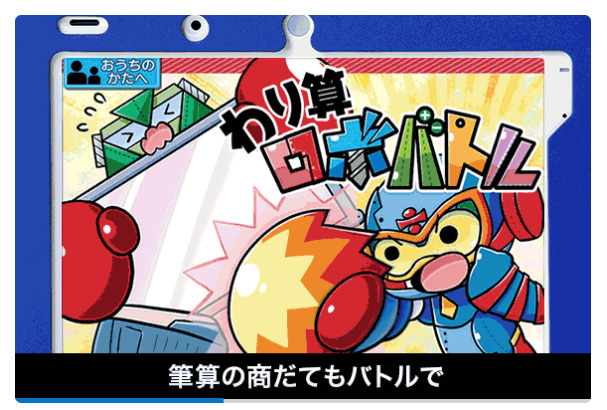また、チャレンジタッチは、楽しく勉強できるだけでなく、苦手を克服しやすい特徴も持っています。

具体的に**チャレンジタッチが苦手を克服しやすい理由**は以下のサービスにあります。

- AIによる個別の分析
- 自動採点
- 動画説明
- つまずきの原因を自動で特定してさかのぼり学習
- 赤ペン先生

より効率的で楽しみながら勉強ができるようにたくさんの工夫があります。

特に、チャレンジタッチが導入した独自AIによって1人1人の苦手なポイントをを正確に分析してくれます。

無駄なく効率的に勉強できることで苦手を克服して成績UPが期待できますね♪

### チャレンジタッチのAIによる最新分析

🐕

チャレンジタッチのAIって何がすごいの？

チャレンジタッチでは、AIが過去に解いた問題や正解率から、**一人一人に最適なカリキュラムを提案**してくれます。

#### AIがつまずきの原因を自動で判定

チャレンジタッチのAIつまずき判定は、**ただつまずきの原因を探すだけではありません**。つまずいた原因を見つけて苦手を克服するために有効なカリキュラムを自動で提案してくれます。

**例を挙げると、**

A君・・・算数のグラフが苦手

B君・・・算数の図形が苦手

AIはこの2人の学習カリキュラムを個別に提案してくれます。

具体的に言うと・・

A君が挑戦した問題の正解率から、AIはグラフの中でも特に「縦軸と横軸の関係」の部分が理解できていない可能性が高いと判断します。

そこで、グラフの基礎から学べる内容を提案します。これにより、A君はグラフ全体の理解を深めることができます。

一方、B君の場合、小学6年生のレベルの「図形の展開図や円柱」の問題の正解率が低いことが分かりました。

AIは、B君が基本的な知識をしっかりと理解しているかを確認するため、4年生の「直方体や立方体」の問題に挑戦させます。

この結果をもとに、B君がどの部分を理解していないのか、どこを重点的に学ぶべきなのかを自動で分析してくれます。

特に算数のように**小学生から高校生まで内容が繋がっている**教科は、さかのぼり学習はとっても有効です。

🐕

さかのぼって苦手を早めに無くすことで、中学に進んでも安心だね♪

**＼5分で完了／**

[「公式」今すぐチャレンジタッチ小学講座に入会する](//ck.jp.ap.valuecommerce.com/servlet/referral?sid=3613518&pid=887390659)

### チャレンジタッチ無料で使えるすごいサービス

進研ゼミチャレンジタッチには会員であればだれでも無料で利用できる**すごいサービス**がたくさん用意されています。

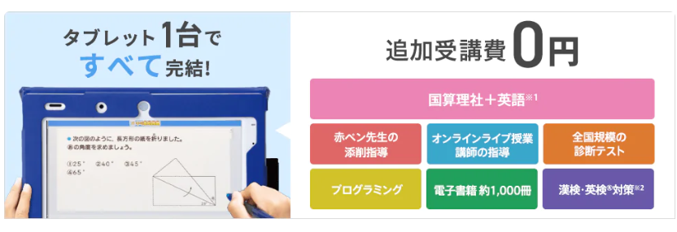

進研ゼミでは、勉強以外にも子供が興味感心を持てるサービスが充実しています。

進研ゼミが提供するこれらのサービスは、単にテストの点数を上げるだけでなく、広い視野と多様な興味を持つキッカケにしてくれます。

🐕

これ全部無料で使い放題なんだって

<strong>進研ゼミ会員が無料で利用できるサービス一覧</strong>

- [まなびライブラリー（1000冊の本が読み放題）](https://xn--5ckip8c4fq970ahbya2o7acu2a.com/2023/07/18/%e3%83%81%e3%83%a3%e3%83%ac%e3%83%b3%e3%82%b8%e3%82%bf%e3%83%83%e3%83%81%e3%81%ae%e6%9c%ac%e8%aa%ad%e3%81%bf%e6%94%be%e9%a1%8c%e3%82%b5%e3%83%bc%e3%83%93%e3%82%b9%e3%81%a8%e3%81%af%ef%bc%9f%e9%80%b2/)
- [プログラミング（基礎）](https://xn--5ckip8c4fq970ahbya2o7acu2a.com/2022/03/08/%e9%80%b2%e7%a0%94%e3%82%bc%e3%83%9f%e3%83%81%e3%83%a3%e3%83%ac%e3%83%b3%e3%82%b8%e3%82%bf%e3%83%83%e3%83%81%e3%80%8c%e5%b0%8f%ef%bc%91%ef%bd%9e%e5%b0%8f%ef%bc%96%e3%80%8d%e3%81%ae%e3%83%97%e3%83%ad/)
- [実力診断テスト](https://xn--5ckip8c4fq970ahbya2o7acu2a.com/2023/06/09/%e3%83%81%e3%83%a3%e3%83%ac%e3%83%b3%e3%82%b8%e5%ae%9f%e5%8a%9b%e8%a8%ba%e6%96%ad%e3%81%af%e3%80%8c%e5%b0%8f1%ef%bd%9e%e5%b0%8f6%e3%80%8d%e3%81%a7%e5%86%85%e5%ae%b9%e3%81%8c%e9%81%95%e3%81%86%ef%bc%9f/)
- [チャレンジイングリッシュ（小１～高３レベルの英語）](https://xn--5ckip8c4fq970ahbya2o7acu2a.com/2022/03/28/%e3%83%81%e3%83%a3%e3%83%ac%e3%83%b3%e3%82%b8%e3%82%a4%e3%83%b3%e3%82%b0%e3%83%aa%e3%83%83%e3%82%b7%e3%83%a5%e3%81%ae%e6%96%99%e9%87%91%e3%81%af%e7%84%a1%e6%96%99%ef%bc%81%ef%bc%9f%e3%80%8c%e5%88%a9/)
- [オンライン授業](https://xn--5ckip8c4fq970ahbya2o7acu2a.com/2023/06/26/%e3%83%81%e3%83%a3%e3%83%ac%e3%83%b3%e3%82%b8%e3%82%aa%e3%83%b3%e3%83%a9%e3%82%a4%e3%83%b3%e6%8e%88%e6%a5%ad%e3%82%92%e3%80%8c%e5%8f%97%e8%ac%9b%e3%81%97%e3%81%9f%e6%84%9f%e6%83%b3%e3%80%8d/)
- [努力賞ポイント景品交換](https://xn--5ckip8c4fq970ahbya2o7acu2a.com/2023/07/10/%e3%83%81%e3%83%a3%e3%83%ac%e3%83%b3%e3%82%b8%e3%82%bf%e3%83%83%e3%83%81%e5%8a%aa%e5%8a%9b%e8%b3%9e%e3%83%9d%e3%82%a4%e3%83%b3%e3%83%88%ef%bc%81%e8%b2%b0%e3%81%88%e3%82%8b%e5%95%86%e5%93%81%e3%81%af/)

それぞれ別記事で詳しく解説しています。気になるサービスがあったらリンクをタップしてね♪

**＼5分で完了／**

[「公式」今すぐチャレンジタッチ小学講座に入会する](//ck.jp.ap.valuecommerce.com/servlet/referral?sid=3613518&pid=887390659)

## チャレンジタッチ：良い口コミ

チャレンジタッチの口コミを調査したところ、学習内容、料金、サービス面、他社との比較、などの多くの口コミが見つかりました。

1つ1つ詳しく見ていきましょう。

### 難易度に関する口コミ

まずは、進研ゼミの難易度に関する口コミです。

進研ゼミの利用者の中には、「簡単すぎる」という声もありますが、基本的には基礎～標準クラスの問題に挑戦するため、多くの子供にとっては丁度良いレベルとなっています。

<blockquote class="twitter-tweet">
そろそろ通信教育の見直ししなきゃなって調べ出すと楽しくなっちゃって……💦 進研ゼミって難易度低めに見られがちだけど、そんなことないと思うんだけどな。 考える力プラス講座ずっと取ってたけど、Z会なんて目じゃないレベルだったし。
— りのママ (@rinomama_koko) <a href="https://twitter.com/rinomama_koko/status/1604650008384458753?ref_src=twsrc%5Etfw">December 19, 2022</a></blockquote>

基礎～標準と言っても基礎的な問題ばかりではなく、基礎を元にした応用問題にもたくさん挑戦していきます。

普段の学校のテストで、平均90点以上取れる子には簡単に思えるかもしれません。しかし、そうでなければチャレンジタッチは、基礎力を高められるとても良い教材といえます。

### ボリュームに関する口コミ

次は、チャレンジタッチの毎月の学習量に関する口コミを見ていきましょう。

<blockquote class="twitter-tweet">
チャレンジって、問題が少ない！って思う人が多い。だけど、初心者が勉強習慣をつけるにはちょうどいい分量。多すぎてもやる気を失うからね。さすが進研ゼミ！って感じ。おかげで、僕は6年間進研ゼミを続けることができた。勉強は、多ければいい！といわけではないよ。量が少なくても質があればOK！
— キャプテン@小学生に成長を！ (@captain_benkyou) <a href="https://twitter.com/captain_benkyou/status/1640561654206193664?ref_src=twsrc%5Etfw">March 28, 2023</a></blockquote>

**進研ゼミ公式サイトで推奨されている1日の学習量**

【**１・２年生**】 １日２回（国語、算数）2教科を約10分

【**３年生**】 ・１日２回、4教科（国語・算数・理科・社会）を約15分 １回の取り組みは約７分になるように設計されている

【**４～６年生**】 ・１日２回、４～５教科（国語・算数・理科・社会・英語）を約15分 １回の取り組みは約７分になるように設計されている

これを見ると「少ない」と感じる方もいるかもしれませんが、あくまでメインレッスンに掛る時間の目安です。

物足りないと感じる場合は、これにプラスしても「演習コース」「発展コース」が用意されています。

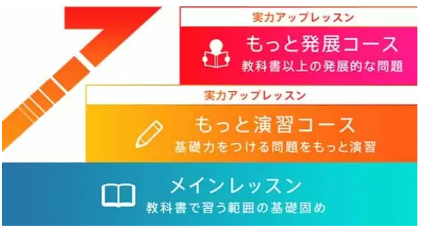そのため、初めのうちはメインレッスンを勉強量の最低ラインして、徐々に勉強量を増やしていくこともできますよ。

### 料金に関する口コミ

口コミからも、進研ゼミの料金は、塾や他の通信教育と比べてもかなりコストパフォーマンスが高いことが分かります。

<blockquote class="twitter-tweet">
進研ゼミの手厚さがやばい🔥小6は紙でもオンライン授業もある。小1は英語も入ってるし、赤ペン先生もお気に入りのようだし。親がきちんと管理ができれば、コスパがかなり良いのかも。
— きなこ餅/母が詩人になりました。 (@mama_shugyochu) <a href="https://twitter.com/mama_shugyochu/status/1601601557954691072?ref_src=twsrc%5Etfw">December 10, 2022</a></blockquote>

<blockquote class="twitter-tweet">
個別塾、コスパ悪すぎて頭クラクラする。進研ゼミやってた時の方が成績良かったのは中1だったから？
— とよさきさん (@migikataagarika) <a href="https://twitter.com/migikataagarika/status/1587831621222551552?ref_src=twsrc%5Etfw">November 2, 2022</a></blockquote>

<blockquote class="twitter-tweet">
旦那の友達は進研ゼミのみで医学部に進学したらしい。コスパ良すぎやろ
— ぱんた (@harapeko_panda_) <a href="https://twitter.com/harapeko_panda_/status/1465666589139759104?ref_src=twsrc%5Etfw">November 30, 2021</a></blockquote>

進研ゼミの料金は月額で**3,250****円～6,370円**とかなり安い料金設定となっています。

これは、スマイルゼミ、Z会、すららなどの主要な通信教材の中もでトップクラスに安い料金なんだとか。

また、先ほども紹介したようにチャレンジタッチでは、基本教科だけでなくAI機能や無料で利用できるサービスも充実しています。

料金面やサービス面から見てもチャレンジタッチはかなりコストパフォーマンスの高い教材であることが分かりますね♪

学年が上がるごとに料金が変わっていくよ♪

[進研ゼミの料金](https://xn--5ckip8c4fq970ahbya2o7acu2a.com/2023/07/13/%e3%83%81%e3%83%a3%e3%83%ac%e3%83%b3%e3%82%b81%e5%b9%b4%e7%94%9f%e6%96%99%e9%87%91%e3%81%af%e3%81%84%e3%81%8f%e3%82%89%ef%bc%9f12%e3%83%b6%e6%9c%88%e4%b8%80%e6%8b%ac%e6%89%95%e3%81%84%e3%81%aa/)を詳しく知りたい方は別記事で解説しています。

**＼5分で完了／**

[「公式」今すぐチャレンジタッチ小学講座に入会する](//ck.jp.ap.valuecommerce.com/servlet/referral?sid=3613518&pid=887390659)

### 子供の継続に関する口コミ

「通信教材はだんだんやらなくなる」とよく言われていますが、口コミを調べてみると、チャレンジタッチの継続率は通信教材の中でもかなり高いことが分かります。

<blockquote class="twitter-tweet">
そういえばチャレンジタッチ到着して1ヶ月半くらい経ったかな そろそろ飽きるかと思いきや定期的にデータ更新され新アプリが解禁になるおかげで本人のモチベーションは高いままです。 ひらがなの書き順・とめはねはらい・形など本人が書いた動画と手本同時再生で細かく指摘してくれて超分かりやすい！
— わとそん。 (@Watson6) <a href="https://twitter.com/Watson6/status/1221650539378692096?ref_src=twsrc%5Etfw">January 27, 2020</a></blockquote>

<blockquote class="twitter-tweet">
本日の息子氏。四月から始めたチャレンジタッチをついに３月号まで一年間やりきる。ただチャレンジを購読するだけじゃなく、毎月課題を終わらせたのえらい。継続できるってすごいこと。 来年もがんばろう。
— タカば (@takaba_batake) <a href="https://twitter.com/takaba_batake/status/1635185390809411584?ref_src=twsrc%5Etfw">March 13, 2023</a></blockquote>

チャレンジタッチでは勉強する習慣を身にけさせることを目的の1つとしています。

✅ 1日の15分程度勉強　→　少しの休憩

このシンプルなリズムで毎日の学習が続けやすくなります。

もちろん、1日に30分、1時間勉強することも提供されている量的には可能です。

しかし、習慣は最低でも1ヶ月続けないと身につかないと言われています。短い時間でも継続することの方が重要です。

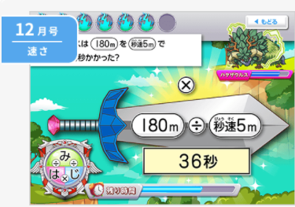また、チャレンジタッチは、多数あるタブレット教材の中でも1番**楽しさを追求した教材**となっています。

この楽しさの追求もチャレンジタッチの継続率が高く飽きにくい理由と言えるでしょう。

**＼5分で完了／**

[「公式」今すぐチャレンジタッチ小学講座に入会する](//ck.jp.ap.valuecommerce.com/servlet/referral?sid=3613518&pid=887390659)

### 塾と比較した口コミ

次に、塾とチャレンジタッチ両方利用した人の口コミを見ていきましょう。

<blockquote class="twitter-tweet">
一昨年に中学に入って、小学校からやってる進研ゼミをそのままやらせてたけど、もう中学生だからお母さんが口出さないで自主性に任せよう、とやったらひっどい成績で、焦って近所の個人指導塾に行かせてみたけど全然効果なしで、また進研ゼミに戻ったんだけど
— Asako (@coldburn123) <a href="https://twitter.com/coldburn123/status/1230890247271043072?ref_src=twsrc%5Etfw">February 21, 2020</a></blockquote>

塾と言っても集団で授業を受ける大きな塾から1人1人個別で教える小さな塾まで色々な種類があります。

それぞれの塾には方針があります。その塾の方針に合うのか合わないかでも塾で得られる成果は大きく違います。

塾と同じように、チャレンジタッチにも子供によって向き不向きがあります。

子供に合った教材を選んであげるのが成績UPの一番の近道ですね♪

ただ、塾と通信教材では、料金が大きく違うため、まずは気軽に始められるチャレンジタッチの資料請求や無料体験をしてみるのも良いかもしれません。

[「公式」チャレンジタッチ小学講座の資料を請求する](//ck.jp.ap.valuecommerce.com/servlet/referral?sid=3613518&pid=889549576)

### スマイルゼミと比較した口コミ

**チャレンジタッチとよく比較される**スマイルゼミですが、実際に2つを利用した人の口コミを集めてみました。

<blockquote class="twitter-tweet">
2年3ヶ月続けてマンネリ化してしまったスマイルゼミを解約して、進研ゼミのチャレンジタッチに乗り換えました✏️
4月入会はキャンペーンが多いのと進研ゼミはオプション講座が充実しているので、ある程度子供の要望通りの学習ができそう💻

今のところ2人とも楽しそうに勉強してます👦👦 <a href="https://t.co/4cN5aQesX5">pic.twitter.com/4cN5aQesX5</a>

— あい@株で将来家を建てる🏡 (@ai_toushi) <a href="https://twitter.com/ai_toushi/status/1637208570193416192?ref_src=twsrc%5Etfw">March 18, 2023</a></blockquote>

<blockquote class="twitter-tweet">
＼　緊　急　速　報／ スマイルゼミ合わず2週間で解約方針…
チャレンジタッチの木の葉丸音声にママ大興奮😍息子も音声ガイドとゲームあったほうが楽しそう🥹✨

スマイルゼミはね、淡々としてるイメージだなあ。

チャレンジタッチは楽しみながら出来そうだよ◎

— 寝不足なままんです (@sy_a_a_n) <a href="https://twitter.com/sy_a_a_n/status/1689623630534389760?ref_src=twsrc%5Etfw">August 10, 2023</a></blockquote>

チャレンジタッチとスマイルゼミでは、料金や難易度など似ている部分がいくつかあります。

そのため「この2つで迷っている」という方も多くいます。

もちろん違う点もありますが、チャレンジタッチとスマイルゼミでは全く違う教材と言っていい程、たくさんの違いがあります。

出題の仕方、専用タブレットの性能、難易度、ゲーム性、その他の無料サービスなどで大きな違いがあります。

どっちを選んだ方がいいかは人によっても異なるため、断言することはできません。子供の性格やレベルに合わせることでベストな選択をすることができますよ。

[チャレンジタッチとスマイルゼミの違い](https://xn--5ckip8c4fq970ahbya2o7acu2a.com/2022/01/24/%e3%80%8c%e3%83%81%e3%83%a3%e3%83%ac%e3%83%b3%e3%82%b8%e3%82%bf%e3%83%83%e3%83%81%e3%83%bb%e3%82%b9%e3%83%9e%e3%82%a4%e3%83%ab%e3%82%bc%e3%83%9f%e3%80%8d%e5%8b%89%e5%bc%b7%e3%81%ae%e7%bf%92%e6%85%a3/)を詳しく知りたい方は別記事をご覧下さい♪

### Z会と比較した口コミ

チャレンジタッチとZ会の2つを比較した口コミをみていきましょう。この2つでは、学習のスタイルが違うため、個人によって合う合わないが分かれるようです。

<blockquote class="twitter-tweet">
4月から1年生の息子。 今まではZ会やってたけど、親がつきっきりじゃないと出来なかったのでチャレンジタッチに変更。 タブレット大好きなので(苦笑)自ら進んでやってるよ。ゲーム感覚で楽しそう。 添削もさすがBenesse。丁寧だよ。 親がついてなくても自分からやってるのが助かる！
— ゆきうさぎ (@yuki1453) <a href="https://twitter.com/yuki1453/status/1252438163139596291?ref_src=twsrc%5Etfw">April 21, 2020</a></blockquote>

<blockquote class="twitter-tweet">
Z会も検討してるのだけど、独自タブレットないからiPad使わなきゃならないのが嫌で、やるとしたら紙一択なんだが、正直英語は絶対タブレット学習&gt;紙でほんとそこがネックなんだよな...まぁ私が英語教えれば解決するのだが、チャレンジのカラフルインタラクティブに慣れると紙に移行が厳しそうで迷う。
— ほんこ (@honkokisscry) <a href="https://twitter.com/honkokisscry/status/1408794163525554179?ref_src=twsrc%5Etfw">June 26, 2021</a></blockquote>

Z会は、チャレンジタッチと違いゲーム要素はほとんどなく、問題の難易度が高い応用問題が多く出題されます。

そのため、ゲーム要素がなくてもいい子であれば、[Z会](https://xn--5ckip8c4fq970ahbya2o7acu2a.com/2022/01/17/z%e4%bc%9a%e5%8f%a3%e3%82%b3%e3%83%9f/)に向いているかもしれません。ただし難易度はチャレンジタッチよりも高いため、基礎ができていない子にはオススメできません。

一方で、勉強に対して苦手意識がある子や少しでも楽しめる要素が欲しい子は[チャレンジタッチ](//ck.jp.ap.valuecommerce.com/servlet/referral?sid=3613518&pid=887390659)がオススメです。

### まなびライブラリー（本読み放題）に関する口コミ

電子書籍（1000冊本読み放題のサービス）を利用できるのは進研ゼミだけ。

<blockquote class="twitter-tweet">
おはようございます🐰 進研ゼミがトレンド！子どもたち3人ともしまじろうからお世話になっています。そして、今はチャレンジ。電子書籍が楽しめるまなびライブラリーが優秀で、おかげで毎月何冊も本を読むようになりました📚このまま本好きになって欲しいな♡ 今日もよろしくです💕<a href="https://twitter.com/hashtag/%E3%81%8A%E3%81%AF%E6%88%A650130jg?src=hash&amp;ref_src=twsrc%5Etfw">#おは戦50130jg</a>🌛
— こよ@いつもありがとう🙌 (@koyo_rm) <a href="https://twitter.com/koyo_rm/status/1619860816588832769?ref_src=twsrc%5Etfw">January 30, 2023</a></blockquote>

<blockquote class="twitter-tweet">
1番上のチャレンジタッチの中にあるまなびライブラリーって本や動画見てるとこに銀河鉄道の映画とHoneyWorksがあるんやけど！ びっくり！ <a href="https://t.co/f8Cfpd0ySc">pic.twitter.com/f8Cfpd0ySc</a>
— やずき💙じゃんけんぽんGO〜💙 (@yazuki2411) <a href="https://twitter.com/yazuki2411/status/1706449950304092387?ref_src=twsrc%5Etfw">September 25, 2023</a></blockquote>

まなびライブラリーを利用したくて進研ゼミを選ぶ人もたくさんいます。

進研ゼミでは、全ての会員が本1000冊読み放題のサービスが無料で利用することができます。本の内容は、小学、中学、高校それぞれに向けた読みやすい本が提供されています。

また、読める本は定期的に入れ替わるため、今話題の本や、普段なら買わない本でも気兼ねなく試し読みすることができます。

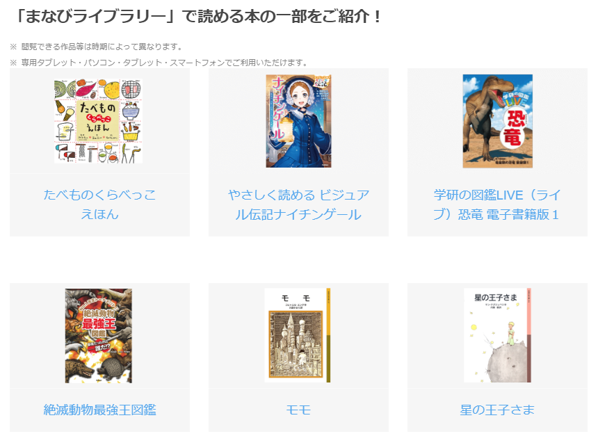

こんなすごいサービスが無料で利用できるのは控えめに言ってめちゃめちゃお得です。

**＼5分で完了／**

[「公式」今すぐチャレンジタッチ小学講座に入会する](//ck.jp.ap.valuecommerce.com/servlet/referral?sid=3613518&pid=887390659)

https://xn--5ckip8c4fq970ahbya2o7acu2a.com/2023/07/18/%e3%83%81%e3%83%a3%e3%83%ac%e3%83%b3%e3%82%b8%e3%82%bf%e3%83%83%e3%83%81%e3%81%ae%e6%9c%ac%e8%aa%ad%e3%81%bf%e6%94%be%e9%a1%8c%e3%82%b5%e3%83%bc%e3%83%93%e3%82%b9%e3%81%a8%e3%81%af%ef%bc%9f%e9%80%b2/

### プログラミングに関する口コミ

ゲーム要素た強く楽しく勉強できるチャレンジタッチのプログラミング。

<blockquote class="twitter-tweet">
進研ゼミでプログラミングのアプリ?あるんですけど長男の組む速さについていけない……しかしそろそろ寝てくれ明日早いんですよ君…… <a href="https://t.co/0gh2KZEbVU">pic.twitter.com/0gh2KZEbVU</a>
— のの。 (@nonononnon) <a href="https://twitter.com/nonononnon/status/1078633196802039809?ref_src=twsrc%5Etfw">December 28, 2018</a></blockquote>

チャレンジタッチでは、プログラミングの基礎を学ぶことができます。

最近では、プログラミング学習は、論理的思考を鍛えるため、小学校と中学校で必修化されています。

**①プログラミングの学習内容**

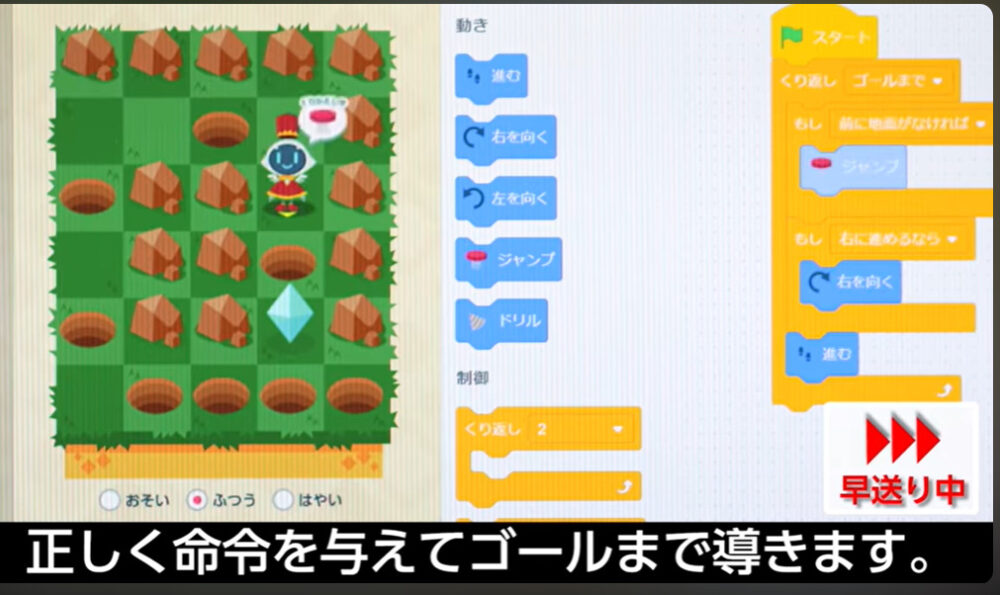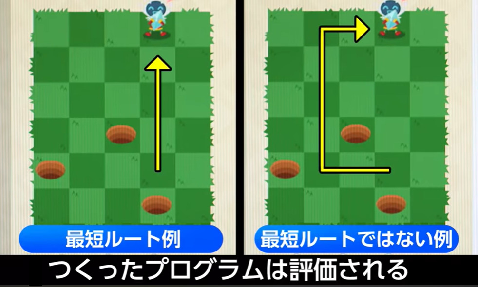チャレンジタッチのプログラミングでは、ブロックを重ねてプログラムを作成します。

学習を進めていくと、自分で作ったキャラクターを自由に動かしてアニメやゲームが作れるようになります。

https://xn--5ckip8c4fq970ahbya2o7acu2a.com/2022/03/08/%e9%80%b2%e7%a0%94%e3%82%bc%e3%83%9f%e3%83%81%e3%83%a3%e3%83%ac%e3%83%b3%e3%82%b8%e3%82%bf%e3%83%83%e3%83%81%e3%80%8c%e5%b0%8f%ef%bc%91%ef%bd%9e%e5%b0%8f%ef%bc%96%e3%80%8d%e3%81%ae%e3%83%97%e3%83%ad/

### 英語に関する口コミ

進研ゼミには、小学1年生～高校3年生のレベルの英語に対応したチャレンジイングリッシュが用意されています。

進研ゼミ会員なら無料で利用できるだけでなく、その質の高さから口コミでも評価の高い内容が多く見つかりました。

<blockquote class="twitter-tweet">
今月のチャレンジイングリッシュはハロウィン🎃 ２レッスンやると、HOME画面のフレディがハロウィンコスプレする！ でも数秒しからやないから見逃さないようにね✨子どもへの声かけに使ってみてください
レベル3も、もうすぐ終盤。コツコツ続けてようやく高学年レベルになれそう！<a href="https://twitter.com/hashtag/%E3%83%81%E3%83%A3%E3%83%AC%E3%83%B3%E3%82%B8%E3%82%BF%E3%83%83%E3%83%81?src=hash&amp;ref_src=twsrc%5Etfw">#チャレンジタッチ</a> <a href="https://t.co/3DBVsjGtCx">pic.twitter.com/3DBVsjGtCx</a>

— めざとぷマスター (@mezatopu1) <a href="https://twitter.com/mezatopu1/status/1708021288328216861?ref_src=twsrc%5Etfw">September 30, 2023</a></blockquote>

<blockquote class="twitter-tweet">
チャレンジタッチ、娘早速ハマってる❤️❤️❤️ チャレンジイングリッシュのレベルチェック、やはりレベル8だったので12まで上げてもらった🤣🤣🤣 でも音読が良いみたい🤣🤣🤣🤣 <a href="https://t.co/AKTFMGoVAS">pic.twitter.com/AKTFMGoVAS</a>
— 里緒＠♂2026🏠中受 ♀2028中受2031♪̊̈♪̆̈受 (@rio_gift_iq) <a href="https://twitter.com/rio_gift_iq/status/1375022262512848897?ref_src=twsrc%5Etfw">March 25, 2021</a></blockquote>

<blockquote class="twitter-tweet">
小３に「最近チャレンジイングリッシュはどんなレッスンやってんの？」と見せてもらったら、上の英文を見てQuestionに答えるみたいなのバチコン正解キメててびっくりした。 <a href="https://t.co/lPWumt2frK">pic.twitter.com/lPWumt2frK</a>
— 尼僧のひさこむ (@hisacom5) <a href="https://twitter.com/hisacom5/status/1368350839769690112?ref_src=twsrc%5Etfw">March 7, 2021</a></blockquote>

進研ゼミの英語では、レベル1～12まで用意されています。

この1～12のレベルを通して、スピーキングでは正確な発音、リーディングでは高速読解、ライティングでは作文力、リスニングでは会話理解力を高めることができます。

英語のテストや中学受験、高校受験、英語検定の対策としても利用することが可能です。そのため、大人の方でも利用されている場合もあるんだとか。

進研ゼミの英語（チャレンジイングリッシュ）は他の通信教材と比べても群を抜いています。

チャレンジイングリッシュは、テストの平均点向上率や、利用者の満足度が高いといった点で、スマイルゼミ、Z会、スタディサプリなど他の通信教材と比べてもトップクラスの英語教材です。

[チャレンジイングリッシュ](https://xn--5ckip8c4fq970ahbya2o7acu2a.com/2022/03/28/%e3%83%81%e3%83%a3%e3%83%ac%e3%83%b3%e3%82%b8%e3%82%a4%e3%83%b3%e3%82%b0%e3%83%aa%e3%83%83%e3%82%b7%e3%83%a5%e3%81%ae%e6%96%99%e9%87%91%e3%81%af%e7%84%a1%e6%96%99%ef%bc%81%ef%bc%9f%e3%80%8c%e5%88%a9/)について知りたい方は別記事からどうぞ♪

**＼5分で完了／**

[「公式」今すぐチャレンジタッチ小学講座に入会する](//ck.jp.ap.valuecommerce.com/servlet/referral?sid=3613518&pid=887390659)

### 中学受験に関する口コミ

次に、進研ゼミを中学受験として利用されている人の口コミをみていきましょう。

<blockquote class="twitter-tweet">
進研ゼミ中学受験講座、いいかもしれない。。夏期講習だけ行った塾（地方、200人規模）のテストで通塾生と戦える（むしろトップ争い）レベルだった！４年の間は進研ゼミで十分そう！
— みく (@y5rFuRQlO7SIwOx) <a href="https://twitter.com/y5rFuRQlO7SIwOx/status/1700473851417870554?ref_src=twsrc%5Etfw">September 9, 2023</a></blockquote>

<blockquote class="twitter-tweet">
地元公立中に進学した息子。
塾、習い事なし。進研ゼミ中学講座受講。

期末試験の結果はまずまずでほっとしてる。

（息子はドヤ顔だったけど、ドヤるほどではない）

中受組は英語で遅れてるかと心配していたんだけど、ちゃんと点数取れているのが驚き。

進研ゼミだけでも今のところ大丈夫みたい！

— あんこ@中学受験応援団 (@ankoromochi06) <a href="https://twitter.com/ankoromochi06/status/1707161004487192790?ref_src=twsrc%5Etfw">September 27, 2023</a></blockquote>

[✅ 進研ゼミだけの中学受験](https://xn--5ckip8c4fq970ahbya2o7acu2a.com/2022/04/20/%e9%80%b2%e7%a0%94%e3%82%bc%e3%83%9f%e3%83%81%e3%83%a3%e3%83%ac%e3%83%b3%e3%82%b8%e3%82%bf%e3%83%83%e3%83%81%e3%81%ae%e3%81%bf%e3%81%a7%e4%b8%ad%e5%ad%a6%e5%8f%97%e9%a8%93%e3%81%af%e9%9b%a3%e3%81%97/)をに関しては別記事で詳しく解説しています。

🐕

進研ゼミには[実力診断テスト](https://xn--5ckip8c4fq970ahbya2o7acu2a.com/2023/06/09/%e3%83%81%e3%83%a3%e3%83%ac%e3%83%b3%e3%82%b8%e5%ae%9f%e5%8a%9b%e8%a8%ba%e6%96%ad%e3%81%af%e3%80%8c%e5%b0%8f1%ef%bd%9e%e5%b0%8f6%e3%80%8d%e3%81%a7%e5%86%85%e5%ae%b9%e3%81%8c%e9%81%95%e3%81%86%ef%bc%9f/)も用意されているよ

実力診断テストを利用すれば、今の自分の実力と志望校のレベルを比較して、どの分野で努力が必要かが明確にわかります。

中学受験合格に向けて、今何を進めるべきなのかを実力診断テストのデータを元に教えてくれます。

更に、進研ゼミでは「中学受験対策講座」が有料オプションで用意されています。

「[進研ゼミ中学受験対策講座](https://xn--5ckip8c4fq970ahbya2o7acu2a.com/2022/04/20/%e9%80%b2%e7%a0%94%e3%82%bc%e3%83%9f%e3%83%81%e3%83%a3%e3%83%ac%e3%83%b3%e3%82%b8%e3%82%bf%e3%83%83%e3%83%81%e3%81%ae%e3%81%bf%e3%81%a7%e4%b8%ad%e5%ad%a6%e5%8f%97%e9%a8%93%e3%81%af%e9%9b%a3%e3%81%97/)」について詳しく知りたいかたは別記事からどうぞ♪

志望校や今の実力に合わせてオプションを利用することで、より実力UPが期待できますよ♪

## チャレンジタッチ：悪い口コミ

次はチャレンジタッチに関する悪い口コミです。当然ですが、どの教材にも良い点があれば悪い点もあります。

チャレンジタッチへの入会を考えている方は、良い口コミだけでなく、悪い口コミを知っておくことが大切だよ

あなたにとって本当に必要な教材なのかそうではないのかを判断することができます。

更に、別記事では[チャレンジタッチ利用者が辞めた理由](https://xn--5ckip8c4fq970ahbya2o7acu2a.com/2023/05/31/%e3%83%81%e3%83%a3%e3%83%ac%e3%83%b3%e3%82%b8%e3%82%bf%e3%83%83%e3%83%81%e3%82%92%e8%be%9e%e3%82%81%e3%81%9f%e7%90%86%e7%94%b1%e3%81%af%e4%bd%95%ef%bc%9f%e7%9f%a5%e3%82%89%e3%81%9a%e3%81%ab%e5%85%a5/)を口コミを一緒に紹介していますので、興味のある方はどうぞ♪

### 理解できているか怪しいという口コミ

チャレンジタッチでは、基本的に選択式の問題が多く出題されます。この選択問題に関する不満の声が見つかりましたので紹介します。

<blockquote class="twitter-tweet">
チャレンジタッチ、うちの子たちがやってた時は選択問題が多くて、だんだん手当り次第に回答を選ぶようになったからあまり意味なかったなぁ(´･ω･`) 今はその辺り改善されたんかな…さすがに5年近くたってるし(´Д｀;)
— さき (@Saki__4218) <a href="https://twitter.com/Saki__4218/status/1251112723040989184?ref_src=twsrc%5Etfw">April 17, 2020</a></blockquote>

チャレンジタッチは基本選択式の問題となってるため、理解していなくても、たまたま正解して次に進めてしまいます。

例えば、4択の問題であれば4分の1の確立で正解出来てしまう可能性があります。

もちろん記述で記入する問題もたくさんありますが、比率で言うと選択式の問題の方が多く出題されます。

### タブレットに関する不満の口コミ

チャレンジタッチのタブレットに関する口コミでは、**反応の悪さ**などの性能に関する不満が見つかりました。

<blockquote class="twitter-tweet">
子どもがやってるチャレンジタッチ。 書き順とか判定してくれるのは有り難いけど、ただでさえ書きにくいペンなのに、歪みとかズレの判定厳しすぎ(笑) 私がやっても❌になっちゃう😅 親がOK出せば赤丸に出来たら良いのにな…。
— みづき玲 (@midukirei) <a href="https://twitter.com/midukirei/status/1101033699745755136?ref_src=twsrc%5Etfw">February 28, 2019</a></blockquote>

<blockquote class="twitter-tweet">
ベネッセのチャレンジタッチ一年生やろうかと思って保証調べたら、タブレットのサポート料金が倍くらいになっとる…タブレットも19800円なのに、娘の年から39800円…倍やん…えっ、値上げ？タブレットの性能がめっちゃよくなったとか？？えっ？？？流石に倍はなんで？ってなるんですけど。
— ゅゅ@7歳育児中 (@asuka_f_jones) <a href="https://twitter.com/asuka_f_jones/status/1388856786837327872?ref_src=twsrc%5Etfw">May 2, 2021</a></blockquote>

チャレンジタッチのタブレットに関する口コミでは、「反応の悪さ」に対する不満の声が多くありました。

そのため、タブレットに関しては、スマイルゼミの方が性能が高いとされてきました。

しかし、2022年4月より登場した最新のタブレットの[チャレンジパッドnext](https://xn--5ckip8c4fq970ahbya2o7acu2a.com/2023/06/19/%e3%83%81%e3%83%a3%e3%83%ac%e3%83%b3%e3%82%b8%e3%83%91%e3%83%83%e3%83%89next%ef%bc%88%e3%83%8d%e3%82%af%e3%82%b9%e3%83%88%ef%bc%89%e3%81%a3%e3%81%a6%e3%81%a9%e3%82%93%e3%81%aa%e3%82%bf%e3%83%96/)では、**大幅に機能が向上**しています。

タッチパネルの方式を静電容量方式に変えたため、今までの筆圧感知式のように反応が悪い点も大幅に改善されました。

また、2つ目の口コミでは、タブレット料金が39,000円とありますが、入会から6ヶ月以上継続することで**タブレット本体の料金は無料**になります。

🐕

39,000円が必要なのは保証に入らずにタブレットを壊してしまった場合だよ

✅ ワンポイント

専用タブレットを長年使っている方は、タブレットの不良が原因で動作が遅くなっている可能性もあるので交換するだけで動きがサクサクになります。

チャレンジタッチには、いざタブレットが故障しても3,000円で新品と交換できる[チャレンジパッド保証](https://xn--5ckip8c4fq970ahbya2o7acu2a.com/2022/04/05/%e3%83%81%e3%83%a3%e3%83%ac%e3%83%b3%e3%82%b8%e3%82%bf%e3%83%83%e3%83%81%e7%ab%af%e6%9c%ab%e3%81%ae%e4%ba%a4%e6%8f%9b%e3%81%ae%e6%96%99%e9%87%91%e3%81%af%ef%bc%9f%e4%bf%9d%e8%a8%bc%e3%81%8c%e3%81%84/)が用意されています。

料金は毎月200円程なので、心配な方は入会時に入っておくといいですよ。

**＼5分で完了／**

[「公式」今すぐチャレンジタッチ小学講座に入会する](//ck.jp.ap.valuecommerce.com/servlet/referral?sid=3613518&pid=887390659)

### 簡単過ぎるという口コミ

チャレンジタッチの難易度に関して「簡単過ぎる」という声がありました。

<blockquote class="twitter-tweet">
姉ちゃん、頑張ってチャレンジタッチしてる。簡単過ぎてつまらない言いながら、、、 <a href="https://t.co/MnczJRgmKy">pic.twitter.com/MnczJRgmKy</a>
— 岩永雅子 (@upB_Masako_Iwa) <a href="https://twitter.com/upB_Masako_Iwa/status/1405814381435256835?ref_src=twsrc%5Etfw">June 18, 2021</a></blockquote>

<blockquote class="twitter-tweet">
チャレンジタッチ１年生の付録、まんがかん字じてん。ボリュームは丁度良い☆子供たちと少しずつ言葉と書き順を確認しながら読み始めた❗️漢字の学習ってやっぱり書取りが基本なのかな。楽しく覚えられたら良いのだけど…象形文字も記載あるけど、由来ないから少し物足りない😂
— おぎママ@小3小1姉妹子育て (@mama_ogi14) <a href="https://twitter.com/mama_ogi14/status/1425454831737573381?ref_src=twsrc%5Etfw">August 11, 2021</a></blockquote>

確かにチャレンジタッチでは**基礎を確実に定着させるため**に、それぞれの分野で基本的な問題も用意されています。

ただ、学校の授業などですでに習って理解できている子にとっては簡単過ぎると感じるかもしれません。

物足りなさを感じる子には、コースを変更することで難易度の調節をすることができます。

| 小１～小３ | 低学年には、通常問題の他に「演習問題」「応用・思考力問題」が用意されています。  ※教科ごとに、取り組む問題を選ぶことが可能 |
| --- | --- |
| 小４～小６ | チャレンジタッチの高学年には標準コース・挑戦コースの2つのコースが用意されています。  しかもそれぞれの**教科ごとにコースを変更することが可能**です。  **標準コース**のレベルは、【基礎:7応用:3】  **挑戦コース**のレベルは、【基礎:4応用:5中学入試レベル:1】 |

**レベルの変更方法**

【小1～小3】 「実力アップレッスン」のカスタマイズ設定・変更は、おうえんネットの「メニュー」→「実力アップレッスン」のカスタマイズ設定 から設定や変更ができます。詳しい手順は下記でご確認ください。

【小４～小６】 チャレンジタッチの「設定」→「コース設定」から変更できます。どのコースが設定されているかは、おうえんネットの「メニュー」→「コース設定確認」からも確認できます。

「それでもチャレンジタッチは簡単過ぎる」という人には、もっと難易度の高い[Z会](https://xn--5ckip8c4fq970ahbya2o7acu2a.com/2022/01/17/z%e4%bc%9a%e5%8f%a3%e3%82%b3%e3%83%9f/)がオススメです。

Z会であれば、より難易度の高い応用問題に挑戦することができます。ただし問題はかなり難しくなるので、まだ基礎が定着出来ていない子にはチャレンジタッチがいいでしょう。

### だんだんやらなくなるという口コミ

進研ゼミは始めは良いけど、「だんだんやらなくなる」という不満の声が見つかりました。

<blockquote class="twitter-tweet">
娘は塾には行きたくない派らしく小さい頃から進研ゼミを続けているのだが中学生になる前からほとんどやらなくなってその理由が紙じゃなくタブレットにして欲しいと。仕方なくタブレットにコース変更したのにほとんどやらないのは変わらない。
— すま (@woodseven_409) <a href="https://twitter.com/woodseven_409/status/1567427343790252033?ref_src=twsrc%5Etfw">September 7, 2022</a></blockquote>

始めのうちは楽しく勉強できるチャレンジタッチに興味津々でも、慣れてくると、**だんだんとやらなくなる**子が多いようです。

しかし、これは進研ゼミに限ったことではなく、通信教材や学校の宿題など自主性が求められる学習に**共通する問題**です。

塾のような強制的な環境がないため、子供たちのやる気や集中力が続くかは不安点として挙げられます。

とはいえ、他の通信教材と比較すると、<strong>進研ゼミは継続率が高い</strong>んだって

進研ゼミの教材は、ゲーム性が高いため、勉強が楽しいと感じられるよう工夫されているのが理由の1つにあります。

また、学校の教科書では難しく感じる部分でも、基礎を徹底することで、わからない問題が少なくなります。

料金面から見ても塾と比べて比較的安いため、子供にやる気があるなら、まずは進研ゼミをためしてみるのもおすすめです。

1度試してみて、長続きするならそのまま継続する。やらなくなったら塾などの強制力のある場所に移す。というのも1つの手ですね♪

**＼5分で完了／**

[「公式」今すぐチャレンジタッチ小学講座に入会する](//ck.jp.ap.valuecommerce.com/servlet/referral?sid=3613518&pid=887390659)

## チャレンジタッチを実際に使用した個人の感想

今回は、チャレンジタッチの口コミを調査したところ、良い口コミも悪い口コミも存在し、使用感は人それぞれ違うようです。

そこで、チャレンジタッチを**自分で体験**してみることにしました。

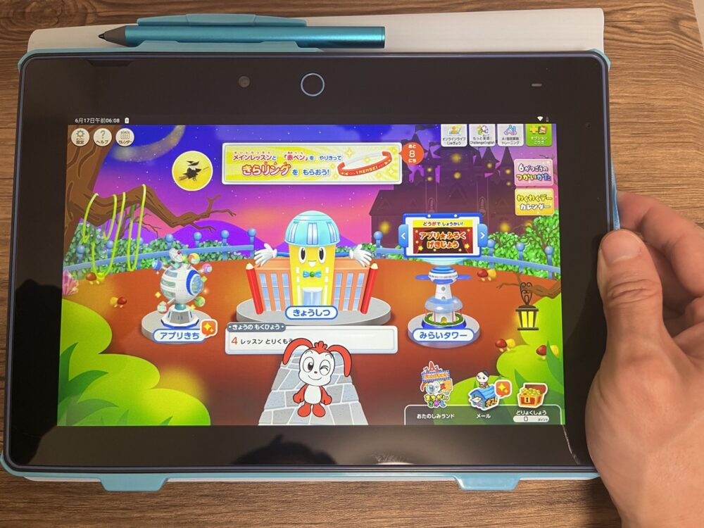実際に使ってみた感想は・・・・

チャレンジタッチを実際に使用して、一番最初に思ったのが、アニメーションを使ったゲーム性の高さでした。

勉強そのものが楽しくなるよう、RPGゲームのように、アイテムを集めて、冒険する。といったストーリー性が加えられていました。

これにより、勉強自体が楽しいゲームの形に変わり、**特に学習に苦手意識を持っている子**にとって、取り組みやすい環境が整っている印象を受けました。

ゲーム好きな私が、小学生の頃にコレを出会っていたら「はまっていたかも」笑

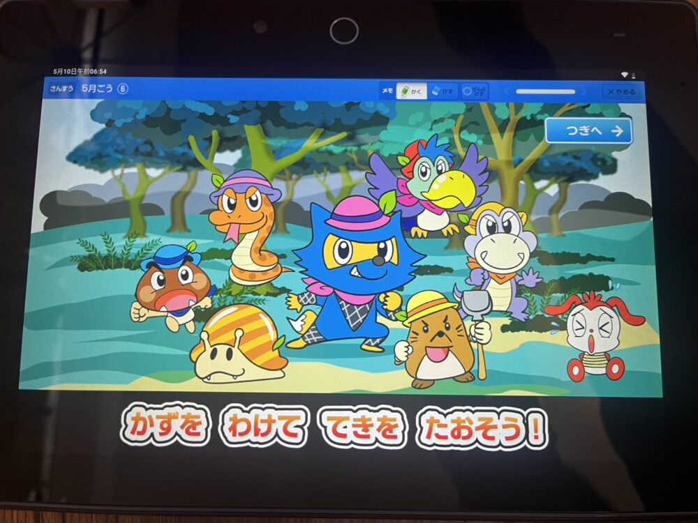反対に、勉強にゲーム性やストーリー性を求めていない子やバンバン応用問題に挑戦したい子にとっては不向きかもしれません。

このような子には、進研ゼミのようなアニメーションやゲーム要素が強い教材は、少しわずらわしく感じる部分があるかもしれません。

進研ゼミは、勉強に対して苦手意識のある子にとっては、問題の解説もわかりやすく基礎を定着させられるオススメな教材です。

また、通常レッスン以外にも**無料で使える**サービスがすごい。

口コミでは、ありましたが、まなびライブラリー（1000冊の本が読み放題）やチャレンジイングリッシュ（英語）は「**これ本当に無料で使えるの？**」というくらい**圧倒的な内容**でした。

鬼滅の刃のライト小説やかいけつゾロリなどの小学生に人気の本もたくさん用意されていました。

チャレンジイングリッシュに関しては、とにかくボリュームが多く、始めて英語を勉強する小学生から、大人でも十分勉強になる高レベルまで取りそろえられています。

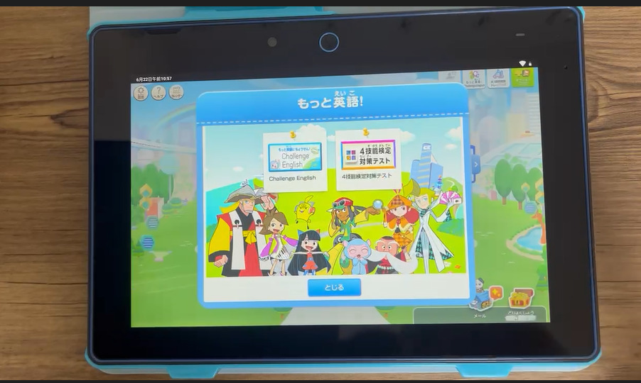

料金も「月額3,300円～」とコストパフォーマンス的にも最強の通信教材なのではないかと思いました。

コスト面や学習内容の両方を考慮すると、まだ通信教材を利用したことがない子供たちには、特にお勧めできる教材だと思います。

**＼5分で完了／**

[「公式」今すぐチャレンジタッチ小学講座に入会する](//ck.jp.ap.valuecommerce.com/servlet/referral?sid=3613518&pid=887390659)

## チャレンジタッチが向いている子

基本的にチャレンジタッチは、好奇心が強く、ゲーム感覚で楽しく勉強したい子にピッタリの教材です。

デジタル学習の魅力を最大限に活かすことで、動画や音声を使用して、学びの過程で子供の好奇心を刺激しくれます。

ただ、チャレンジタッチに向いている子の特徴は、それだけではありません。

チャレンジタッチが向いている子の特徴

- ゲーム好きな子
- 楽しく勉強したい子
- 好奇心旺盛な子
- デジタル学習（動画や音声）に興味がある子
- 勉強に対して苦手意識がある子
- 基礎が定着していない子
- 苦手分野をAIに判定してほしい子
- 読書を習慣にしたい子

チャレンジタッチは、勉強の基礎を身につけるのに向いているため、勉強が得意でない子にも適しています。

勉強が苦手な子ほど基礎をおろそかにする傾向があります。ただ、基礎が分からなければ当然応用問題も解けるようにはなりません。

そこで、チャレンジタッチを使用することで、基礎の部分をしっかりと定着させる習慣を身につけることができるようになります。

また、記事の始めでも書いたようにAIによる判別で、つまずきの原因と突きとめて過去の問題正解率からカリキュラムを自動で組んでくれます。（[詳しくは記事前半へスキップ](#Form1)）

このデジタル時代に、タブレットやインターネットを使いこなす能力は、子供たちにとって非常に大切です。

チャレンジタッチは、そのようなスキルを身につける手助けをしてくれるツールと言えるでしょう。

## チャレンジタッチが向かない子

反対にどんな特徴の子にはチャレンジタッチは向かないのでしょうか？

チャレンジタッチが向いていない子の特徴

- ゲーム性を求めていない子
- アニメーションによる解説がいらない子
- 紙教材を使いたい子
- 途中の計算式をキッチリ書きたい子
- 難易度の高い応用問題にどんどん挑戦したい子

チャレンジタッチはアニメーションを使った解説で勉強が苦手な子でも分かりやすくなっています。

しかし、アニメーションでなく文章のササッとした解説を見れば理解できる子にはチャレンジタッチは向かないでしょう。

このような子の場合、アニメーションによる説明はまどろっこしく感じるかもしれません。

また、チャレンジタッチは、紙教材のように直接鉛筆で書き込むのと違い、タブレットに書けるスペースは限られています。

算数の途中式などは、紙教材と比べて使いにくく感じる部分かもしれません。

チャレンジタッチは、全ての勉強をタブレットでする訳ではありませんが、比率的に言うと、紙教材を使用する回数はかなり少なくなります。

また、基礎問題よりも応用問題にたくさん挑戦したい子にも向きません。そんな子は、基礎の定着を重要視しているチャレンジタッチよりも難易度の高い[Z会がオススメ](https://xn--5ckip8c4fq970ahbya2o7acu2a.com/2022/01/17/z%e4%bc%9a%e5%8f%a3%e3%82%b3%e3%83%9f/)です♪

## チャレンジタッチに入会する方法3ステップ

さっそくチャレンジタッチに入会してみましょう。登録の方法はとっても簡単です。

🐕

チャレンジタッチの入会申し込みは<strong>5分でできるよ</strong>♪

 

**ステップ1：進研ゼミ公式サイトへ移動**

[進研ゼミ小学講座の公式サイト](//ck.jp.ap.valuecommerce.com/servlet/referral?sid=3613518&pid=887390659)へ移動して画面上の「入会のお申し込み」をタップする。

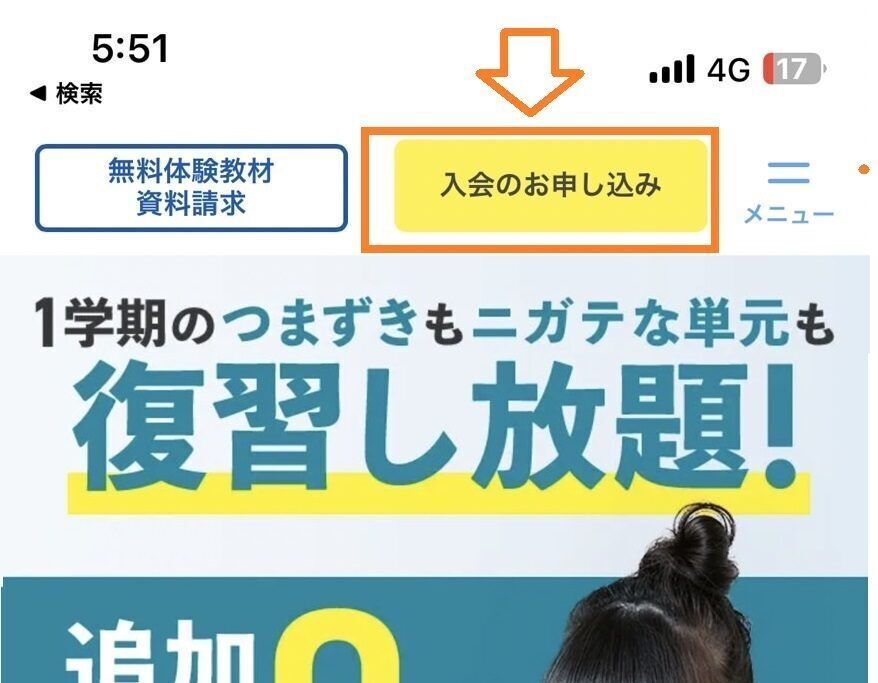

 

**ステップ2：学年と教材を選択する**

・受講したい学年をタップして教材の選択に進む。

・学習スタイルやタブレットの保証にを有無を選択して「同意する」にチェックを入れて「情報入力をする」をタップする。

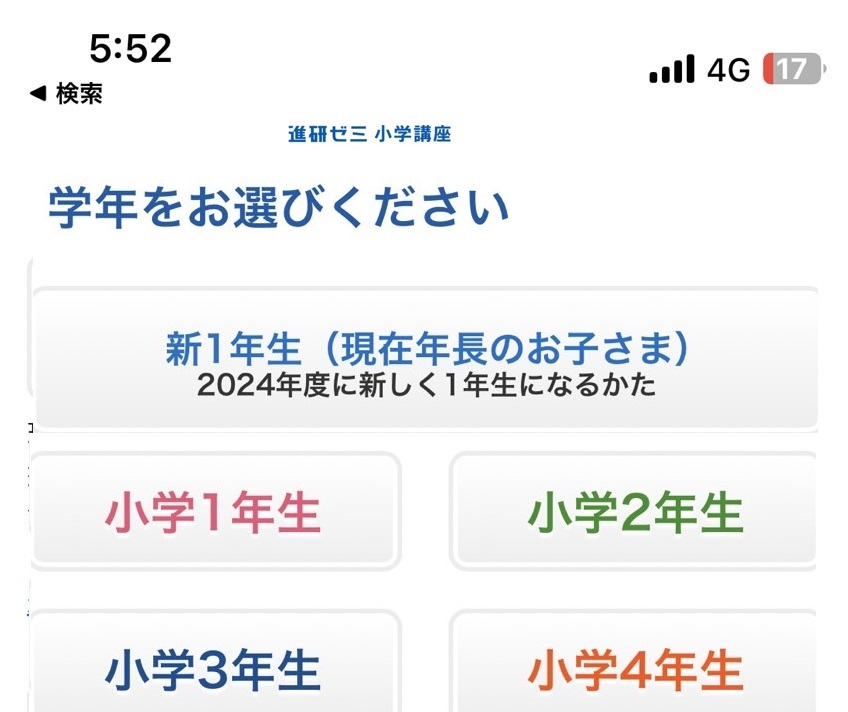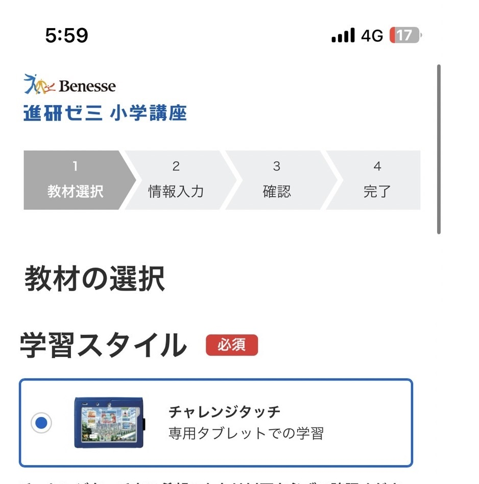

**ステップ3：個人情報を入力する**

氏名、電話番号、住所、支払い方法などを入力して「確認画面にス進む」をタップ

確認画面で入力した情報が正しいかを確かめてOKならば申し込みをタップして完了です。

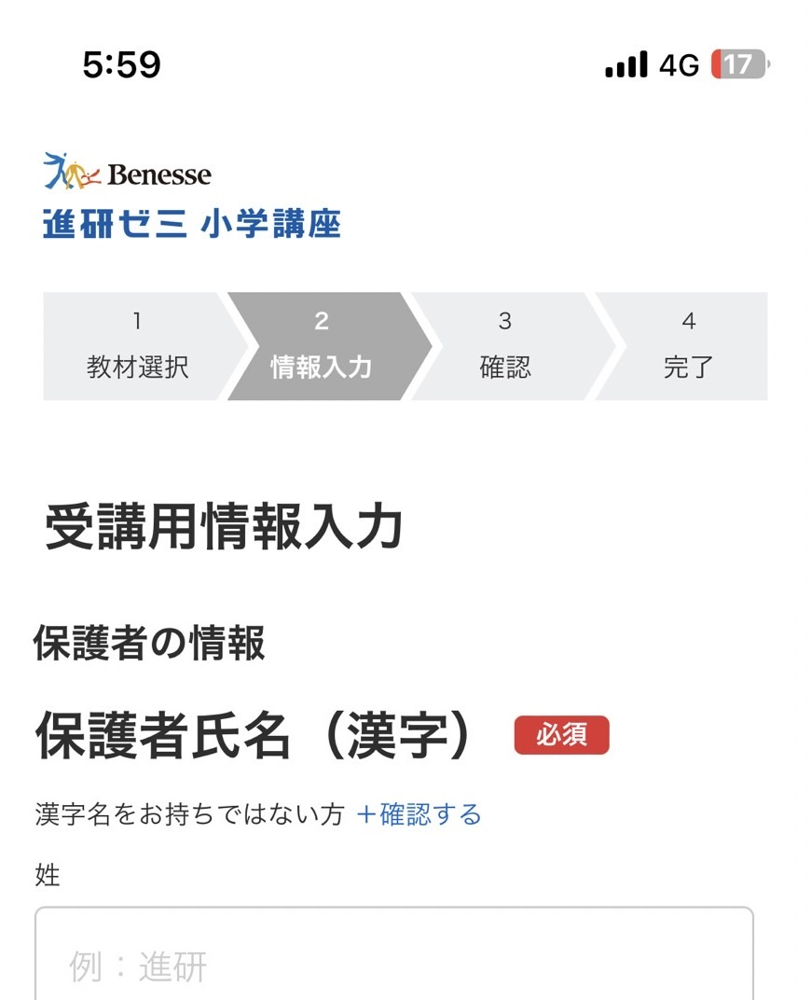

 

🐕

パソコンから入会する場合でも手続きの方法はスマホと一緒だよ♪

**＼5分で完了／**

[「公式」今すぐチャレンジタッチ小学講座に入会する](//ck.jp.ap.valuecommerce.com/servlet/referral?sid=3613518&pid=887390659)
