結論から言うと、進研ゼミ小学講座**だけで中学受験に合格するのは十分に可能です。**

標準～中堅レベルの中学を目指すのであれば、基礎知識が非常に重要です。その点で、進研ゼミでの中学受験対策は有効といえます。

ただし、目指す中学の難易度によっては、進研ゼミの基本コースだけでは足りない場合もあります。

進研ゼミでは基本的に学校の授業に沿った学習内容になっています。**難関中学を受験**する場合は、応用問題が解けるだけでなく、しっかりとした入試対策をする必要があります。

そのため、難関中学の場合、全てを進研ゼミ小学講座だけでカバーするのは難しいと言えます。

その場合、難関中学受験対策として**有料オプションにある「中学受験専用講座」を利用するのがお勧めです。**

## 進研ゼミだけで中学受験の対策は難しい？

進研ゼミだけで中学受験に合格することは十分に可能です。

進研ゼミには、中学受験に必要な、基礎力や応用力を身につけられるカリキュラムが用意されています。

このカリキュラムに沿ってサービスを上手く使いこなすことが志望校合格へと繋がります。

[「公式」今すぐ進研ゼミ小学講座に入会する](https://ck.jp.ap.valuecommerce.com/servlet/referral?sid=3613518&pid=887679902)

https://xn--5ckip8c4fq970ahbya2o7acu2a.com/2022/04/30/%e3%83%81%e3%83%a3%e3%83%ac%e3%83%b3%e3%82%b8%e3%82%bf%e3%83%83%e3%83%81-%e4%b8%ad%e5%ad%a6%e7%94%9f%e3%81%ab%e3%81%aa%e3%81%a3%e3%81%9f%e3%82%89%e4%bd%95%e3%81%8c%e5%a4%89%e3%82%8f%e3%82%8b%ef%bc%9f/

### 進研ゼミの中学受験に役立つサービス

進研ゼミの基本コースには、中学受験に役立つサービスがたくさんあります。

中学受験に役立つサービス一覧

- [実力診断テスト](https://xn--5ckip8c4fq970ahbya2o7acu2a.com/2023/06/09/%e3%83%81%e3%83%a3%e3%83%ac%e3%83%b3%e3%82%b8%e5%ae%9f%e5%8a%9b%e8%a8%ba%e6%96%ad%e3%81%af%e3%80%8c%e5%b0%8f1%ef%bd%9e%e5%b0%8f6%e3%80%8d%e3%81%a7%e5%86%85%e5%ae%b9%e3%81%8c%e9%81%95%e3%81%86%ef%bc%9f/)
- [まなびライブラリー（1000冊の本が読み放題）](https://xn--5ckip8c4fq970ahbya2o7acu2a.com/2023/07/18/%e3%83%81%e3%83%a3%e3%83%ac%e3%83%b3%e3%82%b8%e3%82%bf%e3%83%83%e3%83%81%e3%81%ae%e6%9c%ac%e8%aa%ad%e3%81%bf%e6%94%be%e9%a1%8c%e3%82%b5%e3%83%bc%e3%83%93%e3%82%b9%e3%81%a8%e3%81%af%ef%bc%9f%e9%80%b2/)
- [チャレンジイングリッシュ（小１～高３レベルが使い放題）](https://xn--5ckip8c4fq970ahbya2o7acu2a.com/2022/03/28/%e3%83%81%e3%83%a3%e3%83%ac%e3%83%b3%e3%82%b8%e3%82%a4%e3%83%b3%e3%82%b0%e3%83%aa%e3%83%83%e3%82%b7%e3%83%a5%e3%81%ae%e6%96%99%e9%87%91%e3%81%af%e7%84%a1%e6%96%99%ef%bc%81%ef%bc%9f%e3%80%8c%e5%88%a9/)

詳しく知りたい方はそれぞれ別記事で解説しています。

これらは、進研ゼミ会員なら全て無料で利用できるサービスで、中学受験の対策に役立てる事が出来ます。

- 実力診断テストで今の自分がすべき勉強を理解する。
- 国語の実力の伸ばす最も効果的な読書を習慣にできる。
- 小1～高3まで12のステップに分かられたチャレンジイングリッシュで英語力を伸ばす。

うまく有効活用することで、あなたの実力を格段にあげることができますよ。

## 中学受験（有料）オプションを利用しよう

さらに中学受験の対策する方法としては、進研ゼミでは、有料オプションの中学受験対策専用の講座が用意されています。

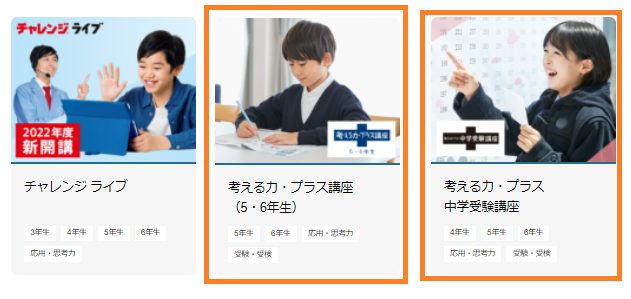

「中学受験オプション」を受講することでチャレンジタッチ単体では難しい中学入試の対策をすることができます。

小学生で習う基礎的な問題から徐々にレベルを上げていき難しい中学受験にも対応できる力が身につきます。

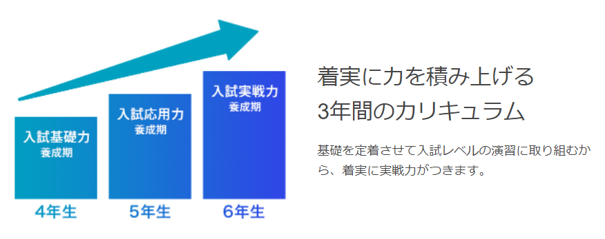

中学受験対策としては、過去に出題された受験問題の膨大なデータから出題されやすい問題や傾向を分析した問題が出題されます。

より出題されやすい問題や傾向に慣れておくことで効率よく受験対策をすることができます。

[進研ゼミ小学講座への入会はここから](//ck.jp.ap.valuecommerce.com/servlet/referral?sid=3613518&pid=887775844)

### 進研ゼミ中学受験講座は2種類ある

進研ゼミには、中学受験の対策を目的として作られた「考える力・プラス」という講座が用意されています。

チャレンジタッチの中学受験オプションには2種類の講座があります。

**①：考える力・プラス 中学受験講座**

「私立・国立中学校」の受験対策をしたい方向けの講座

**②：考える力・プラス講座**

「公立中高一貫校」を目指す人向けの講座

「国立・私立中学校」と「公立中高一貫校」を併願で受験する人は「考える力・プラス中学受験講座」がオススメだよ

公式サイトからそれぞれの資料を請求することができます。

資料請求には中学入試の実践テキストをお試しできます。

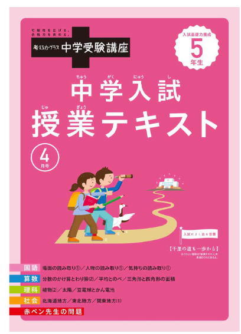

公式サイトから→「メニュー」→「有料オプション講座」から取り寄せることができます。

[進研ゼミ公式サイトから資料請求する](//ck.jp.ap.valuecommerce.com/servlet/referral?sid=3613518&pid=887769279)

### 2つの「中学受験講座」は何が違う？

2つの講座では学習する内容が異なります。

「私立・国立中学校」と「公立中高一貫校」とでは試験の対策に大きく違います

**「私立・国立中学校」の出題形式**

私立・国立中学校の入試のほとんどでは小学校の教科書を超えた範囲の出題があります。

**「公立中高一貫校」の出題形式**

公立中高一貫校の適性検査では、論理的思考力が問われる問題が出題されます。

小学校で習った範囲の知識を活用して問題を解いていく試験が多いため、物事を多面的に見る能力が必要になります。。

🐕

<strong>2つの講座の違いを見てみよう</strong>

| **考える力・プラス中学受験講座** | **考える力・プラス講座** |
| --- | --- |
| ✅ 国語、算数、理科、社会の4教科を中心とした入試対策  ✅ スモールステップで基礎～応用問題までを理解できる  ✅ 小学生で習わない知識や出題範囲をカバー  ✅ 実力テストで入試に必要な力を分析  ✅ 難しい問題は映像授業の解説付き | ✅ 「公立中高一貫校」で出題される作文、適正テスト  ✅ 知識だけでは解けない論理的思考力を鍛える  ✅ 資料の読み方や色々な問題に取り組むことで読解力を鍛える  ✅ 作文を書く基礎を身につける  ✅ 個別の添削指導で表現する力を身につける |

「私立・国立中学校」の合格を目的とした「考える力・プラス中学受験講座」では、学校ごとの科目試験が課される入試対策に特化しています。

対して、「考える力・プラス」では中高一貫校で出題される「適性検査」や「作文」の対策をしていきます。

それぞれの入試にぴったりの対策方法が用意されているんだね

[今すぐ進研ゼミ小学講座へ入会する](//ck.jp.ap.valuecommerce.com/servlet/referral?sid=3613518&pid=887775844)

## 中学受験講座①「私立・国立中学」対策

「考える力・プラス中学受験講座」は「難関私立、国立中学」の**合格を目的とした中学受験一点集中の講座**です。

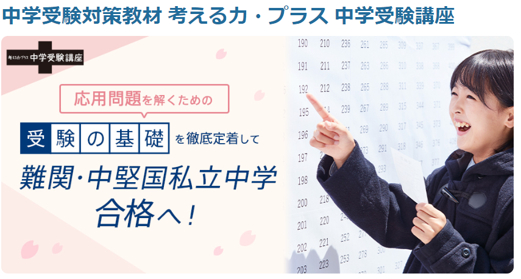スモールステップで分野ごとの基礎をしっかり理解した上で、応用問題、入試対策と少しずつレベルを上げていきます。

🐕

中学受験用の応用問題を解くための基礎の徹底をしているだ

| **考える力・プラス****（中学受験講座）** |  |
| --- | --- |
| 対象 | 小学4年～小学6年 |
| 教科 | 国語、算数、理科、社会 |
| 1日の学習時間 | 60分　※小学6年生の場合 |
| 実力診断テスト | 年2回（4月、8月） |
| 合格可能性判断テスト | 年1回（9月） |
| 添削問題 | 年9回 |
| 料金 | 6,946 円(税込)～ ※詳しい料金はここから[ジャンプ](#Form1) |

**中学受験では、問題をしっかり理解しているかが問われます**。

**中学入試で出題される問題には、基礎を理解していないと解けない問題が多く出題**され、この講座では基礎の定着もかなり重要視しています。

小学校で習う知識以外にも受験で合格点を取るのに必要な範囲の基礎も学習していきます。

また、難しい問題には4教科全てでプロの講師による映像授業解説をみることができます。

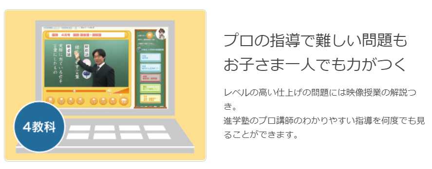年に数回ある実力診断テストやプロの添削では、苦手な部分や本番までに必要な力が何かを教えてくれます。

[進研ゼミ小学講座への入会はここから](//ck.jp.ap.valuecommerce.com/servlet/referral?sid=3613518&pid=887775844)

## 中学受験講座②「公立中高一貫校」対策

「考える力・プラス」は、中高一貫校の受験対策ができる講座です。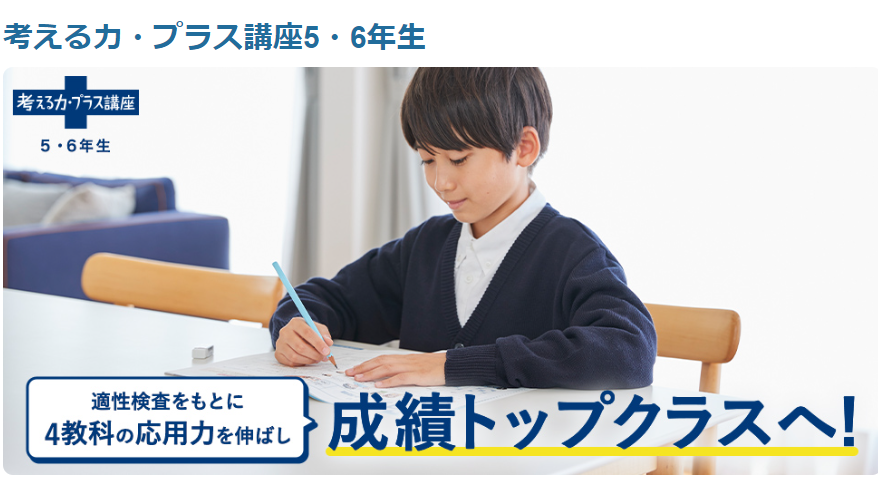「考える力・プラス」では中高一貫校の試験内容である「作文・適正検査」を重点的に勉強し、受験に必要な力を身につけていきます。

| **考える力・プラス****（公立中高一貫）** |  |
| --- | --- |
| 対象 | 小学5年～小学6年 |
| 教科 | 国語、算数、理科、社会、作文、適正検査 |
| 添削 | 作文と適正検査が交互で月に1回 |
| 1日の学習時間 | 30分　 |
| 料金 |  月額3,998円(税込)～ ※詳しい料金はここから[ジャンプ](#Form1) |

🐕

中高一貫校の試験にはどんな力が必要なんだろう？

**適正検査で求められる能力**

①：小学校で勉強した内容の理解度と応用できる力

②：資料や図からの情報読み取り、計算処理、課題解決する力

③：資料を正しく読み、自分の考えを論理的に表現する

**作文で必要な力**

①与えられた文章を正しく理解する読解力

②自分の意見や考えを論理的に表現する力

「考える力・プラス」では、この**中高一貫校の試験に求められる力に着目して作られています**。

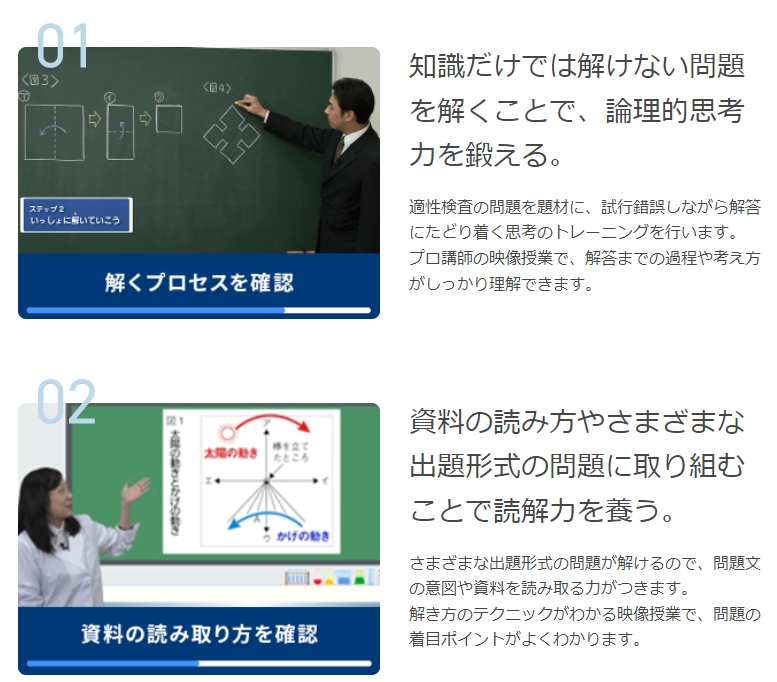

小学生で習う基礎を元に、資料や図からの情報を読み取り、計算処理、課題解決する力を養っていきます。

試験によく出る問題や難易度の高い問題では、講師による映像授業で詳しく解説してあります。

さらに、作文では個別指導で個人に足りない力、作文の伸ばし方を丁寧に教えてくれます。

🐕

一見、難しそうですが、正しい勉強方で1つ1つ理解していくことで確実に問題を解く力を身につけることができるよ

## 中学受験講座でどのレベルまで目指せる？

これまで紹介した2つの講座でどのレベルの学校を目指すことができるのでしょうか？

①：考える力・プラス中学受験講座

②：考える力・プラス講座

2つの講座で目指せる学校のレベルをそれぞれみていきましょう。

### ①考える力・プラス中学受験で目指せるレベル

結論から言うと「考える力・プラス中学受験講座」で目指せるレベルは偏差値55～65あたりの私立・公立の中学です。

🐕

公式サイトでも紹介されているよ

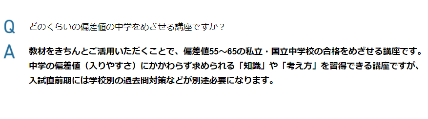この講座は、スモールステップでコツコツと進める学習内容ですが、決してレベルは低いという訳でなく、**正しく活用することでレベルの高い中学も十分に目指すことができます**。

「考える力・プラス中学受験講座」受講者の合格実績

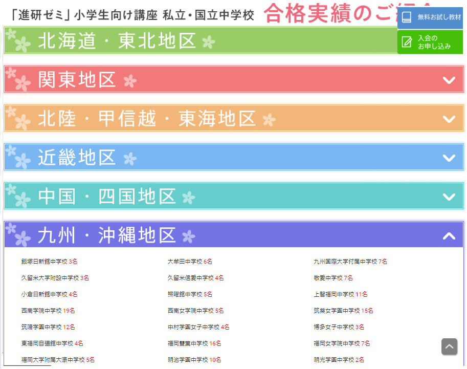全国の合格実績を見たい人は[こちら](https://sho.benesse.co.jp/cj/jisseki/)

### ②考える力・プラスで目指せるレベル

「考える力・プラス」で目指せる偏差値レベルは公式には記載されていませんでした。

ただ、学習する内容や受講者の合格実績から**偏差値50～65あたりの学校は十分に目指すことができる**と言えます。****

「考える力・プラス講座」受講者の合格実績

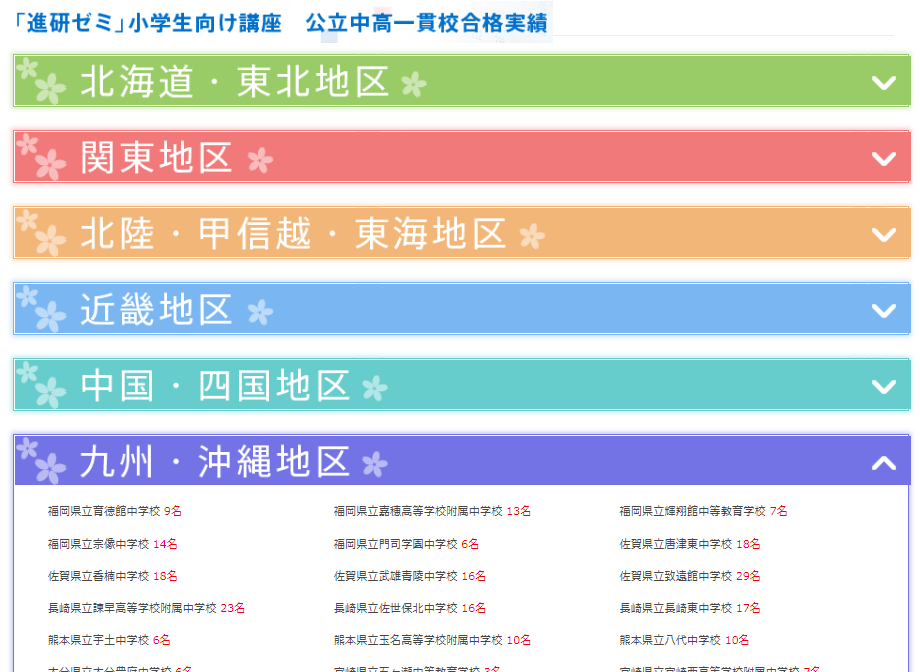全国の合格実績を見たい人は[こちら](https://sho.benesse.co.jp/op/jisseki/)

実践的な問題や勉強の進め方を丁寧に説明してくれるので志望校の対策がしやすいのが「考える力・プラス」の特徴と言えます。

## 中学受験講座（有料オプション）の料金

中学受験の講座は、支払い方法によって料金が変わります。

1年払い、または卒業までの一括払いの方が安い料金で受講することができます。

**考える力・プラス中学受験講座**

|  | 毎月払い | 1年払い | 卒業までの一括払い |
| --- | --- | --- | --- |
| 小4 | 7,312 円 | 83,352円 （毎月6,946 円） | なし |
| 小5 | 7,312 円 | 83,352円 （毎月6,946 円円） | 152,812円 （毎月6,946 円円） |
| 小6 | 7,312 円 | なし | 69,460円 （毎月6,946 円） |

**考える力・プラス講座**

|  | 毎月払い | 1年払い | 卒業までの一括払い |
| --- | --- | --- | --- |
| 小5 | 4,208 円 | 47,976円 （毎月3,998 円） | 90,656円 （毎月3,998 円） |
| 小6 | 4,493 円 | なし | 42,680円 （毎月4,268 円） |

※料金は全て税込み表示です。

[進研ゼミ小学講座への入会はここから](//ck.jp.ap.valuecommerce.com/servlet/referral?sid=3613518&pid=887775844)

## 「中学受験講座」は進研ゼミを受講してない人も入会可能？

結論から言うと有料オプションだけでも受講することは可能です。

🐕

チャレンジタッチの相談窓口に問い合わせした返答

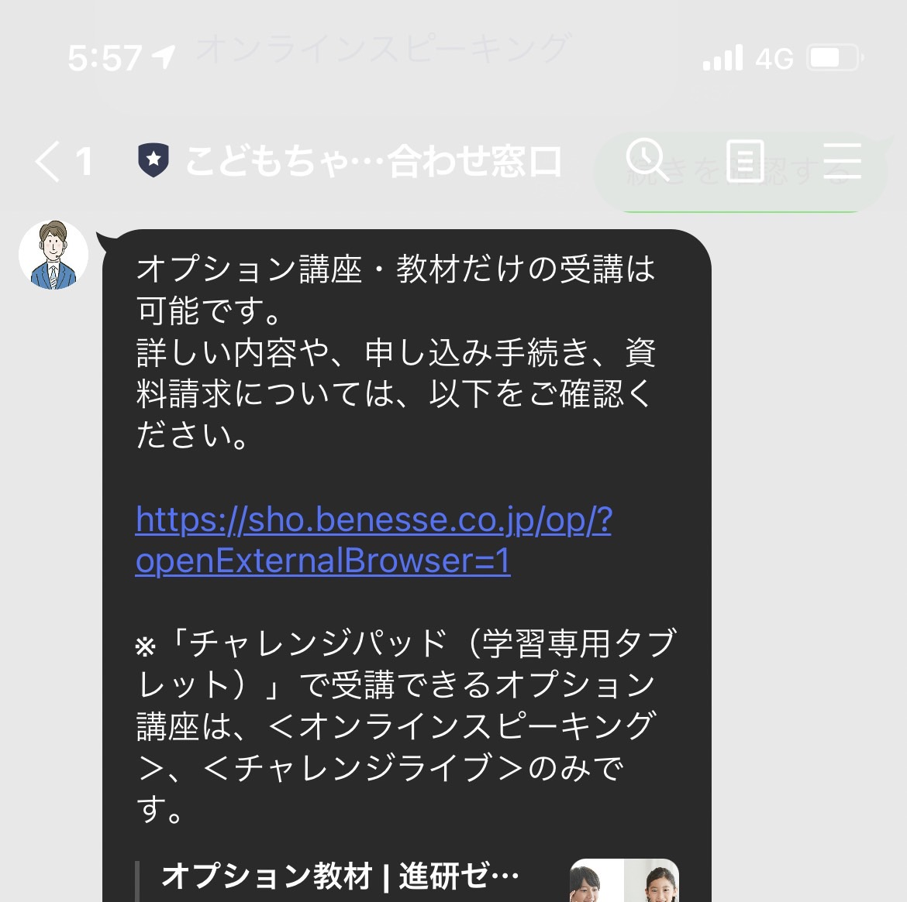

LINE内容

オプション講座・教材だけの受講は可能です。 詳しい内容や、申し込み手続き、資料請求については、以下をご確認ください。

https://sho.benesse.co.jp/op/?openExternalBrowser=1

※「チャレンジパッド（学習専用タブレット）」で受講できるオプション講座は、＜オンラインスピーキング＞、＜チャレンジライブ＞のみです。

中学受験対策だけに集中したい人は有料オプションだけ受講することができます。

## 他教材のレベル別の中学受験対策教材

最後に、中学受験対策としておすすめの教材を紹介していきます。

個人によって「合う、合わない」が違うのでそれぞれ公式サイトで資料を取り寄せて**お試し教材に取り組むことで自分に合った教材をえらぶことができますよ**♪

「中堅～難関」中学レベルの受験におすすめ

1：[進研ゼミ](<http://\<a href="https://px.a8.net/svt/ejp?a8mat=3HEHQP+CIPGIQ+36T2+TX8V6" rel="nofollow"\>スタサプ\</a\> \>)（考える力・プラス中学受験） 今回紹介してきた進研ゼミ（考える力・プラス中学受験）は中堅～難関中学を受験する人にオススメです。基礎から勉強を定着させることができるので時間に余裕があり**コツコツと進めていくにはとても有効な教材**と言えます。

2：[スタディサプリ](<http://\<a href="https://px.a8.net/svt/ejp?a8mat=3HEHQP+CIPGIQ+36T2+TX8V6" rel="nofollow"\>スタサプ\</a\> \>) 一流の講師が難しい問題でも分かりやすく動画で1つ1つの問題が丁寧に解説されています。中学受験専用の講座はありませんが、**学校の復習や塾との活用でより分野ごとの理解を深めていくことができます**。 料金が安いのも特徴の1つになっています。

「難関～最難関」中学レベルの受験におすすめ

1：[Z会中学受験コース](https://px.a8.net/svt/ejp?a8mat=3HG23U+A3S676+E0Q+CUQYA) 基礎ができているならZ会での受験対策がおすすめ。レベルが高く良質な問題が多いZ会では、難関校の受験対策に焦点を当てて集中的に対策をすることができます。**最難関の中学受験対策として通信教材を選ぶならZ会の一択と言って良いほどおすすめの教材です**。

2：[RISU算数](https://px.a8.net/svt/ejp?a8mat=3HIV06+1VVQJM+4EIO+60OXE) 算数だけを集中して伸ばしたい人にはRISU算数がおすすめ。算数に特化したRISU算数では他の教材ではカバーしきれない部分もしっかり学習することができます。算数の応用力を伸ばすことで、**自分で考える力を身につけ楽しみながら勉強を進めていくことができます**。

[今すぐチャレンジタッチ公式サイトから入会する](https://ck.jp.ap.valuecommerce.com/servlet/referral?sid=3613518&pid=887679902)
