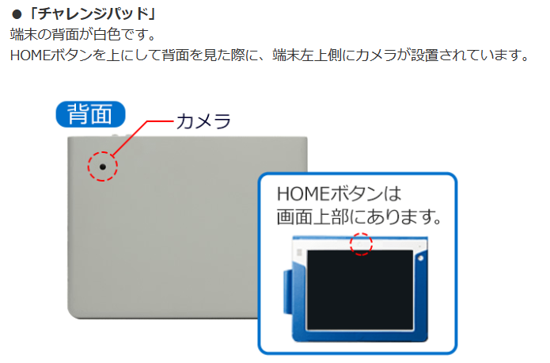
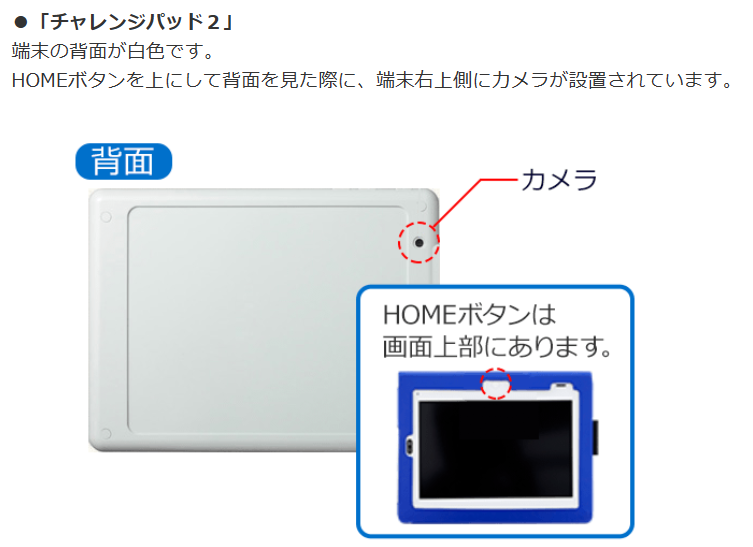
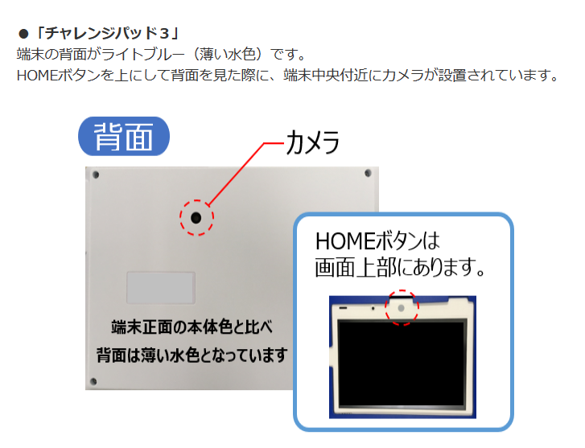
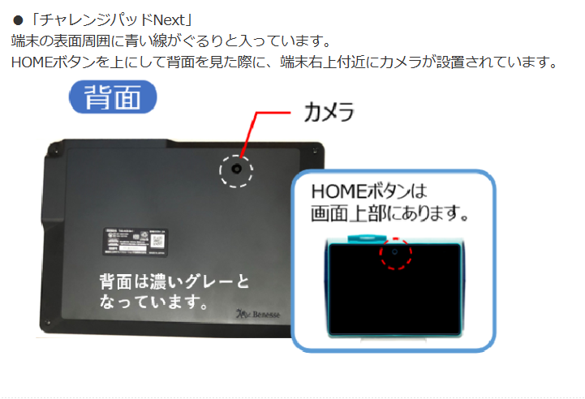
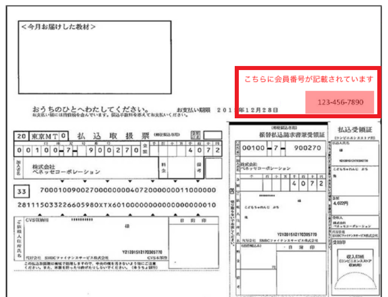
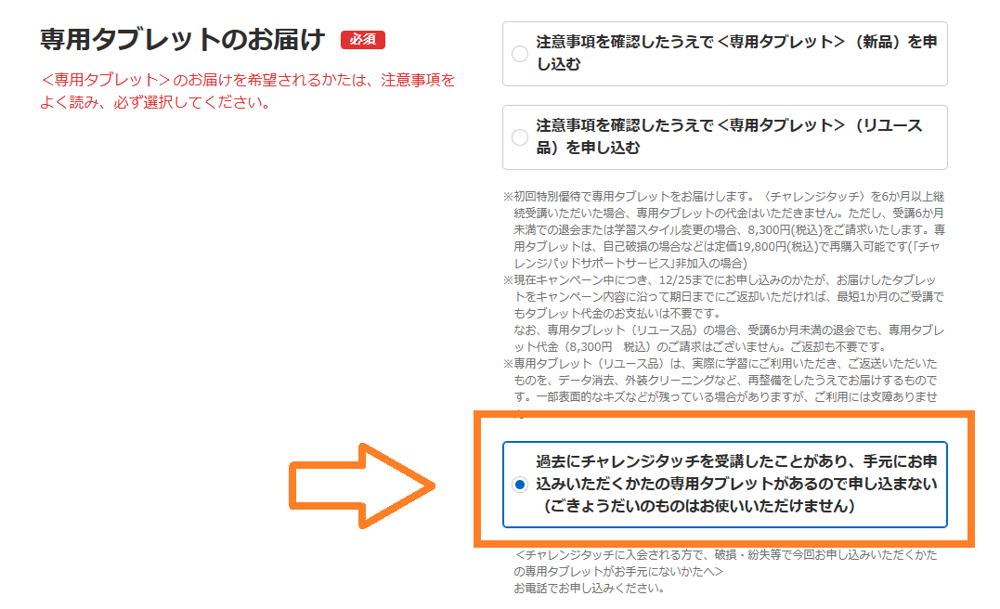

進研ゼミチャレンジタッチに再入会する際新たにタブレットを再購入する必要があります。ただ、前回使っていたタブレットがまだ自宅で保管されている方は同じタブレットで使用することができます。

今回は、チャレンジタッチに再入会する際に知っておくと便利な情報やお得な入会方法を紹介します。

チャレンジタッチの再入会を検討している方は是非最後までご覧ください。

もちろん、チャレンジに再入会する場合は、タブレットの購入は必要ありません。[チャレンジとチャレンジタッチの違い](https://xn--5ckip8c4fq970ahbya2o7acu2a.com/2022/02/12/%e3%83%81%e3%83%a3%e3%83%ac%e3%83%b3%e3%82%b8%e3%82%bf%e3%83%83%e3%83%81%e3%81%a8%e3%83%81%e3%83%a3%e3%83%ac%e3%83%b3%e3%82%b8%e9%81%b8%e3%81%b6%e3%81%aa%e3%82%89%e3%81%a9%e3%81%a3%e3%81%a1%ef%bc%9f/)を知りたい方は別記事で解説しています。

あわせて読みたい

- [進研ゼミ「小学生」利用者の良い口コミ悪い口コミとは！？](https://xn--5ckip8c4fq970ahbya2o7acu2a.com/2022/01/09/%e9%80%b2%e7%a0%94%e3%82%bc%e3%83%9f-%e5%b0%8f%e5%ad%a6%e8%ac%9b%e5%ba%a7%e3%81%ae%e5%8f%a3%e3%82%b3%e3%83%9f%e8%a9%95%e5%88%a4%e5%ae%8c%e5%85%a8%e3%81%be%e3%81%a8%e3%82%81/)
- [進研ゼミ「小学生」1年生～6年生の月額料金](https://xn--5ckip8c4fq970ahbya2o7acu2a.com/2023/10/18/%e3%83%81%e3%83%a3%e3%83%ac%e3%83%b3%e3%82%b8%e3%82%bf%e3%83%83%e3%83%81%e3%80%8c%e5%b0%8f%e5%ad%a6%e7%94%9f%e3%80%8d%e6%96%99%e9%87%91%e3%81%be%e3%81%a8%e3%82%81%ef%bc%8112%e3%83%b6%e6%9c%88-2/)
- [進研ゼミ「中学生」口コミ・料金の総まとめ！](https://xn--5ckip8c4fq970ahbya2o7acu2a.com/2023/10/26/%e9%80%b2%e7%a0%94%e3%82%bc%e3%83%9f%e4%b8%ad%e5%ad%a6%e8%ac%9b%e5%ba%a7%ef%bc%88%e3%83%81%e3%83%a3%e3%83%ac%e3%83%b3%e3%82%b8%e3%82%bf%e3%83%83%e3%83%81%e4%b8%ad%e5%ad%a6%e7%94%9f%ef%bc%89%e6%9c%ac/)
- [チャレンジタッチを辞めた人の理由を調べてみた！](https://xn--5ckip8c4fq970ahbya2o7acu2a.com/2023/05/31/%e3%83%81%e3%83%a3%e3%83%ac%e3%83%b3%e3%82%b8%e3%82%bf%e3%83%83%e3%83%81%e3%82%92%e8%be%9e%e3%82%81%e3%81%9f%e7%90%86%e7%94%b1%e3%81%af%e4%bd%95%ef%bc%9f%e7%9f%a5%e3%82%89%e3%81%9a%e3%81%ab%e5%85%a5/)

## チャレンジタッチ再入会にはタブレット購入が必須？

結論から言うと、「以前チャレンジパッドを使っていたけど[チャレンジタッチ解約](https://xn--5ckip8c4fq970ahbya2o7acu2a.com/2021/09/18/1175/)後に捨ててしまった」という方が再入会する場合はチャレンジタッチのタブレットを購入する必要があります。

専用タブレットが届けられるのは、1人1回限りのため、新規入会の時のような「6ヶ月以上の継続でタブレットが無料」の**サービスは使えない**ので定価料金での購入となります。

もし、**チャレンジタッチを解約**する場合、念のためにタブレットは保管しておくことをオススメします。

ちなみに、[チャレンジパッドの改造（Android化）](https://xn--5ckip8c4fq970ahbya2o7acu2a.com/2022/04/30/%e3%83%81%e3%83%a3%e3%83%ac%e3%83%b3%e3%82%b8%e3%82%bf%e3%83%83%e3%83%81%e3%81%ae%e6%94%b9%e9%80%a0%e3%81%af%e5%8d%b1%e9%99%ba%ef%bc%9fandroid%e5%8c%96%e3%81%ae%e3%83%aa%e3%82%b9%e3%82%af%ef%bc%95/)をしたタブレットは進研ゼミでは使えなくなるので注意してください。

**＼5分で完了／**

[今すぐ進研ゼミ公式サイトから再入会する（小学講座）](//ck.jp.ap.valuecommerce.com/servlet/referral?sid=3613518&pid=887679884)

[今すぐ進研ゼミ公式サイトから再入会する（中学講座）](//ck.jp.ap.valuecommerce.com/servlet/referral?sid=3613518&pid=887679893)

### 以前使っていたタブレットは使える？

結論から言うと以前使っていたチャレンジタッチのタブレットは**再入会後も問題なく使用することができます。**

🐕

※ただし、小学講座から中学講座に再入会する場合は、使用するタブレットが変わります。のちほど詳しく解説しているので先に知りたい方は[ここからジャンプ](#Form1)してください。

しかし、再入会する際に、あまり型の古いタブレットの使用はおすすめしません。古い型のタブレットは今現在の新しいサービスで使うには不便かもしれません。

サービスの精度や技術が向上すると古いタブレットパッドでは技術についていけず、**動きが遅いなどの不具合が発生する可能性があります**。

できれば機能性の高いチャレンジパッド3、neo、nextを使用するのがオススメです。

新規入会で届けられるタブレットの機種

- 小学1年生～2年生で届くタブレット　→　チャレンジパッドnext
- 小学3年生～6年生で届くタブレット　→　チャレンジパッド３

**＼5分で完了／**

[今すぐ進研ゼミ公式サイトから再入会する（小学講座）](//ck.jp.ap.valuecommerce.com/servlet/referral?sid=3613518&pid=887679884)

[今すぐ進研ゼミ公式サイトから再入会する（中学講座）](//ck.jp.ap.valuecommerce.com/servlet/referral?sid=3613518&pid=887679893)

### チャレンジタッチ再入会のタブレットはいくら？

以前使用していたタブレットを捨ててしまった方が再入会する場合、もう一度タブレットの購入が必要です。

[チャレンジタッチの専用タブレットの料金](https://xn--5ckip8c4fq970ahbya2o7acu2a.com/2023/10/18/%e3%83%81%e3%83%a3%e3%83%ac%e3%83%b3%e3%82%b8%e3%82%bf%e3%83%83%e3%83%81%e3%80%8c%e5%b0%8f%e5%ad%a6%e7%94%9f%e3%80%8d%e6%96%99%e9%87%91%e3%81%be%e3%81%a8%e3%82%81%ef%bc%8112%e3%83%b6%e6%9c%88-2/) は種類によって違うよ

チャレンジパッド３・・・定価19,800円（税込・消費税率10％）

チャレンジパッドNeo・・・定価39,800円（税込・消費税率10％）

[チャレンジパッドNext](https://xn--5ckip8c4fq970ahbya2o7acu2a.com/2023/06/19/%e3%83%81%e3%83%a3%e3%83%ac%e3%83%b3%e3%82%b8%e3%83%91%e3%83%83%e3%83%89next%ef%bc%88%e3%83%8d%e3%82%af%e3%82%b9%e3%83%88%ef%bc%89%e3%81%a3%e3%81%a6%e3%81%a9%e3%82%93%e3%81%aa%e3%82%bf%e3%83%96/)・・・定価39,800円（税込・消費税率10％）

いずれにしても2万円以上とかなり高い買い物となってしまいます。

### チャレンジタッチは中古でも使える？

**チャレンジタッチ**のタブレットは**中古**の物でも使うことができます。

ただし、進研ゼミ専用のタブレットでなければなりません。例えば、iPadなどは使用することができないので注意しましょう。

ちなみにチャレンジパッドはメルカリやヤフオクなどで購入できるよ♪

少しでも料金を安く抑えたい方は中古品を購入するのも方法の１つです。

ただし、中古品は「充電がもたない」「どこか不具合がある」といった可能性もあります。ちゃんとした物を使いたい方は公式サイトから新品を購入した方がいいでしょう♪

ちなみに、中古の専用タブレット、または以前使用していた専用タブレットで再入会する場合でも「[進研ゼミタブレット保証サービス](https://xn--5ckip8c4fq970ahbya2o7acu2a.com/2022/04/05/%e3%83%81%e3%83%a3%e3%83%ac%e3%83%b3%e3%82%b8%e3%82%bf%e3%83%83%e3%83%81%e7%ab%af%e6%9c%ab%e3%81%ae%e4%ba%a4%e6%8f%9b%e3%81%ae%e6%96%99%e9%87%91%e3%81%af%ef%bc%9f%e4%bf%9d%e8%a8%bc%e3%81%8c%e3%81%84/)」に加入することは可能です。

タブレットが万が一故障した場合は、新たに購入する必要があるので、「進研ゼミタブレット保証」については一度確認しておくといいですよ♪

### 持っているチャレンジパッドの機種を確認しよう

現在進研ゼミでは、以下の5種類のタブレットがあります。

| **チャレンジパッド種類** |  |
| --- | --- |
| チャレンジパッド | 2014年登場モデル（初代） |
| チャレンジパッド２ | 2017年登場モデル |
| チャレンジパッド３　 | 2020年登場モデル |
| チャレンジパッドneo （中学生用） | 2021年登場モデル |
| チャレンジパッドNext | 2022年登場モデル（最新） |

この中でチャレンジタッチに新規入会して届けられるのは、チャレンジパッド３、neo、nextの3種類です。

現在「チャレンジパッド」または「チャレンジパッド2」を使っている方は新しいタブレットの購入をオススメします。

基本的にチャレンジパッド3以降であれば特に問題なく使用できますが、「よりサクサク動かしたい」「精度の高いタブレットで勉強したい」という方は最新のチャレンジタッチNextがオススメです。

[✅ チャレンジパッドnext](https://xn--5ckip8c4fq970ahbya2o7acu2a.com/2023/06/19/%e3%83%81%e3%83%a3%e3%83%ac%e3%83%b3%e3%82%b8%e3%83%91%e3%83%83%e3%83%89next%ef%bc%88%e3%83%8d%e3%82%af%e3%82%b9%e3%83%88%ef%bc%89%e3%81%a3%e3%81%a6%e3%81%a9%e3%82%93%e3%81%aa%e3%82%bf%e3%83%96/)については別記事で詳しく解説しています。

せっかくお金を払ってチャレンジタッチで勉強するのにタブレットに問題があるせいでやる気が下がっては本末転倒です。

「タブレットを購入したくない」方は**紙教材のチャレンジがオススメです**。

チャレンジであればタブレットの購入することなく利用することができます。

資料請求でお試し教材が送られてくるので気になる方は試してみるといいですよ。

[今すぐチャレンジのお試し教材をためしてみる♪](//ck.jp.ap.valuecommerce.com/servlet/referral?sid=3613518&pid=887679910)

### 以前のデータはそのまま使える？

進研ゼミでは、新しいタブレットでも以前のデータを引き継ぐ事ができます。

🐕

前回のデータを使うには、以前使っていた会員番号とパスワードが必要だよ

会員番号とパスワードは、チャレンジタッチと一緒にお送られてくる会員番号シールの右上に記載されています。す。

ただ、チャレンジタッチのデータ保存期間は2年間だけなので、退会して2年以上たっている方はデータを引き継いでも意味が無いので覚えておきましょう。

**＼5分で完了／**

[今すぐ進研ゼミ公式サイトから再入会する（小学講座）](//ck.jp.ap.valuecommerce.com/servlet/referral?sid=3613518&pid=887679884)

[今すぐ進研ゼミ公式サイトから再入会する（中学講座）](//ck.jp.ap.valuecommerce.com/servlet/referral?sid=3613518&pid=887679893)

## 再入会でもキャンペーンの特典は使える？

キャンペーンは**再入会する時でも使う事ができます**。

チャレンジタッチでは以下のようなキャンペーンを実施しています。

・期間限定キャンペーン（定期的に変化）

・プレゼントキャンペーン

・兄弟、お友達紹介キャンペーン（誰かに紹介してもらう形で入会することもでお得に入会）

中でも期間限定キャンペーンは大きな割引なお得な特典があり、Amazonギフト1000円分もらえるといったキャンペーンが定期的に開催されてます。

キャンペーンの内容は学年やチャレンジタッチ、チャレンジによっても変わってきます。

詳しくは公式サイト、または資料請求から確認ください。

[進研ゼミ公式サイトからキャンペーン内容を確認する](//ck.jp.ap.valuecommerce.com/servlet/referral?sid=3613518&pid=887678560)

## 再入会の手続きはどうすればいい？

進研ゼミへの再入会するには公式サイトから電話またはWebから申し込むことができます。

再入会の手続きは<strong>新規入会の時と同じ</strong>だよ

再入会といっても、面倒な手続きはありません。進研ゼミに一度入会した事がある方は、進研ゼミ公式サイトから同じように申し込みをすれば完了します。

ただし、既にタブレットをお持ちの方は、申し込み時に「専用タブレットのお届け」で「申し込まない」にチェックを入れる必要があるので、注意しましょう。

## 再入会したら努力賞ポイントは引き継がれる

以前、努力賞ポイントを使い切れずに退会した人は再入会後に、残っていた努力賞ポイントを使う事ができます。

有効期限は受講者が高校を卒業する年度の6月までとなっています。

🐕

努力賞ポイントを再入会で使用するには以前使っていた会員番号とパスワードが必要だよ

[再入会後の努力賞ポイント](https://xn--5ckip8c4fq970ahbya2o7acu2a.com/2023/07/10/%e3%83%81%e3%83%a3%e3%83%ac%e3%83%b3%e3%82%b8%e3%82%bf%e3%83%83%e3%83%81%e5%8a%aa%e5%8a%9b%e8%b3%9e%e3%83%9d%e3%82%a4%e3%83%b3%e3%83%88%ef%bc%81%e8%b2%b0%e3%81%88%e3%82%8b%e5%95%86%e5%93%81%e3%81%af/)については別記事で詳しく紹介しています。

### 以前の「頑張りシール」は再入会後も使える？

2016年の4月以降であれば、どの学年・学習スタイルでも「頑張りシール」を「努力賞ポイント」に交換することができます。

頑張りシールを「シール台紙」に貼って以下の送付先に送ります。

送付先 〒700-8688 岡山中央郵便局私書箱第２５２号 （株）ベネッセコーポレーション 努力賞ポイントサービス係

台紙がない人は[こちら](https://faq.benesse.co.jp/attachment_file/faq?id=20759.pdf&site_domain=sho)から印刷することができます。

[参考元URL](https://faq.benesse.co.jp/faq/show/1000?site_domain=sho)

## チャレンジタッチ再入会まとめ

チャレンジタッチに再入会するにはタブレットが必須となります。

タブレットを持っていない方は再度購入する必要があるが、新記入会時のような6ヵ月で無料サービスは受けられないので注意が必要です。

タブレットを購入せず進研ゼミを始めたい方は**紙教材のチャレンジがオススメです。**

https://xn--5ckip8c4fq970ahbya2o7acu2a.com/2022/02/12/%e3%83%81%e3%83%a3%e3%83%ac%e3%83%b3%e3%82%b8%e3%82%bf%e3%83%83%e3%83%81%e3%81%a8%e3%83%81%e3%83%a3%e3%83%ac%e3%83%b3%e3%82%b8%e9%81%b8%e3%81%b6%e3%81%aa%e3%82%89%e3%81%a9%e3%81%a3%e3%81%a1%ef%bc%9f/

進研ゼミについてもっと詳しく知りたい方は資料請求をするのもいいですよ。

お試し教材から料金やサービスが詳しく載っているパンフレットが送られてくるので、簡単な体験や詳しい情報を知りたい方にオススメです。

[進研ゼのミ資料請求する（小学講座）](//ck.jp.ap.valuecommerce.com/servlet/referral?sid=3613518&pid=887679902)

[進研ゼミの資料請求する（中学講座）](//ck.jp.ap.valuecommerce.com/servlet/referral?sid=3613518&pid=887679903)
