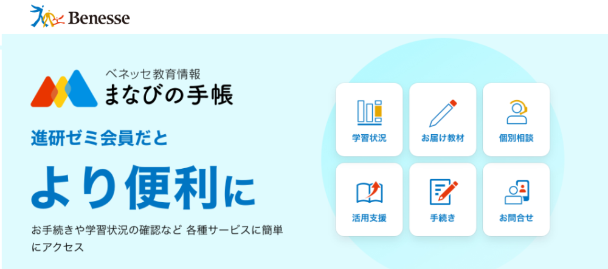

## 良い口コミ・高評価の評判まとめ

進研ゼミ中学講座を実際に使った人の感想をまとめました。

まずは、良い口コミから見ていきましょう。

<blockquote class="twitter-tweet">
チャレンジタッチ中学入学前から再入会したの大正解やった😇 これなかったら何の勉強さしたら良いか全くわからんとこやった！
勉強のやり方知らない子でも 「これやっとき〜」って言える安心感すごい😭 ゲーム感覚で繰り返しやっとくだけで少しは身に付く気がしてる🤳 テスト前の私の御守り✨✨

— kinopoe (@kinopoe_makiko) <a href="https://twitter.com/kinopoe_makiko/status/1542040677181431808?ref_src=twsrc%5Etfw">June 29, 2022</a></blockquote>

<blockquote class="twitter-tweet">
動画解説あるのいいですね！ 進研ゼミうちの娘は中学卒業で一度やめたのですが、高2くらいで再入会してその頃タブレットで講義が受けられるようになりましたが私はもうついていけず本人に任せてました😅
まいさんの息子さんが高校生になる頃には更に進化しているんだろうなぁ

— micha (@kanoutyan) <a href="https://twitter.com/kanoutyan/status/1702580888968860071?ref_src=twsrc%5Etfw">September 15, 2023</a></blockquote>

<blockquote class="twitter-tweet">
3回目接種の真っ只中だけど、長女の高校入試の合格発表だった。 公立校で県内5本の指に入る進学校に、塾も行かず進研ゼミのみの自宅学習で見事合格。 中学3年の4月に母親を亡くし、父親はワクチン担当で毎日午前様。家庭環境は劣悪だったのに、良く合格したよ…。 ご褒美、奮発しよう( ﾟ∀ﾟ)
— nyokirin-kerorin『にょきけろふぃーごん』 (@MNyokirin) <a href="https://twitter.com/MNyokirin/status/1499671148124323840?ref_src=twsrc%5Etfw">March 4, 2022</a></blockquote>

<blockquote class="twitter-tweet">
娘が始めた進研ゼミ(ハイブリッド)。 すごいよね、期末テスト強化対策とかでLIVE講義までしてくれる！！て娘大喜び。テキストや添削、娘曰く ｢進研ゼミまじ神✨｣らしい。 兄は昔、スマイルゼミやったけど早々に退会💧向き不向きはあるけど、うちはやってよかった🤙🏻 (回し者ではありません)
— かーる (@mokamomo03) <a href="https://twitter.com/mokamomo03/status/1494571535494836226?ref_src=twsrc%5Etfw">February 18, 2022</a></blockquote>

<blockquote class="twitter-tweet">
今は紙ではなくタブレット学習なので自習だけでなく授業もあるんです！
しかもAIで添削とテスト対策してくれるのでなかなか今風の仕上がりです！

導入してテストの順位上がりました🤤

スゴイぜ！進研ゼミ！

— なみき@グロースマーケター (@junnami1) <a href="https://twitter.com/junnami1/status/1452082272316780548?ref_src=twsrc%5Etfw">October 24, 2021</a></blockquote>

進研ゼミ中学講座の良い評判で、とくに目立つのが定期テスト対策のしやすさです。

学校の教科書に合わせて進めやすく、テスト範囲や日程に合わせて学習を整理しやすいため、「テスト前に何をやればいいのか」が見えやすいのは大きな強みです。

暗記用の教材や予想問題、アプリ系の機能などもあり、テスト前に使い分けしやすい点も魅力です。

ふだんの勉強にも使えますが、とくに力を発揮しやすいのは定期テスト前だと言えそうです。

忙しい中学生ほど、やることが整理されているだけでかなり助かります。

そう考えると、定期テスト対策のしやすさはかなり大きなメリットです。

### 部活と両立しやすい

部活と両立しやすい点も、よく評価されているポイントです。

短時間で区切って進めやすいため、平日にまとまった時間が取りにくい子でも取り組みやすいです。

家ですぐ始めやすいのも、忙しい中学生にとっては助かるところでしょう。

部活がある日は短めに、少し余裕がある日は多めに、というように、生活に合わせて調整しやすいのも使いやすさにつながっています。

もちろん、短時間で終わるからそれだけで成績が上がるわけではありません。

ただ、少なくとも「忙しいから続けにくい」という壁は下げやすい教材です。

### 自分のペースで進めやすい

自分のペースで進めやすい点も、良い評価としてよく挙がります。

好きな時間に取り組みやすく、わからないところを中心に進めやすいため、生活リズムに合わせて勉強しやすいです。

予定どおりにいかない日があっても調整しやすく、無理なく続けやすいのも強みです。

ここは「自由すぎる」と見ることもできますが、逆にいえば、日ごとの忙しさに合わせて動かしやすいということでもあります。

部活や習い事がある中学生にとって、この柔軟さはかなりありがたいはずです。

**＼5分で完了／**

[✅ 「公式」今すぐ進研ゼミ中学講座に入会する](//ck.jp.ap.valuecommerce.com/servlet/referral?sid=3613518&pid=889799013)

## 進研ゼミ中学講座：悪い口コミ

次に、進研ゼミ中学講座を受講した人の悪い口コミも見ていきましょう。

### 直接指導してもらえるわけではない

これは通信教材でよくある不満のひとつで、進研ゼミ中学講座も例外ではありません。

<blockquote class="twitter-tweet">
娘も算数苦手。今は小数の掛算・割算とか、図形の角で躓いている。チャレンジタッチでは解けるのに、学校のプリントでは盛大に間違う...やっぱ教育のプロによる直接指導に適うものはない😭
— グミィ (@gummy_gummi) <a href="https://twitter.com/gummy_gummi/status/1549738104839618560?ref_src=twsrc%5Etfw">July 20, 2022</a></blockquote>

「直接先生からの指導が受けられない」という点は、通信教材の性質上、どうしても避けにくい課題です。

進研ゼミにもチャット機能で先生に質問することはできますが、**その場ですぐに教えてもらえるわけではありません**。

「直接指導を受けたほうが理解しやすい」と感じる生徒には、通信教材よりも塾のほうが合っているかもしれません。

### タブレットが壊れやすい

「進研ゼミのタブレットは壊れやすい」という口コミです。

> タブレットが壊れやすい。 通常の使い方で液晶が割れるとかあり得ない。 これまで、このような壊れ方をした事がなかったので、はじめてサポートに加入しなかったのだが、今となってはサポートに入っていない事が悔やまれる。
> 
> とはいえ、今回の場合。液晶割れはなんらかのこちらの過失が疑われ、サポートに入っていたとしても金額が発生していそうな感じでした。とすると、実に納得のいかない買い物だと思う。子供が受講継続を望まなければ、即解約していたと思う。
> 
> 引用元：[進研ゼミの口コミ/評判｜口コミ・料金をチェック【塾ナビ】 (jyukunavi.jp)](https://www.jyukunavi.jp/hyouban/blist/16991.html)

この口コミが投稿された時期を考えると、使っていたタブレットは、おそらくチャレンジパッド3かそれ以前の機種だったと考えられます。

チャレンジパッド3以前のタブレットでは、「画面が反応しにくい」「壊れやすい」といった声が多くありました。

しかし、2022年に進研ゼミから[チャレンジパッドnext](https://xn--5ckip8c4fq970ahbya2o7acu2a.com/2023/06/19/%e3%83%81%e3%83%a3%e3%83%ac%e3%83%b3%e3%82%b8%e3%83%91%e3%83%83%e3%83%89next%ef%bc%88%e3%83%8d%e3%82%af%e3%82%b9%e3%83%88%ef%bc%89%e3%81%a3%e3%81%a6%e3%81%a9%e3%82%93%e3%81%aa%e3%82%bf%e3%83%96/)が登場して大きく変わりました。

🐕

中学1年生～中学3年生はハイブリッドコースに入会するとチャレンジパッドnextが届けられるよ♪

チャレンジパッドnextは定価39,800円しますが、進研ゼミを6ヶ月継続することで、料金は無料になります。

チャレンジパッドnextでは、操作性や故障面がかなり改善されています。ただし、**壊れないというわけではない**ので、注意は必要です。

心配な方は進研ゼミの[タブレット保証](https://xn--5ckip8c4fq970ahbya2o7acu2a.com/2022/04/05/%e3%83%81%e3%83%a3%e3%83%ac%e3%83%b3%e3%82%b8%e3%82%bf%e3%83%83%e3%83%81%e7%ab%af%e6%9c%ab%e3%81%ae%e4%ba%a4%e6%8f%9b%e3%81%ae%e6%96%99%e9%87%91%e3%81%af%ef%bc%9f%e4%bf%9d%e8%a8%bc%e3%81%8c%e3%81%84/)に入っておくのがおすすめです。万が一タブレットを壊してしまった場合でも3,300円で新品と交換できます。

料金は、月々200円からとなっており、何度故障しても対応してもらえます。

### 親が見てあげる必要がある

「親のサポートが必要」という口コミです。

> 料金は断然安いのですが、自分でやらないと駄目なシステムなので親が指導しないといけない
> 
> 引用元：[進研ゼミの口コミ/評判｜口コミ・料金をチェック【塾ナビ】 (jyukunavi.jp)](https://www.jyukunavi.jp/hyouban/blist/16991.html)

進研ゼミ中学講座は、基本的に生徒が1人で進められるように設計されています。

ただ、わからない問題や苦手な分野が出てきたとき、とくに説明を読んでも理解しにくい場合は、直接教えてくれる人がいないと進めるのが難しくなりますよね。

こうした場面では、保護者のサポートが必要になることもあります。

そんな時は、子供の学習状況を管理画面で確認してアドバイスをしてあげましょう。

保護者はこの管理画面を利用することで、子供の学習進度や苦手な分野を確認し、必要に応じて助けてあげることができます。

勉強の進み具合も一目で分かるので、「**○○まで進んだらご褒美をあげる**」といった方法も使いやすいかもしれません。

保護者と子供がコミュニケーションをとりながら、学習状況を共有することで、より効果的にサポートしやすくなります。

### 本人にやる気が無いとダメ

最後に「本人にやる気がないとダメ」という口コミを紹介します。

> まだやってないということも多かった。習慣もつかなかった。教材というより本人がやる気がなかった
> 
> 引用元：[進研ゼミの口コミ/評判｜口コミ・料金をチェック【塾ナビ】 (jyukunavi.jp)](https://www.jyukunavi.jp/hyouban/blist/16991.html)

<blockquote class="twitter-tweet">
親が管理しないと放置される可能性が高いと思われます。 ちなみに、うちは塾へ行かずに進研ゼミで高校受験まで乗り切りました。娘にいたっては、塾へ行かずに進研ゼミだけで大学も合格できました。そして、この春から塾講師のバイトをするようです。塾には一度も行ったことないのに。
— 剣道中毒(中の人)🤺 (@kendo_chudoku) <a href="https://twitter.com/kendo_chudoku/status/1629994088706760704?ref_src=twsrc%5Etfw">February 26, 2023</a></blockquote>

たしかに、本人にやる気がないと進研ゼミの効果は限られやすいです。

**イメージとして**は、スポーツでいう「コーチ」が進研ゼミです。コーチがいくら上手に指導しても、選手が練習しなければ上達しませんよね。

やる気がないと、教材を見ることも、問題を解くことも面倒になってしまいます。

ここでおすすめなのが、「本人にやる気があるうちに勉強の習慣をつける」という方法です。

誰でも進研ゼミに入会した直後は、**やる気が高まりやすいものです**。

しかし、だんだん慣れてきてやる気が下がってしまうのは、よくあるパターンです。

だからこそ、やる気があるうちに勉強を習慣化しておくことで、やる気が落ちた時でも勉強する負担を減らしやすくなります。

ポイントは、少なくとも1ヶ月間、毎日決まった量の勉強を続けることです。

進研ゼミのように、1教科15分と決められていると習慣化しやすいので、ぜひ試してみてください。

習慣化できれば、**歯を磨くように**、毎日の勉強を当たり前にできるようになります。

**＼5分で完了／**

[✅ 「公式」今すぐ進研ゼミ中学講座に入会する](//ck.jp.ap.valuecommerce.com/servlet/referral?sid=3613518&pid=889799013)

## 進研ゼミ中学講座の料金：まとめ

進研ゼミ中学講座の料金は、学年・コース・支払い方法によって変わります。

基本的には、学年が上がるごとに料金も上がります。

ただし、小学講座のように1学年で1,000円近く上がるわけではありません。1学年上がるごとの値上がりは、**200円～300円ほど**です。

また、ハイブリッドコース（タブレット学習）は、オリジナルコース（紙教材学習）よりも**600円近く高め**です。

**＼5分で完了／**

[✅ 「公式」今すぐ進研ゼミ中学講座に入会する](//ck.jp.ap.valuecommerce.com/servlet/referral?sid=3613518&pid=889799013)

### 進研ゼミ料金：中学1年

<strong>中学1年生の月額料金</strong>

| **中学1年生** | **12ヶ月一括払い** | **半年一括払い** | **毎月払い** |
| --- | --- | --- | --- |
| ハイブリッド | 6,990円 | 7,700円 | 8,170円 |
| オリジナル | 6,400円 | 7,010円 | 7,480円 |

<strong>中学1年生の年間料金</strong>

| **中学1年生** | **12ヶ月一括払い** | **半年一括払い** | **毎月払い** |
| --- | --- | --- | --- |
| ハイブリッド | 83,880円 | 92,400円 | 98,040円 |
| オリジナル | 76,800円 | 84,120円 | 89,760円 |

中学1年生の料金は、月々6,400円からです。

12ヶ月一括払いと毎月払いでは、1年間で1万円以上の差があります。

そのため、支払い方法は**12ヶ月一括払いを選ぶのがおすすめ**です。

もし12ヶ月一括払いを選んで途中で解約しても、差額は返金されるので、**大きく損をする心配はありません**。

12カ月一括払いなら、ハイブリッドコースは14,160円、オリジナルコースは12,960円お得に利用できます。

### 進研ゼミ料金：中学2年

<strong>中学2年生の月額料金</strong>

| **中学2年生** | **12ヶ月一括払い** | **半年一括払い** | **毎月払い** |
| --- | --- | --- | --- |
| ハイブリッド | 7,140円 | 7,860円 | 8,290円 |
| オリジナル | 6,570円 | 7,270円 | 7,680円 |

<strong>中学2年生の年間料金</strong>

| **中学2年生** | **12ヶ月一括払い** | **半年一括払い** | **毎月払い** |
| --- | --- | --- | --- |
| ハイブリッド | 83,880円 | 92,400円 | 98,040円 |
| オリジナル | 76,800円 | 84,120円 | 89,760円 |

中学2年生の料金は、月々6,570円からです。中学1年生との差額は約150円ほどで、**ほとんど差はありません**。

こちらも12ヶ月一括払いがおすすめです。

12カ月一括払いなら、年間でハイブリッドコースは**13,800円**、オリジナルコースは13,320円お得に利用できます。

### 進研ゼミ料金：中学3年

<strong>中学3年生の月額料金</strong>

| **中学3年生** | **12ヶ月一括払い** | **半年一括払い** | **毎月払い** |
| --- | --- | --- | --- |
| ハイブリッド | 7,190円 | 7,900円 | 8,330円 |
| オリジナル | 7,090円 | 7,800円 | 8,220円 |

<strong>中学3年生の年間料金</strong>

| **中学3年生** | **12ヶ月一括払い** | **半年一括払い** | **毎月払い** |
| --- | --- | --- | --- |
| ハイブリッド | 86,280円 | 94,800円 | 99,960円 |
| オリジナル | 85,080円 | 93,600円 | 98,640円 |

中学3年生の料金は、月々7,090円からです。

中学3年生では、ハイブリッドとオリジナルの2コースの料金差が**100円程度**と、ほとんど変わりません。

12カ月一括払いなら、年間でハイブリッドコースは**13,680円**、オリジナルコースは13,560円お得に利用できます。

**＼5分で完了／**

[✅ 「公式」今すぐ進研ゼミ中学講座に入会する](//ck.jp.ap.valuecommerce.com/servlet/referral?sid=3613518&pid=889799013)

### 進研ゼミ料金：中高一貫

<strong>中高一貫の月額料金</strong>

| 中高一貫 | 12ヶ月一括払い | 半年一括払い | 毎月払い |
| --- | --- | --- | --- |
| ハイブリッド | 9,410円 | 10,140円 | 10,770円 |

<strong>中高一貫</strong><strong>の年間料金</strong>

| 中高一貫 | 12ヶ月一括払い | 半年一括払い | 毎月払い |
| --- | --- | --- | --- |
| ハイブリッド | 112,920円 | 121,680円 | 129,240円 |

中高一貫コースの料金は、中1～中3と比べると2,000円近く高くなります。

また、中高一貫コースは**ハイブリッドコースのみ**です。紙教材のコースはありません。

12カ月一括払いなら、年間で**16,320円お得**に利用できます。

## まとめ：進研ゼミ中学講座を無料体験しよう♪

進研ゼミ中学講座は、基礎力をしっかり伸ばしながら、定期テストの点数アップを目指したい人に向いている教材です。

さらに、読書好きの方にうれしい本読み放題のサービスや、実際の授業に近い感覚で学べるオンライン生配信授業など、多彩なサービスを無料で利用できます。

もちろん、**人によって向き・不向きはあります**。

入会を検討しているもののまだ迷っている方や、実際にどのような内容か体感してみたい方には、体験学習がおすすめです。

資料請求をするだけで、無料の教材を試すことができます。

[「進研ゼミ中学講座」無料体験の資料請求はこちらからどうぞ♪](//ck.jp.ap.valuecommerce.com/servlet/referral?sid=3613518&pid=889820639)
